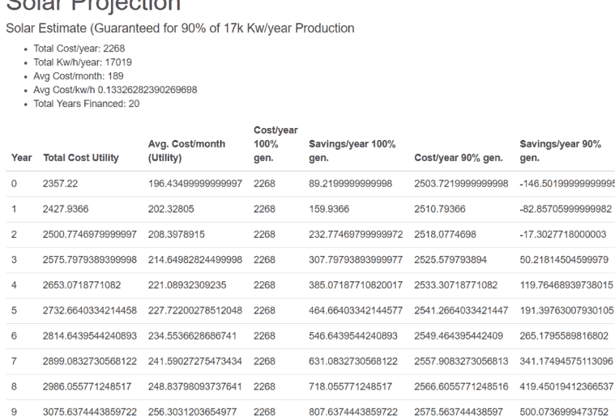

# 角度基础-装订

> 原文：<https://dev.to/kritner/angular-basics--binding-5dn8>

[T2】](https://res.cloudinary.com/practicaldev/image/fetch/s--9VgjpVlq--/c_limit%2Cf_auto%2Cfl_progressive%2Cq_auto%2Cw_880/https://cdn-images-1.medium.com/max/250/0%2APZecK1iEg7xtIbr8.png)

在最近来自 Vivint Solar 的[太阳能电池板阵列帖子](https://medium.com/@kritner/my-first-nuget-package-kritner-solarestimate-79d7f4abfdc2)的基础上，我在我的网站【http://kritner.com/solar-projection】T2 上制作了一个太阳能电池板评估页面——我想通过 angular、docker、typescript 等详细介绍我的一些学习经历。

肯定已经有这方面的教程了，但是我想试着开始写更多的博客，写下东西帮助我记住信息。

绑定非常简单，给定角度模板，包含在`{{ }}`中的信息被绑定。对于我的 angular 应用程序，我使用的是 dotnet 核心 cli 模板 dotnet 新角度 IIRC。你可以做一些简单的事情，比如`{{ 5 + 4 }}`或者更有用的事情，比如绑定到一个模型。

给定我的(一部分)打字稿文件:

```
interface SolarProjection {
  solarEstimate: YearlyElectricityUsage;
  futureProjection: FutureProjection[];
  financeYears: number;
}

interface YearlyElectricityUsage {
  averageCostKiloWattHour: number;
  averageCostPerMonth: number;
  totalCost: number;
  totalKiloWattHours: number;
}

interface FutureProjection {
  solarEstimate: YearlyElectricityUsage;
  purchaseYear: number;
  averageCostKiloWattHour: number;
  averageCostPerMonth: number;
  totalCost: number;
  totalKiloWattHours: number;

  costSolar100Percent: number;
  totalSavings100Percent: number;

  costSolar90Percent: number;
  totalSavings90Percent: number;

  costSolar80Percent: number;
  totalSavings80Percent: number;
} 
```

Enter fullscreen mode Exit fullscreen mode

我想将一些(非数组)信息绑定到我的视图…？我不确定 angular 这个词怎么说合适。

我的模型数据将按照:
进入一个名为 solarProjection 的 var

```
export class SolarProjectionComponent {
  public solarProjection: SolarProjection;

constructor(http: HttpClient, [@Inject](http://twitter.com/Inject)('BASE_URL') baseUrl: string) {
    http.get<SolarProjection>(baseUrl + 'api/SolarProjection/GetProjection').subscribe(result => {
      this.solarProjection = result;
    }, error => console.error(error));
  }
} 
```

Enter fullscreen mode Exit fullscreen mode

现在在 HTML 中，我们只需绑定`{{ }}`

首先，让我们创建一个 div，它只有在我们的数据准备好的时候才可见，并绑定一些基本(和平面)模型数据:

```
<div *ngIf="solarProjection">

  <h4>Solar Estimate (Guaranteed for 90% of 17k Kw/year Production</h4>

  <ul>
    <li>Total Cost/year: {{ solarProjection.solarEstimate.totalCost }}</li>
    <li>Total Kw/h/year: {{ solarProjection.solarEstimate.totalKiloWattHours }}</li>
    <li>Avg Cost/month: {{ solarProjection.solarEstimate.averageCostPerMonth }}</li>
    <li>Avg Cost/kw/h {{ solarProjection.solarEstimate.averageCostKiloWattHour }}</li>
    <li>Total Years Financed: {{ solarProjection.financeYears }} </li>
  </ul>
</div> 
```

Enter fullscreen mode Exit fullscreen mode

现在，我们的页面上显示了一些根信息，但是从上面的模型中，您可以看到我们还显示了一些数组数据。

使用`*ngFor`也很简单！让我们把我们的信息放在一个表中(注意所有这些都在上面定义的`div`内:

```
<table class='table'>
    <thead>
      <tr>
        <th>Year</th>
        <th>Total Cost Utility</th>
        <th>Avg. Cost/month (Utility)</th>
        <th>Cost/year 100% gen.</th>
        <th>Savings/year 100% gen.</th>
        <th>Cost/year 90% gen.</th>
        <th>Savings/year 90% gen.</th>
        <th>Cost/year 80% gen.</th>
        <th>Savings/year 80% gen.</th>
      </tr>
    </thead>
    <tbody>
      <tr *ngFor="let projection of solarProjection.futureProjection">
        <td>{{ projection.purchaseYear }}</td>
        <td>{{ projection.totalCost }}</td>
        <td>{{ projection.averageCostPerMonth }}</td>
        <td>{{ projection.costSolar100Percent }}</td>
        <td>{{ projection.totalSavings100Percent }}</td>
        <td>{{ projection.costSolar90Percent }}</td>
        <td>{{ projection.totalSavings90Percent }}</td>
        <td>{{ projection.costSolar80Percent }}</td>
        <td>{{ projection.totalSavings80Percent }}</td>
      </tr>
    </tbody>
  </table> 
```

Enter fullscreen mode Exit fullscreen mode

所以整个事情看起来像:

```
<h1>Solar Projection</h1>

<p *ngIf="!solarProjection"><em>Loading...</em></p>

<div *ngIf="solarProjection">

  <h4>Solar Estimate (Guaranteed for 90% of 17k Kw/year Production</h4>

  <ul>
    <li>Total Cost/year: {{ solarProjection.solarEstimate.totalCost }}</li>
    <li>Total Kw/h/year: {{ solarProjection.solarEstimate.totalKiloWattHours }}</li>
    <li>Avg Cost/month: {{ solarProjection.solarEstimate.averageCostPerMonth }}</li>
    <li>Avg Cost/kw/h {{ solarProjection.solarEstimate.averageCostKiloWattHour }}</li>
    <li>Total Years Financed: {{ solarProjection.financeYears }} </li>
  </ul>

  <table class='table'>
    <thead>
      <tr>
        <th>Year</th>
        <th>Total Cost Utility</th>
        <th>Avg. Cost/month (Utility)</th>
        <th>Cost/year 100% gen.</th>
        <th>Savings/year 100% gen.</th>
        <th>Cost/year 90% gen.</th>
        <th>Savings/year 90% gen.</th>
        <th>Cost/year 80% gen.</th>
        <th>Savings/year 80% gen.</th>
      </tr>
    </thead>
    <tbody>
      <tr *ngFor="let projection of solarProjection.futureProjection">
        <td>{{ projection.purchaseYear }}</td>
        <td>{{ projection.totalCost }}</td>
        <td>{{ projection.averageCostPerMonth }}</td>
        <td>{{ projection.costSolar100Percent }}</td>
        <td>{{ projection.totalSavings100Percent }}</td>
        <td>{{ projection.costSolar90Percent }}</td>
        <td>{{ projection.totalSavings90Percent }}</td>
        <td>{{ projection.costSolar80Percent }}</td>
        <td>{{ projection.totalSavings80Percent }}</td>
      </tr>
    </tbody>
  </table>

</div> 
```

Enter fullscreen mode Exit fullscreen mode

此时，页面看起来像这样:

[T2】](https://res.cloudinary.com/practicaldev/image/fetch/s--JerNnSzJ--/c_limit%2Cf_auto%2Cfl_progressive%2Cq_auto%2Cw_880/https://cdn-images-1.medium.com/max/1024/1%2Aos2OdZpMGZgm8BBzLgUNUw.png)

开始看起来像…什么了。接下来，我们必须对显示的数字进行格式化。

相关:[我的第一个 NuGet 包！克里特纳。SolarEstimate](https://medium.com/@kritner/my-first-nuget-package-kritner-solarestimate-79d7f4abfdc2)