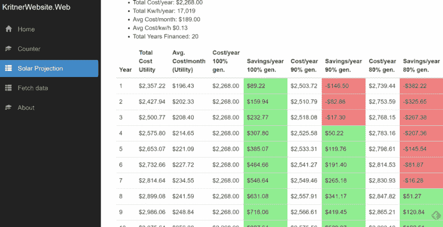

# 角度基础— NgClass

> 原文：<https://dev.to/kritner/angular-basics--ngclass-29dj>

[T2】](https://res.cloudinary.com/practicaldev/image/fetch/s---3vaWt-8--/c_limit%2Cf_auto%2Cfl_progressive%2Cq_auto%2Cw_880/https://cdn-images-1.medium.com/max/250/0%2AioWFxvjTSepxUFpm.png)

继续我从组装[http://www.kritner.com/solar-projection/](http://www.kritner.com/solar-projection/)系列 NgClass 中学到的东西。我真的很难快速“看到”什么是“好”和“坏”的年份，因为我的太阳投影的百分比值不同。考虑到这一点，我认为根据调用中的值对单元格应用一些阴影会很好。这让我来到了 https://angular.io/api/common/NgClass 的 T2。

当我在太阳能电池板上赚钱时，我希望电池板是绿色的(任何正数)，当电池板的成本超过基本公用事业成本时，我希望电池板是红色的(任何负数)。就这样，只需几步:

*   编写 CSS 来表示颜色的变化
*   编写一个 Typescript 函数来确定应该将哪个类应用于表格单元格
*   在视图中编写 nclass 逻辑

半铸钢ˌ钢性铸铁(Cast Semi-Steel)

```
.positive {
    background-color: lightgreen;
}

.negative {
    background-color: lightcoral;
} 
```

以打字打的文件

```
public inTheGreen(value: number): boolean{
    if (value >= 0)
    {
      return true;
    }

    return false;
} 
```

和基本的“模板”插入到我的视图中

```
<td [ngClass]="{
  positive: inTheGreen(myVal),
  negative: !inTheGreen(myVal)
}">{{ myVal }}</td> 
```

现在整个表格部分的代码是:

```
<table class='table'>
    <thead>
      <tr>
        <th>Year</th>
        <th>Total Cost Utility</th>
        <th>Avg. Cost/month (Utility)</th>
        <th>Cost/year 100% gen.</th>
        <th>Savings/year 100% gen.</th>
        <th>Cost/year 90% gen.</th>
        <th>Savings/year 90% gen.</th>
        <th>Cost/year 80% gen.</th>
        <th>Savings/year 80% gen.</th>
      </tr>
    </thead>
    <tbody>
      <tr \*ngFor="let projection of solarProjection.futureProjection">
        <td>{{ projection.purchaseYear | indexOffset }}</td>
        <td>{{ projection.totalCost | currency }}</td>
        <td>{{ projection.averageCostPerMonth | currency }}</td>
        <td>{{ projection.costSolar100Percent | currency }}</td>
        <td [ngClass]="{
          positive: inTheGreen(projection.totalSavings100Percent),
          negative: !inTheGreen(projection.totalSavings100Percent)
        }">{{ projection.totalSavings100Percent | currency }}</td>
        <td>{{ projection.costSolar90Percent | currency }}</td>
        <td [ngClass]="{
          positive: inTheGreen(projection.totalSavings90Percent),
          negative: !inTheGreen(projection.totalSavings90Percent)
        }">{{ projection.totalSavings90Percent | currency }}</td>
        <td>{{ projection.costSolar80Percent | currency }}</td>
        <td [ngClass]="{
          positive: inTheGreen(projection.totalSavings80Percent),
          negative: !inTheGreen(projection.totalSavings80Percent)
        }">{{ projection.totalSavings80Percent | currency }}</td>
      </tr>
    </tbody>
  </table> 
```

[](https://res.cloudinary.com/practicaldev/image/fetch/s--58J2LhEL--/c_limit%2Cf_auto%2Cfl_progressive%2Cq_auto%2Cw_880/https://cdn-images-1.medium.com/max/1024/1%2AwEucFE2RDPz6-eNCyIEi9A.png) 

<figcaption>应用 NgClass 着色后的结果</figcaption>

我不确定是否有办法将 inTheGreen 和！inTheGreen 检查到一个单独的调用，或者它是否很重要，但它现在有点长。

下一次，也许我会开始深入实现一些图表和/或利用数据网格，这样它会更“漂亮”和更具交互性。

相关:

*   我的第一个 NuGet 包！克里特纳。太阳能项目
*   [角度基础—绑定](https://dev.to/kritner/angular-basics--binding-5dn8)
*   [角度基础——管道](https://dev.to/kritner/angular-basics--pipes-180)
*   [角度和类型脚本基础—自定义管道](https://medium.com/@kritner/angular-and-typescript-basics-custom-pipes-eeafe33fec0c)