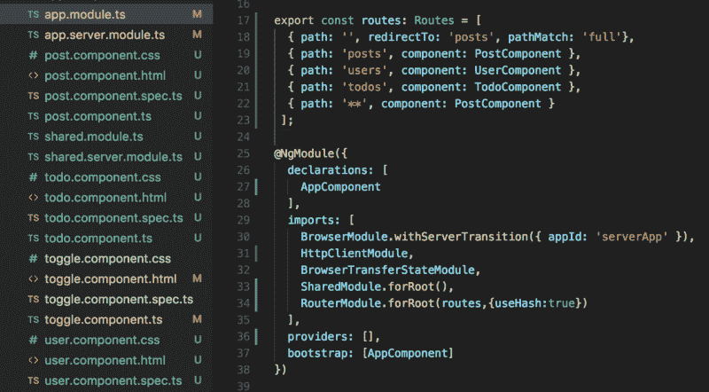

# 角度框架:SPA xor SSR

> 原文：<https://dev.to/peibolsang/angular-framework-spa-xor-ssr-339o>

距离我写第一个 SPA(单页应用程序)已经过去 11 年了——尽管那时它们被称为丰富的互联网应用程序，就好像还有其他应用程序不能在互联网上运行一样！).同样是在那个时候，没有 JavaScript 框架可以在浏览器上实现 [MV*模式](https://stackoverflow.com/questions/28930186/what-is-a-mv-framework) **，所以我不得不使用 PrototypeJS 和一些 JQuery 做大量的定制工作。有趣的东西(更不用说我的后端是 IBM Domino)**

相比之下，过去的开发社区有很多选择，可以使用企业级、高级语言和框架在服务器上实现 MV*模式。当构建 Web 应用程序时，Java 和 Struts 无处不在。这也意味着更少的 JavaScript，更少的微交互，更少的新鲜用户界面，但是更稳定和更高效。

然而，困境已经在那段时间开始了:要么你依靠大量的 JavaScript 和客户端处理([Web 2.0 的技术方面](https://en.wikipedia.org/wiki/Web_2.0#Technologies))来编写你的应用程序，要么你随波逐流，使用广泛传播的服务器端渲染框架来构建你的应用程序。我已经告诉你我的选择了！

(注意:那时候它甚至不叫 SSR(服务器端渲染)。为什么？因为正如我所说，没有客户端渲染。我猜这个概念最近出现只是为了在后者也成为现实时做出明确的区分。因此，SSR 现在被视为前端框架的一个特性，而不是传统后端框架使用的术语)

[T2】](https://res.cloudinary.com/practicaldev/image/fetch/s--O58xCFNP--/c_limit%2Cf_auto%2Cfl_progressive%2Cq_auto%2Cw_880/https://cdn-images-1.medium.com/max/800/1%2AZnbF8sM-VBDI4tXksVlkKA.png)

# SPA 和 SSR

*(在继续之前，我们先设定一下进一步理解的基础。让我们假设这里的“呈现”仅仅指标记生成和 DOM 构造，而不仅仅是可视化显示数据的事实)*

[**SPA** 是一个在浏览器上运行的应用](https://dev.to/ramiro__nd/the-complete-guide-to-deploying-javascript-applications---part-2-single-page-applications-logging-ssl-3161)，不需要页面转换或导航来呈现新内容。数据从服务器中动态检索(使用 [XHR 技术](https://developer.mozilla.org/en-US/docs/Web/API/XMLHttpRequest))并在浏览器中处理以显示用户视图。这就是，客户端渲染。

[**SSR** 是一个前端框架的能力](https://dev.to/sharajeev/explain-server-side-rendering-like-im-five-e3m)在服务器上生成页面标记，并将生成的用户视图通过网络传输到浏览器，浏览器将只是显示而不做任何进一步的处理。这就是，服务器端渲染。

说了这么多，今天我们有了一个新的选择:你可以使用相同的语言和平台: *JavaScript* 编写带有**客户端和/或服务器端渲染**的应用程序。这是一个巨大的进步。您可以使用相同的 JavaScript 框架，编写一个完全响应的全新用户界面，将所有动态刷新和整体类似桌面的行为(SPA)与服务器端处理相结合，使用来自第三方 API 和 WebServices (SSR)… **的数据生成用户视图。这些类型的应用程序也被称为[同构应用程序(不赞成使用的术语)或通用应用程序](https://medium.com/capital-one-developers/why-everyone-is-talking-about-isomorphic-universal-javascript-and-why-it-matters-38c07c87905)。**

**通用应用= SPA 和 SSR**

我将简单地谈谈我们有什么选择，集中在两个最大的球员:反应和角度。我们会看到我对后者有多失望。

# React 框架

[这个由脸书](https://reactjs.org/)创建的受欢迎的前端框架提供了顶级的内置功能，以构建结合了 SPA 和 SSR 世界精华的通用应用。任何使用 React framework 的开发人员都可以在服务器上生成标记(这对性能有明显的积极影响)，然后利用所有 SPA 功能和功能组件。

# 角框架

Angular Universal(哦，讽刺的是)是谷歌团队为那些希望将 SSR 功能整合到应用程序中的开发者开发的框架。它最初是作为一个独立的框架发布的，但是自从 Angular 4 发布以来，它成为了核心平台的一部分。它提供了必要的机制来编写一些 *Node.js* 代码来处理浏览器请求，并在服务器上生成 Angular ( *Material* )组件和标记。

但是我们真的能用这个框架构建通用的 app 吗？当我们使用 Angular Universal 时，选择什么类型的 SPA-SSR？我认为这是唯一的一个。经过一些实验，我知道你必须为你的应用程序选择 SPA 或 SSR 方法，但不能同时选择两者。因此，如果你决定使用 Angular Universal 为你的应用程序添加 SSR 功能，你需要知道**这是以牺牲任何 SPA 功能为代价的。反之亦然。**

**In Angular = SPA xor SSR**

无论如何，让我澄清一下，有很好的理由用 Angular Universal 做 SSR，特别是如果你正在互联网上构建一个面向客户的应用程序，并且你担心 SEO、Webshare 和首页加载性能。但是您需要意识到您正在做出的架构决策。

# 使用角度通用

让我们直观地看看客户端和服务器端的渲染是如何工作的。

如前所述，在客户端渲染中，所有的数据处理和渲染都是在使用 XHR 的浏览器中进行的。

[T2】](https://res.cloudinary.com/practicaldev/image/fetch/s--L1CuJJ6V--/c_limit%2Cf_auto%2Cfl_progressive%2Cq_auto%2Cw_880/https://cdn-images-1.medium.com/max/800/1%2AbRSuZO2T-IEi0P_H2QKHwg.png)

相反，我们在纯服务器端呈现中寻求的是所有的数据请求及其相关处理都在服务器端计算。只有普通视图(HTML、CSS 和不太重要的 JavaScript)通过网络传输，所以浏览器只是在我们称之为 **UI 再水合的过程中显示部分数据。**

[T2】](https://res.cloudinary.com/practicaldev/image/fetch/s--FPmcfoXH--/c_limit%2Cf_auto%2Cfl_progressive%2Cq_auto%2Cw_880/https://cdn-images-1.medium.com/max/800/1%2Atgq5x-wRQEIttE7a3NtIfA.png)

请注意，这不是一个关于如何编写一个角度通用应用程序的教程。有很多好的教程可以帮助你解决这个问题。但是，让我们快速浏览一下如何使用这个框架完成这项工作的主要步骤。

1.  使用 Angular CLI 创建您的项目脚手架和 Angular Universal 配置。

2.  确保您在*上有一个服务器端应用程序的条目。angular-cli.json* 文件。
    T3T5】

4.  现在，您必须设计和构建应用程序的逻辑。这是您的所有组件结构，也是您的所有 **SPA 路由逻辑**使用角度路由。这是一个例子:
    

5.  最后，你必须实现[角度**转移状态**模式](https://dev.to/teroauralinna/how-to-transfer-the-angular-server-side-state-to-the-client-side-575d)。这是让 Angular Universal 完成所有服务器端渲染工作的关键，减轻了浏览器调用获取和处理 API 数据的负担。
    

在我的例子中，我将这个逻辑包含在每个组件的 *ngOnInit()* 事件中。在您写这篇文章的时候，您并没有为服务器或客户端编码，尽管您需要包含*转移状态*逻辑，因为这段代码将在两端执行(是的，它会)。因此，上面这段代码所做的就是用使用 *http get* 对象从 API 获取的数据获取并设置一个全局变量(可由*传输状态*对象访问)的值。由于代码将首先在服务器上执行，API 数据由服务器获取并存储在一个变量中，供以后在浏览器端使用。

# 揭开角宇宙的神秘面纱

要看到这一点，我们只需要运行应用程序，并查看浏览器和服务器控制台。

当应用程序第一次启动时，我们可以看到*传输状态*正在更新服务器上的全局变量。在我的例子中，它从一个[虚拟 API](https://jsonplaceholder.typicode.com/) 获取一些 Post 数据:

[T2】](https://res.cloudinary.com/practicaldev/image/fetch/s--dmh16L7n--/c_limit%2Cf_auto%2Cfl_progressive%2Cq_auto%2Cw_880/https://cdn-images-1.medium.com/max/800/1%2AyUH9Z6LQddXBJsWkqz_F5w.png)

如果我们查看浏览器控制台，我们会发现它所做的只是从*传输状态* (UI 再水合)中检索这个变量。

[T2】](https://res.cloudinary.com/practicaldev/image/fetch/s--wuTa53HF--/c_limit%2Cf_auto%2Cfl_progressive%2Cq_auto%2Cw_880/https://cdn-images-1.medium.com/max/800/1%2AHMjIIvPTo7LUt8tmrKm85Q.png)

这可以通过查看浏览器开发工具中的网络选项卡来确认。在这里，我们可以看到没有对 API 服务器的调用，只是常规的 GET 调用来下载静态资源(其中一些从缓存中提供，如 304 响应所述)

这是一个非常好的消息，它起作用了！

所以让我们继续努力。现在，让我们继续浏览我的示例应用程序。在这种情况下，让我们通过单击“Users”链接来尝试显示 son 用户虚拟数据。这就是事情开始变得奇怪的地方。

1.  如果我们查看服务器控制台，什么也没有发生。就好像服务器没有捕获到事件一样。就好像我在代码中设置的导航路线(见上文)绕过了服务器逻辑，或者更糟，从未到达服务器！服务器控制台没有处理此请求。
    [T3】](https://res.cloudinary.com/practicaldev/image/fetch/s--VgWvvM3a--/c_limit%2Cf_auto%2Cfl_progressive%2Cq_auto%2Cw_880/https://cdn-images-1.medium.com/max/800/1%2ARFfHjK6EvlNh2krzGXastw.png)

2.  但是，如果我查看浏览器控制台，我会看到这个事件和请求是如何在客户端处理的。
    [T3】](https://res.cloudinary.com/practicaldev/image/fetch/s--cs01f1c7--/c_limit%2Cf_auto%2Cfl_progressive%2Cq_auto%2Cw_880/https://cdn-images-1.medium.com/max/800/1%2Amr7oCvvyzZAbnu0iAPVhEw.png)

3.  这绝对不是我们想要的！这意味着密钥在浏览器上被更新，因为*传输状态*没有发生。这也意味着 API 调用是在浏览器中完成的。让我们通过查看浏览器的开发者工具中的网络选项卡来确认这一点:
    

**就这样。它不工作**。我们可以看到对“用户”API 的调用发生在浏览器端。不知何故，我们的应用程序瞬间又变成了一个 SPA，因为所有的数据获取、处理和渲染都在浏览器中完成，所有的服务器端处理都消失了。这只是一个普通的有棱角的应用程序，利用了所有的水疗功能。

# 结论

这种行为并不能证明 Angular Universal 是一个构建通用应用的框架。看起来它是以这样一种方式设计的，SSR 功能只在第一次加载时利用**，但之后，事件不会在服务器上被捕获，UI 再水合也不会发生，将您的应用程序再次变成 SPA。换句话说，**客户端和服务器端的处理在第一次加载后是排他的。****

我想通过查看 [Angular 的官方指南](https://angular.io/guide/universal)来确认这一点，而(并不)令我惊讶的是，[最后声明的最后一句话澄清了很多事情](https://angular.io/guide/universal#summary)。

本指南向您展示了如何将一个现有的 Angular 应用程序变成一个通用的应用程序，进行服务器端渲染。它还解释了这样做的一些主要原因。
*-方便网络爬虫(SEO)*
*-支持低带宽或低功耗设备*
*-快速首页加载*
*有角度的通用可以大大提高你的 app 的感知启动性能。网络越慢，让 Universal 向用户显示第一页就越有利。*

然而，我不能更失望了。[我知道还有其他框架，比如 Apollo](https://www.apollographql.com/docs/angular/recipes/server-side-rendering.html) 与 Angular Universal 结合，可以将您的应用程序转变为真正的通用应用程序，但不知何故，我更期待 Angular 及其本机功能作为一个强大的框架来构建 SPA 和 SSR 应用程序。