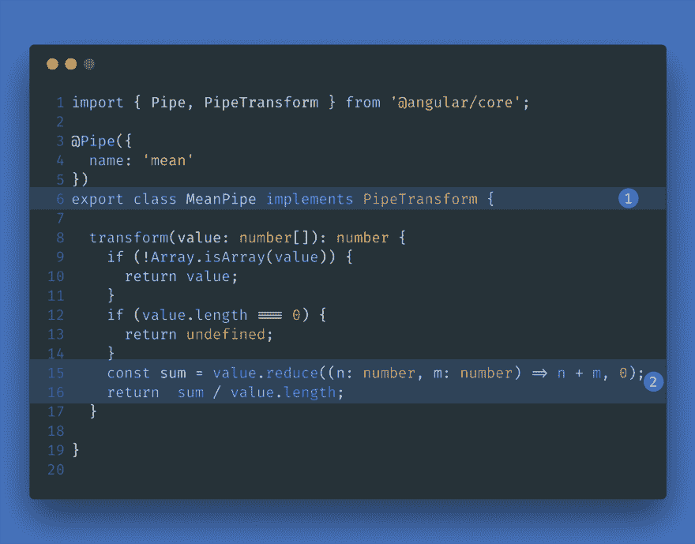
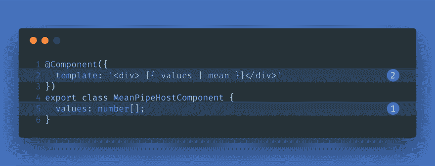
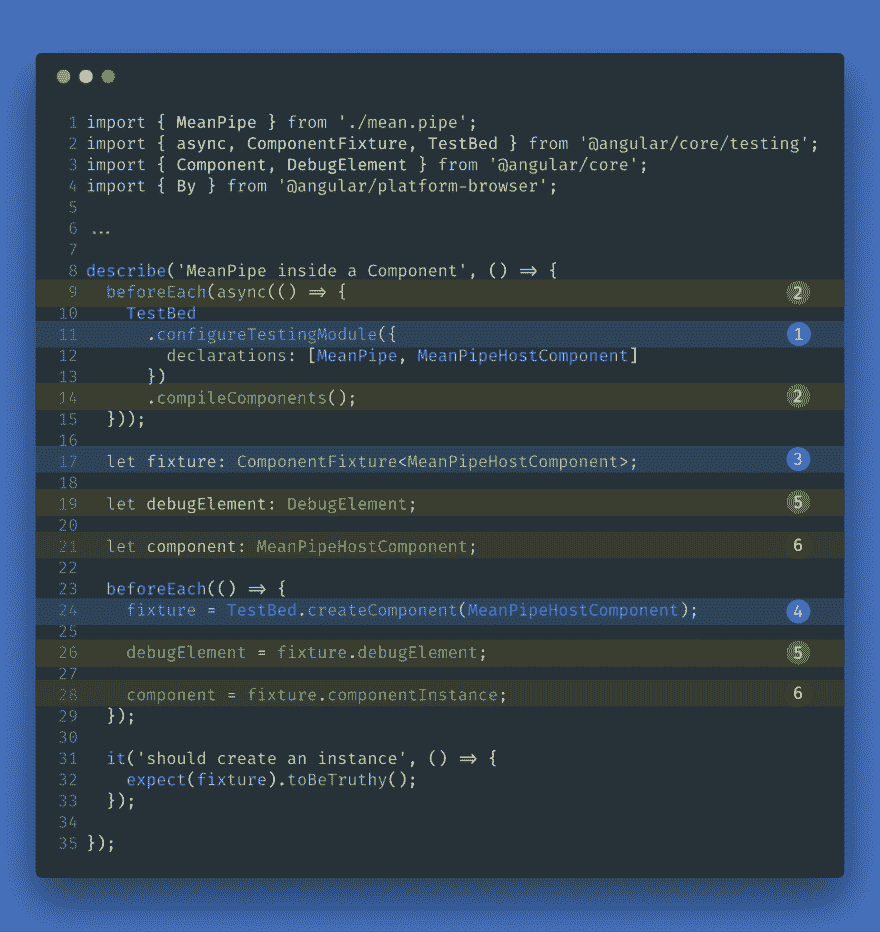
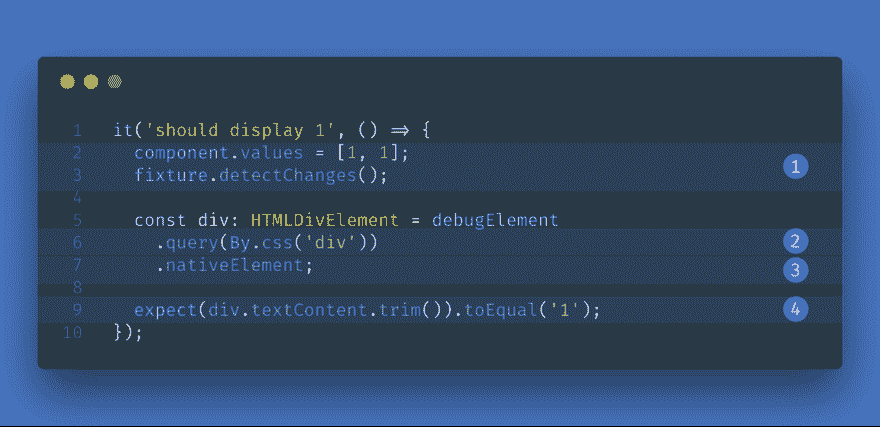

# 弯管:集成单元测试

> 原文：<https://dev.to/ahasall/angular-pipes-integrated-unit-testing-mg4>

[T2】](https://res.cloudinary.com/practicaldev/image/fetch/s--f5yhBxpq--/c_limit%2Cf_auto%2Cfl_progressive%2Cq_auto%2Cw_880/https://www.amadousall.com/conteimg/2018/02/cover-2.png)

在我之前的博文中，我们了解到有两种方法可以对角形管道进行单元测试:

*   独立测试(无试验台)
*   集成测试(带试验台)

但是我们把重点放在孤立的测试上。在这篇文章中，我们将把注意力转移到如何为有角度的管道编写集成单元测试上。

当我们在运行时使用的相同条件下测试管道时，我们谈论集成单元测试。这意味着我们将在 Angular 组件的模板中测试它。

## 被测管道

以防你没看过我之前的博文，这是我们要测试的管道的代码。这是一个简单的管道，将数组转换为它的平均值。

[T2】](https://res.cloudinary.com/practicaldev/image/fetch/s--3V141Nky--/c_limit%2Cf_auto%2Cfl_progressive%2Cq_auto%2Cw_880/https://www.amadousall.com/conteimg/2018/02/mean.pipe.ts-1.png)

1.  实现`PipeTransform`接口。
2.  返回数字数组的平均值。

这个管道的完整源代码可以在文章末尾找到或者[这里](https://gist.github.com/amadousalldotcom/9bcbbc5ee1745bf10c890a5c423bd477)。

## 我们需要一个主机组件

因为我们想要为管道编写集成测试，所以我们需要一个托管管道的组件。主体构件类似于任何其他角度构件。没什么特别的。这只是在角形组件的模板中使用管道的一种方式。

主机组件的代码很简单:

[T2】](https://res.cloudinary.com/practicaldev/image/fetch/s--YP3TVadl--/c_limit%2Cf_auto%2Cfl_progressive%2Cq_auto%2Cw_880/https://www.amadousall.com/conteimg/2018/02/host-component.png)

1.  定义保存要传递给管道的值的属性
2.  通过管道显示这些值的转换结果。

## 设置集成测试！

[T2】](https://res.cloudinary.com/practicaldev/image/fetch/s--OF97K9_B--/c_limit%2Cf_auto%2Cfl_progressive%2Cq_auto%2Cw_880/https://www.amadousall.com/conteimg/2018/02/tests-setup.png)

1.  `TestBed.configureTestingModule`，顾名思义，允许我们创建特定的角度模块用于测试目的。它接受与`NgModule`装饰器几乎相同的参数。
2.  请注意，我们将第一个`beforeEach`的身体包裹在一个特殊的角度区域内。我们通过调用`async`函数来实现，这是许多角度测试实用程序中的一个。我们需要这个，因为`TestBet.compileComponents`是异步的。因此，这确保了我们的组件的模板是预先编译好的(尽管从技术上讲，这在这个例子中是不必要的，因为我们的模板是内联的)。
3.  一个`ComponentFixture`是我们主机组件的包装器。它允许我们与组件的环境进行交互，比如它的变化检测或它的注入器。
4.  夹具由`TestBed.createComponent`返回。
5.  从夹具中，我们可以得到`DebugElement`。`DebugElement`是我们组件的 HTML 元素的包装器。它提供了比原生`HTMLElement`更多的功能。
6.  我们还可以从 fixture 中获得组件的真实实例。

我们确保了我们的 fixture 可以被正确地实例化。现在我们可以开始写真正的期望了。

## 实际测试

[T2】](https://res.cloudinary.com/practicaldev/image/fetch/s--TAUvihqs--/c_limit%2Cf_auto%2Cfl_progressive%2Cq_auto%2Cw_880/https://www.amadousall.com/conteimg/2018/02/tests.png)

1.  我们首先更新组件的`values`属性，然后调用`fixture.detectChanges`。`fixture.detectChanges`开始我们组件的变更检测。如果我们希望我们的模板反映我们对组件类所做的更改，这是必要的。
2.  接下来，我们使用`debugElement.query`向它传递一个谓词`By.css('div')`。这允许我们通过使用它的 CSS 选择器来定位 div 元素。
3.  从那里，我们可以得到原生的`HTMLDivElement`。
4.  然后我们可以写下我们的期望。

这个管道的完整源代码可以在文章末尾找到，或者在这里找到

在本文中，我们学习了如何为我们的角形管道编写集成单元测试。这种的设置比独立单元测试更复杂。还涉及到更多的概念，因为我们需要使用角度测试工具。但是努力的方向是集成的单元测试可以帮助我们发现隔离测试不能揭示的错误。

非常感谢您的阅读！

* * *

## 清单

## 意思是

```
import { Pipe, PipeTransform } from '@angular/core';

@Pipe({
  name: 'mean'
})
export class MeanPipe implements PipeTransform {

  transform(value: number[]): number {
    if (!Array.isArray(value)) {
      return value;
    }
    if (value.length === 0) {
      return undefined;
    }
    const sum = value.reduce((n: number, m: number) => n + m, 0);
    return  sum / value.length;
  }
} 
```

## 意思是

```
import { MeanPipe } from './mean.pipe';
import { async, ComponentFixture, TestBed } from '@angular/core/testing';
import { Component, DebugElement } from '@angular/core';
import { By } from '@angular/platform-browser';

@Component({
  template: '<div> {{ values | mean }}</div>'
})
export class MeanPipeHostComponent {
  values: number[];
}

describe('MeanPipe inside a Component', () => {
  beforeEach(async(() => {
    TestBed
      .configureTestingModule({
        declarations: [MeanPipe, MeanPipeHostComponent]
      })
      .compileComponents();
  }));

  let fixture: ComponentFixture<MeanPipeHostComponent>;
  let debugElement: DebugElement;

  let component: MeanPipeHostComponent;

  beforeEach(() => {
    fixture = TestBed.createComponent(MeanPipeHostComponent);
    debugElement = fixture.debugElement;
    component = fixture.componentInstance;
  });

  it('should create an instance', () => {
    expect(fixture).toBeTruthy();
  });

  it('should display 1', () => {
    component.values = [1, 1];
    fixture.detectChanges();

    const div: HTMLDivElement = debugElement
      .query(By.css('div'))
      .nativeElement;

    expect(div.textContent.trim()).toEqual('1');
  });

  it('should display 0', () => {
    component.values = [1, -1];
    fixture.detectChanges();

    const div: HTMLDivElement = debugElement
      .query(By.css('div'))
      .nativeElement;

    expect(div.textContent.trim()).toEqual('0');
  });

  it('should display nothing', () => {
    component.values = [];
    fixture.detectChanges();

    const div: HTMLDivElement = debugElement
      .query(By.css('div'))
      .nativeElement;

    expect(div.textContent.trim()).toEqual('');
  });
}); 
```