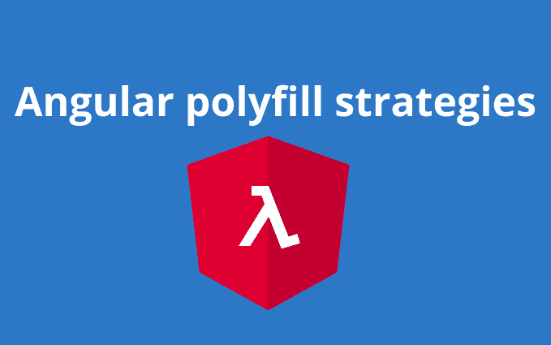
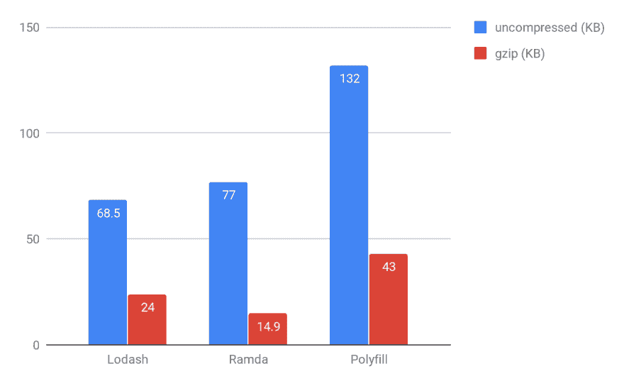
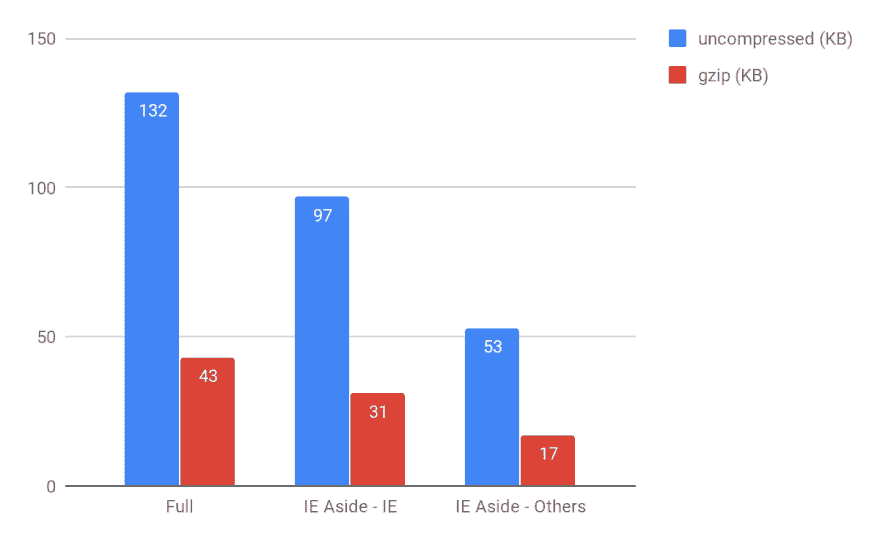
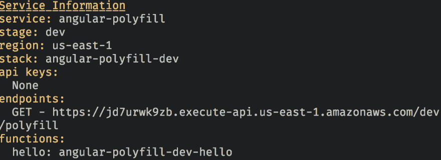

# 多角度填充策略

> 原文：<https://dev.to/izifortune/angular-polyfill-strategies-2dmn>

[T2】](https://res.cloudinary.com/practicaldev/image/fetch/s--ergwaKlm--/c_limit%2Cf_auto%2Cfl_progressive%2Cq_auto%2Cw_880/http://izifortune.com/conteimg/2018/11/angular-polyfill-strategies.png)

跨浏览器兼容性是现代 web 开发的一个重要部分。虽然现在大多数浏览器都在向新的 web 标准看齐，但由于各种原因，跨浏览器问题仍然会发生。有时候浏览器会有 bug，对新技术的支持程度不同。Angular 支持所有最新的浏览器，但支持所有这些不同的浏览器很有挑战性，尤其是在缺乏现代技术支持的地方。这就是为什么 *Angular* 团队[建议](https://angular.io/guide/browser-support)根据你的目标装载多孔填料。polyfill 提供了一种预期在本地可用的功能。

用 *angular-cli* 创建的 *Angular* 应用程序包含文件`src/polyfills.ts`。该文件突出显示了特定浏览器正常工作可能需要的不同模块。在创建 web 应用程序时，尤其是面向公众的应用程序，有必要处理跨浏览器兼容性问题。用户可能会使用旧版本的浏览器访问您的 web 应用程序，您不应该强迫他们升级。根据项目受众，有必要加载所需的聚合填充。

在这篇文章中，我想探索在一个角度应用程序中加载多边形填充的不同方法。从一个非常简单的场景开始，我们将所有可能的模块加载到更高级的模块中。聚合填充通常是 *Angular* 应用程序中被忽略的一部分，这会导致 web 应用程序和用户的性能损失。

### 把它们都捆起来

在第一个例子中，我们只是盲目地取消了 polyfills 文件中所有 imports 语句的注释。这是一个非常简单的例子，我想对于许多开始一个 *Angular* 项目的开发者来说，这是让你的应用程序不需要额外努力就能工作的最简单的方法，除了你的用户。

```
import 'core-js/es6/symbol';  
import 'core-js/es6/object';  
import 'core-js/es6/function';  
import 'core-js/es6/parse-int';  
import 'core-js/es6/parse-float';  
import 'core-js/es6/number';  
import 'core-js/es6/math';  
import 'core-js/es6/string';  
import 'core-js/es6/date';  
import 'core-js/es6/array';  
import 'core-js/es6/regexp';  
import 'core-js/es6/map';  
import 'core-js/es6/weak-map';  
import 'core-js/es6/set';  
import 'core-js/es6/array';  
import 'classlist.js'; // Run `npm install --save classlist.js`.  
import 'core-js/es6/reflect';  
import 'web-animations-js'; // Run `npm install --save web-animations-js`.  
import 'zone.js/dist/zone'; // Included with Angular CLI. 
```

所有的浏览器，甚至那些不需要 polyfills 的浏览器，都在为你的支持列表中的旧浏览器买单。所以每个用户都需要完整下载生成的文件。如果我们看看生成的 polyfill 包的大小，这是普通实用程序库如 [ramda](https://ramdajs) 或 [lodash](https://lodash.com/) 在不使用任何树抖动的情况下所占用空间的两倍。

[T2】](https://res.cloudinary.com/practicaldev/image/fetch/s--kLG8CIKA--/c_limit%2Cf_auto%2Cfl_progressive%2Cq_auto%2Cw_880/https://izifortune.com/conteimg/2018/11/polyfills-ramda-lodash.png)

### 撇开不谈

正如你所想象的，这不是一个理想的解决方案，它毫无歧视地影响着你的所有用户。在我研究改进之前的解决方案时，我偶然发现了目前在 [angular.io](https://angular.io) 使用的解决方案。该网站只为 IE11/10/9 浏览器提供一个附加文件`ie-polyfill`,并为所有其他浏览器提供一个更小的 polyfill。实现的解决方案简单而有效，它包括为 IE 预先生成一个包，并将其加载到一个*脚本*标签中，并在索引中添加`nomodule`属性。

创建以下文件`src/ie-polyfills.js`:

```
/ **IE9, IE10 and IE11 requires all of the following polyfills.** /
import 'core-js/es6/symbol';  
import 'core-js/es6/object';  
import 'core-js/es6/function';  
import 'core-js/es6/parse-int';  
import 'core-js/es6/parse-float';  
import 'core-js/es6/number';  
import 'core-js/es6/math';  
import 'core-js/es6/string';  
import 'core-js/es6/date';  
import 'core-js/es6/array';  
import 'core-js/es6/regexp';  
import 'core-js/es6/map';  
import 'core-js/es6/set';  
import 'classlist.js';  
import 'web-animations-js'; 
```

里面只留下以下内容`src/polyfill.ts`

```
import 'zone.js/dist/zone'; // Included with Angular CLI. 
```

要生成 *ie-polyfills* ，只需在`package.json`的*脚本*部分添加以下命令:

```
"build-ie-polyfills": "webpack-cli src/ie-polyfills.js -o src/generated/ie-polyfills.min.js -c webpack-polyfill.config.js",
"postbuild": "cp -p src/generated/ie-polyfills.min.js dist/generated" 
```

最后，在`src/index.html`的头部添加*脚本*标签:

```
<script nomodule="" src="generated/ie-polyfills.min.js"></script> 
```

`nomodule`属性是一个布尔属性，它防止在支持模块脚本的用户代理中执行脚本。只有不支持 IE11/10/9 等模块的浏览器才会下载较大的包，而其他浏览器会忽略它，只下载较小的文件。

[T2】](https://res.cloudinary.com/practicaldev/image/fetch/s--BuRgIJLp--/c_limit%2Cf_auto%2Cfl_progressive%2Cq_auto%2Cw_880/https://izifortune.com/conteimg/2018/11/polyfill-strategies.png)

这几乎比最初提出的*将它们全部捆绑*的解决方案提高了 60%。它可以轻松集成到任何应用程序中，并且不涉及任何复杂的更改或基础架构支持。您的应用程序只提供一个附加文件。这里有一个到 stackblitz 应用程序的链接，这个应用程序已经为这个场合配置好了[这里](https://stackblitz.com/edit/angular-ahwqb6)。

### 无服务器服务

前面的解决方案很棒，我真的鼓励在您的项目中测试它，以获得简单的性能提升。有几个问题不能忽略:旧的浏览器必须执行一个额外的请求来获取两个 polyfills。同样使用`nomodule`只能区分支持或不支持模块的浏览器。有些情况下，您只需要为特定的浏览器加载聚合填充。例如，在我们的一个 web 应用程序中，我们需要专门为 IOS 9 加载`core-js/es7/object`。

更高级的解决方案是通过检测浏览器请求来动态提供聚合填充。用户代理标头可用于检测发出请求的浏览器。web 开发社区广泛使用的一个流行服务是[。Jonathan Neal 创建的服务正是之前所描述的。不幸的是， *polyfill.io* 不能用于*角度*应用，因为它在全局对象上执行更改](https://polyfill.io)

polyfill.io 提供的解决方案非常有前途，即使是最老的浏览器也能减少呼叫总数。无服务器可以重新创建一个类似于 *polyfill.io* 的解决方案，它可以很容易地设置、维护，也可以与 *Angular* 应用程序一起工作。

无服务器框架是一个用于构建和部署无服务器应用的开源 CLI。*无服务器*基本上在不同的云提供商如 *AWS* 、*谷歌云*或 *Azure* 之上提供了一个抽象层。让我们从全球下载并安装*无服务器 cli* 开始。

本节的先决条件是:一个 *AWS* 帐户和安装在您机器上的 *aws-cli* 。

```
npm i -g serverless 
```

既然 *serverless-cli* 已经全局安装，我们可以使用它来创建基于 nodejs 模板的第一个项目。

```
serverless create --template aws-nodejs --path angular-polyfill && cd angular-polyfill && npm init 
```

cli 在项目中创建两个不同的文件:`serverless.yml`指定服务的基础设施配置。包含函数的`handler.js`，这是一个 lambda 函数，将在托管的 *AWS* 基础设施中执行。

在进入无服务器细节之前，为了生成不同的 polyfills 包，我们将使用命令行界面直接使用 *webpack* 。为了减小尺寸，我们还将配置 *UglifyJsPlugin* ，它将负责执行必要的优化。从添加一些依赖项开始

```
npm i --save-dev core-js web-animations-js classlist.js webpack zone.js webpack-cli uglifyjs-webpack-plugin 
```

用不同的 polyfills 导入在`webpack.config.js`和 *javascript* 文件中创建一个简单的 *webpack* 配置

```
// webpack.config.js
const UglifyJsPlugin = require('uglifyjs-webpack-plugin');

module.exports = {  
  mode: 'production',
  optimization: {
    minimizer: [new UglifyJsPlugin({
      uglifyOptions: {
        warnings: false,
        parse: {},
        compress: {},
        mangle: true, // Note `mangle.properties` is `false` by default.
        output: null,
        toplevel: false,
        nameCache: null,
        ie8: false,
        keep_fnames: false,
      }
    })]
  }
};

//polyfills.js
import 'core-js/es7/reflect'; // Used in JIT - remove if you use only AOT  
import 'zone.js/dist/zone';

//ie-polyfills.js
import 'core-js/es6/symbol';  
import 'core-js/es6/object';  
import 'core-js/es6/function';  
import 'core-js/es6/parse-int';  
import 'core-js/es6/parse-float';  
import 'core-js/es6/number';  
import 'core-js/es6/math';  
import 'core-js/es6/string';  
import 'core-js/es6/date';  
import 'core-js/es6/array';  
import 'core-js/es6/regexp';  
import 'core-js/es6/map';  
import 'core-js/es6/set';  
import 'classlist.js';  
import 'web-animations-js';

import 'core-js/es7/reflect'; // Used in JIT - remove if you use only AOT  
import 'zone.js/dist/zone'; 
```

最后，我们将脚本添加到我们的`package.json`

```
"build-ie-polyfills": "webpack-cli polyfills.js ie-polyfills.js -o ./generated/ie-polyfills.min.js --mode production --optimize-minimize -c webpack.config.js",
"build-polyfills": "webpack-cli polyfills.js -o ./generated/polyfills.min.js --mode production --optimize-minimize -c webpack.config.js"

npm run build-ie-polyfills && npm run build-polyfills 
```

运行这两个命令会在`generated`文件夹中生成两个不同的 polyfills 文件，用于我们的无服务器功能。*无服务器*框架需要在创建的函数中包含生成的文件。在`serverless.yml`中指定:

```
package:  
  include:
    - generated/polyfill.min.js
    - generated/ie-polyfill.min.js
  exclude:
    - ie-polyfills.js
    - polyfills.js 
```

是时候打开`handler.js`并添加逻辑，以根据请求的*用户代理*服务不同的 polyfill 了。这个想法是检测*用户代理*，然后基于这样的信息服务一个或另一个 polyfill。导入一个实用程序库，它通过使用手动调整的专用正则表达式进行浏览器匹配，以高精度解析*用户代理*字符串。

```
npm i --save useragent

//handler.js
'use strict';

const useragent = require('useragent');  
const util = require('util');  
const fs = require('fs');  
const readFile = util.promisify(fs.readFile);  
const path = require('path');

const getPolyFillName = (browser) => {  
  switch (browser) {
    case 'ie':
      return path.join(__dirname, '/generated/ie-polyfills.min.js');
    default:
      return path.join(__dirname, '/generated/polyfills.min.js');
  }
};

module.exports.polyfill = async (event, context) => {  
  const ua = useragent.parse(event.headers['user-agent']);
  console.log(ua);
  const body = await readFile(getPolyFillName(ua.family.toLowerCase()), 'utf8');
  return {
    statusCode: 200,
    body,
    headers: {
      'Content-Type': 'application/javascript',
      'X-Detected-UA': ua.family,
    }
  };
}; 
```

无服务器功能需要一个端点供我们的浏览器访问。在使用 *AWS* 时，我们可以将 lambda 附加到 [API 网关](https://aws.amazon.com/api-gateway/)，后者将提供从函数到 *REST* 端点的集成。*无服务器*通过简单地将*事件*添加到`serverless.yml`中的函数来简化所有所需资源的创建

```
polyfill:
    handler: handler.polyfill
    events:
       - http:
           method: get
           path: /polyfill 
```

现在我们准备部署我们的功能

```
sls deploy 
```

无服务器在创建过程结束时输出一个指向 lambda 的 URL。

[T2】](https://res.cloudinary.com/practicaldev/image/fetch/s--fZldEvts--/c_limit%2Cf_auto%2Cfl_progressive%2Cq_auto%2Cw_880/https://izifortune.com/conteimg/2018/11/serverless-output.png)

通过在浏览器中粘贴 URL 来测试一切是否正常，服务应该会向您返回针对您的浏览器的 polyfill 包。

现在，我们可以轻松地修改我们的 Angular 应用程序，直接从服务 URL 下载聚合填充，并从中删除聚合填充绑定。

这是一个非常简单的设置来展示*无服务器*的威力，根据你的网站流量有不同的方法来提高它，如果你感兴趣，请在下面的评论中告诉我。

花时间决定应该包含的多种填充常常被忽略，因为少数人的“罪过”而惩罚所有人。希望本文探讨的解决方案能帮助你改善网站的应用体验。