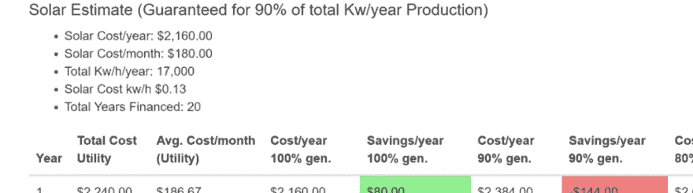
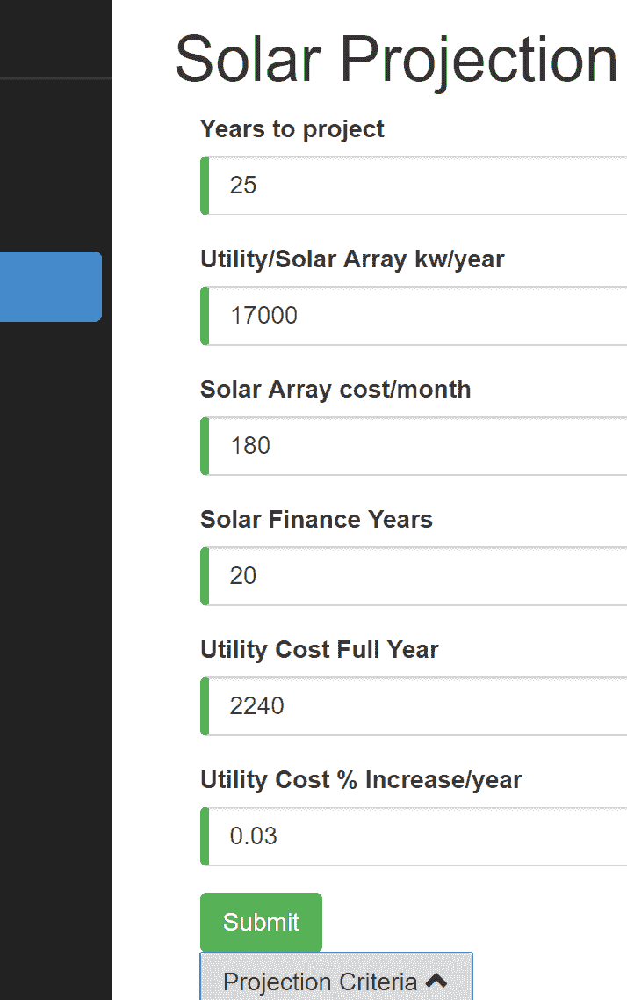
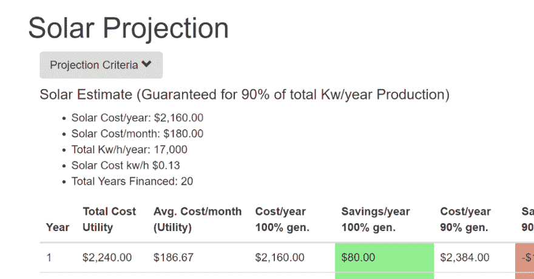

# 角度，打字稿，和。net core —用表单更新 SolarProjection

> 原文：<https://dev.to/kritner/angular-typescript-and-net-core--updating-solarprojection-with-a-form-587h>

<figure>[](https://res.cloudinary.com/practicaldev/image/fetch/s--OT47cjNW--/c_limit%2Cf_auto%2Cfl_progressive%2Cq_auto%2Cw_880/https://cdn-images-1.medium.com/max/250/0%2AmaBUad6PWxuGI8Zh.png) 

<figcaption>棱角分明的标志</figcaption>

</figure>

我很快就要完成我第一次通过网站的[太阳投影功能](http://kritner.com/solar-projection)了。我想提供的最后一点是，访问者可以用他们自己的一组数字进行自己的预测。

目前，其他程序员可以通过抓取 [NuGet 包](https://www.nuget.org/packages/Kritner.SolarProjection/)来做上面的事情，但是我想在页面上提供一些东西。

我们需要一些东西:

*   用于提供与太阳投影相关的所有必要信息的表单条目输入
*   表示新表单及其提交功能的新 typescript 对象
*   新的。net core API 端点来支持新的表单(以前有一个无参数的端点，它返回特定于我的投影的值)

请注意，所有完整的代码更新将出现在 gist 的底部，大多数其他代码将只是代码片段和代码块，因为 gist 支持只能完成完整的帖子，而不是单个文件(为一个帖子创建 400 亿个 gist 似乎太多了)。

我通常喜欢在设计新的东西时首先创建我的模型类和接口，也就是说，我相信从表单入口和新的 API 端点所需的表单参数开始是有意义的。

给定当前页面:

[T2】](https://res.cloudinary.com/practicaldev/image/fetch/s--hPt4sIZM--/c_limit%2Cf_auto%2Cfl_progressive%2Cq_auto%2Cw_880/https://cdn-images-1.medium.com/max/1024/1%2AD0TC-DtivbxgjPfG9SwVSQ.png)

我们需要一些信息:

*   预测未来的年数
*   公用事业/太阳能电池阵列千瓦/小时/年(换句话说，太阳能电池阵列理论上将覆盖你们这一代人的 100%)。在我的例子中，这个值大约是 17，000 千瓦/小时/年
*   每月太阳能成本——给定一个 z 千瓦/年的太阳能阵列，每月成本(注意，在我们与 Vivint 讨论这个数字之前，我没有这个数字——在我的例子中是每月 189 美元
*   太阳能金融年限——抵押贷款有效的年限——对我来说是 20 年。
*   全年公用事业成本——上述公用事业/太阳能阵列千瓦/小时/年项目符号中指定的年度总成本
*   每年的效用百分比增长——太阳能公司每千瓦/小时的估计百分比增长——我使用 3% (0.03)

以上可以在 TypeScript 类中表示:

```
export class SolarProjectionFormModel {

constructor(
        public yearsToProject: number,
        public utilitySolarArrayKwhYear: number,
        public solarCostPerMonth: number,
        public solarFinanceYears: number,
        public utilityCostFullYear: number,
        public utilityPercentIncreasePerYear: number
    ) { }
} 
```

Enter fullscreen mode Exit fullscreen mode

和 c#类:

```
public class SolarProjectionParameters
    {
        public int YearsToProject { get; set; }
        public int UtilitySolarArrayKwhYear { get; set; }
        public double SolarCostPerMonth { get; set; }
        public int SolarFinanceYears { get; set; }
        public double UtilityCostFullYear { get; set; }
        public double UtilityPercentIncreasePerYear { get; set; }
    } 
```

Enter fullscreen mode Exit fullscreen mode

接下来，我们想要添加我们的表单，我使用[角度模板驱动的表单](https://angular.io/guide/forms#template-driven-forms)作为基线教程来解决这个问题(我以前从来没有这样做过)。

我们想这样开始一个表单:

```
<form *ngIf="!isExpandedForm" (ngSubmit)="onSubmit()" #projectionForm="ngForm"> 
```

Enter fullscreen mode Exit fullscreen mode

在上面，你可以看到我只显示了形式！isExpandedForm，用于隐藏单击按钮的表单，并在检索一组新结果时自动隐藏。此外，上面显示了在提交时，我们将调用 on submit()函数——该函数定义将用于发布到我们的 api，并在一些待定义的类型脚本代码中进行处理。

每个表格“项目”的基本模板将是(从第一个作为样本开始):

```
<div class="form-group">
 <label for="yearsToProject">Years to project</label>
 <input type="number" class="form-control" id="yearsToProject" name="yearsToProject" required [(ngModel)]="model.yearsToProject"
/>
</div> 
```

Enter fullscreen mode Exit fullscreen mode

以上适用于我们表单模型的所有属性，所有属性都是数字，并且是必需的。

接下来，我们的提交按钮:

```
<button type="submit" class="btn btn-success" [disabled]="!projectionForm.form.valid">
 Submit
</button> 
```

Enter fullscreen mode Exit fullscreen mode

在上面，你可以看到它是非常标准的，但是使用了一个漂亮的角度(指令？)只有启用提交按钮的表单才有效(在这种情况下，所有字段都是必填的，并且必须指定为数字)。

接下来是 Typescript 更新:

我们需要利用一些新的进口商品

```
import { HttpHeaders, HttpParams } from '@angular/common/http'; 
```

Enter fullscreen mode Exit fullscreen mode

这将使我们能够访问 HttpHeaders 和 HttpParams。这两个导入都将用于向我们的 api 传递我们新的 SolarProjectionFormModel。

构造函数被更新，以接受 HttpClient 和 BASE_URL，并保存为实例成员，供以后在 api get 中使用。

```
constructor(http: HttpClient, [@Inject](http://twitter.com/Inject)('BASE_URL') baseUrl: string) {
    this.http = http;
    this.baseUrl = baseUrl;
  } 
```

Enter fullscreen mode Exit fullscreen mode

在实例中设置我们的模型的初始状态(匹配我的太阳投影)

```
model: SolarProjectionFormModel =
    new SolarProjectionFormModel(
      25,
      17000,
      180,
      20,
      2240,
      .03
    ); 
```

Enter fullscreen mode Exit fullscreen mode

现在，对于类的肉和土豆，新的 get 函数:

```
getProjection() {
    let headers = new HttpHeaders({
      'Accept': 'application/json',
      'Content-Type': 'application/json'
      });

    let params = new HttpParams()
      .set("param", JSON.stringify(this.model));

    this.http.get<SolarProjection>(
      this.baseUrl + 'api/SolarProjection',
      {
          headers: headers,
          params: params
      }
    )
      .subscribe(
        result => {
          this.solarProjection = result;
        },
        error => {
          console.error(error)
        }
      );
} 
```

Enter fullscreen mode Exit fullscreen mode

在上面的例子中，我们做了一些新的事情，设置 HttpHeaders 来表明我们正在传递 JSON，并设置一些 HttpParams 来包含我们模型的 JSON 化版本。

上面的函数 os 实际上为我们的投影得到了什么，它在几个地方被调用，其中一个是在 init 上，也是前面描述的 onSubmit()函数的一部分:

```
onSubmit() {
 this.toggleFormInput();
 this.getProjection();
}

toggleFormInput() {
 this.isExpandedForm = !this.isExpandedForm;
} 
```

Enter fullscreen mode Exit fullscreen mode

注意 onSubmit()是如何调用 toggleFormInput()和 getProjection()的

最后，新的时刻到了。net 核心 API 端点，它将处理我们的参数化 get。

我不喜欢我是如何实现的，我觉得我应该把参数和结果都包装在一个对象中，以传达状态和类型…只是目前感觉有点恶心——也许我下一步会继续。

```
/// <summary>
/// Get solar projection with a json 
/// string representing <see cref="SolarProjectionParameters"/>.
/// 
/// TODO there's gotta be a better way to do this signature,
/// both from a param and return perspective. I feel like
/// parameter should convey the proper type, and the result
/// should be able to convey a status perhaps?
/// </summary>
/// <param name="param">Json representation of <see cref="SolarProjectionParameters"/></param>
/// <returns><see cref="SolarVsUtilityProjection"/></returns>
[HttpGet]
public SolarVsUtilityProjection Get(string param)
{
 // Convert json string to type
 var solarProjectionParameters = JsonConvert
  .DeserializeObject<SolarProjectionParameters>(param);

 // Calculate future projection
 return _service.CalculateFutureProjection(
  solarEstimate: new YearlyKwhUsageFromAnnual(
   totalCost: solarProjectionParameters.SolarCostPerMonth * 12,
   totalKiloWattHours: solarProjectionParameters.UtilitySolarArrayKwhYear
  ),
  projectionParameters: new ProjectionParameters(
   utilityYear: new YearlyKwhUsageFromAnnual(
    totalCost: solarProjectionParameters.UtilityCostFullYear,
    totalKiloWattHours: solarProjectionParameters.UtilitySolarArrayKwhYear
   ),
   yearsToProject: solarProjectionParameters.YearsToProject,
   financeYears: solarProjectionParameters.SolarFinanceYears,
   percentIncreasePerYear: solarProjectionParameters.UtilityPercentIncreasePerYear
  )
 );
} 
```

Enter fullscreen mode Exit fullscreen mode

在上面的代码中，我接受了一个字符串，该字符串表示前面定义的模型类型 ProjectionParameters。将该字符串转换成它的对象表示，然后调用我的投影服务。我还不知道如果坏数据被发送进来会发生什么，但是我觉得我需要以前面已经指出的一些方式来看一下这个实现。

应该可以了！我在这里和那里做了一些没有指出的其他小事情，但是可以找到完整的源代码:

[Kritner/KritnerWebsite](https://github.com/Kritner/KritnerWebsite/tree/84d52c33736073bdc98125da23fa3f4d1d5378c6)

页面现在看起来像这样:

[T2】](https://res.cloudinary.com/practicaldev/image/fetch/s--S_wC7iyv--/c_limit%2Cf_auto%2Cfl_progressive%2Cq_auto%2Cw_880/https://cdn-images-1.medium.com/max/714/1%2AoJDGrxQB-pbiPsYSAxfcoQ.png)

[T2】](https://res.cloudinary.com/practicaldev/image/fetch/s--KzHBKKWv--/c_limit%2Cf_auto%2Cfl_progressive%2Cq_auto%2Cw_880/https://cdn-images-1.medium.com/max/1024/1%2AaltuVpJcyJXElh7r_QX3Hg.png)

和这个帖子中的(大部分)文件列表: