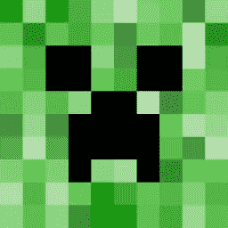
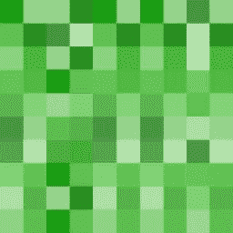
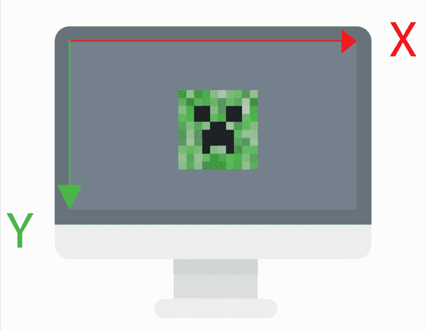
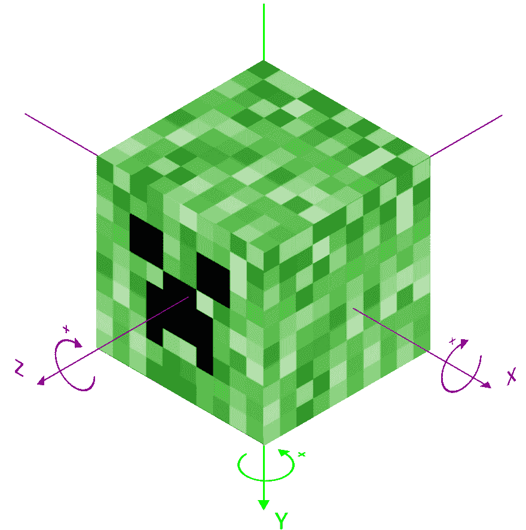

# 用 CSS 和 JS 制作 3D 爬虫的头部动画！

> 原文：<https://dev.to/mcdostone/animating-a-3d-creepers-head-in-css-and-js--2j6a>

我目前正在编写一个基于 minecraft 宇宙的 web 应用程序。在我关于 dev.to 的第一篇文章中(这是我的荣幸)，我与你分享了我是如何用一个 3D 爬虫的头**构建这个很酷的动画的，没有库，只有 CSS 和普通 JS** 。

本教程分为两个部分:

*   为爬行头建模
*   用 javascript 制作模型动画

对于本教程，我使用了 [ES6 语法](https://dev.to/srebalaji/es6-for-beginners-with-example-c7)和 [CSS 变量](https://dev.to/hybrid_alex/quick-intro-to-css-variables-and-how-i-am-using-them-today--26lb)。

## 三维爬虫头部建模

这项工作的第一步是建立爬行动物的头部模型。在我的例子中，这很容易，类似于建模一个立方体。我使用了这两种资产:

*   `face.png`爬山虎的脸
*   他的侧头，`side.png`

[](https://res.cloudinary.com/practicaldev/image/fetch/s--DUIHIkDB--/c_limit%2Cf_auto%2Cfl_progressive%2Cq_auto%2Cw_880/https://github.com/Mcdostone/mcdostone.github.io/blob/master/face.png%3Fraw%3Dtrue%2522)
[T6】](https://res.cloudinary.com/practicaldev/image/fetch/s--vjTha4fV--/c_limit%2Cf_auto%2Cfl_progressive%2Cq_auto%2Cw_880/https://github.com/Mcdostone/mcdostone.github.io/blob/master/side.png%3Fraw%3Dtrue%2522)

立方体的每一边都由一个`img`标签表示，并嵌套在一个`div`元素中，这里是`#creeper`。

```
<div id="creeper">
    
    
    
    
    
    
</div> 
```

Enter fullscreen mode Exit fullscreen mode

默认情况下，在 CSS 中，您可以根据 X 和 Y 轴在 2D 空间中定位 HTML 节点。所以一切都是平的。
[T3】](https://res.cloudinary.com/practicaldev/image/fetch/s--pwk64R67--/c_limit%2Cf_auto%2Cfl_progressive%2Cq_auto%2Cw_880/https://thepracticaldev.s3.amazonaws.com/i/3a9s7yic0nme8z365yvc.png)

在我的例子中，我想在我的网页中建模一个 3D 对象。所以我们需要改变 CSS 的默认行为！要做到这一点，只需在 CSS 中指明你想把你的元素放在一个 3D 空间中:

```
:root {
    --size-creeper: 128px;
}
#creeper {
    width: var(--size-creeper);
    height: var(--size-creeper);
    /* the magic happens here */
    transform-style: preserve-3d;
} 
```

Enter fullscreen mode Exit fullscreen mode

所以现在，我可以基于 X、Y 和 Z 轴精确地放置`#creeper`的每个子元素。这里有一个放置立方体顶部的例子:

```
.side {
    position: absolute;
    width: var(--size-creeper);
    height: var(--size-creeper);
}
.top { transform: rotateX(90deg) translateZ(calc(var(--size-creeper) / 2)); } 
```

Enter fullscreen mode Exit fullscreen mode

以下等轴测视图可以帮助您理解对象在 3D 空间中的位置，以及您可以如何进行旋转、平移和缩放:
[](https://res.cloudinary.com/practicaldev/image/fetch/s--JQGXHL4z--/c_limit%2Cf_auto%2Cfl_progressive%2Cq_auto%2Cw_880/https://thepracticaldev.s3.amazonaws.com/i/ojqiajllufzq1hibsdxt.png)

我给`#creeper`元素添加了一个动画，看看是否所有东西都被正确定位了！更多细节可以通过代码:
[https://codepen.io/Mcdostone/embed/pLGjmV?height=600&default-tab=result&embed-version=2](https://codepen.io/Mcdostone/embed/pLGjmV?height=600&default-tab=result&embed-version=2)T3】

## 制作爬虫头部动画

你可以在 codepen.io 上找到一些很棒的动画，我见过的最后一个创作是这个:[https://codepen.io/jhojann/pen/weKBxV?page=3](https://codepen.io/jhojann/pen/weKBxV?page=3)。我将从这个创作中获得一些灵感，根据鼠标的位置来制作我的爬虫头的动画。我们来写点 javascript 代码吧！我想象我的函数的签名是这样的:

```
const animate = (element, options = {}) => {
    ...
} 
```

Enter fullscreen mode Exit fullscreen mode

*   `element`是要制作动画的 HTML 元素
*   如果你想改变动画的参数,`options`会很有用。

让我们编写这个函数的代码。我首先想要的是我的爬行头的中心原点的准确位置。为了得到这些值，我在`#creeper` :
上使用`getBoundingClientRect`

```
const characterRect = element.getBoundingClientRect()
const originX = elementRect.left + elementRect.width / 2
const originY = elementRect.top + elementRect.height / 2 
```

Enter fullscreen mode Exit fullscreen mode

很好，现在我们有了头部的准确原点。下一步是将光标的位置与 X 和 Y 轴上的旋转绑定在一起。我假设当光标正好定位在原点上时，X 轴和 Y 轴上的旋转应该等于`0deg`。对于听众，我有这样的话:

```
// define default params 
options = Object.assign({}, { maxAngleX: 30, maxAngleY: 30 }, options)
// Re-maps a number from one range to another.
const map = (value, low1, high1, low2, high2) => low2 + (high2 - low2) * (value - low1) / (high1 - low1)
const follow = e => {
  try {
    const width = document.body.clientWidth
    const height = document.body.clientHeight
    // Support of smartphone/tablet
    const clientX = e.clientX || e.touches[0].clientX
    const clientY = e.clientY || e.touches[0].clientY
    const decY = map(clientY - originY, -height / 2, height / 2 , -options.maxAngleY, options.maxAngleY)
    const decX = map(clientX - originX, -width / 2, width / 2 , -options.maxAngleX, options.maxAngleX)
    element.style.transform = `rotateX(${-decY}deg) rotateY(${decX}deg)`
  } catch(e) {}
} 
```

Enter fullscreen mode Exit fullscreen mode

那么现在，让我们用这个我的函数`handle` :
绑定鼠标和触摸事件

```
document.body.addEventListener('mousemove', handle)
document.body.addEventListener("touchmove", handle, false) 
```

Enter fullscreen mode Exit fullscreen mode

最后一步是在页面加载时调用我们的`animate`函数:

```
document.addEventListener('DOMContentLoaded', _ => {
    followCursor(document.querySelector('#creeper'))
}) 
```

Enter fullscreen mode Exit fullscreen mode

这是最终结果(移动光标以查看动画):

[https://codepen.io/Mcdostone/embed/dmaGER?height=600&default-tab=result&embed-version=2](https://codepen.io/Mcdostone/embed/dmaGER?height=600&default-tab=result&embed-version=2)

我希望你喜欢这篇文章。我也对任何改进持开放态度。我不是设计师，只是一个喜欢编码和创造酷东西的人！