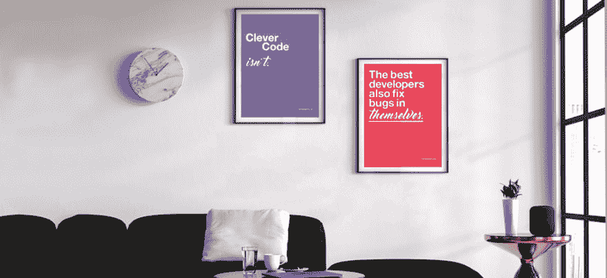

# 宣布一个附带项目:DeveloperPosters.com

> 原文：<https://dev.to/samjarman/announcing-a-side-project-developerposterscom-5fdl>

大家好！

山姆，你们中的一些人可能因为我的*初级开发日记*系列博客帖子，或者我的采访系列*开发聊天*而认识我。我已经在这里发帖大约九个月了。写完这些博客系列(仍在继续)后，我发现了一些关于如何成为一名伟大的软件工程师的核心真理。

所以，我和我的搭档 [HelloMissPotter](https://twitter.com/HelloMissPotter) 为软件工程师制作了一些海报。这些美丽又鼓舞人心的海报非常适合放在家里、办公室或工作场所。

[T2】](https://res.cloudinary.com/practicaldev/image/fetch/s--OAtjf5xg--/c_limit%2Cf_auto%2Cfl_progressive%2Cq_auto%2Cw_880/https://thepracticaldev.s3.amazonaws.com/i/yuxt0nmfmfckqyklw4ec.png)

这个月我们推出了网上商店，你可以在那里为你的办公室买一套，(或唠叨你的办公室经理得到一套；)).

您可以在[DeveloperPosters.com](https://developerposters.com/)访问该网站。我们已经从四张海报(#MVP)开始，并计划添加更多。

因为我太爱戴夫了，所以我为你们所有人创造了一个特别的代码。代码是 **DEVTOLOVE** ，这将给你总订单的 10%折扣。

最后，我想说谢谢，首先，谢谢你在社区里对我如此热情和热情，其次，谢谢你让我与你分享这些。我真的希望你能考虑支持这个项目，并支持 Dev.to 提高世界软件工程师的使命。

非常爱你，山姆