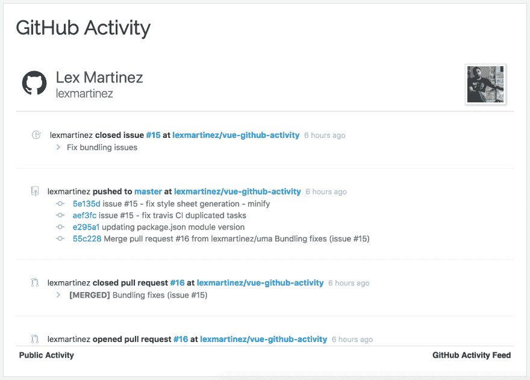

# 宣布 Vue Github 活动:一个 Vue.js 组件，将 Github 提要包含到您的项目/网站中

> 原文：<https://dev.to/lexmartinez/announcing-vue-github-activity-a-vuejs-component-to-include-a-github-feed-into-your-projectwebsite-4ge8>

*原发表于我的[博客](https://redknot.io/articles/vue-github-activity)*

这个简单的 Vue 组件用你最近的 GitHub 活动创建了一个 feed 面板。它显示用户的姓名、登录名、照片和每个活动类型的列表。

几个月前，我开始更新我的作品集网站，我选择了 Vue.js 来完成这个任务，因为这是一个非常流行的语言，我很好奇我可以用它来做什么。我开始重新设计所有的网站，并决定我应该在上面显示什么信息，在最初草图的最后，我在网站上添加了前四个面板，包括技能信息，最新项目，工作经验和最新博客帖子。

通过一个非常简约的设计，我花费了大约一周半的时间来制作 MVP 并把它放到网上。然后我向我的密友征求了一些反馈，关于他们对 UX、设计等等的看法。

反馈会议后，我修复了一些设计问题，包括新的 Spotify 播放列表面板，并收到了一个很大的建议..有人告诉我“嘿，你应该添加一个关于你的 GitHub 活动的 feed”。在那个时候是一个相当忙碌的星期，所以我在袖手旁观上停止了那个建议，然而几个星期前我决定用一个额外的重新开始，我对 Vue 外部组件的开发很好奇，所以我开发了那个面板作为外部依赖，并在 NPM 上发布了它。

最初，该项目的 MVP 是相当适度的，因为我的动机是开发组件本身，一旦我发布了第一个版本，下一步就是改进和修复一些东西，包括组件的内部结构和捆绑，所以我花了几周时间将改进作为依赖版本发布。

正如我所说的，这个项目发布在 NPM，当然是完全开源的，在麻省理工学院的许可下发布，它在 T2 的仓库对任何类型的贡献、问题、评论、请求等都是开放的。目前我在我的[网站](http://lexmartinez.com)上使用这个组件，你可以在那里查看，但这里有一个小截图。

[T2】](https://res.cloudinary.com/practicaldev/image/fetch/s--j9HzixIt--/c_limit%2Cf_auto%2Cfl_progressive%2Cq_auto%2Cw_880/https://github.com/lexmartinez/vue-github-activity/raw/master/screenshot.png)

在结束之前，特别感谢@ caseyscarborough 的这个[库](https://github.com/caseyscarborough/github-activity)，它极大地激发了这个组件的草图绘制过程。

**感谢阅读..希望你喜欢它！任何反馈我都会在这里！**