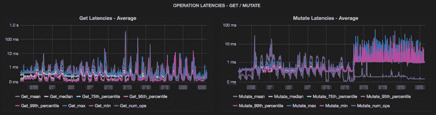

# Apache HBase - Snappy 压缩

> 原文：<https://dev.to/risdenk/apache-hbase---snappy-compression-f6l>

### 概述

[Apache HBase](https://hbase.apache.org/) 提供对大型数据集执行实时随机读/写访问的能力。HBase 构建在 [Apache Hadoop](https://hadoop.apache.org/) 之上，可以扩展到数十亿行和数百万列。HBase 的一个特性是为一个列族启用[不同类型的压缩](https://hbase.apache.org/book.html#compression)。建议对您的用例进行测试，但是这篇博客展示了 [Snappy compression](https://en.wikipedia.org/wiki/Snappy_(compression)) 如何在保持相同查询性能的同时减少存储需求。

### 证据

下面是一些集群的图片，在这些集群中进行了 Snappy 压缩测试。这些图表显示了从存储大小到系统指标的各种指标。

[T2】](https://res.cloudinary.com/practicaldev/image/fetch/s--OhXvv_Ws--/c_limit%2Cf_auto%2Cfl_progressive%2Cq_auto%2Cw_880/https://risdenk.github.img/posts/2018-11-06/dev_grafana_hbase_get_mutate_latencies.png)

[T2】](https://res.cloudinary.com/practicaldev/image/fetch/s--linhfWtS--/c_limit%2Cf_auto%2Cfl_progressive%2Cq_auto%2Cw_880/https://risdenk.github.img/posts/2018-11-06/dev_grafana_hbase_size.png)

[T2】](https://res.cloudinary.com/practicaldev/image/fetch/s--CnQjjbf5--/c_limit%2Cf_auto%2Cfl_progressive%2Cq_auto%2Cw_880/https://risdenk.github.img/posts/2018-11-06/test_grafana_hbase_get_mutate_latencies.png)

[T2】](https://res.cloudinary.com/practicaldev/image/fetch/s--wfKR38hi--/c_limit%2Cf_auto%2Cfl_progressive%2Cq_auto%2Cw_880/https://risdenk.github.img/posts/2018-11-06/test_grafana_hbase_size.png)

[T2】](https://res.cloudinary.com/practicaldev/image/fetch/s--TSV8lipJ--/c_limit%2Cf_auto%2Cfl_progressive%2Cq_auto%2Cw_880/https://risdenk.github.img/posts/2018-11-06/test_grafana_system_disk_io.png)

[T2】](https://res.cloudinary.com/practicaldev/image/fetch/s--t85MyCDo--/c_limit%2Cf_auto%2Cfl_progressive%2Cq_auto%2Cw_880/https://risdenk.github.img/posts/2018-11-06/test_grafana_system_iowait.png)

[T2】](https://res.cloudinary.com/practicaldev/image/fetch/s--E4qI3voD--/c_limit%2Cf_auto%2Cfl_progressive%2Cq_auto%2Cw_880/https://risdenk.github.img/posts/2018-11-06/test_grafana_system_user.png)

### 结论

上面的图表显示存储节省了 80%以上，而变异延迟仅略有增加。进行测试的集群加载了模拟数据和负载。部署时，生产数据也与此相符。这种存储节省也有助于备份和灾难恢复，因为我们不需要通过网络移动那么多数据。下面是您自己用更多测试选项实现它的参考资料。

#### 参考文献

*   [https://community . Horton works . com/articles/54761/compression-in-h base . html](https://community.hortonworks.com/articles/54761/compression-in-hbase.html)
*   [http://Hadoop-h base . blogspot . com/2016/02/h base-compression-vs-block encoding _ 17 . html](http://hadoop-hbase.blogspot.com/2016/02/hbase-compression-vs-blockencoding_17.html)
*   [https://blogs . Apache . org/h base/entry/the _ effect _ of _ column family _ row key](https://blogs.apache.org/hbase/entry/the_effect_of_columnfamily_rowkey)
*   [https://d b-blog . web . CERN . ch/blog/Zbigniew-baranowski/2017-01-performance-comparison-different-file-formats-and-storage-engines](https://db-blog.web.cern.ch/blog/zbigniew-baranowski/2017-01-performance-comparison-different-file-formats-and-storage-engines)
*   [http://blog . erdemagaoglu . com/post/4605524309/lzo-vs-snappy-vs-lzf-vs-zlib-a-comparison-of](http://blog.erdemagaoglu.com/post/4605524309/lzo-vs-snappy-vs-lzf-vs-zlib-a-comparison-of)
*   [https://hbase.apache.org/book.html#compression](https://hbase.apache.org/book.html#compression)
*   [https://h base . Apache . org/book . html # data . block . encoding . enable](https://hbase.apache.org/book.html#data.block.encoding.enable)