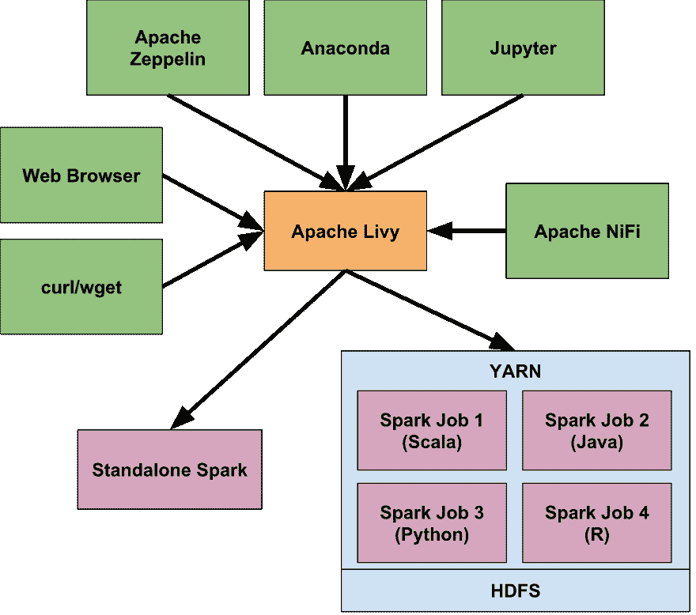

# Apache Livy -简化的 Apache Spark 集成

> 原文：<https://dev.to/risdenk/apache-livy---simplified-apache-spark-integration-4b77>

### 概述

[Apache Livy](https://livy.apache.org/) 提供了一个 [REST 接口](https://livy.incubator.apache.org/docs/latest/rest-api.html)用于与 [Apache Spark](https://spark.apache.org/) 交互。在 Livy 之前，Apache Spark 通常需要从命令行运行 [`spark-submit`](https://spark.apache.org/docs/latest/submitting-applications.html) 或者需要工具来运行`spark-submit`。这在许多情况下是不可行的，并且使得 Spark 周围的安全性变得困难。

### 阿帕奇·李维历史

Cloudera 最初构建 Livy 是为了通过提供一个可以轻松提交和监控 Spark 作业的接口来解决这些问题。Hortonworks 决定支持并改进 Livy，如这里的[和这里的](https://hortonworks.com/blog/livy-a-rest-interface-for-apache-spark/)[所示。Livy 加入了](https://hortonworks.com/blog/recent-improvements-apache-zeppelin-livy-integration/) [Apache Software Foundation](https://www.apache.org/) ，目前正在[孵化器进程中](https://livy.apache.org)。许多其他公司和工具已经开始使用 Apache Livy 作为与 Apache Spark 交互的集成点。下面是 Apache Livy 实现的一个例子。

### 阿帕奇李维架构

[T2】](https://res.cloudinary.com/practicaldev/image/fetch/s--DOK3o6MA--/c_limit%2Cf_auto%2Cfl_progressive%2Cq_auto%2Cw_880/https://risdenk.github.img/posts/2018-03-24/apache_livy_architecture.svg)

### 与 Apache Livy 整合

如上图所示，Apache Livy 集成了许多不同的工具，使用户能够快速安全地使用 Apache Spark。微软的 Azure HDInsight 支持 Apache Livy 连接到 Spark 集群。 [Jupyter Notebook](https://jupyter.org/) ，一款基于 web 的开源笔记本，可以[使用 Livy with `sparkmagic`](https://github.com/jupyter-incubator/sparkmagic) 与 Spark 进行交互。另一个基于网络的笔记本解决方案， [Apache Zeppelin](https://zeppelin.apache.org) 将[与 Livy](https://zeppelin.apache.org/docs/latest/interpreter/livy.html) 进行了本地集成。 [Anaconda](https://www.anaconda.com/) ，支持 Jupyter 和 Apache Zeppelin，[也支持 Livy(视频)](https://www.youtube.com/watch?v=wa514mI7Aw4)。最近 [Apache NiFi](https://nifi.apache.org/) 增加了对[通过 Livy](https://community.hortonworks.com/articles/73828/submitting-spark-jobs-from-apache-nifi-using-livy.html) 提交 Spark 作业的支持。最后， [Apache Knox](https://knox.apache.org/) 可以在 Apache Livy 前面提供 LDAP 认证[。](///2018/03/02/apache-knox-apache-livy-service.html)

由于 Apache Livy，上面所有的集成使得使用 Apache Spark 更容易，而不需要`spark-submit`。构建在 Apache Livy 之上提供了一个很好的抽象，不用担心 Spark 作业将在哪里运行。

### 接下来是什么？

在过去的一年里，我一直与我的团队和多个分析团队合作，以简化入门和使用 [Apache Spark](https://spark.apache.org/) 的体验。 [Apache Livy](https://livy.apache.org/) 提供了在不牺牲易用性和安全性的情况下实现这一点的必要能力。因为 Apache Spark 的大部分文档都围绕着 [`spark-submit`](https://spark.apache.org/docs/latest/submitting-applications.html) 展开，所以我一直在研究如何将这些例子转换成 Apache Livy。