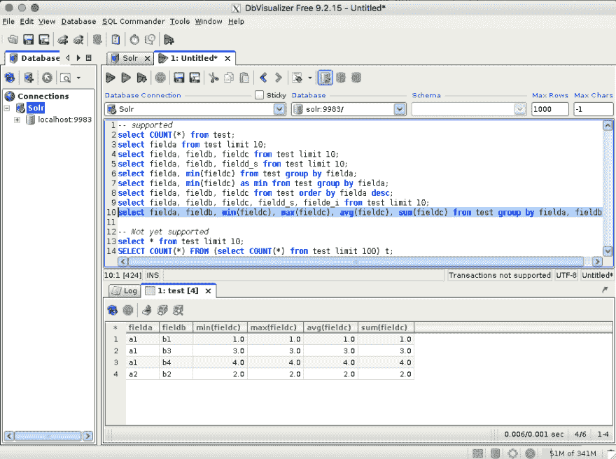
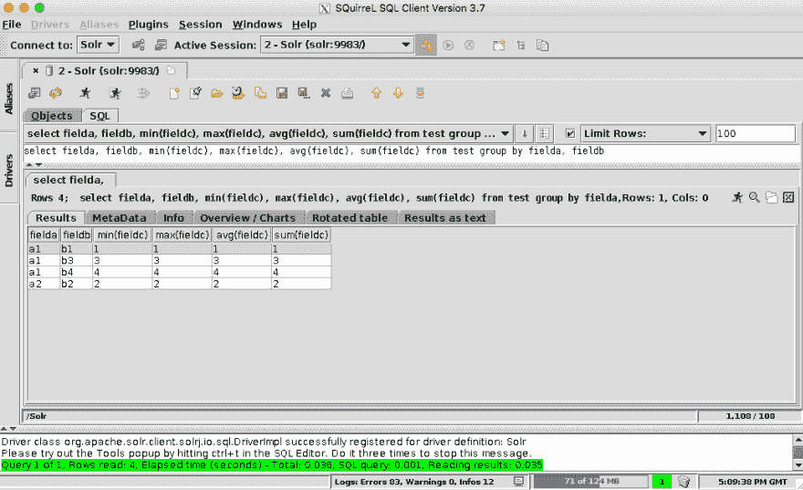
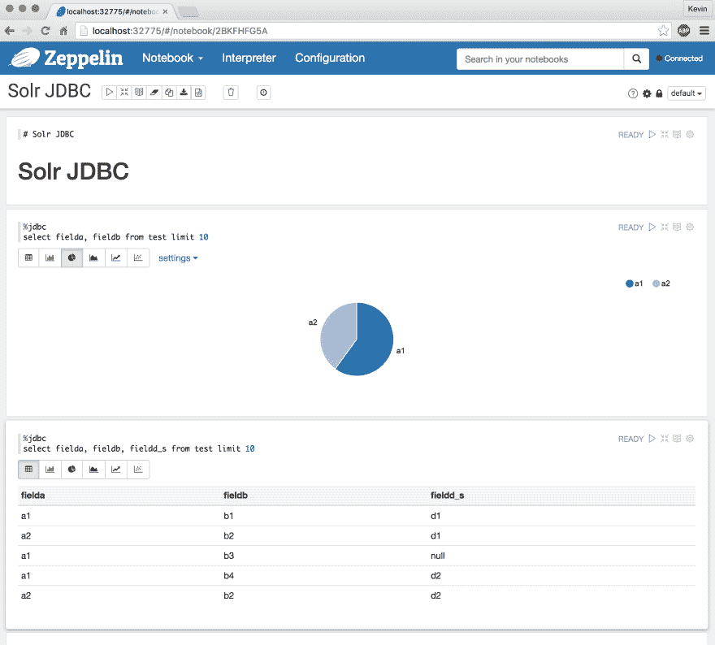

# 阿帕奇 Solr - JDBC 简介-两周年纪念

> 原文：<https://dev.to/risdenk/apache-solr---jdbc-introduction---two-year-anniversary-21ga>

#### 2018 年 3 月更新

我最初是在 2016 年 4 月把这个内容发布到 LinkedIn [这里](https://www.linkedin.com/pulse/apache-solr-jdbc-introduction-kevin-risden/)。在[宣布](http://mail-archives.apache.org/mod_mbox/lucene-dev/201603.mbox/%3CCAE4tqLPcNwyJpsD8UBUJ67-52TVWDq-GY7H1Bk8_C1RO_7KFgA@mail.gmail.com%3E)我成为 [Apache Lucene/Solr](https://lucene.apache.org/solr/) 提交者大约两周年之际，我在我的博客上做了一些小的编辑。

在我的[上一篇文章](///2018/03/16/journey-to-apache-lucene-solr-commiter-two-year-anniversary.html)中，我详细描述了我从事 Apache Solr JDBC 驱动程序并成为 Apache Lucene/Solr 提交者的历史。这篇文章将描述 Solr JDBC 驱动程序及其用法。接下来的几篇文章将详细介绍如何将 Solr JDBC 驱动程序用于 SQL 客户端和数据库可视化工具。

### 概述

我能找到的第一个关于阿帕奇 Solr 和 JDBC 的参考资料可以追溯到 2008 年的 SOLR-373。尽管花了将近 8 年的时间，Solr JDBC 驱动程序是 Solr 6 的一个新特性，支持 JDBC 连接到 Solr 云集群。通过将 Solr 开放给 SQL 查询，这使得更多的开发人员无需学习新的查询语言就可以使用全文搜索引擎进行分析。JDBC 不仅开放了 Java 应用程序来使用 SQL 查询 Solr，还开放了各种商业智能(BI)工具。

Solr JDBC 驱动程序建立在 Solr 并行 SQL 的基础上，Solr 并行 SQL 是由[乔尔·伯恩斯坦](https://www.linkedin.com/in/bernsteinjoel/)在 [SOLR-7560](https://issues.apache.org/jira/browse/SOLR-7560) 中引入的，并且包括用`/sql`处理程序处理 SQL 查询的能力。乔尔还在 [SOLR-7986](https://issues.apache.org/jira/browse/SOLR-7986) 开发了最初的 Solr JDBC 驱动程序。我改进了 Solr JDBC 驱动程序以支持一些带有 [SOLR-8502](https://issues.apache.org/jira/browse/SOLR-8502) 的 BI 工具。虽然 Solr JDBC 驱动程序还不完整，但它现在支持像 [DbVisualizer](https://www.dbvis.com/) 这样的工具，并且已经在 [SOLR-8659](https://issues.apache.org/jira/browse/SOLR-8659) 中支持更多。Solr JDBC 驱动程序的第一个版本只支持 SQL 语言的子集，详见 [Solr 并行 SQL 参考指南](https://lucene.apache.org/solr/guide/7_2/parallel-sql-interface.html)。添加了一个 [SQL 优化器](https://issues.apache.org/jira/browse/SOLR-8593)，并计划在未来的版本中加入连接功能。

### 入门

Solr JDBC 驱动程序很容易上手，需要一个 Solr 云集群和客户端类路径上的几个 jar。目前，Solr JDBC 驱动程序的设置需要一个 Maven 依赖项`org.apache.solr:solr-solrj`,或者将以下 jar 从提取的 Apache Solr 二进制档案复制到客户端类路径:

*   `dist/solr-solrj-${SOLR_VERSION}.jar`
*   `dist/solrj-lib/*.jar`
*   `commons-io-2.4.jar`
*   `httpclient-4.4.1.jar`
*   `httpcore-4.4.1.jar`
*   `httpmime-4.4.1.jar`
*   `jcl-over-slf4j-1.7.7.jar`
*   `noggit-0.6.jar`
*   `slf4j-api-1.7.7.jar`
*   `stax2-api-3.1.4.jar`
*   `woodstox-core-asl-4.4.1.jar`
*   `zookeeper-3.4.6.jar`

**注意** : [SOLR-8680](https://issues.apache.org/jira/browse/SOLR-8680) 被创造出来试图使这成为一个单一的罐子

一旦这些 jar 在客户端类路径上，就可以使用驱动程序`org.apache.solr.client.solrj.io.sql.DriverImpl` :
通过 JDBC 使用以下连接字符串格式进行连接

```
jdbc:solr://SOLR_ZK_CONNECTION_STRING?collection=COLLECTION_NAME 
```

Enter fullscreen mode Exit fullscreen mode

连接字符串的一个例子可以是:

```
jdbc:solr://zk1,zk2,zk3:2181/solr?collection=collection1 
```

Enter fullscreen mode Exit fullscreen mode

通过 Solr JDBC 驱动程序进行连接的最新文档可在[发送查询 JDBC](https://lucene.apache.org/solr/guide/7_2/parallel-sql-interface.html#sending-queries) 和 [SQL 客户端和数据库可视化工具](https://lucene.apache.org/solr/guide/7_2/parallel-sql-interface.html#sql-clients-and-database-visualization-tools)下的 [Apache Solr 参考指南并行 SQL 页面](https://lucene.apache.org/solr/guide/7_2/parallel-sql-interface.html)中找到。另外， [Sematext 发表了一篇博文](https://sematext.com/blog/solr-6-as-jdbc-data-source/)，详细描述了如何在 Java 中使用 Solr JDBC。在某些情况下，Solr 集合将需要[配置，如这里详细描述的](https://lucene.apache.org/solr/guide/6_6/parallel-sql-interface.html#configuration)，以便与 Solr JDBC 驱动程序和并行 SQL 一起工作。

### SQL 客户端和数据库可视化工具

一些 SQL 客户端和数据库可视化工具已经过测试，可以与 Solr JDBC 驱动程序一起工作。正在继续努力扩大 JDBC 支持，以使更多的客户使用 SOLR-8659。下面是一些通过 JDBC 驱动程序连接到 Solr 的 SQL 工具的截图。

#### DbVisualizer

[T2】](https://lucene.apache.org/solr/guide/7_2/solr-jdbc-dbvisualizer.html)

#### 松鼠 SQL

[T2】](https://lucene.apache.org/solr/guide/7_2/solr-jdbc-squirrel-sql.html)

#### 阿帕奇齐柏林飞艇

[T2】](https://lucene.apache.org/solr/guide/7_2/solr-jdbc-apache-zeppelin.html)

### 接下来是什么？

我将交叉发布 LinkedIn 的原始文章，包括一些关于如何配置一些 SQL 客户端和数据库可视化工具以通过 JDBC 驱动程序连接到 Solr 的分步指南。Apache Solr 参考指南已经更新，包括了更多关于连接参数的细节和一些关于特定客户端的信息。如果你对 Solr JDBC 驱动有任何问题或者想帮忙，那么 [Apache Solr 网站](https://lucene.apache.org/solr/)有一个关于[社区](https://lucene.apache.org/solr/community.html)以及如何使用 Solr 用户邮件列表的部分。