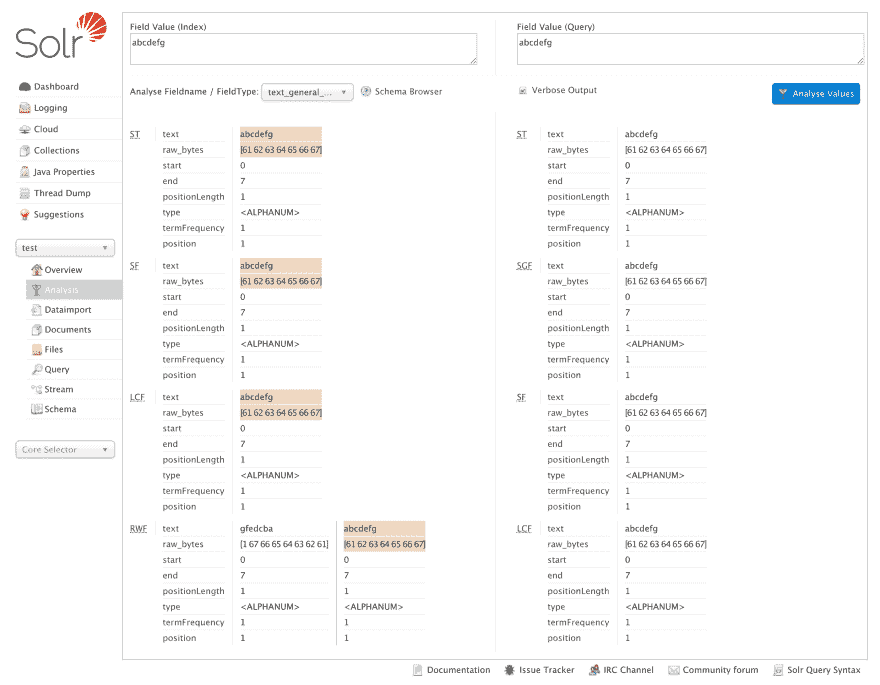
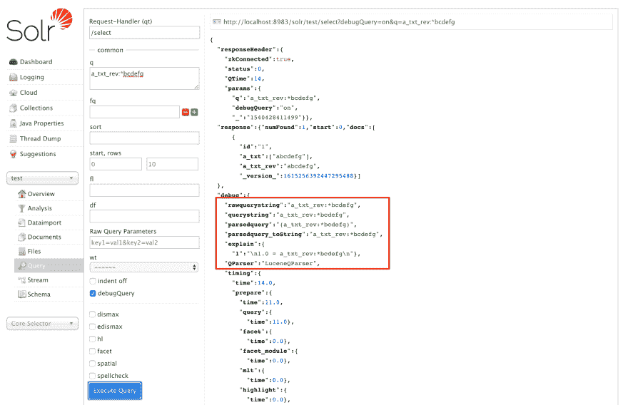
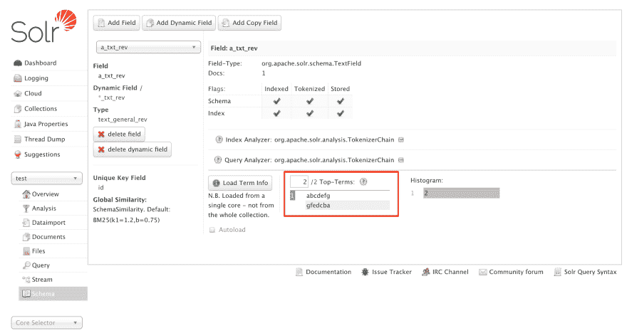

# Apache Solr -前导通配符查询和 ReversedWildcardFilterFactory

> 原文：<https://dev.to/risdenk/apache-solr---leading-wildcard-queries-and-reversedwildcardfilterfactory-48kc>

### 概述

Apache Solr 是一个基于 [Apache Lucene](https://lucene.apache.org/solr/) 的全文搜索引擎。最近，我在研究查询包含前导通配符时的性能。这些年来有[很多](https://mail-archives.apache.org/mod_mbox/lucene-solr-user/201109.mbox/%3C1315989749353-3335240.post%40n3.nabble.com%3E) [关于前导通配符查询的问题](https://mail-archives.apache.org/mod_mbox/lucene-solr-user/201502.mbox/%3CCACtr6ybiKq_nyTdBk_82%3DjErHc3jOkFhC_vEUP9ymcbgCkEm2Q%40mail.gmail.com%3E)。令我惊讶的是，很少有参考资料解释什么是主要通配符查询以及它们是如何在幕后实现的。也没有参考资料解释如何验证前导通配符被有效地处理。

因此，在这篇博客中，我涵盖了以下内容:

*   什么是主要通配符查询？
*   为什么前导通配符查询效率低？
*   如何改进前导通配符查询
*   `ReversedWildcardFilterFactory`实施

### 什么是前导通配符查询？

前导通配符查询是在术语开头使用星号(`*`)的术语查询。例如，您可以查找所有以`ed`和`color:*ed`结尾的颜色。星号(`*`)代替一个或多个字符。还有一种变体，问号(`?`)被用作单个字符的占位符。我只关注前导通配符查询，不关注尾随通配符查询(即:`color:re*`)或其他组合通配符查询(即:`color:*e*`)。有关更多详细信息，请参见 [Apache 参考指南通配符搜索页面](https://lucene.apache.org/solr/guide/7_5/the-standard-query-parser.html#wildcard-searches)。

### 前导通配符查询为什么效率低？

Apache Lucene ，支持 [Apache Solr](https://lucene.apache.org/solr/) 和 [Elasticsearch](https://www.elastic.co/products/elasticsearch) 的库，被设计用来搜索代币。[记号](https://lucene.apache.org/core/7_5_0/test-framework/org/apache/lucene/analysis/Token.html)是一段文本数据经过[记号化和](https://lucene.apache.org/solr/guide/7_5/understanding-analyzers-tokenizers-and-filters.html)分析后的表示。Lucene 非常擅长精确匹配，因为它可以高效地查询索引来匹配。当涉及到前导通配符时，需要做更多的工作，因为索引并不适合这种类型的查找。

前导通配符查询必须遍历索引中的所有术语，以查看它们是否与查询匹配。即使对于中等大小的索引，这也是非常耗时的。在查询的开头使用星号(`*`)，这意味着在整个索引中可能有许多匹配项。问号(`?`)可以显著提高性能，因为 Lucene 不需要做那么多检查。在遍历整个索引进行匹配之前，对这些术语的迭代不能停止。如果索引不适合内存，这可能会导致糟糕的缓存以及其他问题。

### 如何改进前导通配符查询

改进前导通配符查询的最好方法是尽可能删除它们。在许多情况下，通过不同的标记化或分析，有更好的方法来处理查询。如果用例需要前导通配符查询，那么有一个技巧可以帮助提高性能。提高性能的一种方法是在索引期间反转标记，这基本上将前导通配符查询改为尾随通配符查询。尾部通配符查询可以更有效地执行，因为只需要检查索引的一部分。

Apache Solr 有一个名为 [`ReversedWildcardFilterFactory`](https://lucene.apache.org/solr/7_5_0/solr-core/org/apache/solr/analysis/ReversedWildcardFilterFactory.html) 的令牌过滤器，它发出反向令牌。这可以在为可能需要处理前导通配符查询的字段构造字段类型时使用。在`_default` [配置集中有一个这样的例子](https://lucene.apache.org/solr/guide/7_5/config-sets.html)叫做 [`text_general_rev`](https://github.com/apache/lucene-solr/blob/branch_7_5/solr/server/solr/configsets/_default/conf/managed-schema#L440) 。这显示了如何为字段配置`ReversedWildcardFilterFactory`。需要注意的是[索引和查询分析器阶段](https://lucene.apache.org/solr/guide/7_5/analyzers.html#analysis-phases)是不同的。`ReversedWildcardFilterFactory`只能作为索引分析器来实现。查询端被自动处理。

作为参考，下面是`text_general_rev`字段类型定义:

```
<fieldType name="text_general_rev" class="solr.TextField" positionIncrementGap="100">
    <analyzer type="index">
        <tokenizer class="solr.StandardTokenizerFactory"/>
        <filter class="solr.StopFilterFactory" ignoreCase="true" words="stopwords.txt" />
        <filter class="solr.LowerCaseFilterFactory"/>
        <filter class="solr.ReversedWildcardFilterFactory" withOriginal="true"
                maxPosAsterisk="3" maxPosQuestion="2" maxFractionAsterisk="0.33"/>
      </analyzer>
      <analyzer type="query">
        <tokenizer class="solr.StandardTokenizerFactory"/>
        <filter class="solr.SynonymGraphFilterFactory" synonyms="synonyms.txt" ignoreCase="true" expand="true"/>
        <filter class="solr.StopFilterFactory" ignoreCase="true" words="stopwords.txt" />
        <filter class="solr.LowerCaseFilterFactory"/>
    </analyzer>
</fieldType> 
```

### `ReversedWildcardFilterFactory`实现

当在 Solr 中为一个字段设置了`ReversedWildcardFilterFactory`时，该字段在索引期间会发出两个不同的标记，原始标记和反转标记。下面的屏幕截图显示了[分析选项卡](https://lucene.apache.org/solr/guide/7_5/analysis-screen.html)，展示了如何为一个简单的字符串`abcdefg`创建令牌。

[T2】](https://res.cloudinary.com/practicaldev/image/fetch/s--7O3b8wHB--/c_limit%2Cf_auto%2Cfl_progressive%2Cq_auto%2Cw_880/https://risdenk.github.img/posts/2018-10-25/test_analysis.png)

额外的反转标记会增加索引大小，但这通常是一个可以接受的折衷，因为另一个选项是非常慢的前导通配符查询。

当一个查询使用带有`ReversedWildcardFilterFactory`的字段时，Solr [在内部评估](https://github.com/apache/lucene-solr/blob/branch_7_5/solr/core/src/java/org/apache/solr/parser/SolrQueryParserBase.java#L1192)是搜索原始的还是反向的查询字符串。由于这种优化是 Solr 内部的，因此一个恼人的问题是没有向用户提示查询字符串被反转了。即使使用 [`debug=true`](https://lucene.apache.org/solr/guide/7_5/common-query-parameters.html) ，解析后的查询也是一样的，因为 [`AutomatonQuery#toString()`方法](https://github.com/apache/lucene-solr/blob/branch_7_5/solr/core/src/java/org/apache/solr/parser/SolrQueryParserBase.java#L1213)不提供自动机的信息。下面的屏幕截图显示了一个前导通配符查询，但没有表明它工作正常。

[T2】](https://res.cloudinary.com/practicaldev/image/fetch/s--AO3x9prp--/c_limit%2Cf_auto%2Cfl_progressive%2Cq_auto%2Cw_880/https://risdenk.github.img/posts/2018-10-25/wildcard_debug_query.png)

我能够通过远程调试正在运行的 Solr 服务器来确认预期的行为。这表明该查询基于 [`ReversedWildcardFilterFactory`](https://lucene.apache.org/solr/7_5_0/solr-core/org/apache/solr/analysis/ReversedWildcardFilterFactory.html) 的参数正确地反转了自动机。

我在 Solr UI 中唯一能找到的显示 ReversedWildcardFilterFactory 实际上做了什么的地方是在集合下的[模式部分](https://lucene.apache.org/solr/guide/7_5/stream-screen.html)。然后，您必须选择字段，然后单击“加载条款信息”按钮，以获得有关基础条款的详细信息。下面的屏幕截图显示了`a_txt_rev`字段的术语。

[T2】](https://res.cloudinary.com/practicaldev/image/fetch/s--rMwpMrPB--/c_limit%2Cf_auto%2Cfl_progressive%2Cq_auto%2Cw_880/https://risdenk.github.img/posts/2018-10-25/a_txt_rev_terms.png)

### 结论

Solr 和`ReversedWildcardFilterFactory`可以帮助提高前导通配符查询的性能，如果它们是绝对必需的话。当我多年来一直解释说`ReversedWildcardFilterFactory`将解决主要的通配符问题时，我并没有看内部。这篇文章迫使我查看 Lucene 和 Solr 如何使用前导通配符的内部情况。我检查了 Solr 的多个版本(4.3.x、4.10.x、5.5.x、6.3.x 和 7.5.x)，最初认为查询没有使用反转的标记。直到我使用调试器进行检查，我才确信查询得到了正确的处理。对于这种情况，更好的调试日志记录会有很大帮助。

#### Solr 设置参考

我使用下面的代码来设置 Apache Solr，以复制上面所有的截图。还有一些命令行版本可以通过编程收集相同的信息。

```
./bin/solr start -c
./bin/solr create -c test -n basic_configs
echo '1,abcdefg,abcdefg' | ./bin/post -c test -type text/csv -params "fieldnames=id,a_txt,a_txt_rev" -d
curl "http://localhost:8983/solr/test/select?q=*:*"
curl "http://localhost:8983/solr/test/select?q=a_txt:abcdefg&debug=true"
curl "http://localhost:8983/solr/test/select?q=a_txt_rev:abcdefg&debug=true"
curl "http://localhost:8983/solr/test/admin/luke?fl=a_txt_rev&numTerms=2" 
```