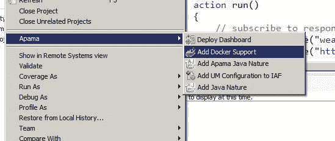

# apama builder for docker

> 原文：<https://dev.to/techcommunity/apama-builder-for-docker-4j15>

# 采用多阶段构建部署设计师产品

阿帕玛 10.3 引入了对使用多阶段 Docker 构建和新的构建器映像来构建和部署 Software AG Designer 项目的支持。本文解释了它的工作原理和使用方法。

| 2018 年第四期 | [ 下载 PDFT4】](http://techcommunity.softwareag.com/ecosystem/download/techniques/2018-issue4/SAG_Apama_Docker_TECHniques_Oct18_WEB.pdf) |
| --- | --- |

## 向设计器项目添加 Docker 支持

在 10.3 版本中，Designer 中的所有阿帕玛项目都添加了一个新的上下文菜单项:

[T2】](https://res.cloudinary.com/practicaldev/image/fetch/s--jSQaOhDc--/c_limit%2Cf_auto%2Cfl_progressive%2Cq_auto%2Cw_880/http://techcommunity.softwareag.com/documents/10157/10000089/afd1.jpg/5aad3a24-7ce3-4ebc-a0ab-40b96da7f232%3Ft%3D1539764627938)

这将在项目的顶层添加一个 Dockerfile。对于大多数仅适用于 EPL 的阿帕玛项目，默认 docker 文件无需进一步更改即可运行。这将部署查询文件并与数字事件服务集成，以及在启动时正确排序任何进样和事件文件。它还包括您的整个配置，包括项目中的定制和连接包。

## 建筑设计师项目

一旦您添加了 Docker 支持，您就可以使用 Docker 客户端从您的项目中构建一个映像。这可以在 Windows 上使用 Docker client for Windows 和本地 Linux Docker 安装或远程 Docker 服务器来完成。它也可以作为 CI 管道的一部分从 Linux 中完成。

默认情况下，这将使用阿帕玛的公共 Docker 商店图像:

```
docker build –t apama\_app ProjectDirectory 
```

要使用 docker 商店，您必须首先使用您的 Docker 凭证调用 Docker 登录。或者，如果您已经将阿帕玛基础映像推送到自定义存储库中，您可以在构建时覆盖这些映像:

```
docker build –t apama\_app \ --build-arg APAMA\_IMAGE=repository/apama- correlator \ --build-arg APAMA\_BUILDER=repository/apama builder \ ProjectDirectory 
```

生成的应用程序映像可以在本地运行，也可以通过 Docker 或 Kubernetes 推送到一个存储库中进行云部署。简单地运行容器将自动启动阿帕玛并将配置好的应用程序部署到其中。

## 多级 Dockerfile

构建阿帕玛的多阶段 docker 文件如下所示:

```
ARG APAMA\_VERSION=10.3 ARG APAMA\_BUILDER=store/softwareag/apama-builder:${APAMA\_VERSION} ARG APAMA\_IMAGE=store/softwareag/apama-correlator:${APAMA\_VERSION} # Use the build environment FROM ${APAMA\_BUILDER} as builder # Copy project assets into build environment COPY --chown=sagadmin:sagadmin . /Project # Deploy the apama project RUN engine\_deploy --outputDeployDir ${APAMA\_WORK}/Project\_deployed \ /Project # Final image is based on the runtime base image FROM ${APAMA\_IMAGE} # Copy deployed project from the build environment COPY --from=builder ${APAMA\_WORK}/Project\_deployed \ ${APAMA\_WORK}/Project\_deployed WORKDIR ${APAMA\_WORK} # Run the deployed project CMD ["correlator", "--config", "Project\_deployed"] 
```

通过一些处理数字事件服务应用程序的附加功能，这正是当您通过 Designer 将 Docker 支持添加到您的项目时所得到的。如果您想定制您的映像构建过程，您也可以自己实现它。特别是，如果您有额外的生成步骤，如生成插件，您可以编辑由 Designer 添加的 Dockerfile 文件，以将这些生成步骤包含在生成器映像中，然后将结果复制到运行时映像中。由于多阶段构建，您不需要担心在构建步骤中创建的任何临时文件会出现在最终映像中。只有从构建器映像中显式复制的内容才会包含在内。这允许您在构建过程中安装编译器和其他构建工具。构建器映像已经提供了一个 JDK 和一个 Python 3 解释器。

## 在 CI 管道中使用多阶段构建

部署 Docker 映像的一种常见方法是使用从源代码控制直接到部署的 CI 管道。您也可以使用 Docker 部署的阿帕玛项目来实现这一点。只需将 Docker 支持添加到您的项目中，并提交到您的源代码库中。因为所有特定于阿帕玛的构建步骤都发生在构建器映像中，所以您的构建服务器只需要有可用的源代码控制和 Docker 客户端工具。其他所有事情都将发生在 Docker 中经过适当配置的环境中。然后，CI 流程将生成一个映像，并将其推送到一个存储库，该存储库可以从任何 Docker 或 Kubernetes 配置中直接部署。

除了构建 CI 管道之外，您还可以运行测试。阿帕玛构建器映像附带了一个完整的 Pysys 和 Python 3 环境，可以作为项目 Dockerfile:
的一部分运行

```
FROM ${APAMA\_BUILDER} as builder … RUN cd tests; pysys run … FROM ${APAMA\_IMAGE} 
```

如果测试运行失败，您的 Docker 构建也会失败。这意味着您的 CI 管道可以在部署之前用测试套件验证应用程序。因为测试是在构建器环境中运行的，所以测试输出甚至源目录都不需要复制到最终部署的映像中。

## 总结

面向 Docker 的阿帕玛构建器映像与 Software AG Designer 集成提供了部署工作流的无缝开发，包括支持 CI 管道，该管道包含在生成适用于所有主要云提供商部署的映像之前的完整构建和测试流程。

要了解更多信息，请查看 Software AG 阿帕玛公司的文档和 Docker 示例，这些文档和示例可在您的阿帕玛系统和[https://github . com/Software AG/apama-streaming-analytics-Docker-samples](https://github.com/SoftwareAG/apama-streaming-analytics-docker-samples)上找到