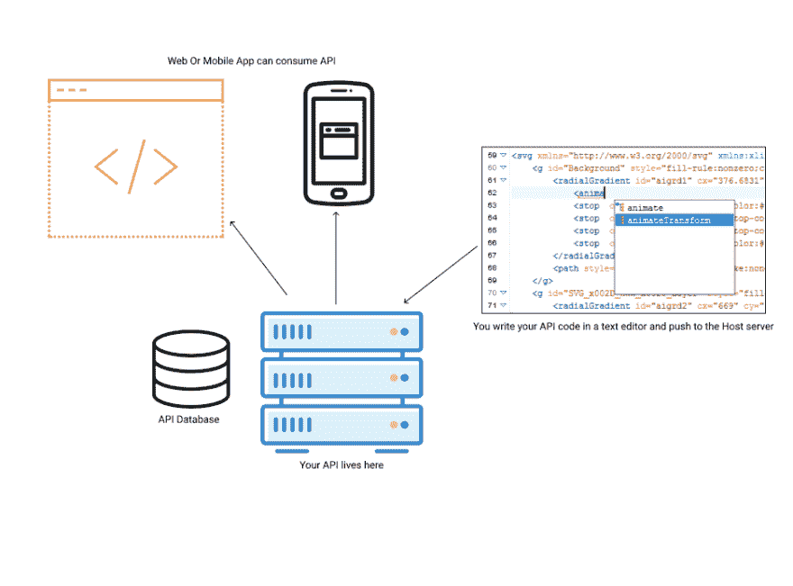

# 面向新手的 API

> 原文：<https://dev.to/emma_odia/api-for-newbies--5e94>

请不要给我讲专业术语！

所以在这篇文章中，我将回答一些我还是一个初级开发者时没有任何答案的问题。我希望有人在我刚开始的时候发了一个帖子。所以我在这里，目标很简单:在非开发对话中解释什么是 API，上帝保佑！

*“一切都应该尽可能简单，但不能更简单”*
爱因斯坦

在这篇文章中，我们将采取一种提问的方法，然后提供足够的答案来回答这个问题，而不会在解释或意义上有任何损失。

### 1。API 是一种软件吗？

回答:即使你已经阅读了维基百科和所有其他来源上以关键词定义:应用程序编程接口开始的定义，对于 API 到底是什么还有一个普遍的误解。这里对接口的强调经常会导致混乱，更不用说使用 Twitter API、YouTube API、脸书 API 和科技巨头制造的 API，而且作为一个新手，有这样一种误解，认为 API 只由科技巨头制造！

就这一个问题，我将提供三个答案。鉴于这个问题存在两个未问的问题。另外两个是:

### 1a。我可以构建自己的 API 吗？

### 1b。其他人也可以使用我的 API 吗？

API 基本上是一种软件，就像运行在手机或网站上的应用程序。

在“高级工程师”称之为误导之前，请记住我在开始时说这将是一个非技术性的解释！

这是一个直观的演示，分步骤进行了详细说明:

 

<figure>

<figcaption>利用图像作为视觉引导

<figcaption></figcaption>

</figcaption>

</figure>

在这一点上，使用类比来解释答案是安全的，从而给它一些深度。

是的，我把 API 比作手机或网站上的应用程序。现在明确地说:

这两个应用程序都运行(托管)在服务器上，然后您才可以访问使用。该应用程序有一个代码库，可以(或不)分为前端和后端。你看不到也可能对这个程序运行的逻辑(代码)不感兴趣。你有它作为一个完整的软件，你可以访问！API 基本上是一样的，它是一个托管在服务器上的软件，您可以出于各种原因和用途访问它。

是的，你可以建一个！够简单的回答！在这篇文章的后续文章中，我将教你如何使用 ExpressJS 在节点上用 MongoDB 或 PostgreSQL 构建一个 API，你将把它推到一个服务器上，让其他人使用它。请关注这篇文章。像大型科技巨头一样，其他人也可以使用你的 API。这里的好处是，他们可以在桌面或移动设备上使用(消费)它。

 

<figure>

<figcaption>你可以把你的 app 托管在服务器上，让它活起来！

<figcaption></figcaption>

</figcaption>

</figure>

最后，这是我希望在我还是一名初级工程师的时候就知道的事情，当我发现大型科技公司公开提供 API 时，这个时髦词经常被抛来抛去，我感到头晕目眩。好了，这是把它变成非技术人员的简单语言的许多方法之一。如果你有更多的问题，担心或者只是想在这次谈话中加入你的想法，请在评论区发表。另外，请留意后续文章，在这些文章中，我将构建一个 API 并引导您完成整个过程，这样您就可以开始自己构建一些 API 了。