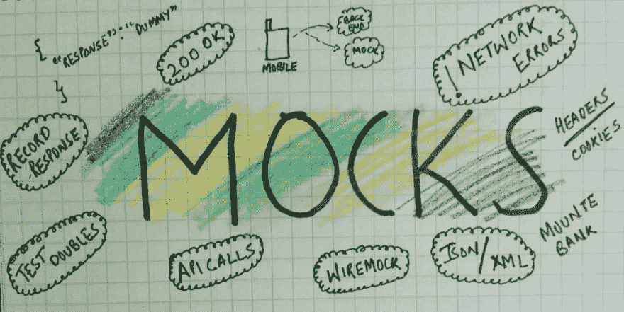
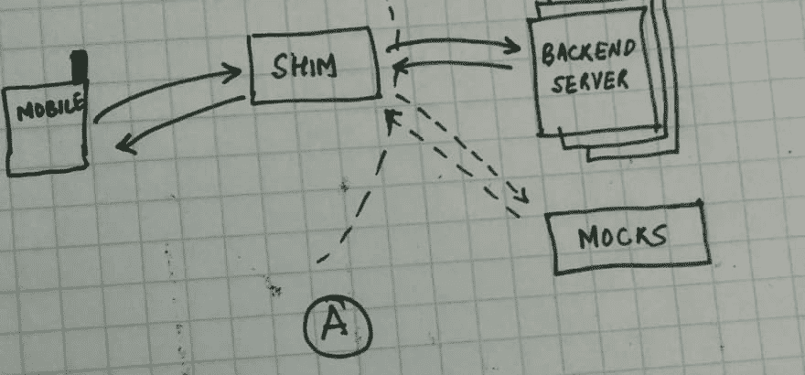
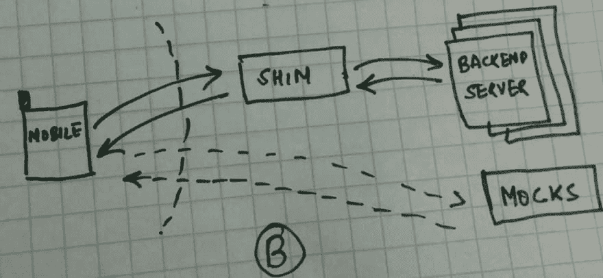

# API 模仿以及我们为什么要关注它

> 原文：<https://dev.to/kapil_aggarwal1/api-mocks-and-why-should-we-care-38po>

[T2】](https://res.cloudinary.com/practicaldev/image/fetch/s--uFWLZ65z--/c_limit%2Cf_auto%2Cfl_progressive%2Cq_auto%2Cw_880/https://cdn-images-1.medium.com/max/1024/1%2A66KbxEMsRw0w8I_qcTT0pg.jpeg)

服务虚拟化、假货、存根、模仿、虚拟等都是不同类别的测试替身，它们在更广泛的层面上以受控的方式返回给定请求的响应。

请求可以是方法调用、对象创建、数据库交互或 webAPI 交互。

在下面的文章中，我们将讨论 API 模仿，并尝试讨论 API 模仿的一些**什么，为什么，如何，何时**以及一些**挑战**。如果你更关心所有不同类型的测试双打之间的差异，那么请越过[这里](https://www.infoq.com/articles/stubbing-mocking-service-virtualization-differences)和[这里](https://martinfowler.com/articles/mocksArentStubs.html)。

说够了，让我们开始吧

#### **什么是嘲讽**

Mocks 只不过是模仿(什么？).它模拟真实 API 的行为，但是以一种更可控的方式。

一个简单的模拟服务器由一个服务器组成，它在匹配某些请求时返回预定义的响应和其他相关参数，如响应代码、标题等。

#### **为什么 API 嘲讽**

为测试获得快速和一致的反馈是持续集成的一些关键原则，API 模拟确实有助于促进这一点。

*快速反馈*非常明显，但是让我们理解。

更快的测试反馈(手动/自动)早期的错误被捕获并修复。你是否经历过这样一种情况:一个测试场景需要 15 分钟来完成，而且支付服务不可靠(大约 12 次 API 调用)，如果是的话，请使用 API 模拟。

我们所说的*“一致/确定性结果”*是什么意思？。

考虑一个机票预订应用程序，我们必须检查用户是否能够

*   搜索从 PUN-DEL 出发的航班
*   为乘客选择座位
*   添加旅行附加服务，如“机上 wifi”等
*   完成购买

这里的搜索结果、座位的可用性和额外行程将根据航班的当前状态而变化，因此是不确定的测试。

但是如果我们嘲笑了 API 对座位可用性的响应，那么座位 25A 将总是可用的。

API 模拟的其他好处是

*   如果我们正在进行屏幕的视觉比较，那么每个屏幕上绘制的数据也需要保持一致，以便进行视觉比较。
*   当测试环境不可用时，通过指向模拟来手动验证场景。
*   通过指向相同的模拟环境来验证不同版本应用程序的问题(生产/新问题)。
*   如果后端和 UI 开发并行进行，那么 UI 需要一个契约/虚拟响应来处理。

#### **嘲笑什么？**

因为这篇文章是关于模仿后端的，所以后端应该被模仿，但是如果你的团队拥有一些后端(1 或 2 个服务)和 UI 呢？

要问的问题是

> 我们是应该模仿我们自己的后端 API，还是应该模仿 UI 的所有后端 API。

[](https://res.cloudinary.com/practicaldev/image/fetch/s--C3_lWNWx--/c_limit%2Cf_auto%2Cfl_progressive%2Cq_auto%2Cw_880/https://cdn-images-1.medium.com/max/1024/1%2AMnngq59LoQMeacfmPhIleg.png) 

<figcaption>后端戏弄</figcaption>

如果你在寻找一个直接的答案，那么“我们应该模仿团队拥有的所有组件的后端 API”。同意吗？

假设团队以某种方式同意接近 UI 后端的所有东西都将被嘲笑的地方。参考下文

[](https://res.cloudinary.com/practicaldev/image/fetch/s--fj9WdroJ--/c_limit%2Cf_auto%2Cfl_progressive%2Cq_auto%2Cw_880/https://cdn-images-1.medium.com/max/1024/1%2AZ24cwTHzTA5BC_80RYvdQg.png) 

<figcaption>UI 后端嘲讽</figcaption>

有一天，如果团队拥有的填充层被改变而没有对 UI 进行改变，那么你的 UI 测试用例将**而不是**产生任何标志，因为它们总是处理模拟响应，测试将返回误报。

在对自动化测试用例的信心非常重要的环境中，误报是你最不希望看到的事情。

*思考的食粮*:这是每个 API 都嘲笑的问题吗(请在评论区告诉我你的想法，如果是的话，我们如何保持检查？)

#### 如何进行 API 模拟

首先:对于 mocking API，我们需要在我们的应用程序中进行配置，它可以根据开关有选择地指向 mocks 环境或实时服务。它可以是一个 javascript 函数，可以在移动应用程序的测试版本中更改主机和端口或设置页面，用户可以在其中选择环境。

对于编写模拟，有许多开源工具可用，就我个人而言，我从未觉得有必要为模拟或服务虚拟化寻求付费解决方案。

一些流行的开源解决方案有 [wiremock](http://wiremock.org/) 、[江湖骗子](http://www.mbtest.org)。在相应的工具网站上有很好的文档和“入门”帮助，但是为了让大家了解为 GET 请求编写 mock 有多容易，这里有一个片段。

wiremock 中一个简单的“greet”模拟 GET 请求如下所示

```
public class Test {

public static void main(String[] args){
        stubFor(get(urlEqualTo("/greet"))
                .willReturn(aResponse().withBody("Hello World")));
    }
} 
```

如果响应很大，那么可以考虑将它们存储在文件中并返回文件内容。

此外，模拟响应可以被模板化，以包括日期敏感响应，如用“今天的日期”问候用户。

```
public static void main(String[] args){
    stubFor(get(urlEqualTo("/greet"))
            .willReturn(aResponse().withBody("Hello World, today is:"+ DateTime.now())));
} 
```

#### **何时对 API 进行模拟**

这再次取决于项目，如果我们已经同意为什么它的一部分，基于自动化的需要，它应该在项目的早期，如果任何后端服务是片状或缓慢的，那么这些应该被嘲笑。

#### **挑战**

正如我们在上面看到的，API 模仿对于 UI 自动化和其他手动场景来说确实很方便，但是也有一些与之相关的挑战。

**模拟中的状态**

如果我们的应用程序中有状态，模仿会变得更复杂，例如:/greeting api 将返回“Hello World”，然后在随后的/greeting 中，我们需要返回“Hello Universe”。

> 强大的力量伴随着巨大的责任

此外，这阻止了测试用例的并行化，因为某一天状态会干扰测试，测试会失败，调试会花费很长时间。

**陈旧的模仿**

正如我们在“模仿什么”一节中所讨论的，模仿有可能变得陈旧，并且没有明确的方法知道它们何时变得陈旧(除非与契约测试结合在一起)。

**模板**

[T2】](https://res.cloudinary.com/practicaldev/image/fetch/s--QA97KjWP--/c_limit%2Cf_auto%2Cfl_progressive%2Cq_auto%2Cw_880/https://cdn-images-1.medium.com/max/225/1%2A-bQMHPTZfCp-Pm4n9ilskA.jpeg)

如果 UI 测试和模拟在不同的时区运行，那么日期时间的模板化问题需要非常仔细地分类。

**中断的请求**

考虑一个带有所有强制对象的请求

```
{
  "action": "greet",
  "name": "kapil",
  "date": "2018-02-01"
} 
```

为了使模拟变得简单，很多时候，上述请求的模拟映射应该是这样的

```
stubFor(post(urlEqualTo("/greet"))
        .withRequestBody(containing("greet"))
        .withRequestBody(containing("kapil"))
        .willReturn(aResponse().withBody("Hello Kapil!"))); 
```

现在考虑一个场景，其中有一个 bug，强制的“日期”对象没有请求进来，我们的 UI 自动化测试用例将总是再次通过，给出假阳性。

**模拟更新的工作量**

最后但并非最不重要的一点是，当后端发生变化时，更新模拟所需的努力(或自动化的方式)是要提前考虑的事情，这来自于在有大约 3000 个模拟响应的项目中工作的经验。

差不多就是这样了，我希望这篇文章能让你对 API 模仿有所了解。将在后续文章中讨论一些挑战。请在评论区告诉我你的反馈，如果你喜欢这篇文章，请分享。