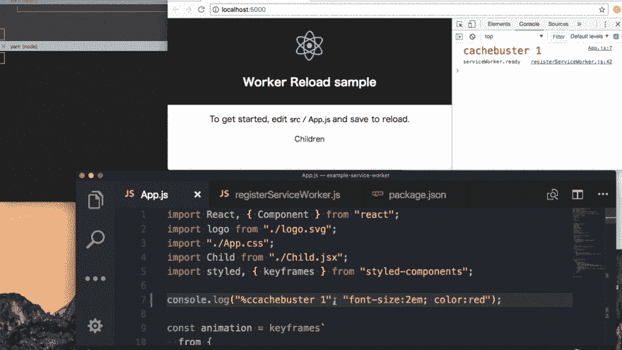

# 在 create-react-app & registerserviceworker . js 上追加重新加载通知

> 原文：<https://dev.to/terrierscript/append-reload-notice-on-create-react-app--registerserviceworkerjs-1fp7>

`create-react-app`默认有`registerServiceWorker.js`。

我知道这个特性支持离线缓存，但是我觉得很难理解如何处理它(有时会禁用它)。

我试着让 show 重载像这样的模态例子。

* * *

[T2】](https://res.cloudinary.com/practicaldev/image/fetch/s--vVTaqWGo--/c_limit%2Cf_auto%2Cfl_progressive%2Cq_66%2Cw_880/https://thepracticaldev.s3.amazonaws.com/i/c5b0dk8qu4a5aj4fnuq3.gif)

[源代码](https://github.com/inuscript/example-service-worker.git)

* * *

## 1。准备

默认情况下，create-react-app 不便于本地服务人员调试。

我`eject`创建-反应-app，安装 [`serve`](https://github.com/zeit/serve) 。(并且需要禁用`serve`缓存控制。)

```
{
  "scripts": {
    "start":
      "NODE_ENV=production webpack --config config/webpack.config.prod.js --watch",
    "static": "serve -c 0 -s build -o --local"
  }
} 
```

像这样开始。

```
$ yarn start & yarn static 
```

## 2。`onupdatefound`时追加事件调度

当 ServiceWorker 检测到更新时，执行`registerServiceWorker`的 [`onupdatefound`](https://github.com/facebook/create-react-app/blob/0b1d6365768ae3bd267b042b74bab249673f1a9f/packages/react-scripts/template/src/registerServiceWorker.js#L63-L69) ，我在这里追加 distpatch 事件。

```
registration.onupdatefound = () => {
  const installingWorker = registration.installing;
    installingWorker.onstatechange = () => {
        if (navigator.serviceWorker.controller) {
          // At this point, the old content will have been purged and
          // the fresh content will have been added to the cache.
          // It's the perfect time to display a "New content is
          // available; please refresh." message in your web app.
          console.log("New content is available; please refresh.");

          // Append dispatch event
          const event = new Event("newContentAvailable");
          window.dispatchEvent(event);
        } else {
           : 
```

[在下一个版本](https://github.com/facebook/create-react-app/blob/cb3f835586d2f1e3b9ddcf3a29442c9d76eaef84/packages/react-scripts/template/src/serviceWorker.js#L71-L73)中，服务工作者脚本得到了`config.onUpdate`回调。
我们不需要将代码直接添加到`registerServiceWorker.js`

## 2。创建`<ReloadModal>`

接下来，我追加`<ReloadModal>`捕捉全局定制`newContentAvailable`事件。

```
 // Main App
class App extends Component {
  render() {
    return (
      <div className="App">
        <ReloadModal />
            :
      </div>
    );
  }
}

class ReloadModal extends Component {
  state = {
    show: false
  };
  componentDidMount() {
    // Handle global event.
    window.addEventListener("newContentAvailable", () => {
      this.setState({
        show: true
      });
    });
  }
  onClick = () => {
    // Reload when modal click.
    window.location.reload(window.location.href);
  };
  render() {
    if (!this.state.show) {
      return null;
    }
    // <Modal> is common fixed component.
    return (
      <Modal onClick={this.onClick}>
        <span> New Content Available!please reload </span>
      </Modal>
    );
  }
} 
```

## 结论

在这之后，我可以得到类似截图的结果。

但是我对这个实现没有信心。请告诉我是否有更好的方法。