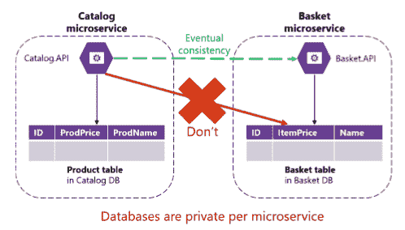
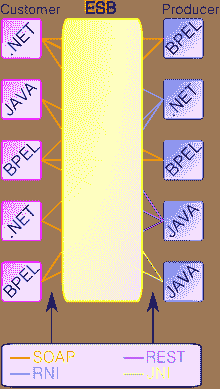
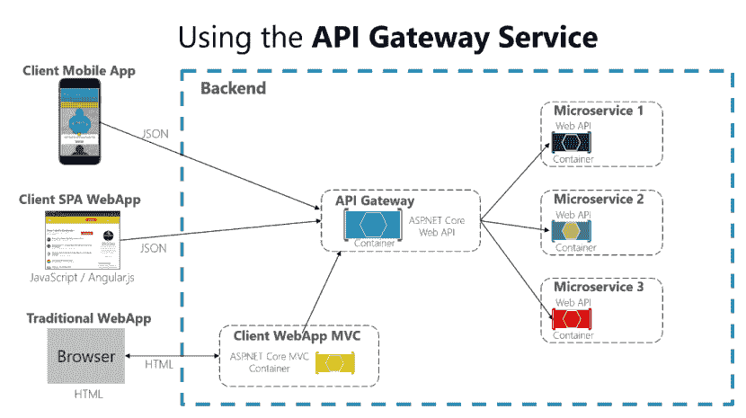
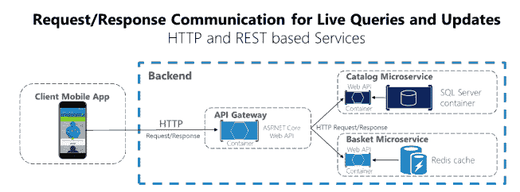
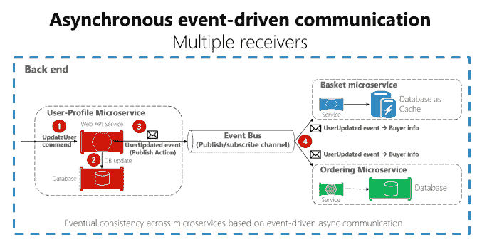

# 应用和微服务——你需要知道的:自主性和你将面临的挑战。

> 原文：<https://dev.to/chris_bertrand/apps--microservices--what-you-need-to-know-autonomy-and-the-challenges-you-will-face-39e1>

我将要经历的很多事情都会参考这份来自微软的惊人的 289 页巨兽文件，可以从这里下载:

集装箱化的建筑。网络应用

我会链接到我发现的博客文章、视频和任何有趣的白皮书。同时还研究了其他人是如何将以前的单一应用程序创建或转换成多个松散耦合的微服务的。

就像任何如此庞大和引人入胜的作品一样，这将涵盖我在这个过程中的旅程和我所学到的任何东西。如果你对所写的内容有任何其他建议或想法，请随时在下面留下评论，我可以在必要的地方进行修改。

所以让我们开始吧。

## 什么是微服务？

首先，我们需要简单地从什么是服务，什么是系统开始。

用软件术语来说，服务是:

*   由某个组织拥有、建造和运营
*   负责保存、处理和/或分发系统范围内特定类型的数据
*   可以独立构建、部署和运行，满足既定的运营目标
*   与消费者和其他服务通信，使用约定和/或契约保证来呈现信息
*   处理故障情况，使故障不会导致信息损坏
*   保护自身免受不必要的访问，并防止信息丢失

一组服务危及一个系统

*   系统是一组服务和系统，旨在为明确定义的范围提供组合解决方案。
*   一个系统可能出现并充当对其他方的服务。
*   系统可以共享服务
*   消费者可能会与多个系统交互

服务不是一组特定的语言或框架，而是这些服务的组合来提供解决方案。它不仅仅是 Linux 容器上 docker 实例中的一个 API。Net、JavaScript 或任何其他脚本语言。它独立于实现选择。

那么一个服务和微服务的区别是什么呢？微服务必须是可独立部署的，而 SOA **服务**通常是在整体部署中实现的。 [SOA 是一种架构模式](http://www.soapatterns.org/)，其中应用组件向其他组件提供**服务**。然而，在 SOA 中，这些组件可以属于同一个应用程序。

> ## For microservices, the most important thing is to remember that they are " **autonomous"**

这意味着:

*   服务拥有它直接依赖和管理的所有状态
*   服务拥有其通信契约
*   服务可以被改变、重新部署和/或完全替换
*   服务有一组众所周知的通信路径
*   服务不应与其他服务共享状态
*   不要依赖或假设任何公共数据存储
*   不要依赖任何共享的内存状态
*   军种之间没有副业通信
*   所有的交流都是明确的

归根结底，要记住自治是关于跨组织合作的。它的精神是没有单一的服务是耦合到另一个！

## 分布式数据管理的挑战和解决方案

### 定义边界

在设计微服务架构时，您将面临的第一个挑战是如何将您当前的设置分成自治的块。您将需要定义每个微服务的边界，以识别同一个应用程序中的解耦数据点和上下文。我们的目标不是尽可能获得最细粒度的分离，而是您的领域所需的最有意义的分离，如果您定义了一个边界，然后发现大量的依赖项，您可能需要再次重新定义。

> 重点不在于规模，而在于业务能力。

您应该基于有界上下文模式来定义您的边界。为了识别这些，可以使用领域驱动设计(DDD) [或上下文映射](https://www.infoq.com/articles/ddd-contextmapping)模式。

### 跨多个微服务的一致性

由于每个微服务都是相互分离的，因此保持多个微服务之间的数据一致性是一个挑战。

[T2】](https://res.cloudinary.com/practicaldev/image/fetch/s--Lnn6iaQN--/c_limit%2Cf_auto%2Cfl_progressive%2Cq_auto%2Cw_880/http://blog.designpuddle.com/wp-content/uploads/2017/07/Conistency.png)

我们可以看到，当一个微服务的价格发生变化时，我们必须将这种变化传播到其他微服务。通常这将涉及一个 join 或一个 API 调用来反映这一点，然而对于每个拥有私有数据库的微服务，我们需要使用基于异步通信(如集成事件)的**最终一致性**。

### 分布式系统通信和数据检索

由于许多解耦微服务可能会单独运行，因此选择合适的解决方案以最佳方式从这些微服务中查询数据是一项挑战。

当在线阅读和使用附在页面顶部的 PDF 时 **Api 网关**在创建微服务时被大量提及，作为将它们组合在一起的一种方式。虽然这可能是一种容易采取的方法，但它从根本上违背了微服务的核心原则。

首先，在谈论 **Api 网关**以及它们如何相似之前，我将快速回顾一下关于 **ESB** (企业服务总线)和它是什么的历史课。

## 什么是/曾经是 ESB(企业服务总线)

[T2】](https://res.cloudinary.com/practicaldev/image/fetch/s--g4iHMcj7--/c_limit%2Cf_auto%2Cfl_progressive%2Cq_auto%2Cw_880/https://upload.wikimedia.org/wikipedia/commons/thumb/a/a2/ESB.svg/220px-ESB.svg.png)

> **ESB 模型承诺通过集中化进行简化**

实体服务总线承诺通过一个中心点处理所有事情来使系统更加简化，在较小的应用程序中，这种模式有优势，但是在大规模应用中，ESB 的许多优势实际上成为其最大的弱点。

ESB 最终成为一个瓶颈，因为它与系统的每个部分都紧密耦合，这种困境是大规模的，有移动客户端、大量服务，没有人拥有中央区域，每当这些服务中的一个被更新、升级或完全改变时，都需要改变，这可能/会导致停机，并影响整个系统！

## 什么是 Api 网关

API 网关也落入了同样的陷阱。它集中处理多个微服务。很明显，它没有 ESB 模型那么庞大，但是在网关中改变微服务需要同时改变服务和网关。

如果需要使用 API 网关，应该根据业务边界进行隔离，而不是作为整个应用程序的聚合器。

[T2】](https://res.cloudinary.com/practicaldev/image/fetch/s--s8WZVmlO--/c_limit%2Cf_auto%2Cfl_progressive%2Cq_auto%2Cw_880/http://blog.designpuddle.com/wp-content/uploads/2017/07/ApiGateway.png)

### API 网关模式的缺点

*   最重要的**缺点**是当你实现一个 API 网关时，你是把那个层和内部微服务耦合在一起。像这样的耦合可能会给应用程序带来严重的困难。**(云架构师 Clemens Vaster 在 2016 年的“消息和微服务”会议中将这一潜在困难称为“新 ESB”，如下所示。)**
*   使用微服务 API 网关会产生额外的故障点。
*   如果 API 网关没有适当地向外扩展，它可能会成为一个瓶颈
*   如果 API 网关包含定制逻辑和数据聚合，则需要额外的开发成本和未来维护。开发人员必须更新 API 网关，以公开每个微服务的端点。此外，内部微服务的实现变化可能会导致 API 网关级别的代码变化。然而，如果 API 网关只是应用安全性、日志和版本控制(当使用 Azure API 管理时)，这种额外的开发成本可能并不适用。

上面提到的来自 Clemens Vaser 的大型会议讨论了微服务以及 API 网关为何是个坏主意。他记录了我们是如何陷入与 ESB 相同的陷阱的，并强烈反对使用 ESB。我还在附录中附上了他的幻灯片。

[https://www.youtube.com/watch?v=rXi5CLjIQ9k](https://www.youtube.com/watch?v=rXi5CLjIQ9k)

## 

在单个进程上运行的单片应用程序中，模块使用方法或函数调用相互调用。这些可以使用 new Class()之类的代码进行强耦合，也可以使用依赖注入进行松散耦合。

无论哪种方式，对象都在同一个进程中运行。从单一应用程序转变为基于微服务的应用程序时，最大的挑战在于改变通信机制。

从进程内方法调用到服务的远程进程调用的直接转换将导致低效的通信，这在分布式环境中不能很好地执行。

正确设计分布式系统的挑战已经被很好地记录下来；程序员做出的假设会导致问题。这些是由彼得·多伊奇写的，包括:

1.  网络是可靠的。
2.  延迟为零。
3.  带宽是无限的。
4.  网络很安全。
5.  拓扑不会改变。
6.  有一个管理员。
7.  运输成本为零。
8.  网络是同构的。

请注意，列出的这些例子没有一个是真的，你不应该陷入这样的陷阱，认为这些都不值得考虑，它们会自己解决。每一个都需要代码覆盖来处理，确保代码能够处理网络中断、数据包丢失、安全协议变更等。

更多关于这些谬误的内容可以在这里阅读:[分布式系统的 8 个谬误](http://blog.fogcreek.com/eight-fallacies-of-distributed-computing-tech-talk/)

> 解决办法不止一种，而是几种。

### AMQP、HTTP 或 TCP

基于微服务的应用是运行在多个进程或服务上的分布式系统，通常跨多个服务器或主机。每个服务通常是一个流程。因此，根据每个服务的性质，服务必须使用进程间通信协议(如 HTTP、AMQP)或二进制协议(如 TCP)进行交互。

### 智能端点和哑管道

是一个让人联想到微服务的术语，是一个经过反复试验的设计原则，它利用复杂系统拓扑上的异步通信机制。

一个尽可能去耦合的设计，通过使用 RESTFUL 和灵活的事件驱动通信而不是集中的编排器来编排。

两种最常见的方法是通过 API 使用 HTTP/S 消息。这是一个同步协议，客户端发送请求并等待响应。这通常会使用[命令模式](https://en.wikipedia.org/wiki/Command_pattern)，其中每个请求由一个服务处理。

[T2】](https://res.cloudinary.com/practicaldev/image/fetch/s--SjAlS0aW--/c_limit%2Cf_auto%2Cfl_progressive%2Cq_auto%2Cw_880/http://blog.designpuddle.com/wp-content/uploads/2017/07/RequestReponseComHTTP.png)

另一种是轻量级异步消息协议，如 AMQP。客户端代码或消息不需要等待响应，只需将消息发送给一个代理，如 [RabbitMQ](https://www.rabbitmq.com/) ，然后由一个单独的进程处理。发布/订阅方法就是这样一种利用多个接收者的机制，因为异步的本质意味着每个请求可以由一个或多个服务实例来处理。另一种是事件驱动的通信，通常使用服务总线来实现，这些服务总线提供了一些选项，如使用队列的 [MassTransit](http://masstransit-project.com/) 、 [NServiceBus](https://particular.net/nservicebus) 或使用主题和订阅的 Azure 服务总线。

[T2】](https://res.cloudinary.com/practicaldev/image/fetch/s--DYBOalUl--/c_limit%2Cf_auto%2Cfl_progressive%2Cq_auto%2Cw_880/http://blog.designpuddle.com/wp-content/uploads/2017/07/AsynchronousEvents.png)

这两种方法之间的比较可以在这里找到:[队列与主题和订阅。](https://docs.microsoft.com/en-us/azure/service-bus-messaging/service-bus-queues-topics-subscriptions)

### 服务之间的通信

你应该尽量减少你的微服务之间的通信。

这些之间的交流越少越好。当然，有时您将不得不集成微服务。这里的关键规则是，通信应该是异步的，并且通过异步传播数据来执行，而不是依赖其他内部微服务作为初始 HTTP 请求/响应的一部分。

您不应该依赖微服务之间的同步通信，目标是每个微服务都是自治的，并且对客户端消费者可用，即使应用程序中的其他服务脱机或损坏。这意味着当某些服务失败时，您的架构必须有足够的弹性来处理

同步操作意味着性能会受到影响。在微服务之间添加的同步依赖(如查询请求)越多，客户端的整体响应时间就越短。

### 微服务版本控制、发现和服务注册

微服务模型的优势是以增加运营复杂性为代价的，这是由于平台异构、服务发现需求以及消息传递和 API 调用量等因素造成的。

服务 API 需要随着时间的推移而改变。当这种情况发生时，特别是当它是一个公共 API 被多个应用程序使用时，你不能强迫接受这个新契约。版本控制策略必须到位，以保持新旧版本对用户可用。

[中介](https://en.wikipedia.org/wiki/Mediator_pattern)模式可以将你的实现分割成独立的处理程序，而[超媒体](https://www.infoq.com/articles/mark-baker-hypermedia)对于你的服务版本化非常有用。

需要一个服务注册中心，因为每个微服务的 URL 都需要被解析，无论它可能在哪里运行。与 DNS 解析地址的方式相同，您的服务也需要一个唯一的名称才能被发现。[服务注册模式](http://microservices.io/patterns/service-registry.html)是保持端点和服务实例最新的关键。

* * *

## 额外资源

集装箱化的建筑。网络应用

[消息和微服务- Clemens Vaster](http://gotocon.com/dl/goto-amsterdam-2016/slides/ClemensVasters_MessagingAndMicroservices.pdf)