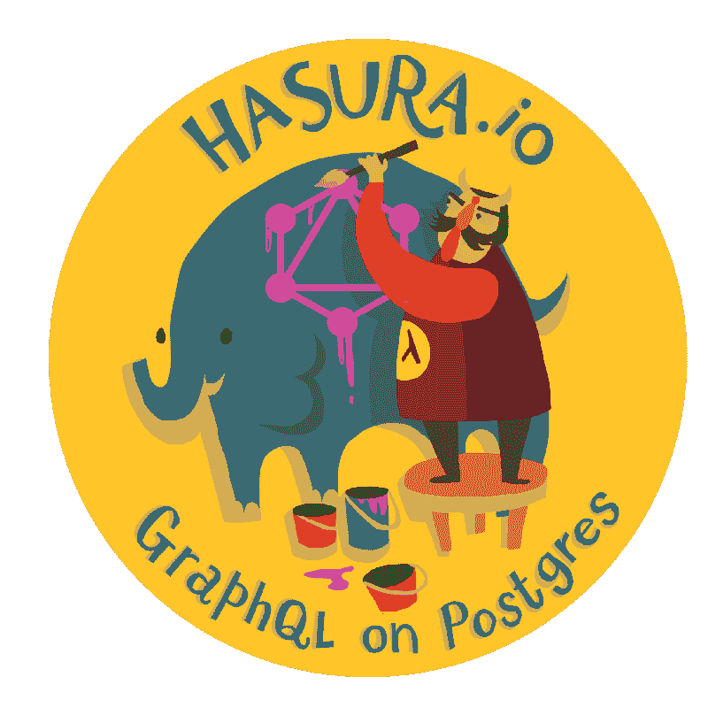

# 一种高性能 GraphQL 到 SQL 引擎的体系结构

> 原文：<https://dev.to/hasurahq/architecture-of-a-high-performance-graphql-to-sql-engine-nof>

[T2】](https://res.cloudinary.com/practicaldev/image/fetch/s--j4u6QtDt--/c_limit%2Cf_auto%2Cfl_progressive%2Cq_auto%2Cw_880/https://blog.hasura.io/conteimg/downloaded_images/architecture-of-a-high-performance-graphql-to-sql-server-58d9944b8a87/1-uq3C8eOtLNZuekJLlaMsYg.png)

Hasura 平台的数据微服务提供了一个 HTTP API，以权限安全的方式使用 GraphQL 或 JSON 查询 Postgres。

您可以利用 Postgres 中的外键约束在单个请求中查询分层数据。例如，您可以运行这个查询来获取“albums”及其所有“tracks”(假设“track”表有一个指向“album”表的外键):

```
{
  album (where: {year: {_eq: 2018}}) {
    title
    tracks {
      id
      title
    }
  }
} 
```

Enter fullscreen mode Exit fullscreen mode

您可能已经猜到，查询可以遍历表到任意深度。这个查询接口结合了权限，使得前端应用程序无需编写任何后端代码就可以查询 Postgres。

这个 API 被设计为快速(响应时间)和处理大吞吐量(每秒请求数)，同时资源较少(低 CPU 和内存使用率)。我们讨论使我们能够实现这一点的架构决策。

## 查询生命周期

对数据微服务的查询经历以下几个阶段:

1.  **会话解析**:请求到达网关，网关解析授权密钥(如果有)并添加 user-id 和 role 头，然后将请求代理给数据服务。
2.  **查询解析**:数据服务接收请求，解析消息头以获得用户标识和角色，将消息体解析成 GraphQL AST。
3.  **查询验证**:检查查询在语义上是否正确，然后执行为角色定义的权限
4.  **查询执行**:经过验证的查询被转换成 SQL 语句，并在 Postgres 上执行。
5.  **响应生成**:来自 postgres 的结果被处理并发送给客户端(*网关根据需要添加 gzip 压缩*)。

## 目标

要求大致如下:

1.  HTTP 堆栈应该增加很少的开销，并且应该能够处理大量的并发请求，以获得高吞吐量。
2.  快速查询翻译(GraphQL 到 SQL)
3.  编译后的 SQL 查询在 Postgres 上应该是高效的。
4.  Postgres 的结果必须被有效地发回。

## 处理 GraphQL 请求

以下是获取 GraphQL 查询所需数据的各种方法:

### 天真的解析者

GraphQL 查询执行通常包括为每个字段执行一个解析器。在示例查询中，我们将调用一个函数来获取 2018 年发行的专辑，然后对于这些专辑中的每一张，我们将调用一个函数来获取曲目，这是经典的 N+1 查询问题。查询的数量随着查询的深度呈指数增长。

对 Postgres 执行的查询如下:

```
SELECT id,title FROM album WHERE year = 2018; 
```

Enter fullscreen mode Exit fullscreen mode

这给了我们所有的专辑。假设返回的相册数量为 N。对于每个相册，我们将执行以下查询(因此，N 个查询):

```
SELECT id,title FROM tracks WHERE album_id = <album-id> 
```

Enter fullscreen mode Exit fullscreen mode

这总共需要 N + 1 次查询来获取所有需要的数据。

### 批量查询

像 [dataloader](https://github.com/facebook/dataloader) 这样的项目旨在通过批处理查询来解决 N + 1 查询问题。请求的数量不再取决于结果集的大小，而是取决于 GraphQL 查询中的节点数量。在这种情况下，示例查询需要对 Postgres 进行 2 次查询，以获取所需的数据。

对 Postgres 执行的查询如下:

```
SELECT id,title FROM album WHERE year = 2018 
```

Enter fullscreen mode Exit fullscreen mode

这给了我们所有的专辑。获取所有所需专辑的曲目:

```
SELECT id, title FROM tracks WHERE album_id IN {the list of album ids} 
```

Enter fullscreen mode Exit fullscreen mode

这总共是 2 个查询。我们避免发出查询来获取每个专辑的曲目信息，而是使用 where 子句在单个查询中获取所有所需专辑的曲目。

### 归附

Dataloader 旨在跨不同的数据源工作，不能利用单个数据源的功能。在我们的例子中，我们拥有的唯一数据源是 Postgres 和 Postgres，像所有关系数据库一样，它提供了一种在单个查询中从几个表中收集数据的方法。我们可以确定 GraphQL 查询所需的表，并使用连接来获取所有数据，从而生成一个 SQL 查询。因此任何 GraphQL 查询所需的数据都可以从单个 SQL 查询中获取。这些数据在发送到客户端之前已经过适当的转换。

该查询如下所示: