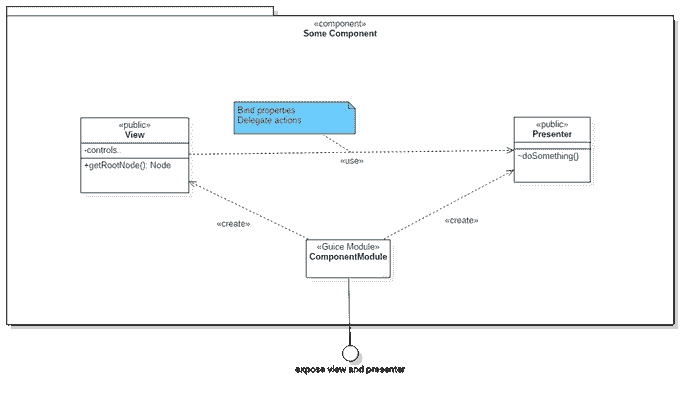
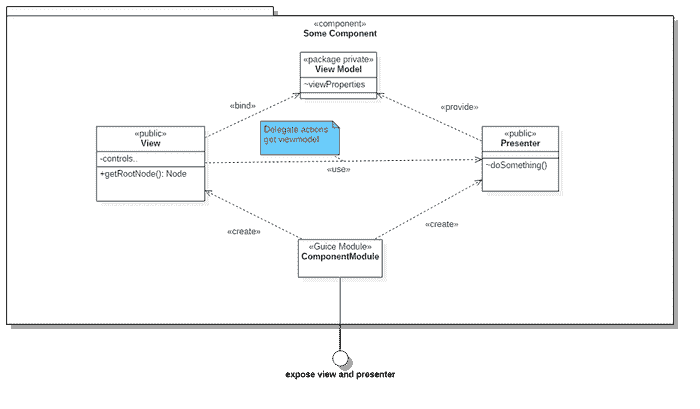
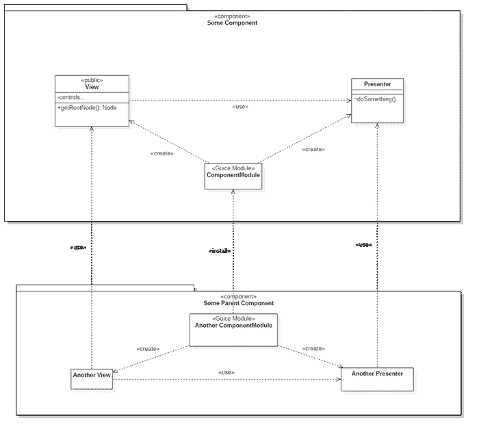
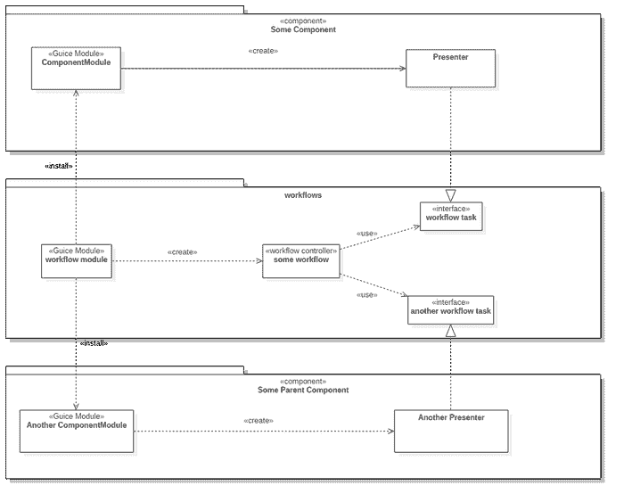
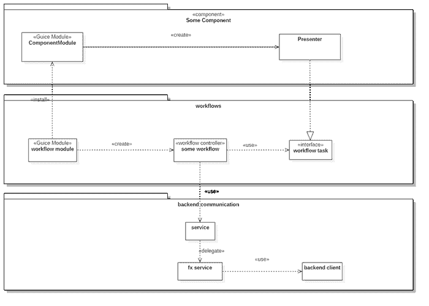

# JavaFX 应用程序的架构

> 原文：<https://dev.to/_maimart_/architecture-of-a-javafx-application-2geb>

## 简介

我开发 JavaFX 应用程序已经有 5 年了，并且使用了不同的架构模式。

首先我从 MVC 开始，然后是 MVVM，最后我们在我当前的项目中使用了 MVP 被动视图。

JavaFX 文档中很好地描述了如何应用 MVC 模式，mvvmFX 框架的文档中也很好地描述了 MVVM，但是对于 MVP 被动视图，我花了很多时间阅读关于它的不同文章，但是我没有找到对我来说 100%正确的方法。

此外，我没有找到一篇关于如何协调用 MVP 模式构建的不同视图的令人满意的文章。

因此，我评估了创建一个复杂的 JavaFX UI 的不同方法，该 UI 具有遵循 MVP 被动视图模式的视图，以及如何协调它们。

我的重点是:

*   为了避免视图和演示者之间的双向依赖性
*   找到管理视图的特定于域的属性的最佳方法
*   父组件附加子组件
*   工作流控制器访问组件。
*   如何以及在哪里与后端通信

所以我得出了下面这个对我来说感觉不错的结论。

## 一个 ui 组件的结构

#### 具有少量视图属性绑定的简单 ui 组件

[T2】](https://i0.wp.com/maimart.de/wp-content/uploads/2018/03/Some-Component__Simple-Component_0.png)

##### 组件模块

整个组件被绑定在一个管理依赖关系的上下文中。我使用了 guice，所以有一个私有的 guice 模块来管理内部依赖关系。

使用此模块的更多全局模块必须确保提供了演示者所需的所有依赖项。

##### 演示者

表示器的主要目的是提供视图可以绑定的特定于域的属性，并提供视图可以直接委托的方法。

它负责**显示什么**信息，而不是如何显示。

演示者不能持有业务逻辑，只能持有关于**在视图和业务逻辑之间调整**的逻辑。

演示者不知道视图。

```
public class Presenter { private final StringProperty someString = new SimpleStringProperty(); void doSomething() { // not implemented yet } StringProperty someStringProperty() { return someString; } } 
```

Enter fullscreen mode Exit fullscreen mode

##### 视图

视图负责**如何显示**信息。

视图是一个谦卑的对象。它只做三件事:

*   提供一个包私有工厂方法
*   将控件的属性绑定到演示者的属性，并在 initialize 方法中将控件的操作委托给演示者
*   通过公共方法提供其根节点

```
public class View { @FXML private StackPane root; @FXML private Label label; @FXML private Button button; private final Presenter presenter; private View(Presenter presenter) { this.presenter = presenter; } static View createInstance(Presenter presenter) { View view = new View(presenter); FXMLLoader.load("....", view); return view; } @FXML void initialize(){ label.textProperty().bind(presenter.someStringProperty()); button.setOnAction(event -\> presenter.doSomething()); } public Node getRootNode() { return root; } } 
```

Enter fullscreen mode Exit fullscreen mode

#### 具有多个视图属性绑定的更复杂的 ui 组件

[T2】](https://i0.wp.com/maimart.de/wp-content/uploads/2018/03/Some-Component__Complex-Component_1.png)

为了保持演示者的整洁，我们将视图属性外包给一种视图模型。

视图模型只是视图和表示者的助手类，所以它的访问级别只需要是包私有的。

## 嵌套的 ui 组件

#### 嵌套一个 ui 组件作为子 ui 组件(1:1 嵌套)

如果您想要嵌套一个子视图，您需要在父视图的模块中安装它的模块。

因此，您可以简单地将子组件的公开视图注入到父组件视图的工厂方法中。

如果需要的话它的呈现者可以直接注入到父的呈现者中。

[T2】](https://i2.wp.com/maimart.de/wp-content/uploads/2018/03/ui-component-nest-another-ui-component__ui-component-nest-another-ui-component_2.png)

#### 嵌套一个组件作为一种控件(1:n 嵌套)

基本上，我认为一个自定义控件不应该被视为一个视图，所以不能用 MVP 模式实现。

有一个解决方案可以这样处理这种情况:

1.  这种“控件组件”的呈现者必须通过视图本身访问，而不是由模块公开
2.  视图的模块提供者必须注入到父视图中
3.  父视图必须关心子视图/控件的实例化，并将其传播到自己的表示器，表示器连接视图逻辑

但是正如您所看到的，MVP 模式对于注入自定义控件的典型用例是不合适的，所以我不会深入这个案例。

## ui 组件的协调

用户总是有理由使用系统的界面。所以应用程序是基于用例的。

这些用例的实现被投射到一些抽象对象中，我称之为工作流控制器。

它有不同的概念和名称，但共同之处是它们构建了用例或工作流的上下文，目的是在非常抽象的层次上保持对工作流的控制。

在 ui 层，他们的职责是协调和编排 ui 组件，构建一个上下文，在这个上下文中，组件之间以及它们如何与后端交互。

根据 ui 和用例的复杂性，在许多情况下，他们不会直接控制 ui 组件，而是通过一些不同职责的帮助组件进行抽象。

为了保持工作流控制器与演示者分离，对演示者的访问应该由演示者实现并由工作流控制器使用的功能接口来抽象。

从演示者到工作流控制器的回调可以通过向演示者注入回调函数、将列表器附加到其属性或者让演示者触发由工作流控制器捕获的事件来实现。

[T2】](https://i1.wp.com/maimart.de/wp-content/uploads/2018/03/Workflow-controls-ui-components__Workflow-controls-ui-components_3.png)

另一个想法是通过包含属性和回调函数的特定于任务的模型来处理工作流控制器和表示器之间的通信。

但在我看来，一个界面更面向对象，保持一个模型的整洁和独立于工作流程和演示者的东西比一个界面要难得多。

所以从上面看，演示者可能是这样的:

```
public class Presenter implements WorkflowTask{ private final StringProperty someString = new SimpleStringProperty(); private Consumer\<String\> onDoSomething; @Override public void showSomeString(String string) { someString.set(string); } @Override public void setOnDoSomething(Consumer\<String\> onDoSomething) { this.onDoSomething = onDoSomething; } void doSomething() { onDoSomething.accept(someString.get()); } StringProperty someStringProperty() { return someString; } } 
```

Enter fullscreen mode Exit fullscreen mode

## 与后端交互

工作流控制器处理与后端的交互。

出于可测试性的原因，我更喜欢使用内部委托给 fx 服务并向其客户返回 CompletableFuture 的服务类。

[T2】](https://i0.wp.com/maimart.de/wp-content/uploads/2018/03/Connecting-the-backend.png)

如果你对 Angular 和 AWS 感兴趣，请阅读我的文章[如何将 angular spa 推向云](http://maimart.de/pushing-an-angular-project-to-the-aws-cloud)

[。](http://maimart.de/privacy-policy)

JavaFX 应用程序的 post [架构首先出现在](http://maimart.de/javafx-architecture-and-design) [maimArt](http://maimart.de) 上。