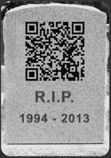
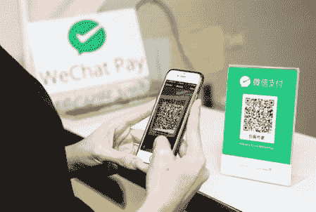
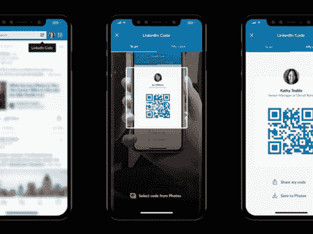
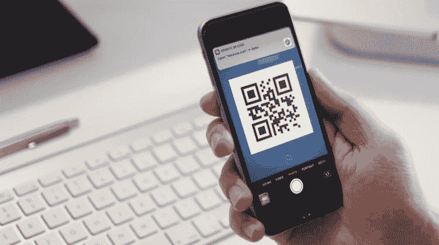

# 二维码正在卷土重来吗？

> 原文：<https://dev.to/oninross/are-qr-codes-making-a-comeback-3e4k>

在某些时候，我们已经看到 QR 码贴满了所有的地方，产品，盒子和/或海报。它旨在充当从物理世界到互联网的桥梁，将用户带到网页、YouTube 视频，甚至让你的智能设备执行特定的任务。想象中的用户体验是帮助用户快速获取信息。然而，事实并非如此。尽管二维码被认为已经灭绝，但这些方形点拒绝消亡，并以不同的形式和使用案例再次崛起。

# 他们到底怎么了？

发明 QR 码系统是为了在制造过程中跟踪车辆，并允许高速部件扫描。把这个简单的想法应用到网络行业，它应该为用户提供快速和具体的信息。如果 QR 码在关于音乐会的海报上，用户可以简单地扫描 QR 码，并将用户带到包含关于音乐会的更多信息的网页。这只是可能的应用之一。

尽管这个缩写的意思是“快速响应”，但在用户体验这项技术时还是有陷阱。在二维码蓬勃发展的时候，响应式网页设计还不常见，在智能手机上浏览网站实际上就是在一个小屏幕上浏览桌面版本。这是一次可怕的经历。这可能是用户在看到二维码时选择放弃甚至忽略它们的主要原因之一。

[T2】](https://res.cloudinary.com/practicaldev/image/fetch/s--IC0kcVOm--/c_limit%2Cf_auto%2Cfl_progressive%2Cq_auto%2Cw_880/https://thepracticaldev.s3.amazonaws.com/i/m8vcksdya45o063rkx6d.png)

我们几乎看不到二维码了。即使我们知道，我们也不会费心拿起智能手机扫码。然而，它已经从灰烬中重生，并被以不同的方式使用，其他人已经演变成其他东西。

# “我会回来的……”-二维码

对于大多数用户来说，在小触摸屏上打字一直是个问题。科技公司一直在不断改进移动设备上的键盘输入，从自动完成到滑动输入。这部分解决了我们在日常生活中通常需要输入的句子。有些情况下，用户仍然需要输入一些不寻常的东西，比如一个混合了数字和字符的很长的 URL(需要我用大小字母来说明吗)。

二维码提示。

## 微信

[T2】](https://res.cloudinary.com/practicaldev/image/fetch/s--LdtVmib4--/c_limit%2Cf_auto%2Cfl_progressive%2Cq_auto%2Cw_880/https://thepracticaldev.s3.amazonaws.com/i/eoaaj5puap70t50cjkdt.png)

它可能是成功利用二维码的移动应用之一，而且没有停止的迹象。这是面向中国观众的一站式应用程序，用户可以使用该应用程序支付账单，订购商品和服务，向其他用户转账，以及在商店支付。商店的柜台上会有一个二维码，用户可以扫描这些码。用户然后必须键入他们将不得不支付多少，就是这样。它简化了客户的用户之旅，使用户体验变得无缝。

## Twitter / LinkedIn

[T2】](https://res.cloudinary.com/practicaldev/image/fetch/s--qutvyxnc--/c_limit%2Cf_auto%2Cfl_progressive%2Cq_auto%2Cw_880/https://thepracticaldev.s3.amazonaws.com/i/5hv2lx0ujxsde6tcz0da.png)

大多数时候，在手机上与人分享联系人信息是件棘手的事情。尤其是当你听到不同的名字或者记错号码的时候。Twitter 和 LinkedIn 让人们可以轻松分享彼此的联系方式。这两款应用都有自己的二维码生成器和阅读器，因此用户只需轻点两下就能生成和扫描这些二维码。这样，人们就不需要记下细节，也不需要再摸索着打开他们的智能手机。

## Snapcodes / Spotify 代码

[T2】](https://res.cloudinary.com/practicaldev/image/fetch/s--iLAxrdZz--/c_limit%2Cf_auto%2Cfl_progressive%2Cq_auto%2Cw_880/https://thepracticaldev.s3.amazonaws.com/i/3nm56190qy7hmp7i1ged.png)

让用户对二维码感到困惑的一个因素是，大多数时候，用户不知道如何处理二维码。具有讽刺意味的是，当你需要扫描时，二维码阅读器应用程序从未安装在你的设备上，或者当你最终安装它时，看不到二维码。Snapchat 和 Spotify 已经将二维码生成发展到一个不同的水平，这将更多地反映他们的品牌。随着 Snapcodes 的“幽灵”标志和 Spotify 代码与声波一起出现，用户将立即知道他们应该使用什么应用程序来扫描这些代码。

# 隐藏的小宝石

随着 Snapchat、微信和 LinkedIn 等应用程序的出现，我相信二维码正在行业中微妙地卷土重来。快速响应这个词现在名副其实了，两家科技巨头最终都在各自的设备中加入了这一功能。苹果通过将摄像头对准二维码和一个预览链接来告诉用户它已经解码了什么，从而实现了无缝连接。谷歌也把它包含在他们的软件中。虽然它需要的步骤比苹果多一点，但它仍然完成了任务。

[T2】](https://res.cloudinary.com/practicaldev/image/fetch/s--Ab4rcjaY--/c_limit%2Cf_auto%2Cfl_progressive%2Cq_auto%2Cw_880/https://thepracticaldev.s3.amazonaws.com/i/qbf8zj19fcmiqqb7odkn.png)

这些小宝石有助于改善每个人的用户体验。当苹果或安卓系统的摄像头扫描这些二维码时，它会给出一个已经解码的预览链接。这种方式给用户一种安全感，即他们将要输入的是安全的。最棒的是，它不再是第三方应用程序了。只需拿出手机，扫描二维码，就能快速到达终点。

不起眼的二维码已经走过了漫长的道路，从一个脱节的用户体验，悄悄地被重新引入行业。这些黑与白将以这样或那样的形式帮助我们从现实世界进入互联网。留心这些东西，它可能是你通向虚拟世界的窗口。

[T2】](https://res.cloudinary.com/practicaldev/image/fetch/s--E_od-e0O--/c_limit%2Cf_auto%2Cfl_progressive%2Cq_auto%2Cw_880/https://thepracticaldev.s3.amazonaws.com/i/kdc1x5leo9cz23byk34u.png)