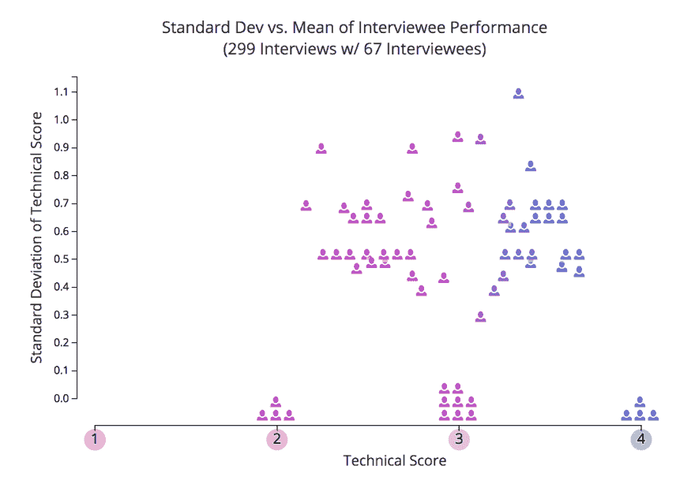

# 技术面试是衡量软件工程能力的好方法吗？

> 原文：<https://dev.to/amandasopkin/are-technical-interviews-a-good-measure-of-software-engineering-ability-1cp9>

> 萨拉梅[@萨拉梅](https://dev.to/sarahmei)为什么我们一直做白板面试，即使他们很少告诉我们申请人在实际软件开发方面有多好？2015 年 3 月 20 日上午 00:37

> 

对于这样一个年轻的行业来说，技术面试已经走了很长的路。大约 10 年前，微软等公司给应聘者出了一个著名的脑筋急转弯，比如“为什么检修孔是圆的？”当这些问题被证明不能揭示候选人的能力时，这种做法就停止了。随后，公司向受访者提供一些琐事，包括几页 javascript 问题和关于各种语言的随机陈述。在很大程度上，今天的公司越来越关注平台和语言不可知的面试——旨在只显示特定人解决问题的能力。然而，这一过程仍然有其缺陷。

大多数工程师都会承认，传统的技术面试会错过很多优秀的候选人。不练习的候选人，在休息日，甚至(上帝不允许！)从未真正理解过图论的人可能会在一两次面试中表现不佳，拒绝他们的公司会错过一个很好的候选人。然而，许多人认为，失去一些“好”的候选人是可以的，只要他们不意外地雇佣了“坏”的工程师。

用 Stack Overflow 联合创始人乔尔·斯波尔斯基(Joel Spolsky)的话说，“如果你拒绝了一个好的候选人，我的意思是，我想在某种存在主义的意义上，这是不公平的，但是，嘿，如果他们这么聪明，别担心，他们会得到很多好的工作机会。”

但这种心态足以维持面试现状吗？根据 Tech Crunch 的这篇文章“历史上，误报被认为是灾难性的；雇佣一个糟糕的工程师被认为比雇佣两个好工程师更糟糕。但如今优秀的工程师非常稀缺，这种情况已经不再适用了。”没有人想雇佣一个糟糕的候选人。但是公司在避免招聘的过程中会投入数百万美元的招聘成本。让我们看看一个候选人的价码。成本是显而易见的:比如现场候选人的差旅费，但招聘过程也有很多额外的成本。根据[招聘方 Box 的一个估计](https://recruiterbox.com/blog/first-in-hr-know-your-numbers-in-hiring):

*   根据发布方式的不同，在求职网站上发布信息的费用在 40-500 美元之间
*   审查申请人需要 10-24 小时，花费公司 500 多美元
*   预筛选过程需要 2-4 个小时，很容易就要 100-200 美元
*   招聘人员的面试准备需要 1-2 个小时，花费 40 美元
*   现场采访通常需要 4-5 个小时的开发时间，200-400 美元
*   整个过程，包括提供工作机会、与候选人交谈以及核实推荐信，可能需要大约 8 个小时，大约 200 美元

这个估计的总数是:1080-1840 美元，不包括差旅费。

第一个通过这个过程的人很少会接受一个提议。根据 Glassdoor 的一份分析报告，公司平均花费 35 天来面试 120 名求职者来竞争一个工程职位。其中，23 人出现在屏幕上，5.8 人被带到现场，1.7 人获得聘用。所以你看到的是 40-500 美元+500 美元+100-200 美元+920 美元(40*23 美元)+1160-2320 美元(200-400*5.8 美元)+ 340 美元(200*1.7 美元)= 3060-4780 美元。

这一成本是保守的，但与糟糕的招聘成本相比就相形见绌了。一个错误的判断会让团队在代价高昂的错误和纠正时间上损失数万美元。那么，公司应该做些什么呢？

#### 面试到底有没有用？

研究表明，评估候选人最好的方法是通过“工作样本测试”来反映候选人将要做的工作。这就是为什么技术面试比传统的“行为”面试更受欢迎。托莱多大学 2000 年的一项心理学研究发现，面试 10 秒钟内做出的判断总是能预测整体结果。通过白板或编码访谈，我们试图通过根据(更)客观的问题来判断表现来消除这种偏见。

然而，根据 interview . io(一个练习技术面试的平台)的一项研究，这些面试中的表现并不一定与工作表现密切相关。

 
*技术面试表现[来源](http://blog.interviewing.io/technical-interview-performance-is-kind-of-arbitrary-heres-the-data/)*

该网站发现，候选人的表现差异很大，只有大约 25%的候选人表现始终处于同一水平。即使是“强”的表现者，也有 22%的时间表现不佳。这些启示中更令人担忧的部分是一致性。一些“好”的候选人肯定会时不时地犯错，但只要“差”的候选人没有通过这个过程，那也没什么。但是如果只有四分之一的受访者是一致的，这说明了什么呢？它确实有改进的余地。

技术面试的部分问题是专注于一种特殊的技能。大多数面试过程都想当然地认为目标是雇佣最合格的人——我们大多数人都认为这意味着“最聪明”问题是这不一定是成功的最佳预测。几年前，NYT 的一项研究记录了一系列研究，这些研究表明，按照智商测试的标准，由少数非常“聪明”的工程师主导的团队在所有指标上的表现都不如那些 a .更具协作性，b .在解读情商的能力上排名更高，c .更具多样性的团队。这些因素在传统的编码测试中都没有被筛选出来。虽然我们会问一些问题来衡量文化契合度和合作度，但与面试中技术部分的表现相比，这些因素往往是事后才想到的。

#### 白板面试的替代品

还有其他评估候选人的技术方法，但没有一种在技术行业被大规模采用。一些公司给候选人一个技术项目，至少代替技术屏幕。问题是，很难提出一个足够小的项目来完成，并且足够复杂来反映一个软件工程师的正常生活。许多公司也担心这些测试经常被有抱负的求职者抄袭。此外，许多候选人觉得他们应该得到报酬，因为他们努力完成了这些项目，其中一些甚至在面试后被公司利用了！

一些公司喜欢 Stripe，使用典型技术面试的不同风格。Stripe 允许候选人使用自己的笔记本电脑，并在 stack overflow 等网站上查找语法，以更接近地模拟他们正在寻求的工作条件。除了技术问题，他们还包括面试，面试的重点是候选人解释他们从事的技术项目和回答基本工程设计问题的能力。

亚马逊已经尝试了小组面试，允许候选人选择一个技术问题(从给定的一组中)并在几个小时内解决它，然后有机会解释他们的方法。

在 Helpful，他们进行简单的 [1 小时面试](https://be.helpful.com/https-medium-com-fnthawar-helpful-technical-interviews-are-garbage-dc5d9aee5acd)，并向所有被认为有价值的候选人发出邀请。然后他们让这些候选人进入试用期(30-60 天),看看他们的工作表现如何。这种方法有其自身的挑战，因为许多工程师可能会发现这样的过程有失身份，但这是传统面试过程中一个有趣的转变。
这些公司已经写了他们的新流程和他们得到的结果，看起来很有希望！如果科技行业如此重视创新，还有什么地方比我们的招聘系统更适合实践这一原则呢？

#### 我们将何去何从？

虽然上面提到的许多备选面试策略都很有前途，但技术性面试还有更深层次的问题。自大狂横行霸道，因为有很大面试信心的软件工程师对缺乏经验的候选人很苛刻，这些候选人可能是缺乏实践或容易紧张的伟大工程师。

出于某种原因，雇佣“精英中的精英”的想法在整个科技行业迅速传播开来。当我在大学时，作为我在学生团体中角色的一部分，我会见了招聘经理，讨论他们的招聘策略。这些招聘人员中的大多数都认同这种只寻找绝对最佳候选人的需求。虽然这种态度在管理层也有一席之地，但当我在学校时，我相信至少 70%的工科学生能够满足这些公司的工作要求。即使你要求高于平均水平的工程技能，保守估计，这些学生中有 35%能够在你提供的工作中表现出色。然而，他们仍然在讨论只雇佣前 1-5%的人。

 
*精英企鹅[来源](https://giphy.com/gifs/O1RLonZ60LIIw)*

精英们需要雇佣“前 5%”的工程师，随之而来的精英们认为那些通过这个过程的人是“前 5%”的一部分，这并没有考虑到面试中的随机因素。(这种心态与科技工作者因其技术技能而处于食物链顶端的想法相关。这种“技能差距”理论有自己的批评者。)寻找顶端的问题在于，正如采访中所显示的那样。io 即使是表现最好的人也必然会有 22%的时间搞砸！虽然我们愿意相信面试是客观的，但其他研究表明，这个过程的一些因素超出了我们的控制范围，比如我们在前 10 秒钟内与面试官建立联系的能力。

问题不仅仅在于面试阶段。许多招聘人员在早期就根据可疑的标准筛选出优秀的候选人。根据专门筛选与 Ycombinator 初创公司匹配的优秀候选人的 Triplebyte 的说法，在招聘过程中表现出色的候选人是那些反映“创始人背景”的人在这些公司中，即使是非技术招聘人员也会根据这些标准拒绝 50%的申请人。由于创始人往往严重缺乏多样性(只有 3%的风投资金流向女性创始人，只有 1%流向黑人创始人)，这是提高技术多样性的一大障碍。

我们将何去何从？不重复新想法，就不可能找到更好的解决方案。首先，稍微尝试一下传统的技术面试形式，计算一下数字——在一个流程中被录用的候选人与在另一个流程中被录用的候选人相比如何？众所周知，像亚马逊这样的公司非常依赖这些数据来逐年完善他们的面试过程。亚马逊的集体面试形式越来越流行，这表明这种新方法已经被证明是成功的。

除了系统性的改变，作为面试的工程师，重要的是要努力让候选人感到舒适，意识到我们的个人偏见，并放弃我们只能与 1%最聪明的工程师一起工作的信念。这些信念是有局限性的，从根本上说是错误的。正如我们所知，软件工程的工作多的是。

 
*大量的编码要绕过[来源](https://giphy.com/gifs/reactionseditor-cat-typing-ule4vhcY1xEKQ)*

在评论中分享对你的公司有用的东西吧！