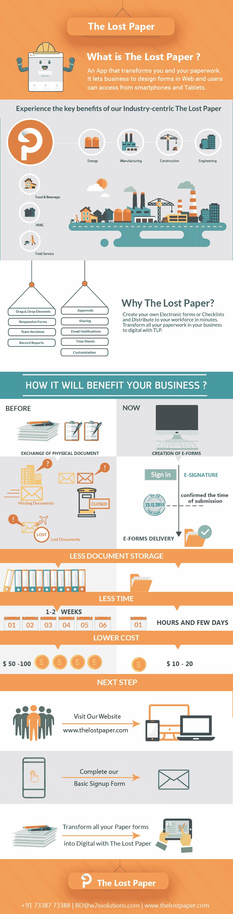

# 你还在使用纸质表格吗？了解如何转型并在市场中保持竞争力

> 原文：<https://dev.to/thelostpaperapp/are-you-still-using-paper-forms-know-how-you-can-transform-and-be-competitive-in-market-36op>

表格和清单仍然是许多企业的重要组成部分之一。虽然我们生活在数字时代，但只有少数企业使用电子设备或智能应用程序来克服他们的常规表格和清单。除此之外，大多数企业仍在使用纸质表单和清单来完成他们的日常活动。这种手动过程既耗时又会出错。甚至很少有企业需要为每次产品质量检查或任何评估准备不同的表格或清单，从而导致纸张和印刷的单独投资。想听听你的故事吗？

作为一个以行业为中心的解决方案提供商，我们有一个永久的解决方案来最大限度地降低您的纸张成本、无错误的环境、更高的生产力以及保存您所有文档的中央服务器。是的，这一切都可能与丢失的文件。这是一个表单生成器工具，您可以通过拖放在您的 PC 上为您的企业创建 n 个表单。将所有纸质表格最小化为数字形式，并开始与员工各自的移动应用程序共享。提交表格后，可以立即获得批准。丢失的文件允许你用我们在应用程序中预定义的字段创建任何类型的表单。请看看我们的信息图，了解更多关于丢失纸张的信息。[丢失的纸张](http://www.thelostpaper.com/blog/transform-your-business-with-tlp/)

[T2】](https://res.cloudinary.com/practicaldev/image/fetch/s--cEh1dXjX--/c_limit%2Cf_auto%2Cfl_progressive%2Cq_auto%2Cw_880/https://thepracticaldev.s3.amazonaws.com/i/ubtn05eyq4dsze8moozn.jpg)