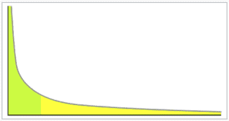

# 你在做最重要的事情吗？

> 原文：<https://dev.to/bosepchuk/are-you-working-on-the-most-important-thing--5e6i>

有没有可能是你低估或忽视了积压的故事，而这些故事会让 T2 在你每一小时的努力中获得数千美元的回报？你确定你在做最重要的事情吗？

这正是我的遭遇。我一直忽略了一堆“低优先级”的故事，直到我发现一个类似的故事**在我的时间**中每小时回报远远超过 15K 美元。

在这篇文章中，我将告诉你发生了什么，你如何在你自己的积压工作中找到这样的故事，以及你如何确保你在做最重要的事情。

### 我制作了一个可以有效打印钞票的登陆页面

大约 5 年前，我对关键词分析产生了兴趣。所以，我在工作间隙花了一点时间调查它。我很快发现了一个真正伟大的关键字，它没有出现在我们网站的任何地方。于是，我迅速建立了一个登陆页面，在 AdWords 上为它做了一个广告群，开始向它推送流量。

我的登陆页面很难看。这只是一堆我扔在一起的好处和一些行动的呼吁。因为是实验，所以没花太多时间。然而，尽管它看起来很业余，我们很快就了解到它疯狂地转换——远远超过了我们在 AdWords 中的任何东西。我为自己感到自豪，并考虑进一步发展。但是我有很多其他的工作要做，所以我开始做其他的事情。

几年过去了，我继续为我的登录页面感到自豪。迄今为止，它一直是我们最好的广告团队，在有机搜索方面也做得很好。但是我很忙，所以我就不管了。

### 我等了 5 年来评估我的登陆页面的性能

一个不相关的工作任务促使我最终评估我的登陆页面。当我得知我丑陋的登录页面已经使我们超过了每小时 15，000 美元的努力(到目前为止)时，我震惊了。而且它的年收入每年都在增加。所以，很难说一个登陆页面会让我的雇主一生赚多少钱。

[T2】](https://res.cloudinary.com/practicaldev/image/fetch/s--yjs-bS9L--/c_limit%2Cf_auto%2Cfl_progressive%2Cq_auto%2Cw_880/https://thepracticaldev.s3.amazonaws.com/i/t655nxdd2iclzxaufauk.PNG)

现在，我的目标是永远做最重要的事情。我觉得我做得很好。但是考虑到这个登陆页面的回报率，我不得不说**我没有做最重要的事情**,因为我没有定期做任何每小时能带来五位数收入的事情。

所以，我花了一些时间寻找新的关键词(不这样做我会疯的，对吗？).几个小时后，我发现了一堆更多的看起来像他们有潜力在同一个联盟作为我们的最佳关键字。

多年来我一直忽略了一个巨大的机会。

### 如何确保你在做最重要的事情

我们知道我的登陆页面是好的。每次谈到 AdWords 或 Google Analytics 时，我们都会谈到它。我甚至建立了另一个不同关键字的登陆页面，这是我和我的老板有一天集体讨论出来的。但是我们从来没有真正坐下来计算我的登陆页面的价值。其他任务似乎总是更优先。

很难确定最重要的事情，因为解决方案空间很大，很难比较故事。但是我发现[约束理论](https://smallbusinessprogramming.com/theory-of-constraints-10x-programmers/)是一种很有帮助的方法，可以快速聚焦于高价值领域，而无需极其详细地审视整个业务。去年，我学习了延迟成本和 CD3，它们与约束理论结合得非常好。我在这里写了这些概念，这里写了，这里写了。然而，至少 5 年来，我还是没能找到最重要的东西。怎么回事？

#### 你需要关闭回路

我最近读了《精益创业》,我认为 Eric Ries 找到了答案。他在书中用了很大一部分篇幅谈论创业公司如何通过参与一个“***-构建-测量-学习*** ”循环来获得他称之为“*”的经验学习。好吧，是我做的。但我五年没测也没学(作者滑稽地把手掌贴在额头上)。*

 *所以，我的解决方案很简单。使用约束理论、延迟成本和 CD3 来确定工作的优先级。但是只要有可能，也要花时间应用构建-测量-学习反馈循环。

#### 你必须将你的结果转换成美元

CD3 迫使你将你的故事转换成金钱，这是整件事的关键。

当我们**计算出我的登陆页面的实际美元价值**时，我们能够将无所作为转化为行动。我们知道这很好，但我做了很多有好结果的事情，所以这并不突出。但是当我们用金钱来衡量我的登录页面有多“好”时，我和我的老板都立刻相信，如果我们能找到更多同样吸引人的关键词，我们需要制作更多的登录页面。

如果你的成果没有价值，就不可能准确计算不同故事的相对“好”。例如，你应该花 5 个小时来消除错误，还是花 5 个小时来为你的软件添加新功能？看到问题了吗？你的整个积压都是很难比较的东西。这就是为什么你需要按 CD3 对你的待办事项进行优先排序。

#### 根据经验证的学习结果更新您的评估

最后，我认为 Ries 的构建-测量-学习反馈循环暗示了一些更微妙的东西。积压工作中每个故事的价值取决于两个估计。

您必须估计这个故事对客户的价值，并且必须估计实现这个故事的成本(可能还会增加一些维护成本)。您使用这两个评估来确定您的故事的 ROI。但是，在你完成这个故事，把它拿到你的客户面前，并分析你的结果之前，你不会知道这些估计有多准确。

所以，这是重要的一点。如果你用美元来量化你的故事的价值和你的实际努力，你可以算出两件事:

*   过去你的故事有多接近最优
*   如果您需要更新未来类似故事的价值和/或成本估计

有了这些数据，你可以更准确地对你的待办事项进行优先级排序，并确保你总是在尽可能地做最重要的事情。

#### 抵制冲动，用你的直觉来优先处理你的待办事项

我知道外面的牛仔软件开发人员会想忽略所有这些分析的东西，而只是开始编码下一个东西。这种错误在最好的情况下会导致你开发出不必要的昂贵软件，在一般情况下会导致你开发出毫无价值的软件，在最坏的情况下会导致你开发出没有成品的软件。

你的故事的价值很可能遵循[幂律分布](https://en.wikipedia.org/wiki/Power_law)，这具有重要的意义。

[T2】](https://res.cloudinary.com/practicaldev/image/fetch/s--JjFXimRa--/c_limit%2Cf_auto%2Cfl_progressive%2Cq_auto%2Cw_880/https://thepracticaldev.s3.amazonaws.com/i/3452ou8mr4f8u275nax5.PNG)

你需要一个合理的方法，始终如一地识别分布图最左边的那些少数真正有价值的故事。如果没有这样的方法，你将会把大部分资源浪费在低优先级的故事上。如果你不想平庸，你需要 [CD3](https://smallbusinessprogramming.com/cost-of-delay-prioritize-your-product-backlog-by-cd3/) 。

### 外卖

我对项目管理了解得越多，我就越意识到经理们毫无必要地根据直觉做出决策，并交付糟糕的结果。在某些情况下，跟着感觉走绝对是正确的选择。但是对于绝大多数商业决策来说，当我们没有花时间去做“构建-测量-学习”反馈循环中的“测量-学习”阶段时，我们只是在从事次优行为。

我花了不到五分钟的时间来量化我丑陋的登陆页面的价值。除了我的注意力分散在积压的其他三百件事情上，我真的没有任何借口不早点做这件事。但是现在我已经看过了，我们已经把登陆页面移到了待办事项列表的最前面。

亲爱的读者，你正在做最重要的事情吗？如果有，你怎么知道？如果没有，请在评论中告诉我原因。*