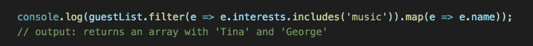

# 用于对象数组的数组方法

> 原文：<https://dev.to/tallmanlaw/array-methods-used-on-an-array-of-objects-4ah0>

数组方法可以相对容易地在对象数组上使用，只有一个细微差别——考虑对象属性。解决方案是利用点符号。

下面提供了一个简单的对象数组作为演示。

[T2】](https://res.cloudinary.com/practicaldev/image/fetch/s--Ic3wqlMz--/c_limit%2Cf_auto%2Cfl_progressive%2Cq_auto%2Cw_880/https://thepracticaldev.s3.amazonaws.com/i/fya42ih1doqc0hd0u05x.png)

当您试图确定数组中是否至少有一项通过了某个条件时，可以使用 some()数组方法。输出将返回“真”或“假”。在下面的示例中,“some”数组方法正在检查以确定对象数组中是否有年龄属性大于 21 岁的 guest。

[T2】](https://res.cloudinary.com/practicaldev/image/fetch/s--zb5-_drt--/c_limit%2Cf_auto%2Cfl_progressive%2Cq_auto%2Cw_880/https://thepracticaldev.s3.amazonaws.com/i/8y6jyn9cpqa7s8b1ny8y.png)

every()数组方法类似地检查以确定是否有任何项目满足已建立的条件。在这种情况下,“every”方法检查以确定对象数组中的“every”是否有年龄属性大于 21 岁的 guest。输出将返回“真”或“假”。

[T2】](https://res.cloudinary.com/practicaldev/image/fetch/s--gHvcoYCq--/c_limit%2Cf_auto%2Cfl_progressive%2Cq_auto%2Cw_880/https://thepracticaldev.s3.amazonaws.com/i/aulc3bfvt95weyi95cdc.png)

find()数组方法只是查找指定的项并返回它。在下面的例子中，它返回包含指定属性的整个对象。

[T2】](https://res.cloudinary.com/practicaldev/image/fetch/s--KyySQLd7--/c_limit%2Cf_auto%2Cfl_progressive%2Cq_auto%2Cw_880/https://thepracticaldev.s3.amazonaws.com/i/oglf2bt7n6nf17cbk0q4.png)

此外，这些方法可以结合使用。下面的示例演示了 filter()、includes()和 map()方法的组合。filter() array 方法在列表中循环查找传递给它的条件，生成只包含满足该条件的项目的新数组。在下面的例子中,“filter”方法与“includes”方法相结合，后者通常会产生“true”或“false”结果，以“筛选”项目，找到每个对象的“music”属性。然后，使用“map”方法呈现一个包含条件项的新数组。

[T2】](https://res.cloudinary.com/practicaldev/image/fetch/s--Cra4M3II--/c_limit%2Cf_auto%2Cfl_progressive%2Cq_auto%2Cw_880/https://thepracticaldev.s3.amazonaws.com/i/0jgwj75drxkghfw6bdop.png)

当您想要显示整个数组，或者在本例中显示对象数组时，forEach() array 方法非常有用。该方法遍历每个项目，呈现整个来宾列表。

[T2】](https://res.cloudinary.com/practicaldev/image/fetch/s--606VL5Yt--/c_limit%2Cf_auto%2Cfl_progressive%2Cq_auto%2Cw_880/https://thepracticaldev.s3.amazonaws.com/i/k33qx18yhxgounxn8ryr.png)

[T2】](https://res.cloudinary.com/practicaldev/image/fetch/s--aQJnIisE--/c_limit%2Cf_auto%2Cfl_progressive%2Cq_auto%2Cw_880/https://thepracticaldev.s3.amazonaws.com/i/yqqh5hsbf1dw7p6os9nc.png)