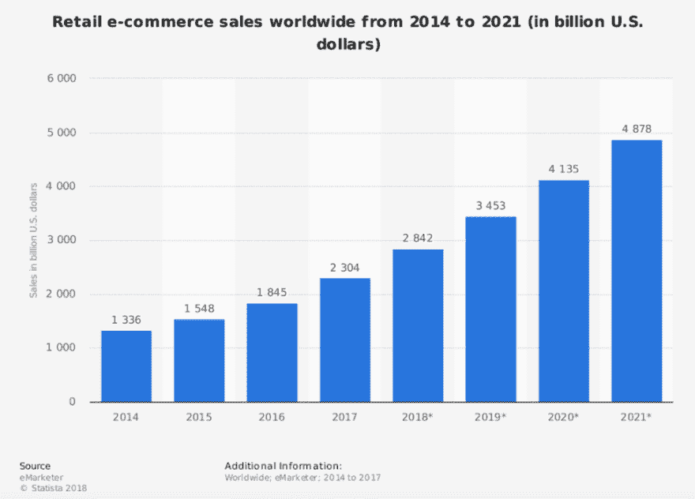
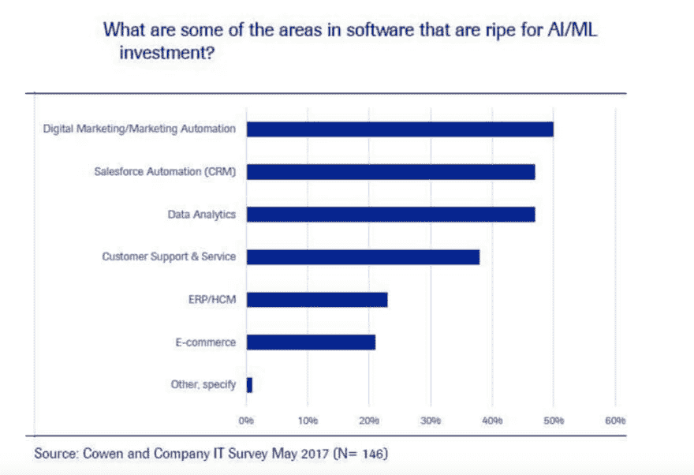
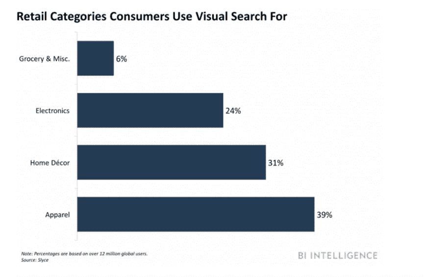

# 电子商务中的人工智能:好处、统计数据、事实、用例及案例研究

> 原文：<https://dev.to/apium_hub/artificial-intelligence-in-ecommerce-benefits-statistics-facts-use-cases--case-studies-1ieb>

2018 年是充满惊喜的一年，我们也看到了电子商务的进步和变化。[人工智能](https://dev.to/apium_hub/artificial-intelligence--in-math-i-trust-5fhl)真的要接管世界了。人工智能现在无处不在，尤其是在电子商务领域；我们今天在这篇文章中关注的是。继续阅读，了解人工智能在电子商务中的重要性。

## 电子商务中的人工智能:统计数据&事实

首先，让我们从总体上看一下电子商务行业:

[T2】](https://apiumhub.com/wp-content/uploads/2018/07/Picture1.png)

*来源:[emarketer](https://amasty.com/blog/global-e-commerce-trends-and-statistics-2017-2018/)T3】*

印象深刻吧。电子商务绝对值得一看。让我们继续讨论人工智能，看看它们实际上是如何联系在一起的。

[T2】](https://apiumhub.com/wp-content/uploads/2018/07/Picture1-1.png)

正如我们所看到的，人工智能在电子商务中被大量使用！Gartner 预测，到 2020 年，超过 80 %的客户互动将由人工智能处理。如今，阿里巴巴、乐天、易贝和亚马逊等公司正在使用人工智能进行虚假评论检测、聊天机器人、产品推荐、管理大数据等。稍后我们将更详细地讨论它。

**现在，让我们回顾一下最近 [Ubisend 报道](https://blog.ubisend.com/optimise-chatbots/chatbot-statistics) :** 的一些有趣数据

五分之一的消费者愿意[从聊天机器人](https://dev.to/apium_hub/why-chatbots-are-the-future-of-m-commerce-statistics-benefits-use-cases--startups-1i13)处购买商品。

而这些消费者被开放消费高达 314.74。

40%的消费者使用聊天机器人寻找优惠和交易。

谷歌出资 4 亿收购 DeepMind 人工智能公司

人工智能有 3 个关键要素:数据挖掘、 [NLP](https://apiumhub.com/tech-blog-barcelona/natural-language-processing-projects/) 和 ML。这些元素有助于电子商务企业改善业绩。通过人工智能，机器正在学习如何帮助我们以及如何执行手动任务，令人着迷的是，它们的工作做得非常好，让我们能够更加专注于战略层面的业务。现在，我们终于有了以前没有的时间，现在我们可以专注于创造更多的东西，忘记重复的任务。

人工智能是一种趋势，是的，肯定是这样，但它给了我们如此多的机会，以至于不可能在一篇文章中涵盖所有的机会。让我们关注最强大、最时尚的解决方案。其中之一是视觉和语音搜索:

[T2】](https://apiumhub.com/wp-content/uploads/2018/07/Picture1-2.png)

Branded3 声称，到 2020 年，图像和语音搜索可能会占到所有搜索的 50%。又一个令人印象深刻的预测，对吧？此外，到 2021 年，预计早期采用者重做他们的网站并实施视觉和[语音搜索](https://dev.to/apium_hub/breaking-the-deadlock-how-a-voice-assistant-can-transform-your-business-38g8)将增加 30%的电子商务收入。

搜索引擎也在这一领域努力，提高图像搜索技术。这一新功能真正推动了服装和时尚电子商务的发展，不仅如此！看看零售和制药行业。对于较小的公司来说，这是一个巨大的增长推动力，一个他们从未有过的机会。在这种情况下，它不是那么关于技术，而是关于在搜索引擎和市场的排名。

多年来，元数据和标签是搜索引擎识别正确图像或文档的最强指标之一。是的，在大多数情况下是手工完成的。但当涉及到人工智能时，它会自动进行图像分类和产品标记，确保基于改进的属性识别的搜索结果更加一致。如果我们想一想，实际上，图像本身成为了一个数据源。

你有“视觉听觉”的心吗？给你一个简单的例子，现在品牌可以识别所有与其品牌相关的图片和视频，不仅仅是那些有品牌标签的，而是所有真正展示品牌的。今天，许多消费者分享他们的品牌体验；通过图像、视频等正反两方面。然而，他们并不总是标记这些图像。据《福布斯》报道，80%包含品牌标志的社交媒体图片并没有在文字中提及品牌或产品。直到现在这还是一个问题，但有了人工智能，品牌可以忘记这个问题，并可以成功地以自动方式收集所有数据。在 2018 年和 2019 年，我们预计将看到更多采用集成人工智能功能的视觉听觉工具，以高效的方式分析所有视觉内容。

## 电子商务中的人工智能:用例

在电子商务中还有其他使用人工智能的方法，在本文中，我们将向您展示强大而实用的方法。

嗯，正如你可能猜到的，人工智能在电子商务中最受欢迎的用途是更好地了解客户，产生新的线索，并提供增强的用户体验。随着电子商务已经成为购买商品和服务的标准方法，领先的电子商务品牌集中投资于探索人工智能如何提高品牌竞争力和客户忠诚度。

因此，让我们看看迄今为止人工智能在电子商务中最受欢迎的应用(来源:[tech emergency](https://www.techemergence.com/artificial-intelligence-in-ecommerce-amazon-alibaba-jd-com/)):

**1。人工智能助手和聊天机器人**

它们帮助品牌回复客户询问:就像语音一样。此外，它们还用于通过自然语言处理提供产品推荐(阿里巴巴和易贝就是很好的例子)

**2。智能物流**

AI 自动化仓库运营和交付流程。(JD.com 就是例子之一)

**3。推荐引擎**

人工智能能够分析网站上的客户行为。它使用算法来预测客户可能会喜欢什么产品，并提供建议。(亚马逊可以给我举一个很好的例子)。

## 电子商务中的人工智能:案例研究

**亚马逊**
T3】Alexa 是亚马逊最受欢迎、最著名的 AI 产品之一。它有助于推动算法，这些算法对亚马逊的目标营销战略至关重要。人工智能允许亚马逊预测什么产品将最受欢迎，以根据客户搜索提供定制建议。据[回复](http://rejoiner.com/resources/amazon-recommendations-secret-selling-online/)称，亚马逊的推荐引擎驱动了总销售额的 35%。

总部位于北京的 JD.com 与新松机器人&自动化有限公司合作，利用机器人等自动化技术来改善仓库运营。主要想法是提高仓库中产品分拣和交付的速度和效率，降低成本并增加收入。据[tech emergency](https://www.techemergence.com/artificial-intelligence-in-ecommerce-amazon-alibaba-jd-com/)报道，在实施这一新举措后，2015 年在线订单数量达到 12.6 亿(是 2014 年订单数量的两倍)，其中约 85%的订单在两天内送达。正如我们所见，这很有帮助！JD.com 创始人兼首席执行官刘强东表示，人工智能是公司未来商业战略的必要组成部分。JD.com 的目标是利用人工智能在十年内将员工数量从大约 12 万人减少到 8 万人，通过减少人工劳动来提高效率，从而提高利润率。

**阿里巴巴**

至于阿里巴巴，大概我们首先想到的是 AI 助手——天猫精灵和阿里助手。基本上，通过使用人工智能，阿里巴巴希望增强其竞争优势。它的客户服务聊天机器人处理 95%的客户询问，包括书面和口头的，它现在非常强大。此外，阿里巴巴表示，人工智能算法有助于推动内部和客户服务运营，包括智能产品和搜索推荐。此外，阿里巴巴使用人工智能来帮助绘制最有效的送货路线。效果相当好！阿里巴巴声称，智能物流已经导致车辆使用量减少了 10%，旅行距离减少了 30%。对他们来说，这似乎是正确的投资！

易贝

易贝将人工智能视为保持消费者兴趣和竞争优势的一种方式。易贝商店机器人帮助用户使用自然语言处理轻松找到他们感兴趣的产品。此外，客户可以通过文本、语音或使用手机拍摄的照片与机器人交流。目前，机器学习是易贝商业战略不可或缺的一部分。

**ASOS**

时尚零售商 ASOS 继续投资人工智能和语音识别系统，以影响买家行为。此外，它还通过引入视觉搜索功能，对图像识别技术进行了大量投资，该功能允许 ASOS app 将用户的照片与在线销售的类似服装进行匹配。

乐天

日本最大的电子商务网站乐天继续投资人工智能，以更好地预测客户行为，因为这对电子商务的成功至关重要。现在，通过他们的乐天技术研究所，他们能够分析他们的 2 亿件产品，以高度准确地预测销售。现在，他们也能够利用实时数据更准确地细分买家。在 Rakuten Fits Me 应用程序中，他们使用图像识别技术来提高客户满意度和销售效率。

## 电子商务中的人工智能:好处

现在让我们看看在电子商务中使用人工智能的主要好处。

**1。以顾客为中心的视觉搜索**

消费者常常对电子商务体验感到失望，因为显示的产品结果常常是不相关的。为了解决这个问题，人工智能使用自然语言处理来缩小范围，融入背景并改善在线购物者的搜索结果。此外，它允许有视觉搜索能力，寻找和匹配产品。此外，人工智能使购物者能够发现互补的产品，并增强客户体验。现在，消费者可以拍下朋友的新鞋或新运动服，上传照片，然后人工智能使消费者能够通过电子商务商店轻松找到类似的商品。听起来很酷，对吧？好吧，我们有它，它可供我们使用！例如，亚马逊有这个选项，它允许你指向你喜欢的产品，亚马逊会识别它并给你你最可能喜欢的结果，因为它正是你正在搜索的。我相信，人工智能使我们尽可能容易地在网上购买我们喜欢的产品！

**2。重新瞄准潜在客户，改善销售流程**

根据 Conversica 的数据，至少有 33%的营销线索没有被销售团队跟进。这意味着通过资格预审的对产品感兴趣的潜在买家被落在了后面。此外，许多团队被难以管理的客户数据压得喘不过气来，他们很少或根本不处理这些数据。这时候人工智能才是真正的必需品。人工智能可以通过定制您的问题解决方案和创建强有力的销售信息，在正确的时间和正确的平台上到达消费者，来帮助改善销售周期。现在有很多 AI 系统可以实现 NLP 和语音输入，例如，Siri，Alexa 等。这允许 CRM 系统回答客户的询问，解决他们的问题，甚至为销售团队识别新的机会。

为了更好地理解我的意思，我们来看一个非常好的例子——大型电子商务零售商 The North Face。他们使用 IBM 的人工智能解决方案 Watson 来更好地了解他们的消费者。他们可以帮助他们的用户找到完美的衣服，通过问顾客一些问题，比如“你将在何时何地使用你的跑步服装？”客户可以通过说或写来回答。然后，IBM 的软件扫描数百种产品，根据客户的实时输入找到最佳匹配，并做额外的研究，找出该地区的天气情况等。

**3。个性化的新水平**

现在我们可以找到许多人工智能解决方案，例如其中一个我非常想提到的是 Boomtrain。这家公司分析不同的接触点，以帮助企业分析客户如何在线互动:通过移动应用程序、网络、电子邮件等。AI engine 正在监控所有设备和渠道，以创建通用的客户视图。所以，不只是一个频道，而是所有的频道。当然，它有助于电子商务零售商在所有平台上提供无缝的客户体验。这将有助于在正确的时间发出相关的信息。

**4。聊天机器人和虚拟助手**

电子商务现在注重用户体验。通过应用“聊天机器人”来使用人工智能只是在对话式商业时代推动对话的一种方式。实际上不止如此，聊天机器人可以自动化订单流程。此外，它们是提供 24/7 客户服务、收集有价值的数据和跟踪行为的有效且低成本的方式。有了聊天机器人，电子商务网站可以通过为消费者量身定制在线体验来提高转化率。并且 [Juniper Research](https://www.juniperresearch.com/analystxpress/july-2017/chatbot-conversations-to-deliver-8bn-cost-saving) 称聊天机器人到 2022 年将每年节省超过 80 亿美元。同样，最著名的例子之一当然是亚马逊的虚拟助手 Alexa。它已经集成到亚马逊自己的产品以及其他制造商的产品中。虚拟助理有望影响消费者的购买，并为电子商务零售商提供一个可以利用的创造性机会。

**7。改善对客户的推荐**

让我们再次强调这个好处:借助 AI，品牌可以更智能、更高效地预测客户行为和需求，并提供相关和有帮助的推荐。星巴克就是一个很好的例子，它使用人工智能来分析它收集的所有数据，以提供更个性化的建议。该算法考虑了:客户的信息、客户偏好、购买历史、第三方数据和上下文信息。

**8。智能代理**

新型智能代理谈判系统已经成为电子商务中使用的流行工具。有 3 个主要的用例:匹配买家和卖家；促进交易；并提供机构基础设施。你猜怎么着？！一切都在自动进行！

**9。过滤虚假评论**

不幸的是，虚假评论成为在线零售商和电子商务商店的一个问题。根据 Dimensional Research 的调查，90%的受访者表示，正面的在线评论会影响他们的购买决定。此外，86%的人说他们的购买决定受到负面在线评论的影响。然而，正如我们所知，存在由竞争对手、机器人等发布的虚假评论。那么，AI 如何管理这个问题呢？如今，许多电子商务企业使用人工智能来打击虚假宣传，更加重视经过验证和有帮助的评论。例如，亚马逊使用人工智能来打击虚假产品评论和他们受欢迎的明星评级的膨胀。他们的人工智能专注于已验证的客户购买评论的突出性和权重，并提升它们。人工智能也考虑其他用户标记为有帮助的评论。

10。自动化

AI 并不意味着机器人正在接管。现在许多人害怕在不久的将来所有的事情都将由机器人来做。不，不是真的！机器人为零售商提供了机会，通过使用技术和算法，在顾客想要的时候，准确地提供他们想要的东西。随着电子商务行业的公司继续扩张，这意味着拥有越来越多的客户，自动化成为必须，并成为他们对电子商务商店投资的首要任务之一。此外，正如我们所知，当电子商务业务开始增长时，重复性任务的数量也会增加。机器人可以接管它们；从在多个渠道发布新产品到安排销售、给忠实客户打折等等。

据 Martechtoday 报道，据报道，Ocado 今年计划为其机器人和自动化系统投资 1.75 亿美元(2.32 亿美元)，亚马逊仅在印度就承诺投资 50 亿美元，阿里巴巴计划在未来三年内投入 150 亿美元用于研发。Forrester Research (PDF)预测，2017 年人工智能相关投资将增长约 300%，到 2020 年，企业将变得更具竞争力，每年收益 1.2 万亿美元。

要找到更多关于人工智能在电子商务中的好处的信息，请阅读 Ubisend 文章。

## 电子商务中的人工智能:结论

总之，我想说的是，人工智能在电子商务行业正在崛起，然而，它还远远不够完美。电子商务公司继续改进他们的人工智能工具，以更好地满足市场需求。他们还与其他公司合作，整合他们在人工智能方面的能力，创造更复杂的解决方案。我们相信，电子商务中的人工智能将影响交易、客户保持、满意度、效率等等。人工智能正在改变我们在线购买和销售的方式。

我希望这篇文章对你有用！如果你对电子商务中人工智能的最新消息感兴趣，我强烈推荐你在这里订阅[我们的每月简讯](http://eepurl.com/cC96MY)。

## 如果你发现这篇关于电子商务中人工智能的文章，你可能会喜欢…

*   [值得阅读的顶级商业博客](https://apiumhub.com/tech-blog-barcelona/top-business-blogs/)
*   [关注智慧城市项目和领导者](https://apiumhub.com/tech-blog-barcelona/smart-city-projects-leaders-barcelona/)
*   [以人为中心的创新](https://apiumhub.com/tech-blog-barcelona/human-centered-innovation/)
*   [巴塞罗那跻身创新中心前五名](https://dev.to/apium_hub/barcelona-makes-it-to-the-top-5-of-innovation-hubs)
*   [区块链技术:用例、统计、收益、初创公司&事件](https://apiumhub.com/tech-blog-barcelona/blockchain-technology/)
*   [巴塞罗那；欧洲最佳智能城市之一](https://apiumhub.com/tech-blog-barcelona/barcelona-smart-cities/)
*   [颠覆性创新追踪](https://apiumhub.com/tech-blog-barcelona/disruptive-technology-innovations/)
*   [独角兽时代](https://dev.to/apium_hub/the-era-of-tech-unicorns-companies-to-watch-in-2018-4nb)
*   [巴塞罗那 20 大有前途的创业公司](https://dev.to/apium_hub/top-20-promising-startups-in-barcelona-in-2017-3mj)
*   [IOT 可能改变世界的项目](https://apiumhub.com/tech-blog-barcelona/iot-projects-will-change-world/)
*   [AI 能控制“假新闻”市场](https://dev.to/apium_hub/can-ai-control-the-fake-news-market-555c)
*   [人工智能——我相信数学](https://dev.to/apium_hub/artificial-intelligence--in-math-i-trust-5fhl)

帖子[电子商务中的人工智能:好处、统计数据、事实、用例&案例研究](https://apiumhub.com/tech-blog-barcelona/artificial-intelligence-ecommerce/)最先出现在 [Apiumhub](https://apiumhub.com) 上。