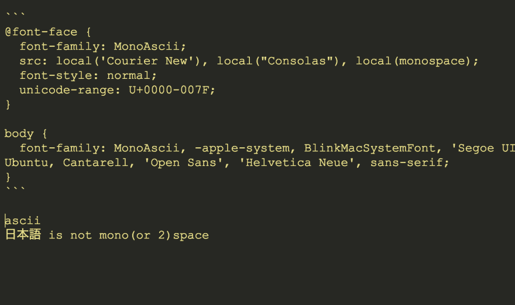

# ascii 仅单空间字体-面

> 原文：<https://dev.to/mizchi/ascii-only-monospace-font-face-4ea6>

```
@font-face {
  font-family: MonoAscii;
  src: local('Courier New'), local("Consolas"), local(monospace);
  font-style: normal;
  unicode-range: U+0000-007F;
}

body {
  font-family: MonoAscii, -apple-system, BlinkMacSystemFont, 'Segoe UI', Roboto, Oxygen, Ubuntu, Cantarell, 'Open Sans', 'Helvetica Neue', sans-serif;
} 
```

[T2】](https://res.cloudinary.com/practicaldev/image/fetch/s--zI9niKhX--/c_limit%2Cf_auto%2Cfl_progressive%2Cq_auto%2Cw_880/https://i.gyazo.com/4a25fa13c8e9a9294e47e281e1813b46.png)