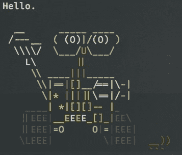

# 你的终端的 Ascii Wall-E

> 原文：<https://dev.to/rpalo/ascii-wall-e-for-your-terminal-2am5>

两件事。1.我在试用[鱼壳](https://fishshell.com/)。到目前为止我喜欢！2.我做了瓦力！

[T2】](https://res.cloudinary.com/practicaldev/image/fetch/s--RSHvVZcU--/c_limit%2Cf_auto%2Cfl_progressive%2Cq_auto%2Cw_880/https://assertnotmagic.com/img/wall-e.jpg)

在他们的网站上，鱼壳上有一张整洁的鱼的 ascii 图片。我看到过这样的例子，当航站楼开门时，人们会把这句话作为他们最初的问候。我觉得这很棒，但我想要更符合我风格的东西。于是我花了几个*咳*T2】小时 T4】咳制作瓦力，现在每当我打开我的终端他都会跟我打招呼！

如果你好奇的话，我把代码[放到一个要点](https://gist.github.com/rpalo/cd77a94616b0a30d1c2a2f18d6bc7581)中。

挑战！制作自己的 ASCII 艺术并分享。

星期六快乐！

* * *

*原帖 [`assert_not magic?`](https://assertnotmagic.com/2018/06/23/ascii-wall-e/)*