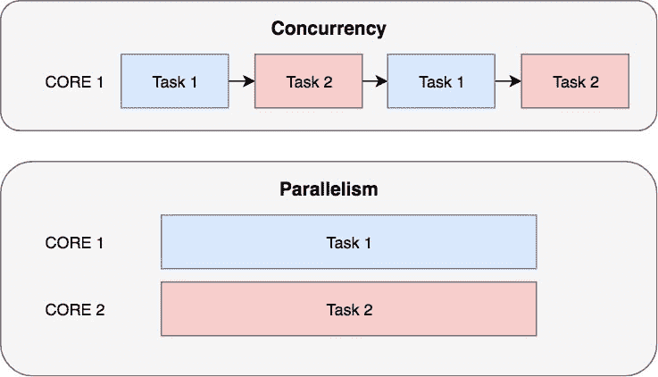

# 使用 asyncio 在 Python 中进行异步编程

> 原文：<https://dev.to/welldone2094/async-programming-in-python-with-asyncio-12dl>

对于来自 JavaScript 的人来说，异步编程不是什么新鲜事，但是对于 python 开发人员来说，习惯异步函数和未来(相当于 JS 中的承诺)可能不是小事

# 并发 vs 并行

并发性和并行性听起来非常相似，但是在编程中有一个重要的区别。想象你在做饭的时候写一本书，即使看起来你在同时做这两项任务，你所做的是在这两项任务之间切换，当你等待水烧开的时候你在写你的书，但是当你切菜的时候你暂停了你的写作。这被称为**并发**。在**并行**中完成这两个任务的唯一方法是有两个人，一个写，一个做饭，这就是多核 CPU 做的事情。

[T2】](https://res.cloudinary.com/practicaldev/image/fetch/s--d28fU0gK--/c_limit%2Cf_auto%2Cfl_progressive%2Cq_auto%2Cw_880/https://dev-to-uploads.s3.amazonaws.com/i/eduzmp4zt3898xz5dfia.jpeg)

# 为什么是 asyncio

异步编程允许您编写在单线程中运行的并发代码。与多线程相比，第一个优势是您可以决定调度程序从一个任务切换到另一个任务的位置，这意味着在任务之间共享数据更加安全和容易。

```
def queue_push_back(x):
    if len(list) < max_size:
        list.append(x) 
```

Enter fullscreen mode Exit fullscreen mode

如果我们在多线程程序中运行上面的代码，有可能两个线程同时执行第 2 行，所以两个项目将同时被添加到队列中，并有可能使队列大小大于`max_size`

异步编程的另一个优点是内存使用。每次创建一个新线程时，都会使用一些内存来允许上下文切换，如果我们使用异步编程，这不是问题，因为代码在一个线程中运行。

# 如何用 python 写异步代码

Asyncio 有 3 个主要组件:协程、事件循环和未来

## 协程

协程是异步函数的结果，可以在`def`
前使用关键字`async`来声明

```
async def my_task(args):
    pass

my_coroutine = my_task(args) 
```

Enter fullscreen mode Exit fullscreen mode

当我们使用关键字`async`声明一个函数时，这个函数不运行，而是返回一个协程对象。

从协程中读取异步函数的输出有两种方法。
第一种方法是使用`await`关键字，这只有在异步函数中才有可能，它会等待协程终止并返回结果

```
result = await my_task(args) 
```

Enter fullscreen mode Exit fullscreen mode

第二种方法是将它添加到事件循环中，我们将在下一节中看到。

## 事件循环

事件循环是执行异步代码并决定如何在异步函数之间切换的对象。在创建一个事件循环之后，我们可以添加多个协同程序，当调用`run_until_complete`或`run_forever`时，这些协同程序将同时运行。

```
# create loop loop = asyncio.new_event_loop()
# add coroutine to the loop future = loop.create_task(my_coroutine)
# stop the program and execute all coroutine added
# to the loop concurrently loop.run_until_complete(future)
loop.close() 
```

Enter fullscreen mode Exit fullscreen mode

## 未来

future 是一个对象，作为异步函数输出的占位符，它给我们提供关于函数状态的信息。当我们给事件循环添加一个例程时，未来就被创造出来了。有两种方法:

```
future1 = loop.create_task(my_coroutine)
# or future2 = asyncio.ensure_future(my_coroutine) 
```

Enter fullscreen mode Exit fullscreen mode

第一种方法将一个协程添加到循环中，并返回一个`task`，它是 future 的一个子类型。第二种方法非常类似，它采用一个协程，并将其添加到默认循环中，唯一的区别是它也可以接受一个未来，在这种情况下，它不会做任何事情，并返回未来不变。

## 简单的程序

```
import asyncio

async def my_task(args):
    pass

def main():
    loop = asyncio.new_event_loop()
    coroutine1 = my_task()
    coroutine2 = my_task()
    task1 = loop.create_task(coroutine1)
    task2 = loop.create_task(coroutine2)
    loop.run_until_complete(asyncio.wait([task1, task2]))
    print('task1 result:', task1.result())
    print('task2 result:', task2.result())
    loop.close() 
```

Enter fullscreen mode Exit fullscreen mode

正如您所看到的，要运行一个异步函数，我们首先需要创建一个协程，然后我们将它添加到创建一个 future/task 的事件循环中。到目前为止，我们的异步函数中没有任何代码被执行，只有当我们调用`loop.run_until_completed`时，事件循环才开始执行所有用`loop.create_task`或`asyncio.ensure_future`添加到循环中的协程。
`loop.run_until_completed`会阻止你的程序，直到你给定的未来作为参数完成。在这个例子中，我们使用`asyncio.wait()`来创建一个未来，只有当参数列表中传递的所有未来都完成时，这个未来才是完整的。

# 异步功能

在用 python 编写异步函数时要记住的一件事是，仅仅因为你在`def`之前使用了`async`，并不意味着你的函数将被并发运行。如果你取一个普通的函数并在它前面加上`async`，事件循环将会无中断地运行你的函数，因为你没有指定在哪里允许循环中断你的函数来运行另一个协程。指定事件循环允许改变协程的地方真的很简单，每次你使用关键字 await 事件循环就可以停止运行你的函数并运行另一个注册到该循环的协程。

```
async def print_numbers_async1(n, prefix):
    for i in range(n):
        print(prefix, i)

async def print_numbers_async2(n, prefix):
    for i in range(n):
        print(prefix, i)
        if i % 5 == 0:
            await asyncio.sleep(0)

loop1 = asyncio.new_event_loop()
count1_1 = loop1.create_task(print_numbers_async1(10, 'c1_1')
count2_1 = loop1.create_task(print_numbers_async1(10, 'c2_1')
loop1.run_until_complete(asyncio.wait([count1_1, count2_1])
loop1.close()

loop2 = asyncio.new_event_loop()
count1_2 = loop1.create_task(print_numbers_async1(10, 'c1_2')
count2_2 = loop1.create_task(print_numbers_async1(10, 'c2_2')
loop2.run_until_complete(asyncio.wait([count1_2, count2_2])
loop2.close() 
```

Enter fullscreen mode Exit fullscreen mode

如果我们执行这段代码，我们会看到 loop1 将首先打印带有前缀`c1_1`的所有数字，然后打印带有前缀`c2_1`的数字，而在第二个循环中，每隔 5 个数字，循环将改变任务。

# 真实世界的例子

现在我们知道了 python 中异步编程的基础，让我们写一些更实际的代码，这些代码将从互联网上下载一个页面列表，并打印包含页面前 3 行的预览。

```
import aiohttp
import asyncio

async def print_preview(url):
    # connect to the server
    async with aiohttp.ClientSession() as session:
        # create get request
        async with session.get(url) as response:
            # wait for response
            response = await response.text()

            # print first 3 not empty lines
            count = 0
            lines = list(filter(lambda x: len(x) > 0, response.split('\n')))
            print('-'*80)
            for line in lines[:3]:
                print(line)
            print()

def print_all_pages():
    pages = [
        'http://textfiles.com/adventure/amforever.txt',
        'http://textfiles.com/adventure/ballyhoo.txt',
        'http://textfiles.com/adventure/bardstale.txt',
    ]

    tasks =  []
    loop = asyncio.new_event_loop()
    for page in pages:
        tasks.append(loop.create_task(print_preview(page)))

    loop.run_until_complete(asyncio.wait(tasks))
    loop.close() 
```

Enter fullscreen mode Exit fullscreen mode

这段代码应该很容易理解，我们从创建一个异步函数开始，该函数下载一个 URL 并打印前 3 行非空行。然后我们创建一个函数，为页面列表中的每一页调用`print_preview`，将协程添加到循环中，并将未来存储在任务列表中。最后，我们运行事件循环，它将运行我们添加到其中的协程，并打印所有页面的预览。

# 异步发电机

我想说的最后一个特性是异步生成器。实现异步生成器非常简单。

```
import asyncio
import math
import random

async def is_prime(n):
    if n < 2:
        return True
    for i in range(2, n):
        # allow event_loop to run other coroutine
        await asyncio.sleep(0)
        if n % i == 0:
            return False
    return True

async def prime_generator(n_prime):
    counter = 0
    n = 0
    while counter < n_prime:
        n += 1
        # wait for is_prime to finish
        prime = await is_prime(n)
        if prime:
            yield n
            counter += 1

async def check_email(limit):
    for i in range(limit):
        if random.random() > 0.8:
            print('1 new email')
        else:
            print('0 new email')
        await asyncio.sleep(2)

async def print_prime(n):
    async for prime in prime_generator(n):
        print('new prime number found:', prime)

def main():
    loop = asyncio.new_event_loop()
    prime = loop.create_task(print_prime(3000))
    email = loop.create_task(check_email(10))
    loop.run_until_complete(asyncio.wait([prime, email]))
    loop.close() 
```

Enter fullscreen mode Exit fullscreen mode

# 异常处理

当一个未处理的异常在协程中出现时，它不会像在普通的同步编程中那样中断我们的程序，相反，它被存储在未来的程序中，如果你在程序退出前没有处理这个异常，你会得到下面的错误

```
Task exception was never retrieved 
```

Enter fullscreen mode Exit fullscreen mode

有两种方法可以解决这个问题，在访问未来结果时捕获异常，或者调用未来异常方法。

```
try:
    # this will raise the exception raised during the coroutine execution
    my_promise.result()
catch Exception:
    pass

# this will return the exception raised during the coroutine execution my_promise.exception() 
```

Enter fullscreen mode Exit fullscreen mode

# 越走越深

如果您已经阅读了到目前为止的所有内容，您应该知道如何使用 asyncio 编写并发代码，但是如果您希望更深入地了解 asyncio 是如何工作的，我建议您观看下面的视频

[https://www.youtube.com/embed/M-UcUs7IMIM](https://www.youtube.com/embed/M-UcUs7IMIM)

如果你想了解 asyncio 更复杂的用法，或者你有任何问题，请留下评论，我会尽快回复你