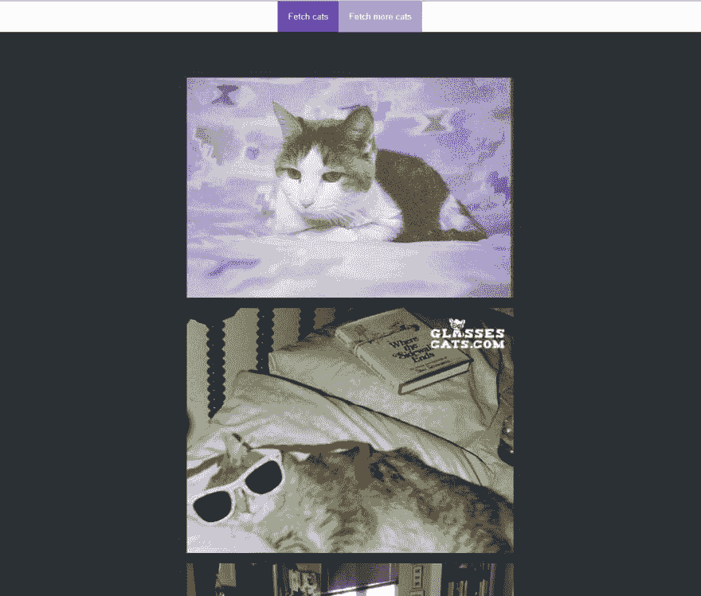

# 使用 Redux-thunk 和 Redux-saga 的异步反应基础

> 原文：<https://dev.to/bnorbertjs/async-react-basics-with-redux-thunk--redux-saga-4af7>

我最近有很多空闲时间，所以我决定用 React & Redux 玩一会儿。如果你想使用 Redux 编写可维护的异步代码，你需要选择一个像 redux-thunk 或 redux-saga 这样的中间件。

# 我们在建造什么

我喜欢猫，所以应用程序的功能是基于[猫 API](https://thecatapi.com/) 的。你可以在这里克隆/分叉[的 GitHub 回购。](https://github.com/bnorbertJS/react_catapi)

应用程序看起来是这样的:
[](https://res.cloudinary.com/practicaldev/image/fetch/s--_Y_eUrNW--/c_limit%2Cf_auto%2Cfl_progressive%2Cq_auto%2Cw_880/https://thepracticaldev.s3.amazonaws.com/i/64ocl0lsfupq43eqdsod.JPG)

如果你点击“获取猫”按钮，它发送一个 HTTP GET 请求，返回一个随机的猫图像。如果你点击“获取更多的猫”,它会返回一个 5 只随机猫的数组。我知道这很难看，但我真的不想在 css 上浪费时间。如果您对完整的“项目”和 css 文件感兴趣，请查看我上面提到的 github repo。

`fetchCats`函数将使用 redux-thunk 实现，`fetchMoreCats`将使用 redux-saga 编写，以便我们可以比较它们。

# 入门

```
create-react-app catapi_app 
```

让我们先安装一些依赖项。

```
npm i --save react-redux redux redux-logger redux-saga redux-thunk 
```

接下来，我们需要在`index.js`中设置 redux。

```
//index.js
import React from 'react'
import ReactDOM from 'react-dom'
import { Provider } from 'react-redux'
import thunkMiddleware from 'redux-thunk'
import { createLogger } from 'redux-logger'
import { createStore, applyMiddleware } from 'redux'
import rootReducer from './reducers/index'

const loggerMiddleware = createLogger()

const store = createStore(
    rootReducer,
    applyMiddleware(
        thunkMiddleware,
        loggerMiddleware ))

ReactDOM.render(
    <Provider store={store}>
        <App/>
    </Provider>,     document.getElementById('root')
); 
```

这段代码将会失败，因为我们没有我们的`rootReducer`。所以让我们继续。

```
// ./reducers/index.js

import { combineReducers } from 'redux'
import fetchCatReducer from './fetchCatReducer'

export default combineReducers({
    cats: fetchCatReducer
}) 
```

到目前为止，我们只有一个减速器，但我喜欢使用 combineReducer，因为如果我需要添加另一个，这就容易多了。

这段代码仍然会失败，因为现在我们缺少了`fetchCatReducer`。

```
// ./reducers/fetchCatReducer.js

const fetchCatReducer = (state = [], action) => {
    switch(action.type) {
        case "FETCH_CATS_SUCCESS":
            return [
                ...action.payload,
                ...state
            ]
        case "FETCH_CATS_START":
            return state
        case "FETCH_CATS_ERROR":
            return state
        default:
        return state
    }
}

export default fetchCatReducer 
```

每当我们调度一个动作时，该动作会通过`fetchCatReducer`并相应地更新我们的状态。

*   `"FETCH_CATS_SUCCESS"` : HTTP 请求成功，我们必须更新状态。
*   `"FETCH_CATS_START"` : HTTP 请求已经开始，这是例如向用户显示忙碌指示符的合适位置。(加载屏幕什么的)
*   `"FETCH_CATS_ERROR"` : HTTP 请求失败。可以显示一个错误组件什么的。

为了使应用程序简单，在`"FETCH_CATS_START"`或`"FETCH_CATS_ERROR"`的情况下，我什么也不做，只是返回到以前的状态。

# Redux-thunk

目前，我们的应用程序什么都不做，因为我们需要一个动作创建器来触发我们的 reducer 处理的动作。

```
//./actions/fetchCats.js

/*Helper functions. remember, we have 3 action types so far,
 these functions return a plain object that has a 
type attribute that our reducer can handle.
in case of success request, 
the action has a payload property as well. 
That's the response cat from the server 
that we have requested*/

const fetchCatsError = () =>{
    return {type: "FETCH_CATS_ERROR"}
}

const fetchCatsStarted = () =>{
    return {type: "FETCH_CATS_START"}
}

const fetchCatsSuccess = (cat) => {
    return {type: "FETCH_CATS_SUCCESS", payload: cat}
}

// fetching a random cat starts now
const fetchCats = () => dispatch => {
    dispatch(fetchCatsStarted())

    fetch("https://api.thecatapi.com/img/search",{
        headers: {
            "Content-Type": "application/json",
            "x-api-key": "YOUR_API_KEY"
        }
    })
    .then( catResponse => catResponse.json()) 
    .then( cat => dispatch(fetchCatsSuccess(cat)) )
    .catch( err => dispatch(fetchCatsError()))
} 
```

是的，为了在卡特彼勒 api 上使用这个端点，您需要一个 API 密钥。
`fetchCats`乍一看可能很奇怪，它基本上是一个返回另一个有参数`dispatch`的函数的函数。一旦您调用 dispatch，控制流将跳转到您的 reducer 来决定做什么。在我们的例子中，如果请求成功，我们只更新我们的应用程序状态。顺便说一句，这就是为什么我安装了`redux-logger`。它不断地记录你的状态和行动的变化，所以很容易跟踪发生了什么。

如果您喜欢 Async/await 语法，那么您可以像这样实现上面的函数:

```
const fetchCats =  () => async dispatch => {
    dispatch(fetchCatsStarted())
    try{
        const catResponse = await fetch("https://api.thecatapi.com/img/search",{
            headers: {
                "Content-Type": "application/json",
                "x-api-key": "YOUR_API_KEY"
            }
        })

        const cat = await catResponse.json()
        dispatch(fetchCatsSuccess(cat))
    }catch(exc){
        dispatch(fetchCatsError())
    }
} 
```

# App 组件

我不想这篇文章太长，所以我跳过了组件的实现。我会向你展示`App.js`的样子，如果你对完整的代码感兴趣，可以在 [GitHub](https://github.com/bnorbertJS/react_catapi) 上查看。

```
 //./components/App.js

import React, { Component } from 'react'
import Button from './proxy/Button'
import CatList from './CatList'
import '../css/App.css'
import { connect } from 'react-redux'
import fetchCats from '../actions/fetchCats'

class App extends Component {
    render() {
        return (
            <div className="App">
                <Button className="primary" text="Fetch cats" onClick={this.props.fetchCats}/>
                <Button className="secondary" text="Fetch more cats"/>
                <header className="App-header">
                    <CatList cats={this.props.cats}/>
                </header>
            </div>
        )
    }
}

const mapStateToProps = (state, ownProps) => ({
        cats: state.cats
})

export default connect(mapStateToProps, { fetchCats })(App); 
```

# [T1】Redux-saga](#reduxsaga)

Redux-saga 是一个 Redux 中间件，允许我们使用 redux 轻松实现异步代码。

为了初始化它，我们需要稍微调整一下我们的`index.js`。

```
//./index.js
...
import createSagaMiddleware from 'redux-saga'
import watchFetchMoreCatsSaga from './saga/fetchMoreCats'

//init
const sagaMiddleware = createSagaMiddleware()

//run
sagaMiddleware.run(watchFetchMoreCatsSaga)
... 
```

在`saga`文件夹中，创建名为`fetchMoreCats`的新文件。

```
//./saga/fetchMoreCats

import { takeLatest, put } from "redux-saga/effects";

//Every time we dispatch an action 
//that has a type property "FETCH_MORE_CATS"
// call the fetchMoreCatsSaga function
export default function* watchFetchMoreCatsSaga(){
    yield takeLatest("FETCH_MORE_CATS", fetchMoreCatsSaga)
}

//query 5 cat image at the same time
function* fetchMoreCatsSaga(){
    yield put({type: "FETCH_MORE_CATS_SAGA_START"})

   const catResponse = yield fetch("https://api.thecatapi.com/img/search?limit=5",{
        headers: {
            "Content-Type": "application/json",
            "x-api-key": "YOUR_API_KEY"
        }
    })

    const cats = yield catResponse.json()

    yield put({type: "FETCH_MORE_CATS_SAGA_SUCCESS", payload: cats})
} 
```

那些东西叫做发生器函数。如果你想了解更多，点击[这里](https://developer.mozilla.org/en-US/docs/Web/JavaScript/Reference/Statements/function*)。

例如，`takeLatest`函数可以用`takeEvery`代替，但是`takelatest`的一个很酷的特性是它只取最后一个“事件”。在我们的例子中，如果我们快速点击按钮 100 次，那么我们的应用程序就会发送 100 个请求，使用 API :D。因此，我们可以使用`takeLatest`而不是在每次点击按钮时禁用按钮。

如你所见，通过调用`put`函数，我们可以像使用`dispatch`一样触发动作。所以让我们调整我们的`./reducers/fetchCatReducer.js`来处理我们新的传奇行动。

```
//./reducers/fetchCatReducer.js

...
case "FETCH_MORE_CATS_SAGA_SUCCESS":
            return [
                ...action.payload,
                ...state
            ]
        case "FETCH_MORE_CATS_SAGA_START":
            return state
        case "FETCH_MORE_CATS_SAGA_ERROR":
            return state
... 
```

`watchFetchMoreCatsSaga`生成器函数不断监听`"FETCH_MORE_CATS"`动作并调用我们的`fetchMoreCatsSaga`。因此，为了实现这一点，我们需要首先启动该操作。

```
//./actions/fetchMoreCats.js

const fetchMoreCats = () => dispatch =>{
    dispatch({type: "FETCH_MORE_CATS"})
}

export default fetchMoreCats 
```

就是这样。每次我们调用`fetchMoreCats`，它都会调度`{type: "FETCH_MORE_CATS"}`，后者“调用”我们调用`fetchMoreCatsSaga`的`watchFetchMoreCatsSaga`。

所以我们需要在我们的`App.js`中导入`fetchMoreCats`，并在用户点击那个按钮时调用它。

```
//App.js

...
import fetchMoreCats from '../actions/fetchMoreCats'

//put this button in the render method
<Button className="secondary" text="Fetch more cats" onClick={this.props.fetchMoreCats}/> 
//we need to map that function to the props of the App

export default connect(mapStateToProps, { fetchCats, fetchMoreCats })(App); 
```

# 结束

如果想了解更多:[传奇文档](https://redux-saga.js.org/)

如果你有任何问题，请在评论区告诉我，或者发邮件给我。