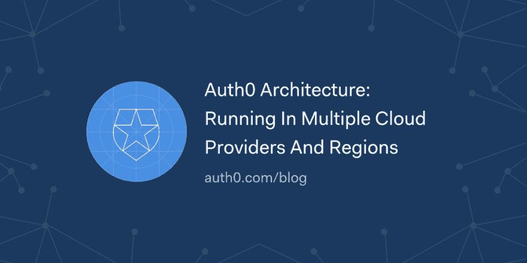

# Auth0 架构:在多个云提供商和地区运行

> 原文：<https://dev.to/auth0/auth0-architecture-running-in-multiple-cloud-providers-and-regions-1l3o>

Auth0 为任何堆栈上的任何类型(移动、web、本机)的应用提供身份验证、授权和单点登录服务。对于绝大多数应用来说，身份认证至关重要。我们从一开始就设计了 Auth0，以便它可以在任何地方运行:在我们的云上，在你的云上，甚至在你自己的私有基础设施上。

在本帖中，我们将更多地讨论我们的公共 SaaS 部署，并简要介绍 Auth0 背后的基础架构以及我们用来保持其高可用性运行的策略。

[读下去🏛](https://auth0.com/blog/auth0-architecture-running-in-multiple-cloud-providers-and-regions/?utm_source=dev&utm_medium=sc&utm_campaign=auth0_architecture)

[T2】](https://res.cloudinary.com/practicaldev/image/fetch/s--2b2nX7OY--/c_limit%2Cf_auto%2Cfl_progressive%2Cq_auto%2Cw_880/https://thepracticaldev.s3.amazonaws.com/i/tdohldz7lox3k7980k7h.png)