# 在 Azure 上使用数据科学虚拟机的自动化开发工作流

> 原文：<https://dev.to/anoff/automated-dev-workflow-for-using-data-science-vm-on-azure-2h55>

*这是从[媒体](https://medium.com/@an0xff/automated-dev-workflow-for-using-data-science-vm-on-azure-13c1a5b56f91)T3 交叉发布的*

*TL；dr；我在 Github 上整理了一堆脚本，让你可以从命令行部署一个 VM，还可以轻松地将代码从本地目录同步到 VM，以便能够使用本地 IDE 和 git，但在强大的远程机器上执行。非常适合基于 jupyter 笔记本电脑的数据科学应用。*

在[我之前的博文](https://dev.to/anoff/deploy-datascience-infrastructure-on-azure-using-terraform-12kl-temp-slug-8098101)中，我解释了如何在[平台](https://www.terraform.io/intro/index.html)部署 [Azure 数据科学虚拟机](https://docs.microsoft.com/en-us/azure/machine-learning/data-science-virtual-machine/overview)。

[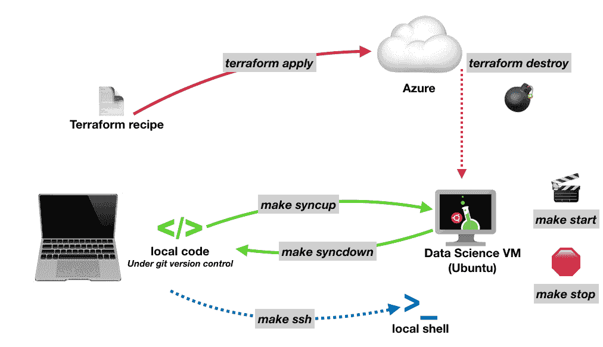](https://cdn-images-1.medium.com/max/1012/1*Bx6KlPw3otLxrY_nYQdAQg.png) 

<figcaption>可用命令概述</figcaption>

### 动机😓

最近我开始做一些#深度学习🔮作为我的 Udacity 人工智能纳米学位的一部分。当我去年在做#deeplearning Nanodegree 的时候，我开始[编写启动/停止 AWS GPU VM](https://github.com/anoff/nd101/blob/master/gan_mnist/Makefile) 的脚本，并四处同步代码。这一次，我想试试蔚蓝色的云。主要是因为我白天的工作让我看到了他们的许多服务，我想更深入地探索 Azure 数据科学产品。更多的是软件开发人员，而不是数据科学家👨‍🔬我经常觉得我在版本控制、测试和开发简易性方面的标准超出了 ML 生态系统默认提供的标准(希望这不会冒犯那里的数据奇才)。我的开发机是一个没有 GPU 支持的小 MacBook。因此，为了训练神经网络，我想得到一个带有 GPU 的虚拟机。Azure 为虚拟机提供了一个[预烘焙的 Ubuntu 映像](https://azure.microsoft.com/en-us/services/virtual-machines/data-science-virtual-machines/)，其中包含所有当今的数据科学工具:Python、Conda、Jupyter、GPU Neuralnet libs 等。

[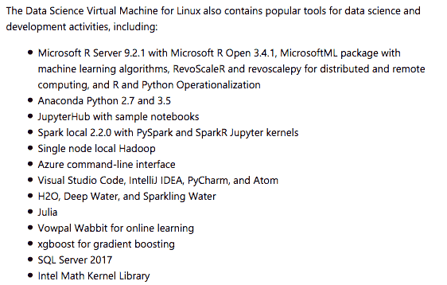](https://cdn-images-1.medium.com/max/562/1*Oau5dKnDt_e7wFfOlX2llA.png) 

<figcaption>顶级特性，参见[此列表](https://docs.microsoft.com/en-us/azure/machine-learning/data-science-virtual-machine/overview)了解 DSVM 上可用的完整堆栈([来源](https://azuremarketplace.microsoft.com/en-us/marketplace/apps/microsoft-ads.linux-data-science-vm-ubuntu) )</figcaption>

有了运行代码的完美目标，我想知道如何让我的本地机器成为我的主要开发机器——这意味着我不想在 VM 上设置 git 来版本化我的代码。这就是我们的朋友 [rsync](https://en.wikipedia.org/wiki/Rsync) 进入🖼.画面的地方它允许您通过 SSH 同步两个目录。

```
rsync [OPTION]... SRC [SRC]... [USER@]HOST::DEST 
```

### 目标🏁

倾向于过度设计🙄我的副业我带着以下目标开始了我的虚拟机工作流自动化之旅:

1.  通过一个我可以在 Github 上发布的模板来部署(和删除)整个虚拟机
2.  从我的命令行启动/停止虚拟机，这样，如果我不需要它，我就不用付费(GPU 虚拟机需要💰💰💰)
3.  使用 jupyter notebook 将我在 VM 上所做的代码更改同步到我的本地机器上，这样我就可以 git commit 了

### 部署基础设施📦

我再次选择 Terraform 来部署虚拟机。正如我在之前的博客中提到的，你也可以使用 Azure 资源管理器模板，但是我个人最喜欢的是 T2 的 Terraform😍。因此，我继续从我以前的发现，建立以下 Terraform 食谱。建议的设置是将脚本放在项目工作目录下的 infra 文件夹中。

[开关/虚拟机自动化](https://github.com/anoff/vm-automation/blob/master/azure_dsvm.tf)

它创造了几种资源:

*   资源组:*Azure 上的逻辑分组，包含*下的所有资源
*   *虚拟网络:嗯..您的资源用于通信的虚拟专用网**
*   网络子网:*您的 VPN 将使用的子网**
*   网络接口:*一个网络接口，这样你的虚拟机就可以绑定虚拟网络*
*   虚拟机:*实际计算资源(将为文件系统生成磁盘资源)*
*   公共 IP 地址:*一个静态 IP，它将使您的虚拟机可以从互联网上访问*
*   本地执行器(空资源):*用于将 VM 创建过程的一些结果写到您的磁盘上*

*如果我没有正确解释，我很抱歉💯%确定我正确理解他们的工作😊

[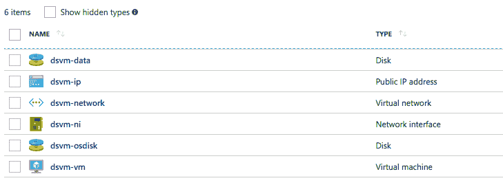](https://cdn-images-1.medium.com/max/729/1*ffSnnPoJkPq2BnXqUfixFQ.png) 

<figcaption>这是被创造的资源</figcaption>

[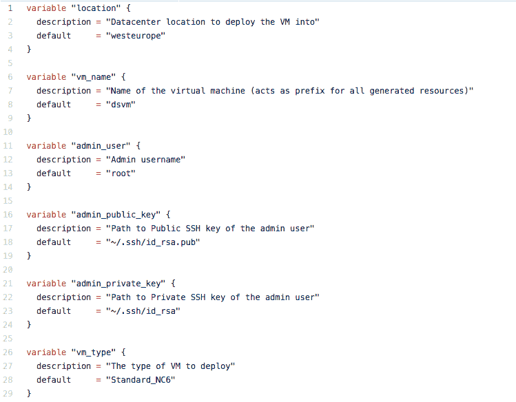](https://cdn-images-1.medium.com/max/749/1*TT4fEhGizjadrx17c0Ynew.png)

<figcaption>terra form 配方中的变量</figcaption>

利用 [Terraform 变量](https://www.terraform.io/docs/configuration/variables.html)可以定制该配方的一些属性。

改变变量值最简单的方法是将所有变量名及其描述保存在`config.auto.tfvars`文件中。

你可以在 Terraform 食谱旁边的 [Github repo](https://github.com/anoff/vm-automation/blob/master/config.auto.tfvars) 中找到它。如您所见，所有变量都有默认值，即使您没有指定。tfvars 属性。您最想修改的是`admin_public_key`和`admin_private_key`

它们是一个 [SSH 密钥对](https://help.github.com/articles/generating-a-new-ssh-key-and-adding-it-to-the-ssh-agent/)，您将在以后连接到虚拟机时使用它进行身份验证。在 Terraform 过程中，公钥将存储在虚拟机上，因此它稍后会将其识别为有效密钥。这个私有密钥将被用来在这个过程的最后 SSH 到机器中，为以后的文件传输准备本地文件系统——也就是创建一个`~/work`目录。您可能还想修改管理员用户名或资源位置。

[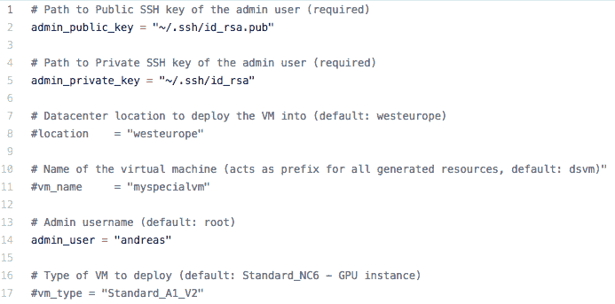](https://cdn-images-1.medium.com/max/693/1*xBors1HBFd35O0ZDrVqnGQ.png)

<figcaption>config . auto . TF vars</figcaption>

#### 签署数据科学虚拟机⚖️的许可条款

您可能会看到以下错误时，试图运行 Terraform 脚本没有阅读到这里。

[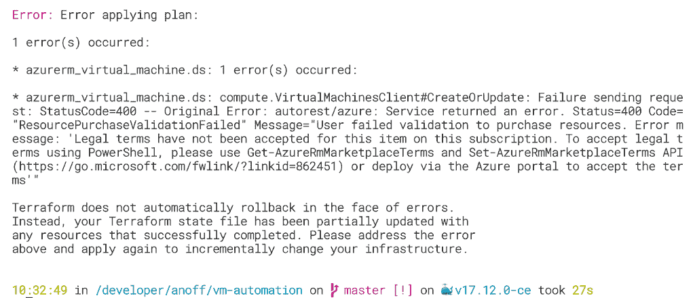](https://cdn-images-1.medium.com/max/1024/0*rBLvs8PYsESCoQM0.) 

<figcaption>由于缺少许可协议导致 Terraform 错误</figcaption>

问题是 DSVM 是通过 Azure market place 发布的，即使它没有在 Azure VM 资源上产生额外的费用，你也需要阅读并同意许可条款。您可以通过 Powershell 按照错误消息中的描述来完成此操作。在这个[自述文件](https://github.com/anoff/vm-automation#sign-the-terms-of-service-%EF%B8%8F)中解释了打开 Powershell 的完整过程。如果您已经打开了 Powershell，简短的版本是运行:

```
# Use this command to view the current license agreement

$ Get-AzureRmMarketplaceTerms -Publisher "microsoft-ads" -Product "linux-data-science-vm-ubuntu" -Name "linuxdsvmubuntu" # If you feel confident to agree to the agreement use the following command to enable the offering for your subscription

$ Get-AzureRmMarketplaceTerms -Publisher "microsoft-ads" -Product "linux-data-science-vm-ubuntu" -Name "linuxdsvmubuntu" | Set-AzureRmMarketplaceTerms -Accept 
```

成功签署许可条款后，您应该在 shell 中看到以下输出

[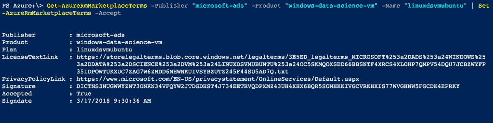T2】](https://cdn-images-1.medium.com/max/1024/0*dJGkO860Y2VCzaDW.png)

#### 运行地形🏃‍♂️

一旦签署了许可条款，你就可以使用`terraform init`初始化 Terraform，然后运行`terraform apply`来调用 azure 上的基础设施资源。完全调配虚拟机可能需要 5~10 分钟。

运行之后，您可能会注意到创建了两个新文件。两者都包含指向创建的虚拟机的链接。`.vm-ip`包含已创建的公共 IP 地址，将用于 SSH 到机器。`.vm-id`是您的虚拟机的 Azure 资源 ID，并且是我们稍后将用于启动/停止该机器的唯一标识符。两者都是纯文本文件，并且只包含一行，请随意查看。机器现在已经启动并运行，你可以使用它了。

### 将代码带到虚拟机上💁‍♀️

在做任何工作之前，你可能想上传一些引导代码到虚拟机上——或者你只是想在那里运行一个现有的 jupyter 笔记本。同样，Github 存储库中有一个小脚本可以帮助你做到这一点(在 Mac/Unix 机器上开箱即用，否则你需要先安装 make 和 rsync)。

[开关/虚拟机自动化](https://github.com/anoff/vm-automation/blob/master/Makefile)

将`Makefile`放入代码的工作目录，并确保将路径定义更新到上一章末尾提到的两个文件，这两个文件包含了新创建的虚拟机的详细信息。如果您将 Terraform 脚本放在名为 infra 的子文件夹中，则无需执行任何操作。否则，您应该将这两个文件复制到这样的目录中，或者修改 Makefile 中的路径定义。

使用工作目录(放置 Makefile 的地方)中的`make syncup`将本地目录内容同步到远程机器上。您可以看到正在执行的命令以及远程目录的名称。在我的情况下，它是~/work/AIND-RNN，这是我的一个纳米学位项目。您还可以看到，该命令自动忽略了在您的`.gitignore`中定义的所有文件，这意味着您不想版本化的任何内容也不会被复制。这对于在神经网络训练过程中创建的工件尤其有用。

[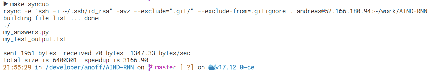](https://cdn-images-1.medium.com/max/865/1*Dq4e1DsOEc8LIQv8iMR2UQ.png)

<figcaption>make syncup 的输出</figcaption>

### 运行 Jupyter 笔记本📒

让我们假设您的项目还包含一个 Jupyter 笔记本，您希望在远程机器上执行并从本地浏览器访问它。您也可以使用类似的过程在远程机器上执行任何类型的脚本。

首先，您需要使用`make ssh`SSH 进入机器，这也将为本地机器上的 Jupyter 端口 **8888** 进行端口转发，以便您可以在本地浏览器(我的 MacBook)中打开 [http://localhost:8888](http://localhost:8888) ,并连接到在虚拟机(Jupyter 笔记本)上监听该端口的 web 服务器。现在，您已经有了一个运行在 DSVM 上的 shell，可以操作文件系统，通过 pip/conda 安装缺失的包，或者只是启动一个进程。

[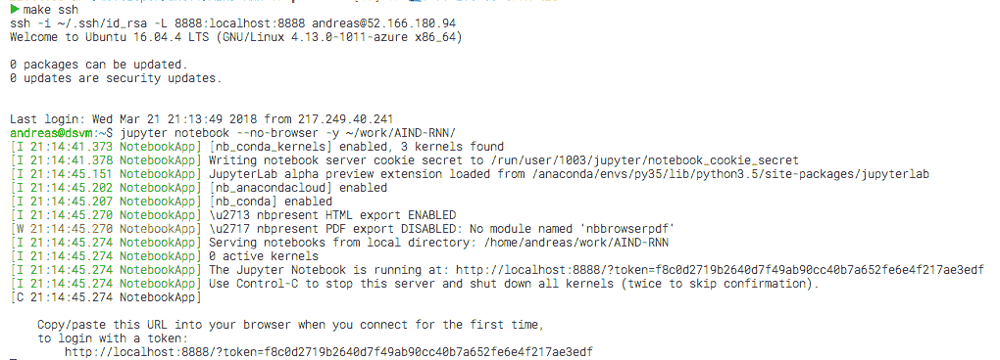](https://cdn-images-1.medium.com/max/1020/1*yTi-8TPBnLCdysDuJT3Yaw.png) 

<figcaption>首发虚拟机上的 jupyter 笔记本</figcaption>

上面开始的 Jupyter notebook 过程与我们用 SSH 连接打开的交互式 shell 的生命周期相关联。关闭 SSH 连接也会杀死 Jupyter 服务器。由于 Jupyter 会定期保存到磁盘，所以你的所有代码应该还在，但是你的 python 内核将会消失，所有的内存对象(笔记本执行的状态)也将丢失。在您再次进入机器并启动 Jupyter up 之后，您将需要从头再次执行笔记本。

### 提交您的更改💾

在您做了一些更改之后，您想要像一个优秀的开发人员一样提交，您需要将您在虚拟机上做的这些更改应用到您的本地开发环境中。您可以使用 make syncdown 来做到这一点，它会将所有更改过的远程文件复制到您的本地工作目录中——同样只复制那些受 git 版本控制的文件。

> _🚨_ 确保您首先退出 SSH 连接

[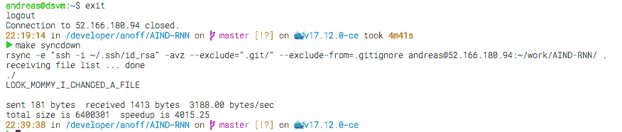](https://cdn-images-1.medium.com/max/876/1*d9lbCykuPCtKQhe1sDdsBw.png) 

<figcaption>将远程更改复制到本地文件系统</figcaption>

远程文件`LOOK_MOMMY_I_CHANGED_A_FILE`现在已经被复制到我的本地工作目录，我可以使用 git commit -am“每个人都使用有意义的提交消息，对吗？”要提交我的更改或使用我的本地工具来执行单元测试，检查 codestyle，添加一些注释…

### 启动和停止虚拟机🎬 🛑

如果您还没有查看，您应该查看一下您所调配的虚拟机的实际成本。 **Standard_NC6** (这是最便宜的 GPU 实例)如果你让它运行一个月的话，会花掉你一个小假期。这就是为什么我想要一种简单的方法，当我不需要它时停止它，如果我想继续工作，就快速恢复它。

[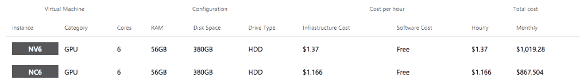T2】](https://cdn-images-1.medium.com/max/1024/1*l5o4sU8CQMVF29JDpviaNA.png)

Makefile 附带了三个命令来管理虚拟机本身的状态。它们都需要位于。vm-id 以在您的 Azure 订阅中选择正确的 vm:

`make stop`将停止停止虚拟机*和*释放资源，这将大大降低成本，因为您只需为保存数据的磁盘付费。

告诉 Azure 分配新资源并再次生成虚拟机

`make status`将告诉您虚拟机是否已启动

[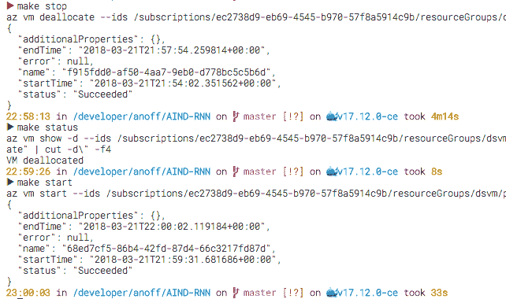](https://cdn-images-1.medium.com/max/642/1*fWfS39LrqSt3BVnjTVdk-Q.png) 

<figcaption>虚拟机启动/状态/停止</figcaption>

该屏幕截图显示了停止和启动虚拟机可能需要多长时间。然而，当你看到命令行界面显示正在运行时，你可以关闭你的本地机器，因为 Azure 开始释放你的资源。

#### 降低破产风险💸

如果你担心如果你错过停止虚拟机，账单可能会飞来，你应该仔细看看 Azure 为你提供的**自动关机**功能。它允许您指定虚拟机每天自动关闭的时间。

[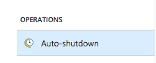T2】](https://cdn-images-1.medium.com/max/224/1*eCQ-Uvq0dzVIK8EiqdtFvQ.png)

[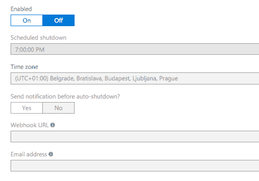](https://cdn-images-1.medium.com/max/514/1*q7Mp8WkWI_0rtsKkMAQIUw.png) 

<figcaption>虚拟机自动关机</figcaption>

> 但是让我以我的经验告诉你——如果你不小心坚持了一个周末，然后在下一周看到账单，你将会从那时起“永远”关机。这实际上是我想让这个工作流程尽可能简单的原因之一。

### 总结📚

我希望你喜欢这篇文章，并找到一些有用的提示。一般工作流程也可以用 AWS 机器完成，但 Terraform 模板看起来会有所不同。请随时向我的回购提交 PR，我会添加选项，也使用 AWS 资源。

[开关/虚拟机自动化](https://github.com/anoff/vm-automation)

我很乐意通过[问题](https://github.com/anoff/vm-automation/issues/new)、[推特听到反馈🐦](https://twitter.com/an0xff)或者评论。*我的一个想法是将所有的命令捆绑到一个二进制命令行界面中，这样它就可以跨平台工作，并且只需复制一个文件就可以安装。如果你感兴趣，请告诉我*😻

这里是另一个看看所有的命令，你可以 use🧙‍♀️

[](https://cdn-images-1.medium.com/max/1012/1*Bx6KlPw3otLxrY_nYQdAQg.png) 

<figcaption>可用命令</figcaption>

/安德烈亚斯