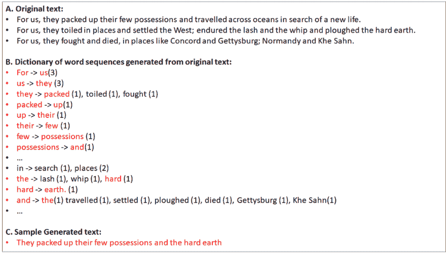
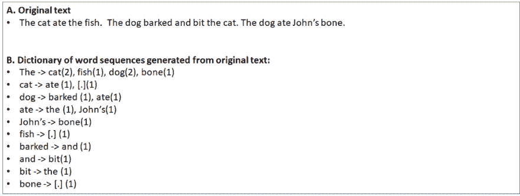
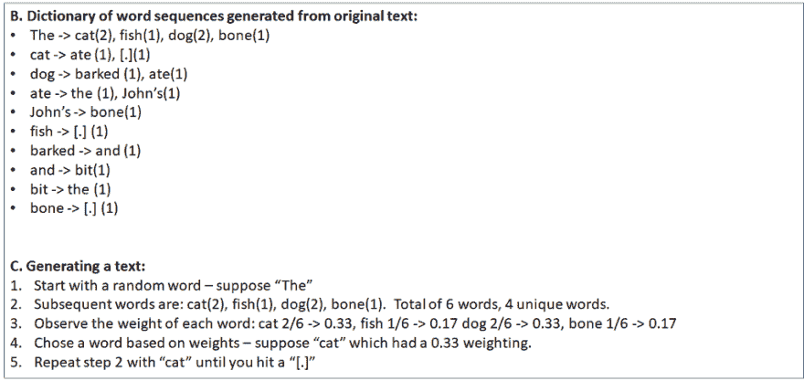

# 使用马尔可夫链的自动文本生成器

> 原文：<https://dev.to/pubs12/automated-text-generator-using-markov-chain-2ge2>

#### 参考提供的代码，查看该算法如何工作的分步指南。

 

<figcaption>照片由[托马斯·列斐伏尔](https://unsplash.com/photos/gp8BLyaTaA0?utm_source=unsplash&utm_medium=referral&utm_content=creditCopyText)于 [Unsplash](https://unsplash.com/search/photos/code?utm_source=unsplash&utm_medium=referral&utm_content=creditCopyText)</figcaption>

让计算机生成的文本模仿人类的语言是很有趣的，实际上并不难达到有时令人信服，但肯定很有趣的效果。马尔可夫链是做到这一点的一种方法。它的工作原理是基于历史文本生成新文本，其中相邻单词(或词组)的原始序列用于生成有意义的句子。

真正有趣的是，你可以获取一个人的历史文本，然后生成新的句子，这些句子听起来和那个人说话的方式相似。或者，您可以将两个不同人的文本组合在一起，得到一个混合的“声音”。

我用两位伟大总统的演讲文本来处理这个问题:

<figcaption>screentv.com</figcaption>

对[的礼遇形象](http://screenertv.com/news-features/president-bartlet-to-president-obama-make-romney-your-cabana-boy-in-new-york/)

我的马尔可夫链使用奥巴马演讲的文本和 [Bartlet](https://www.imdb.com/title/tt0200276/) 脚本的组合“训练”出来的结果如下:

*   我能烧死北卡罗来纳州的母亲吗？因为她给了我们一个美好的夜晚。
*   因此，展望未来，我相信我们可以在他们的教堂里制造一枚炸弹。
*   “查理，每次我进来时，我父亲都是在情况室里长大的。''
*   这场运动必须是弹道式的。,

#### 什么是文本生成上下文中的马尔可夫链？

对于更技术性的解释，我认为你可以在那里找到大量的资源。简而言之，它是一种算法，用于从基于历史文本的加权单词列表中生成新的结果。这很抽象。更实际地说，在文本生成的场景中，这是一种使用历史文本的方法，将它分割成单个单词(或单词集)，然后随机选择一个给定的单词，然后基于历史序列随机选择下一个可能的单词。例如:

 括号中的数字表示该词在原词中的出现次数。

这不仅适用于文本(虽然最流行的应用之一是在智能手机上，那里有预测文本)，它可以用于任何使用历史信息来定义给定状态的后续步骤的场景。例如，您可以对给定的股票市场模式进行编码(例如过去 30 天的每日变化百分比)，然后使用它来查看历史上第二天可能的结果(仅作为示例..我很怀疑会有多大效果)。

#### 他们为什么这么好玩？

我一直想建立一个文本生成器，因为这是一个很棒的方式，可以看到你如何使用一个非常便宜的快捷方式来模仿智能。你会看到下面的算法，超级简单。另一个事实是，就像上面的例子一样，你可以用它来混合来自两个不同人的“声音”,然后看看结果。

#### 它是如何工作的？

使用马尔可夫链生成文本有两个阶段。首先是“字典构建阶段”,它包括收集历史文本，然后生成一个字典，其中的关键字是句子中的给定单词，然后得到的结果是自然的后续单词。

 

<figcaption>在这里你可以看到原来的句子被分解成单词，而后面包含的单词用一个计数器来表示出现的次数。请注意，句号也包括在内。</figcaption>

第二个是执行，你从一个给定的单词开始，然后用这个单词以概率的方式来看下一个单词会是什么。例如:

 

<figcaption>遍历字典生成文本</figcaption>

现在，有一些你需要注意的技巧(我是通过艰苦的努力才发现的):

*   你不能从任何一个随机的单词开始——如果你这样做了，你会得到这样的句子:“**吃了猫。”**。你必须记录“起始词”来简化事情——因此你可以有:**“约翰**吃了猫”**。**
*   不要忽略标点符号——如果你去掉标点符号，你会得到这样的句子:“**狗对着约翰猫吠叫”**。相反，把它们留在那里，这样你就有更好的机会说出一个更现实的句子——例如，“狗对着**约翰的**ca**吠叫”**
***   以句号结尾。当你从头到尾从一个单词开始，然后找到下一个单词，然后找到下一个单词，以此类推，你可以继续，直到你达到指定的长度，但然后你会在句子中间停止，比如这样:"**猫吃了约翰的"**"。相反，当你有一个有句号的单词时，简单地结束(另一个不删除标点的原因)——例如，“猫吃了约翰的**靴子”。****

 **#### 源文本

我尝试了不同的文本，包括:艾迪·墨菲的单口相声、唐纳德·特朗普的推文、奥巴马的演讲和杰德·巴特利特的对话。你可以在这里找到所有的[。使用一个源然后生成字典是很好的，但是你可以混合搭配使用两个源(例如，Obama 和 Bartlet ),然后创建一个字典文件。然后当你遍历字典，你会得到两种声音。](https://github.com/pub12/MarkovText)

确保你能平衡文本是很重要的——例如，如果你有 8000 条来自奥巴马的文本，而只有 1000 条来自艾迪·墨菲的文本，很可能你会看到更多奥巴马的话。当然，当您构建字典时，您也可以向较轻的文本源添加一些人工权重来平衡。

#### 结论

它并不完美——当你创建自己的文本时，你会发现有些文本只是胡言乱语。文本越多越好。其次，在字典中使用单个单词是没有帮助的——你应该使用 2-3 个单词的组合。实际数量取决于你有多少历史文本。

你可以在这里找到所有的代码和源代码。祝你好运！

*感谢阅读！如果你喜欢你所读的，给下面的* ***鼓掌*** *这样其他人也可以找到这个(你也可以在*[*Twitter*](http://www.twitter.com/pubs12)_)_

* * ***