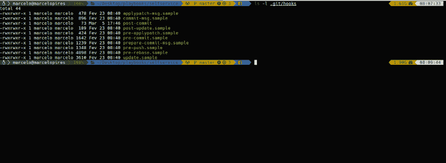

# 使用 git 的自动变更日志

> 原文：<https://dev.to/marcpires/automatic-changelog-with-git-325c>

**带 git 的自动变更日志**

这是一个简单的技巧，告诉你如何使用 git 为你的项目生成自动的变更日志。

**了解你的钩子**

对于从来不敢接触。git 文件夹中，驻留着*钩子*文件夹。在这个文件夹中，你会发现一系列可以被激活的脚本，它们将在 git 操作上运行，让我们来看看。

<figure> 

<figcaption>的内容。git/hooks 子文件夹</figcaption>

</figure>

如上图所示，我们可以激活一堆*挂钩*。这里有一些:

**预推送**:顾名思义，它总是在推送之前运行。例如，您可以使用这个钩子在将代码发送到远程之前运行所有的测试。

**预提交**:在提交之前运行

**变更日志挂钩**

知道了，我们就开门见山吧。

首先在。git/hooks 文件夹。我的提交后文件的内容如下。