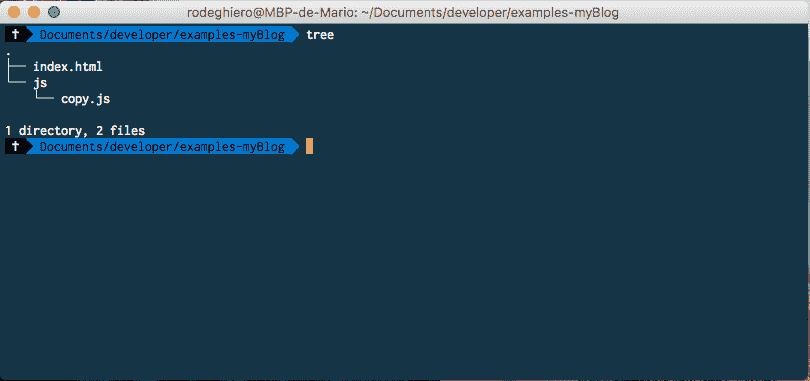

# 自动版权

> 原文：<https://dev.to/mariorodeghiero/automatic-copyright-25j4>

## 文件结构

如果有人对所用的文件结构有疑问，它将遵循应用于计算机终端的“tree”命令的输出。

[T2】](https://res.cloudinary.com/practicaldev/image/fetch/s--AfcpinEA--/c_limit%2Cf_auto%2Cfl_progressive%2Cq_auto%2Cw_880/https://thepracticaldev.s3.amazonaws.com/i/fr138x1bdk8jnb1sn84h.png)

## HTML 代码

为了显示版权，我在根文件夹(examples-myBlog)中创建了一个名为“index.html”的文件，就在“body”标记的下面，创建了“footer”标记并插入了 id =“copy”，所以让我们能够在 javascript 代码中使用 id。为了调用我们的 javascript 文件，我们创建“script”标签并插入 src = "js / copy.js "。

```
<html>
  <body>

    <footer id="copy"></footer>

    <script src="js/copy.js"><script>
  </body>
</html> 
```

Enter fullscreen mode Exit fullscreen mode

## JS 代码

javascript 代码中要做的第一件事是创建一个新的“date()”对象，并将其存储在“Date”变量中。我们这样做是因为“Date()”返回给我们一个非常完整的信息，大概是这样的:“Mon Oct 09 2017 15:27:03 GMT-0300(-03)”。因为我们希望在版权中只显示年份，所以我们将创建变量“year”来只获取对象的年份，并传递“date.getFullYear()”。现在让我们做一些基本的工作，我们将使用 id = "copy "获取元素，然后使用" innerHTML "在示例页面上显示年份。

```
let date = new Date();
let year = date.getFullYear();

let copyRight = document.getElementById('copy');
copyRight.innerHTML = 'Copyright ©'+ year; 
```

Enter fullscreen mode Exit fullscreen mode

当我用葡萄牙语写文章时，这篇文章第一次出现在我的博客上，你可以访问这个链接。如果你想在社交网络上关注我，这是我的[推特](https://twitter.com/rodeghiero_)。

谢谢！！