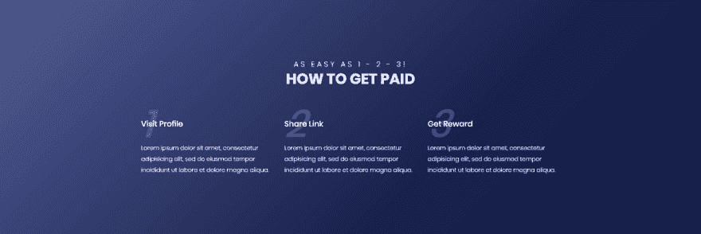

# 在 CSS 中使用自动计数器

> 原文：<https://dev.to/ojanti/automatic-counters-in-css-pc0>

最初发布在[我的博客](http://ojanti.com/blog/Build-a-lightweight-Internet-Detect-Feature-with-VanilaJS)上。

如果你想在你的 HTML/CSS/JS 界面中添加一个自动计数组件，你可能会使用一个(重样式的)编号列表或者 javascript 计数器，它们将被插入/更新到 DOM 中。这些选项存在一些问题。

虽然第一种可能适合简单的场景，但在更复杂的情况下就不太适合了，比如当您希望计数器显示在界面上彼此相距较远的部分，或者您希望在计数器周围创建具有多个元素的复杂样式时。很有选择性。第二种选择应该被简单地“避免”,因为使用 CSS 而不是等效的 Javascript (JS)进行尽可能多的设计和渲染操作通常被认为是最佳实践。原因是 CSS 操作在性能上比 JS 操作更好。CSS 不像 JS 那样需要太多的内存和开销来渲染。

所以回到正题。如何在我们的 HTML/CSS/JS 工作中创建一个自动计数器/计数组件？

> CSS 有一个内置的计数机制，就像在大多数编程语言中使用变量作为计数器一样。

我们将需要以下 CSS 属性来在我们的界面中设置和使用计数器。

*   `counter-reset` -创建新的计数器变量或重置现有的计数器变量
*   `counter-increment` -递增计数器值
*   `content` -这是指通常的 CSS 内容，它将用于包含我们生成的计数器和任何其他准备好的信息
*   `counter()`或`counters()`函数——插入在调用元素时创建的任何计数器变量的值。

让我们用一个基本的例子来了解它是如何工作的。
[https://codepen.io/ojanti/embed/oGoaqz/?default-tab=html,result&amp;embed-version=2%20?height=500&default-tab=result&embed-version=2](https://codepen.io/ojanti/embed/oGoaqz/?default-tab=html,result&amp;embed-version=2%20?height=500&default-tab=result&embed-version=2)
如果你注意到的话，单词*数字*在每一次使用中都会出现。我们可以将它移到内容规则中，像
[https://codepen.io/ojanti/embed/YrEJGG/?default-tab=html,result&amp;embed-version=2%20?height=500&default-tab=result&embed-version=2](https://codepen.io/ojanti/embed/YrEJGG/?default-tab=html,result&amp;embed-version=2%20?height=500&default-tab=result&embed-version=2)
那样构建它。现在让我们来看一个例子，在 DOM 中的任意点使用 2 个计数器，然后重置。它跟踪增量值。
[https://codepen.io/ojanti/embed/ZXaqdE/?default-tab=html,result&amp;embed-version=2%20?height=500&default-tab=result&embed-version=2](https://codepen.io/ojanti/embed/ZXaqdE/?default-tab=html,result&amp;embed-version=2%20?height=500&default-tab=result&embed-version=2)
现在让我们来处理一些更高级更实用的东西。这里有一个来自 w3 schools 的例子，它展示了一个真实的场景，你可以考虑使用 CSS 计数器。
[https://codepen.io/ojanti/embed/QqOYgB/?default-tab=html,result&amp;embed-version=2%20?height=500&default-tab=result&embed-version=2](https://codepen.io/ojanti/embed/QqOYgB/?default-tab=html,result&amp;embed-version=2%20?height=500&default-tab=result&embed-version=2)
现在到我最喜欢的部分。这在设计中有多大用处。你可以使用 css 计数器来创建漂亮的组件，就像我创建的这个。

[T2】](https://res.cloudinary.com/practicaldev/image/fetch/s--0OU6IxJy--/c_limit%2Cf_auto%2Cfl_progressive%2Cq_auto%2Cw_880/http://ojanti.com/assets/img/uploads/css_counters_example.jpg)

任何有经验的(或成长中的)UI 架构师都知道，保持界面的标记代码尽可能干净是最佳实践。在上面的例子中使用 CSS 计数器更有意义，因为；

*   您不必在 HTML 标记中包含这些数字并手动跟踪它们
*   你不必弄清楚如何对有序列表进行大规模样式化
*   而且不用用 Javascript 来插入和更新数字(乱七八糟乱七八糟)

如果你是一名设计师，我肯定你能看到可能性。

*PS:*

1.  如果你担心兼容性，IE8 支持这一点。你只需要指定一个！DOCTYPE。
2.  我不太确定为什么，但是每个元素只能创建/重置一个计数器。你不能这样做:

```
.animal_story{
    counter-reset: cat_number;
    counter-reset: dog_number;
} 
```

在推特上关注我