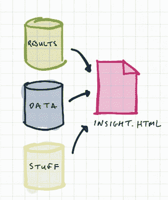
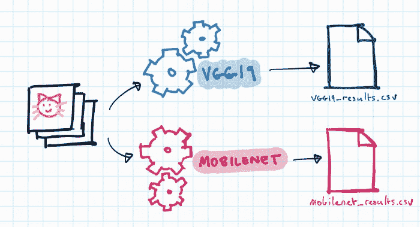
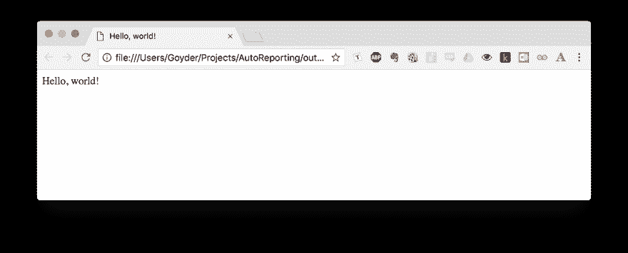
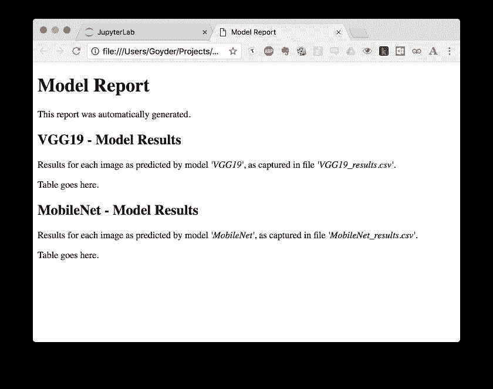
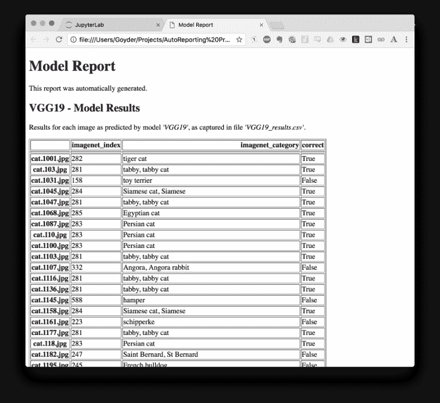
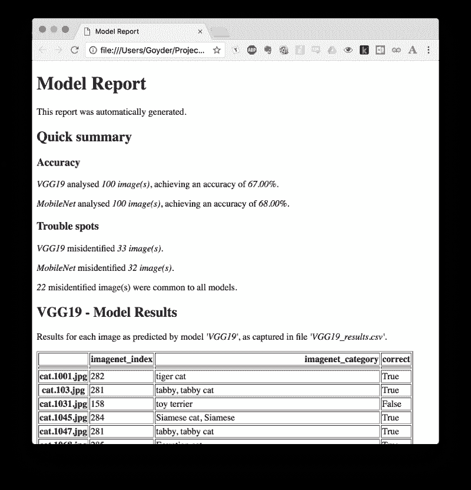

# Python 中的自动报告——第 2 部分:从 Hello World 到 Real Insights

> 原文：<https://dev.to/goyder/automatic-reporting-in-python---part-2-from-hello-world-to-real-insights-8p3>

正如我在上一篇文章中概述的[，这个项目的目标是制作一个自动报告工具。](https://dev.to/goyder/automatic-reporting-in-python---part-1-from-planning-to-hello-world-32n1)

在本指南中，我追求的结果是一个单一的 HTML 页面，它允许我询问和比较机器学习模型的输出。

[T2】](https://res.cloudinary.com/practicaldev/image/fetch/s--fEW8RSgX--/c_limit%2Cf_auto%2Cfl_progressive%2Cq_auto%2Cw_880/https://thepracticaldev.s3.amazonaws.com/i/ae8kwaytszwzmznkkmmn.png)

在前一个教程的[结束时，我们已经开始“你好，世界！”舞台。一些非常基本的内容可以被输入到我们非常基本的结构中——但是现在是时候添加一些真正的特性了。](https://dev.to/goyder/automatic-reporting-in-python---part-1-from-planning-to-hello-world-32n1)

### 关于教程和设计选择的说明

我不仅仅是提供一堆有用的代码，我更愿意一步一步地逐步完成开发。

就我个人而言，我一直认为这类教程更有效，因为:

*   它让我们了解其他人是如何解决问题的
*   它实际上反映了我是如何编码的——一个特性接一个特性，一次次提交。

当我对编程完全陌生时，我从大量的教程开始工作。大多数教程的结构给你的印象是，有且只有一种方法可以实现教程设定的目标——不可否认，有时确实有，这取决于教程的定位和技术性。

但是我经常发现，任何编程工作，即使是非常小的工作，从一开始就需要在解决方案的实现中做出选择和权衡。这应该是函数还是类？我是导入一个库还是自己开发一个库？我应该使用字典还是列表？这些选择会产生什么样的流动效应？

[T2】](https://res.cloudinary.com/practicaldev/image/fetch/s--7Ayk0lSZ--/c_limit%2Cf_auto%2Cfl_progressive%2Cq_auto%2Cw_880/https://thepracticaldev.s3.amazonaws.com/i/pd0quc5sgv8z625fqwg4.png)

### 简化事情的一种方法:标记你的假设

很明显，这个挑战没有简单的解决方案。然而，让理解过程变得更容易的一个方法是明确支撑你的项目的假设。

例如，在这个项目中:

*   我是这些报告的唯一消费者，因此；
*   我的用户(我！)不会有敌意
*   需要最少的错误检查，因为我可以自己询问和排除故障
*   互联网连接可用
*   不要求可移植性

其中大部分都是简化的假设，用来明确我的解决方案需要多彻底或多复杂。当然，一旦您开始考虑向他人提供您的代码，或者在企业环境中，或者如果需要更高程度的自动化，游戏可能会发生重大变化！

它让这个工具将存在的生态系统变得更加清晰。当我陷入困境，不知道该何去何从时，我会回头参考这些假设，看看我是否在什么地方没有回答自己的问题。

* * *

## 第三步——生成一些要处理的数据

正如本帖的[第 1 部分所提到的，这个工具有许多来自机器学习领域的用例。](https://dev.to/goyder/automatic-reporting-in-python---part-1-from-planning-to-hello-world-32n1)

在这种情况下，我们将考虑以下场景:

*   我们有一个现有的基线模型来确定一个图像是否包含一只**猫**。
*   我们定期开发执行相同任务的新模型。这些模型可能是也可能不是你的基线模型的改进。
*   每当我们开发一个新的模型，我们就在一组现有的数据上运行它，并获取输出。在这种情况下，输出是模型认为每个图像中的内容。

因此，能够方便地:

1.  自动检查这些输出，并获得新模型的状态报告。
2.  自动比较这些模型的性能。一个比另一个强在哪里？有没有两个人都纠结的画面？

出于这项研究的目的，我们将评估两个模型在检测图像中的猫方面的性能。 [**VGG19**](https://arxiv.org/abs/1409.1556) ，第一个模型，是一个备受推崇的重要的图像分类器。 [**MobileNet**](https://arxiv.org/abs/1704.04861) 是一个明显更轻量级的架构(例如，运行速度大约比 VGG19 快 6 倍)，但精确度有所降低。

使用这些模型生成的数据可以在单独的回购协议下找到，[在这里可用](https://github.com/goyder/dataset_generation)。虽然生成这些数据的过程有点超出了本文的讨论范围，但最终结果是我们有两个数据集可以使用——`VGG19_results.csv`和`MobileNet_results.csv`——每个都存储为 [CSV 文件](https://en.wikipedia.org/wiki/Comma-separated_values)。

[T2】](https://res.cloudinary.com/practicaldev/image/fetch/s--2mXou_S---/c_limit%2Cf_auto%2Cfl_progressive%2Cq_auto%2Cw_880/https://thepracticaldev.s3.amazonaws.com/i/bspnb7m7jo8jqcm7pc4b.png)

对于数据集中的每个图像，我们都有一列用于预测的 ImageNet 类别 ID ( `imagenet_index`)、类别的文本描述(`imagenet_category`)以及它是否对应于一只家猫(`correct`)。

* * *

## 第四步——建立一个放东西的结构

好吧——在我们离题之后——回到记者身上。当我们停下来的时候，我们让记者处于一个功能正常但毫无特色的状态:

[T2】](https://res.cloudinary.com/practicaldev/image/fetch/s--7l6kQV9R--/c_limit%2Cf_auto%2Cfl_progressive%2Cq_auto%2Cw_880/https://thepracticaldev.s3.amazonaws.com/i/jmubbdsddqgrnm4opkpl.png)

让我们进行下一步，向报告添加一个基本结构，我们可以用更多的内容部分填充它。首先，我们将更新`report.html`。我们将做一些小的调整，比如指定一个要输入的实际的`title`点，并添加一个简短的序言，但是真正有趣的部分在下面:

**`report.html`**T3】

```
<!DOCTYPE html>
<html lang="en">
<head>
    <meta charset="UTF-8">
    {{ title }}
</head>
<body>
<h1>{{ title }}</h1>
<p>This report was automatically generated.</p>

    {{ section }}

</body>
</html> 
```

Enter fullscreen mode Exit fullscreen mode

我们只能在模板中插入文本块——Jinja 允许控制流结构！在这种情况下，我们将输入一些可迭代变量`sections`——注意复数形式——然后我们将在其中发布每个`section`对象。

但是我们在这些部分中包括什么呢？作为第一次运行，我们可以为每个模型生成一个部分，显示关于模型输出的简短信息，然后显示结果。让我们创建一个新模板，`table_section.html`，
，我们将使用它来呈现这些信息。

**`table_section.html`**T3】

```
<h2>{{ model }} - Model Results</h2>
<p>Results for each image as predicted by model <i>'{{ model }}'</i>, as captured in file <i>'{{ dataset }}'</i>.</p>
{{ table }} 
```

Enter fullscreen mode Exit fullscreen mode

又好又简单——这给了我们所需要的所有结构。

在我们开始将表格插入文档之前，让我们看看如果我们用一些虚拟数据填充它会得到什么。我们将把`autoreporting.py`更新为 a)引用更新后的`report.html`模板中新更新的术语，b)渲染并输入一些`sections`，这样我们就可以检查新模板了。

**`autoreporting.py`**T3】

```
from jinja2 import FileSystemLoader, Environment

# Configure Jinja and ready the loader env = Environment(
    loader=FileSystemLoader(searchpath="templates")
)

# Assemble the templates we'll use base_template = env.get_template("report.html")
table_section_template = env.get_template("table_section.html")

# Content to be published title = "Model Report"
sections = list()
sections.append(table_section_template.render(
    model="VGG19",
    dataset="VGG19_results.csv",
    table="Table goes here."
))
sections.append(table_section_template.render(
    model="MobileNet",
    dataset="MobileNet_results.csv",
    table="Table goes here."
))

def main():
    """
    Entry point for the script.
    Render a template and write it to file.
    :return:
    """
    with open("outputs/report.html", "w") as f:
        f.write(base_template.render(
            title=title,
            sections=sections
        ))

if __name__ == "__main__":
    main() 
```

Enter fullscreen mode Exit fullscreen mode

当我们运行这个脚本时，我们用`table_section.html`模板渲染的两个部分将一个接一个地包含在我们的报告中。

[T2】](https://res.cloudinary.com/practicaldev/image/fetch/s--go0NUQFZ--/c_limit%2Cf_auto%2Cfl_progressive%2Cq_auto%2Cw_880/https://thepracticaldev.s3.amazonaws.com/i/mum6sae6cuaoybncgmtr.png)

在这里，我们只有两个部分，它们是同一类型的——但是我们可以想象，将更多的模型串在一起，或者生成比较模型之间性能的块，只是给出一些例子，这是没有关系的。

### GitHub 状态

在这一点上，您的项目将看起来类似于 [this](https://github.com/goyder/autoreporting/tree/9ded9bf1867ba6e8149591d34a1525589f0d785e) 。

* * *

## 第五步——将表格插入文档

是时候将我们的表格提取并插入到报告中了。

我建议的基本方法是使用 [*熊猫*](https://pandas.pydata.org/) 作为 DataFrame 对象读入`.csv`文件(熊猫*的工作类)。从这个 DataFrame 对象中，我们可以使用`to_html`方法将其导出为 HTML。因此，我们修改后的`autoreporting.py`如下所示:*

 ***`autoreporting.py`**T3】

```
import pandas as pd
from jinja2 import FileSystemLoader, Environment

# Allow for very wide columns - otherwise columns are spaced and ellipse'd pd.set_option("display.max_colwidth", 200)

def csv_to_html(filepath):
    """
    Open a .csv file and return it in HTML format.
    :param filepath: Filepath to a .csv file to be read.
    :return: String of HTML to be published.
    """
    df = pd.read_csv(filepath, index_col=0)
    html = df.to_html()
    return html

# Configure Jinja and ready the loader env = Environment(
    loader=FileSystemLoader(searchpath="templates")
)

# Assemble the templates we'll use base_template = env.get_template("report.html")
table_section_template = env.get_template("table_section.html")

def main():
    """
    Entry point for the script.
    Render a template and write it to file.
    :return:
    """

    # Content to be published
    title = "Model Report"
    sections = list()
    sections.append(table_section_template.render(
        model="VGG19",
        dataset="VGG19_results.csv",
        table=csv_to_html("datasets/VGG19_results.csv")
    ))
    sections.append(table_section_template.render(
        model="MobileNet",
        dataset="MobileNet_results.csv",
        table=csv_to_html("datasets/MobileNet_results.csv")
    ))

    with open("outputs/report.html", "w") as f:
            f.write(base_template.render(
                title=title,
                sections=sections
            ))

if __name__ == "__main__":
    main() 
```

Enter fullscreen mode Exit fullscreen mode

这里最让我吃惊的是，对于一个剧本来说，这开始变得相当复杂。为了让事情变得简单明了，我采用了以下粗略的订购流程:

1.  开始导入
2.  运行所需的任何配置代码
3.  定义任何需要的功能
4.  运行任何独立代码
5.  `main()`函数，并在脚本结束时调用运行它。

这就提出了一个问题:什么应该是独立的，什么应该放在`main()`里？根据经验，我们只希望在显式运行脚本时执行的代码放在`main()`中；我们可能想在别处使用的代码(如类、定义、对象)放在主体中，可以在别处导入。你可以找到很多关于这个功能的解释，但是我发现[这个](https://stackoverflow.com/a/22493194)是对这个概念的彻底讨论。

以上其他一些小问题:

*   请注意在脚本开始时通过`set_option`为`pandas`加宽`max_colwidth`设置的调用。如果没有这个，`pandas`会在任何一列超过 50 个字符时自动应用一些有趣的格式。增加`max_colwidth`是一个只有通过痛苦的经历才学会的技巧。
*   还有我们称之为`table_section_template.render()`的重复——注意，同一个文件的文件名手动输入两次，违反了[不要重复自己](https://en.wikipedia.org/wiki/Don%27t_repeat_yourself)的原则。这样做值得吗？文件名会自动从文件路径中分离出来。

有了这个实现，我们可以重新运行脚本，瞧，表！

[T2】](https://res.cloudinary.com/practicaldev/image/fetch/s--Rx-a_4oz--/c_limit%2Cf_auto%2Cfl_progressive%2Cq_auto%2Cw_880/https://thepracticaldev.s3.amazonaws.com/i/8w06zeswd5vcs1z1zdvg.png)

### GitHub 状态

如果你在家玩，你的项目将类似于[这个](https://github.com/goyder/autoreporting/tree/f64e986b0775df694b3969a7271b9b1c9814b613)。

* * *

## 步骤六——包括总结和比较

我们展示了原始数据，但我们还没有真正回答我们的关键问题:哪种模型性能更好？使用我们基于“部分”的方法，让我们开发一个新的“总结”部分。

比较模型时经常想到的两个问题是:

*   每个模型有多精确？
*   在这个例子中，有没有模型不准确的模式，有没有所有模型都出错的图像？

这不仅仅是简单地*显示*原始数据:相反，我们开始做出推论和总结，这标志着代码复杂性的显著增加。我发现如果我不小心的话，这种情况会导致一种[分析瘫痪](https://en.wikipedia.org/wiki/Analysis_paralysis):我可能会花太多时间去思考如何最好地处理问题，以确保解决方案简洁优雅。我可以直接进入代码吗？我要写一个新模板吗？我如何知道现在存在的代码是欠火还是过火？

关注这个过程的一个方法是非常清楚地阐明我们的最终目标，让我们专注于找出最有效的方法。因此，在直接回到 Python 脚本之前，我花了五分钟写下我希望这一部分如何阅读，并选定了一些我喜欢的明确短语。在一些涂鸦之后，我最终有了这个目标:

**T2`Summary block prototype`**

> ## 快速汇总
> 
> ### 准确度
> 
> **模型 1** 分析了 **100 张**图像，达到了 **97.2%** 的准确率。
> 
> **模型 2** 分析了 **100 张**图像，达到了 **94.2%** 的准确率。
> 
> ### 麻烦点
> 
> **模型 1** 识别错误 **10 张图片**。
> 
> **模型 2** 识别错误 **12 张图片**。
> 
> 8 张图片被误认的图片很常见。

这看起来很简单，并且*意味着*一个到`Jinja`模板构造的简洁翻译——这使得下一步变得显而易见。因此，清楚地记住这个目标后，我可以轻松地生成模板:

**`summary_section.html`**T3】

```
<h2>Quick summary</h2>
<h3>Accuracy</h3>

<p><em>{{ model_results.model_name }}</em> analysed <em>{{ model_results.number_of_images }} image(s)</em>, achieving an accuracy of <em>{{ "{:.2%}".format(model_results.accuracy) }}.</em></p>

<h3>Trouble spots</h3>

<p><em>{{ model_results.model_name }}</em> misidentified <em>{{ model_results.number_misidentified }} image(s)</em>.</p>

<em>{{ number_misidentified }}</em> misidentified image(s) were common to all models. 
```

Enter fullscreen mode Exit fullscreen mode

这个模板假设我将生成一个包含一些对象`model_results`的*列表*，该列表又包含类似`model_name`、`number_of_images`和`accuracy`的属性。我还需要一些值`number_misidentified`，指的是所有模型中被错误识别的图像数量:这不太符合理论上的单一`model_results`对象，所以它是独立的。(目前来说。)

这看起来似乎很合理，并且暗示了一些有用的信息，我可以把它们带回到代码中，给我一个好的结构作为开始。如果当我开始研究代码时，我发现这些早期的和粗略的需求不能很好地翻译或者使事情变得太困难，我会毫不犹豫地将设计决策*向前*推进并调整它们。然而，在这种情况下，这看起来相当简单，我想象不出任何重大问题。

带着这个想法，我重新回到`autoreporting.py`并开始做一些改变。到目前为止，我觉得每次发布`autoreporting.py`都有点太长了，所以我将从现在开始破例工作:你可以在这里找到这个相关的提交[。](https://github.com/goyder/autoreporting/blob/4f79514660bcc34a44c01be3076f757f1371f098/autoreporting.py)

也许最重要的是`model_results`物体。我花了一点时间争论是将它实现为一个类、字典还是命名元组:最后，我选择了一个类。这样做的主要原因是我最终将*数据*和*方法*捆绑在了一起:当你将数据和方法结合在一起时，类是一种很好的方法。

**`autoreporting.py - ModelResults class`**T3】

```
# ... 
class ModelResults:
    """
    Class to store the results of a model run and associated data.
    """

    def __init__(self, model_name, filepath):
        """
        :param model_name: Name of model.
        :param filepath: Filepath to results .csv.
        """
        self.model_name = model_name
        self.filepath = filepath

        self.dataset = os.path.split(filepath)[-1]
        self.df_results = csv_to_df(filepath)  # Filesystem access 
        self.number_of_images = len(self.df_results)

        self.accuracy = self._calculate_accuracy()

        self.misidentified_images = self._get_misidentified_images()
        self.number_misidentified = len(self.misidentified_images)

    # Class methods not shown... 
# ... 
```

Enter fullscreen mode Exit fullscreen mode

现在，有了这个`ModelResults`类，我们只需调用一次结果文件，就可以随时获得相关信息，解决了第五步中提到的 DRY 问题。

**`autoreporting.py - main() function`**T3】

```
# ... 
def main():
    """
    Entry point for the script.
    Render a template and write it to file.
    :return:
    """
    # Content to be published
    title = "Model Report"
    vgg19_results = ModelResults("VGG19", "datasets/VGG19_results.csv")
    mobilenet_results = ModelResults("MobileNet", "datasets/MobileNet_results.csv")
    number_misidentified = len(set(vgg19_results.misidentified_images) & set(mobilenet_results.misidentified_images))

    # Produce our section blocks
    sections = list()
    sections.append(summary_section_template.render(
        model_results_list=[vgg19_results, mobilenet_results],
        number_misidentified=number_misidentified
    ))
    sections.append(table_section_template.render(
        model=vgg19_results.model_name,
        dataset=vgg19_results.dataset,
        table=vgg19_results.get_results_df_as_html())
    )
    sections.append(table_section_template.render(
        model=mobilenet_results.model_name,
        dataset=mobilenet_results.dataset,
        table=mobilenet_results.get_results_df_as_html())
    )

    # Produce and write the report to file
    with open("outputs/report.html", "w") as f:
        f.write(base_template.render(
            title=title,
            sections=sections
        )) 
```

Enter fullscreen mode Exit fullscreen mode

现在，我们将运行修改后的`autoreporting.py`，并且:

[T2】](https://res.cloudinary.com/practicaldev/image/fetch/s--YGtHKJt0--/c_limit%2Cf_auto%2Cfl_progressive%2Cq_auto%2Cw_880/https://thepracticaldev.s3.amazonaws.com/i/8ypcum4wkmd5wjcrymku.png)

我们得到的是一个简洁的总结！

从这个输出中，我们可以看到:

*   这两种模型达到了大致相同的精确度。这本身就令人惊讶——我本以为 VGG19 会更准确。
*   我们在错误识别的图像中有适度的重叠——大约 2/3 在模型之间是常见的。这表明这些图像在某种程度上特别具有挑战性。深入研究这些图片并检查它们是否有缺陷或在某些方面不合适可能是值得的。

或者，总结一下上面的要点:我们实际上从报告中获得了有用的见解。不错！

### GitHub 状态

在这一点上，项目可能会看起来像[这个](https://github.com/goyder/autoreporting/tree/4f79514660bcc34a44c01be3076f757f1371f098)。

## 下一步

我们有一个能产生有用信息的功能报告！这是一个好的开始。但是，接下来还有许多事情需要关注，例如:

*   我们想要运行报告的数据集目前被硬编码到脚本中。我们如何把它变成一个更有用、更灵活的工具？
*   很难以任何有意义的方式深入到表格中——输出非常静态。我们能否改进模型，以便过滤和调整数据？
*   这份报告看起来极其乏味。我们怎样才能使它漂亮起来呢？

总是有更多的工作要做。*