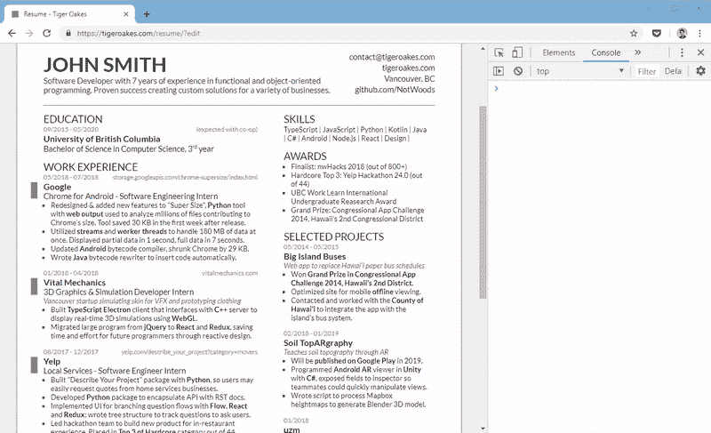

# 自动简历编辑器

> 原文：<https://dev.to/notwoods/automatic-resume-editor-25f8>

[T2】](https://res.cloudinary.com/practicaldev/image/fetch/s--F1RKHWEU--/c_limit%2Cf_auto%2Cfl_progressive%2Cq_66%2Cw_880/https://thepracticaldev.s3.amazonaws.com/i/tpiesnyqajiyipnsiivh.gif)

在用 Microsoft Word 写了几年简历后，我最近开始用普通的 HTML 和 CSS 制作简历。这对我来说效果更好，因为我可以将简历内容(我的工作经历和描述)与其布局(文本的颜色和位置以及列数)分开。我添加了额外的功能，这样我就可以用 JavaScript 即时编辑简历，并快速保存一份新的副本，以防我无法访问我的主机，需要做一些小的调整。我是这样做的。

## 内容有 HTML 和 JSON 简历

在网上显示我的简历的第一步是用浏览器能理解的方式用 HTML 表示数据。我首先按照 [JSON 简历模式](https://jsonresume.org/schema/)将我的简历转换成 JSON。我为我的网站使用了一个静态站点生成器，所以我编写了一个读取 JSON 文件的模板，然后编写了相应的 HTML 元素。

```
<header class="resume-header">
    <div class="name-container">
        <h1 class="name">{{.basics.name}}</h1>
        <p class="summary">{{.basics.summary}}</p>
    </div>
    <a class="resume-email" href="mailto:{{.basics.email}}">{{.basics.email}}</a>
</header> 
```

Enter fullscreen mode Exit fullscreen mode

## 用 CSS 布局

当我第一次重新设计我的网站时，我想不仅仅使用嵌入的 PDF 来包含我的简历。相反，我用 HTML 和 CSS 重新创建了我的简历，以便它在浏览器中显示为元素。我使用了一些更罕见的 CSS 特性，比如英寸和厘米单位，所以虚拟“页面”仍然是一个 8.5 英寸 x11 英寸的页面。

```
.resume {
  max-width: 8.5in;
  min-height: 11in;
} 
```

Enter fullscreen mode Exit fullscreen mode

显然这不是最佳选择，因为现在我有两份简历:一份微软 Word 文档，一份在线版本。每次更新 Word 文档，对应的 HTML 都需要更新。Word 也变得很麻烦，因为我需要重新排列标题左边的小块，而且由于两列布局，经常会产生额外的空白页。

## 从站点生成 PDF

接下来，我开始寻找一种方法，从我的网站的在线版本输出 PDF，这样我就可以摆脱 Word 版本。大多数人在一些网站上制作 pdf 的方式是直接打印出来。轻松点。不幸的是，在 web 浏览器中打印有一些奇怪的错误，当我打开打印预览时，我的布局变成了 1 列设计。

[T2】](https://res.cloudinary.com/practicaldev/image/fetch/s--15W_gd4e--/c_limit%2Cf_auto%2Cfl_progressive%2Cq_auto%2Cw_880/https://tigeroakes.com/posts/resume-editor/flex-fail.png)

> 如果您希望在打印样式表中使用 Flexbox 或 CSS Grid，您可能会失望。你可以检查出 [Flexbox](https://bugs.chromium.org/p/chromium/issues/detail?id=660611) 和 [Grid](https://bugs.chromium.org/p/chromium/issues/detail?id=614667) 的 Chrome bugs。
> 
> 我现在能给出的最好建议是让你的打印样式表保持合理的简单。

<cite>–[2018 年打印样式表状态指南——粉碎杂志](https://www.smashingmagazine.com/2018/05/print-stylesheets-in-2018/#browser-support)</cite>

当我尝试不同的布局时，我在这里停留了一段时间。最终，我选定了一个基于表格的简历布局。CSS `display: table`允许我在不使用`<table>` HTML 标签的情况下做到这一点，所以在移动设备上它可以切换到一个单独的列。

## 脚本

此时，我已经用 HTML 呈现了我的简历，用 CSS 布局，并生成了 PDF。一切正常！除了…我的网站需要 10 秒钟来重新生成 HTML 文件，所以当编辑简历时，我需要等待 10 秒钟，然后刷新页面，不管我做什么改变。这比仅仅在微软 Word 中编辑文本要沉闷得多。

鉴于我的 JSON 数据，我决定使用 JavaScript 来更新页面。我用 JavaScript 复制了我的 HTML 模板逻辑，所以在 Inspector 中我可以调用一个`update`函数并粘贴到我的 JSON 中。

```
function update(data) {
  // Header
  document.querySelector(".name").textContent = data.basics.name;
  document.querySelector(".summary").textContent = data.basics.summary;
  const email = document.querySelector(".resume-email");
  email.textContent = data.basics.email;
  email.href = `mailto:${data.basics.email}`;
} 
```

Enter fullscreen mode Exit fullscreen mode

## 加贺

我还是不太喜欢打字`update(`，粘贴，`)`，回车。为什么不直接粘贴 JSON 而不调用函数呢？我为`"paste"`事件添加了一个监听器，当我将 JSON 粘贴到 resume 窗口时，它会做出响应。

```
document.onpaste = e =>
  update(JSON.parse(e.clipboardData.getData("text/plain"))); 
```

Enter fullscreen mode Exit fullscreen mode

当我离开电脑时，我有时也需要对我的简历做些小改动。如果能够在 web 浏览器检查器中编辑 JSON 就好了。使用 Fetch API，我可以将我的 JSON 文件作为 JavaScript 对象加载进来。我可以使用一个 [`Proxy`对象](https://developer.mozilla.org/en-US/docs/Web/JavaScript/Reference/Global_Objects/Proxy)来检测对象何时被改变，然后自动调用`update()`。

```
let jsonResume = await fetch().then(r => r.json());
const proxyHandler = {
  /** Recursive proxy for nested objects. */
  get(target, key) {
    if (typeof target[key] === "object" && target[key] !== null) {
      return new Proxy(target[key], proxyHandler);
    } else {
      return target[key];
    }
  },
  /** Update HTML when any changes are made */
  set(target, key, value) {
    target[key] = value;
    update(jsonResume);
    return true;
  }
};
window.resume = new Proxy(jsonResume, proxyHandler); 
```

Enter fullscreen mode Exit fullscreen mode

`Proxy`用于在获取或设置属性时添加自定义行为。`set`函数在设置一个值时被调用，并且被定制为也调用我的`update`函数。`get`函数被定制为返回嵌套对象的代理。

## 下一步

将来，我想从我的标记自动生成一个 PDF，并保存在网站上供下载，而不是手动使用打印到 PDF。wkhtmltopdf 或[无头 Chrome](https://developers.google.com/web/updates/2017/04/headless-chrome) 可能是很好的工具。

让呈现的简历允许直接编辑文本，而不是在检查器中操作 JSON，这也是有帮助的。 [`contenteditable`](https://developer.mozilla.org/en-US/docs/Web/HTML/Global_attributes/contenteditable) HTML 属性允许用户更改 HTML 元素中的文本，但可能需要一些调整来正确处理列表和强调。

你可以在我的网站的 [GitHub 库上看到我所有的源代码。](https://github.com/NotWoods/tigeroakes.com/tree/master/content/resume)

##  [诺特伍兹](https://github.com/NotWoods)/[tigeroakes.com](https://github.com/NotWoods/tigeroakes.com)

### 我的投资组合网站。旨在脱机工作，快速加载，并展示一些我最喜欢的项目。