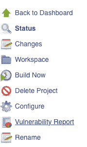

# 用 OWASP ZAP 在 Jenkins 进行自动安全测试

> 原文：<https://dev.to/gwllmnn/automatic-security-tests-in-jenkins-with-owasp-zap-2f6b>

[T2】](https://res.cloudinary.com/practicaldev/image/fetch/s--YJBGaquQ--/c_limit%2Cf_auto%2Cfl_progressive%2Cq_auto%2Cw_880/https://cdn-images-1.medium.com/max/790/1%2A6qCQfcu5ZX7Eq_C1mqOLqA.png)

OWASP ZAP 是一个非常流行的工具，用来发现你的代码库和实例/服务器设置中的漏洞。

[](https://res.cloudinary.com/practicaldev/image/fetch/s--PPEsZKJR--/c_limit%2Cf_auto%2Cfl_progressive%2Cq_auto%2Cw_880/https://cdn-images-1.medium.com/max/64/1%2AAr8NCL0OVmq0GU6wzzxSQA.png) 

<figcaption>OWASP ZAP 标志</figcaption>

它基本上是通过你的网站爬行，然后扫描在爬行过程中发现的所有网址的漏洞。

一个**会话**是一个测试的实例。在一个会话中，您可以有多个上下文。

**上下文**帮助 ZAP 只扫描你想要的网址。

例如，如果您在页面中直接包含 bootstrap，其中包含:

```
<link rel="stylesheet" href="https://maxcdn.bootstrapcdn.com/bootstrap/3.3.7/css/bootstrap.min.css"> 
```

ZAP 必然会找到这个网址。既然你肯定不希望 ZAP 扫描 https://maxcdn.bootstrapcdn.com 的漏洞，你就把它排除在上下文之外。

这样你就可以根据你想让它扫描的内容在上下文中包含或排除 URL。

在遵循本指南之前，你可能应该在你的电脑上运行 OWASP ZAP 客户端来**理解基本概念**。

振作起来，安装 OWASP ZAP Jenkins 插件将是一个漫长的旅程！

### 在 Jenkins 实例上下载并安装 OWASP ZAP

前往[https://github.com/zaproxy/zaproxy/wiki/Downloads](https://github.com/zaproxy/zaproxy/wiki/Downloads)下载适用于您平台的客户端版本。

将其解压缩，并将文件夹移动到/usr/local/bin，例如。

然后将环境变量 ZAPROXY_HOME 设置为您的 ZAP 代理安装文件夹的路径:

```
vim /etc/environment 
```

并粘贴以下内容:

```
ZAPROXY\_HOME=/usr/local/bin/ZAP\_2.x.x/ 
```

### 安装 OWASP ZAP 插件

要在你的 Jenkins 实例上安装官方 OWASP ZAP 插件，请进入管理 Jenkins ->管理插件->可用(这是一个选项卡)->查找 OWASP ZAP。

[](https://res.cloudinary.com/practicaldev/image/fetch/s--IjrMvsDg--/c_limit%2Cf_auto%2Cfl_progressive%2Cq_auto%2Cw_880/https://cdn-images-1.medium.com/max/574/1%2A1A4Zmuc0rk27mc2SJrp8gg.png) 

<figcaption>插件安装</figcaption>

安装它。

通过转到管理 Jenkins ->配置系统并填写以下字段来配置插件。

[](https://res.cloudinary.com/practicaldev/image/fetch/s--hJiRX64k--/c_limit%2Cf_auto%2Cfl_progressive%2Cq_auto%2Cw_880/https://cdn-images-1.medium.com/max/885/1%2AW0-GYn-rWI_EHTcRChsYNA.png) 

<figcaption>端口 8089 就是一个例子，你可以在这里选择你想要的端口</figcaption>

### 创建新的 Jenkins 工作

创建一个新的自由式项目，并填写以下字段:

*   丢弃旧版本

[](https://res.cloudinary.com/practicaldev/image/fetch/s--V78Y5mIF--/c_limit%2Cf_auto%2Cfl_progressive%2Cq_auto%2Cw_880/https://cdn-images-1.medium.com/max/934/1%2AxlaV6P8g3UTvccOrtmjwnw.png) 

<figcaption>确保我们的项目不会占用太多空间</figcaption>

*   构建触发器(可选)

[](https://res.cloudinary.com/practicaldev/image/fetch/s--60WGMuFY--/c_limit%2Cf_auto%2Cfl_progressive%2Cq_auto%2Cw_880/https://cdn-images-1.medium.com/max/934/1%2ASttXjjWEcSNadq9cGLQJ5Q.png) 

<figcaption>每周日凌晨 2 点运行作业</figcaption>

*   添加执行 ZAP 构建步骤

在执行 ZAP 构建步骤中:

[](https://res.cloudinary.com/practicaldev/image/fetch/s--8SrWt_3A--/c_limit%2Cf_auto%2Cfl_progressive%2Cq_auto%2Cw_880/https://cdn-images-1.medium.com/max/899/1%2AhbOocOWkKTMZqfbg2Mw0WQ.png) 

<figcaption>它应该反映你安装插件的步骤中填写的字段值</figcaption>

[](https://res.cloudinary.com/practicaldev/image/fetch/s--qqzA_sce--/c_limit%2Cf_auto%2Cfl_progressive%2Cq_auto%2Cw_880/https://cdn-images-1.medium.com/max/896/1%2ArM_ePR_RP5dI3ssh23HHmg.png) 

<figcaption>指定 OWASP ZAP bin 在我们的 Jenkins 实例</figcaption>

上的安装位置

[](https://res.cloudinary.com/practicaldev/image/fetch/s--4oQXr4Rl--/c_limit%2Cf_auto%2Cfl_progressive%2Cq_auto%2Cw_880/https://cdn-images-1.medium.com/max/887/1%2AkinmgLX05-2oLHsv4NZoDg.png) 

<figcaption>应该是您正在创建的 Jenkins 作业的目录路径</figcaption>

[](https://res.cloudinary.com/practicaldev/image/fetch/s--MKHIgciz--/c_limit%2Cf_auto%2Cfl_progressive%2Cq_auto%2Cw_880/https://cdn-images-1.medium.com/max/901/1%2Agpgt_r0xG2p9lC1jc68Tsg.png) 

<figcaption>还记得我们讲过的语境吗？您可以在这里指定应该包含和排除哪些 URL。这里 [http://10.0.40.3](http://10.0.40.3) 是我托管我要测试的网站的地方。*表示我希望 ZAP 在上下文中包含所有以 [http://10.0.40.3](http://10.0.40.3)</figcaption>

开头的 URL

[](https://res.cloudinary.com/practicaldev/image/fetch/s--aTo18zmd--/c_limit%2Cf_auto%2Cfl_progressive%2Cq_auto%2Cw_880/https://cdn-images-1.medium.com/max/898/1%2AZfdzD883IYrAG19Ujo6pqQ.png) 

<figcaption>告诉 ZAP 先抓取网址，然后扫描找到的网址</figcaption>

[](https://res.cloudinary.com/practicaldev/image/fetch/s--wf96Y8IX--/c_limit%2Cf_auto%2Cfl_progressive%2Cq_auto%2Cw_880/https://cdn-images-1.medium.com/max/900/1%2AWLPR-d8-OEQ8OMsxi9DHFQ.png) 

<figcaption>告诉 ZAP 要生成哪些报告以及将它们放在哪里</figcaption>

最后，回到会话管理部分，这部分比其他部分需要更多的解释:

如果您勾选了持续会话复选框，ZAP 将为您创建一个新的会话。这是最容易设置的选项，但也是最不彻底的。

如果你的 web 应用有一个登录页面，ZAP 将不会知道使用什么凭证来访问你的 web 应用的私有区域。所以 ZAP 只会攻击你网站的公共部分，而错过其中很好的一部分。

为了帮助 ZAP 知道凭证，您必须做的是使用您计算机上的 GUI 客户机来生成 ZAP 会话，例如，在该会话中您分配一个有效的会话 cookie。然后，您可以将创建的会话导出并上传到新的 Jenkins 作业文件夹，然后勾选“加载会话”复选框，并在选择列表中选择您的会话。

[](https://res.cloudinary.com/practicaldev/image/fetch/s--GFHCUr5W--/c_limit%2Cf_auto%2Cfl_progressive%2Cq_auto%2Cw_880/https://cdn-images-1.medium.com/max/897/1%2A08Jz7vF8gyH55fyrXMe57w.png) 

<figcaption>对于我们的基本示例，我们将勾选持续会话复选框</figcaption>

*   添加发布 HTML 报告后期生成步骤

[T2】](https://res.cloudinary.com/practicaldev/image/fetch/s--Jto_4LLB--/c_limit%2Cf_auto%2Cfl_progressive%2Cq_auto%2Cw_880/https://cdn-images-1.medium.com/max/928/1%2AeRnZdkHf5dAD_NvJCan7-Q.png)

就是这样！要么手动构建作业，要么等待 cron 调度来执行它，您应该会在 Jenkins 作业仪表板中看到 ZAP 测试的 HTML 报告。

[](https://res.cloudinary.com/practicaldev/image/fetch/s--dS7ux4x0--/c_limit%2Cf_auto%2Cfl_progressive%2Cq_auto%2Cw_880/https://cdn-images-1.medium.com/max/179/1%2AUb5D2hgoSsIcR12MtH1KFg.png) 

<figcaption>点击漏洞报告查看安全测试结果</figcaption>

如果我错过了什么，请告诉我！