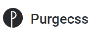
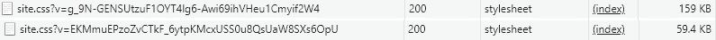

# 从 Bootstrap 或其他框架中自动移除未使用的 css

> 原文：<https://dev.to/lukencode/automatically-remove-unused-css-from-bootstrap-or-other-frameworks-331e>

我喜欢 bootstrap(和其他 css 框架)。对于像我这样经常在没有任何设计输入的情况下从事 web 项目的开发人员来说，这是一个真正的救命稻草。问题是因为 bootstrap 是一个厨房水槽类型的框架(虽然你可以通过 sass 挑选), css 文件的大小会很快失控。Bootstrap.min.css 的大小为 138 KB。如果你添加一个主题和自定义 css，它可以很容易地超过 200 kb。

[ ](https://www.purgecss.com/) [PurgeCSS](https://www.purgecss.com/) 是一个 node.js 包，可以检测并移除未使用的 CSS 选择器。它将分析你的视图页面——不管是 HTML 还是模板引擎，并建立一个正在使用的 css 选择器列表。然后 PurgeCSS 将获取您的样式表并删除视图中不存在的任何选择器。

我使用 [webpack 插件](https://www.purgecss.com/with-webpack)设置 PurgeCSS，它与 extract-text-webpack-plugin 一起工作。我的 webpack 配置是基于我之前写过的[简单 webpack 配置](https://lukencode.com/2018/04/14/simple-webpack-config-to-build-javascript-sass-and-css-using-npm-and-aspnet-core/)。

webpack 配置已经设置为处理 sass 并将 css 合并到一个文件中。我添加了 PurgecssPlugin，它将在初始 css 处理后运行。

`npm i -D purgecss-webpack-plugin`

`npm i -D extract-text-webpack-plugin`

```
const path = require('path')
const glob = require('glob')
const webpack = require('webpack')
const ExtractTextPlugin = require('extract-text-webpack-plugin')
const PurgecssPlugin = require('purgecss-webpack-plugin')

const outputDir = './wwwroot/dist'
const entry = './wwwroot/js/app.js'
const cssOutput = 'site.css'

module.exports = (env) => {    
    return [{
        entry: entry,
        output: {
            path: path.join(__dirname, outputDir),
            filename: '[name].js',
            publicPath: '/dist/'
        },
        module: {
            rules: [
                {
                    test: /\.js$/,
                    use: 'babel-loader'
                },
                {
                    test: /\.css$/,
                    use: ExtractTextPlugin.extract({
                        use: ['css-loader'],
                        fallback: 'style-loader'
                    })
                },
                {
                    test: /\.scss$/,
                    use: ExtractTextPlugin.extract({
                        use: ['css-loader', 'sass-loader'],
                        fallback: 'style-loader'
                    })
                }
            ]
        },
        plugins: [
            new ExtractTextPlugin(cssOutput),
            new PurgecssPlugin({
                paths: glob.sync('./Views/**/*.cshtml', { nodir: true }),
                whitelistPatterns: [/selectize-.*/]
            })
        ]
    }]
} 
```

Enter fullscreen mode Exit fullscreen mode

该插件接受一组路径来查看文件，以搜索正在使用的 css 选择器。glob 包接受一个搜索模式并生成一个文件列表。我在找。查看我的文件夹中的文件。net web app。

```
paths: glob.sync('./Views/**/*.cshtml', { nodir: true }) 
```

Enter fullscreen mode Exit fullscreen mode

whitelistPatterns 参数允许您从清除中排除路径中可能不存在的选择器。我发现我正在使用的 [selectize 插件](https://selectize.github.io/selectize.js/)有动态添加和删除的 css 类，所以我添加了一个模式来匹配它的 css 类的前缀。我也可以包含。带有路径参数的插件的 js 文件。

```
whitelistPatterns: [/selectize-.*/] 
```

Enter fullscreen mode Exit fullscreen mode

在我的一个基于 bootstrap 的网站上运行 PurgeCSS，CSS 文件大小从 159KB 减少到了 60KB，而我基本上没有付出任何努力！

[T2】](https://res.cloudinary.com/practicaldev/image/fetch/s--HBjEGWCv--/c_limit%2Cf_auto%2Cfl_progressive%2Cq_auto%2Cw_880/http://lukencode.com/img/posts/purgecss-results.png)