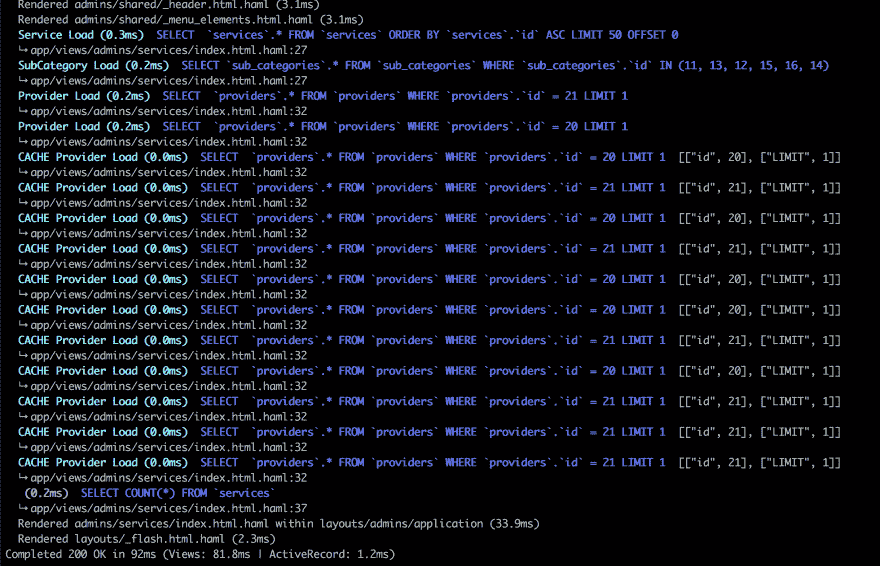
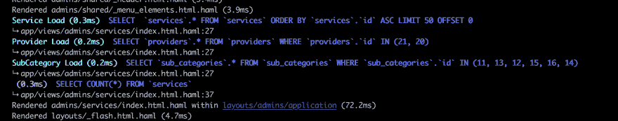

# 避免洗劫的 N+1 陷阱！

> 原文：<https://dev.to/husteadrobert/avoid-ransacks-n1-pitfall-33of>

我以前写过关于[搜索](https://github.com/activerecord-hackery/ransack)的文章，因为这是一个方便的小工具，可以快速搜索两个模型及其关系。但是您可能会惊讶地发现，使用 sorack 创建 N+1 个查询看似很容易！好消息是，它也很容易修复。

回顾一下基本的搜索使用，假设你有一个模型`Service`，它有`name`和`description`的属性。如果您想搜索这两个属性，您应该像这样设置您的视图:

```
<%= search_form_for @q do |f| %>
  <%= f.label :name_cont %>
  <%= f.search_field :name_description_cont %>
<% end %> 
```

你的控制器是:

```
def index
  @q = Service.ransack(params[:q])
  @services = @q.result(distinct: true)
end 
```

很基本的东西，对吧？但是如果您有另一个与服务相关的模型呢？例如，假设您有一个带有`name`和`address`属性的`Provider`模型，并且每个`Provider`都有 _many `Services`。

现在，您想在`name`和`description`属性中搜索`Service`，但是您还想包括`Provider`的`name`属性。你是怎么做到的？

洗劫提供了一个简单的方法。您可以将视图更改为:

```
<%= search_form_for @q do |f| %>
  <%= f.label :name_cont %>
  <%= f.search_field :name_description_provider_name_cont %>
<% end %> 
```

事情进展顺利。但是等等，让我们看看当我们试图搜索某些东西时运行的 SQL 查询:
[](https://res.cloudinary.com/practicaldev/image/fetch/s--vLTMc3fM--/c_limit%2Cf_auto%2Cfl_progressive%2Cq_auto%2Cw_880/https://i.imgur.com/pJUnj0d.png)

呀！这根本不是我们想要的！

熟悉 rails 的人会知道可怕的 N+1 问题，但也可能知道我们通常可以通过急切加载和使用`includes(:model_name)`来解决它。但是我们把它放在哪里呢？简单，当然是在控制器里！

```
def index
  @q = Service.includes(:provider).ransack(params[:q])
  @services = @q.result(distinct: true)
end 
```

再次运行我们的搜索:

[T2】](https://res.cloudinary.com/practicaldev/image/fetch/s--ffL0zBNP--/c_limit%2Cf_auto%2Cfl_progressive%2Cq_auto%2Cw_880/https://i.imgur.com/xA9RuMv.png)

(请注意，在我的示例中，我还为视图的另一部分加载了子类别)

这并不是一个很难解决的问题，但是很多人可能没有意识到对相关模型使用搜索会导致 N+1 的问题。

祝你好运，并快乐编码！