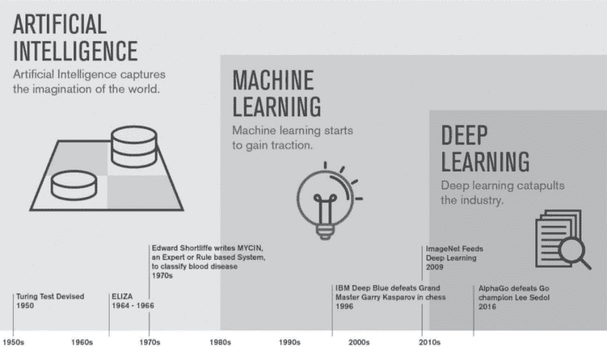

# Awesome-AI:掌握人工智能的指南

> 原文：<https://dev.to/vidyasagarmsc/awesome-ai-the-guide-to-master-artificial-intelligence-35k3>

### 一个精选的文章、书籍、MOOCs、信息图表和更多内容的列表，涵盖人工智能、机器学习和深度学习。检查这个 [GitHub 回购](https://github.com/VidyasagarMSC/Awesome-AI)

人工智能是一个迷人的话题，也是一种流行词，已经存在多年，并将在未来许多年占据主导地位。当我与开发人员和学生互动时，我听到了关于机器学习、深度学习和人工智能的不同直觉。有时，人们会混淆 AI、ML 和 DL 是相同的还是不同的。

因此，我在演示的第一张幻灯片中使用了这张[信息图](https://github.com/VidyasagarMSC/Awesome-AI/blob/master/infographics/AI-Timeline.jpg)。你可以很容易地弄清楚什么是什么

<figure> 

<figcaption>来源: [Apttus](https://apttus.com/blog/artificial-intelligence-works-intelligent-enterprise/)</figcaption>

</figure>

即使这样，他们中也很少有人像

<figure> 

<figcaption>照片由[亚历山大·奈特](https://unsplash.com/photos/2EJCSULRwC8?utm_source=unsplash&utm_medium=referral&utm_content=creditCopyText)上[下](https://unsplash.com/?utm_source=unsplash&utm_medium=referral&utm_content=creditCopyText)</figcaption>

</figure>

作为人类，我们都是不同的，我们的学习方式也不同。我们中很少有人阅读书籍来掌握一个主题，很少有人观看视频，很少有人参加在线 MOOCs(大规模开放在线课程)或 [meetups](https://www.meetup.com/BlueCoders/) 。很少有人(包括我)喜欢快速指南和备忘单来快速学习和理解一个主题。

所以，来回答和满足大家掌握人工智能的需求和兴趣。我思考并制定了一个 [GitHub repo](https://github.com/VidyasagarMSC/Awesome-AI) ，它将包含一小组有趣的聚合。这是我将在人工智能(ML + DL)世界中收集我所有的知识和迷人经历的地方。

### 初学者——入门

#### 文章

*   [人工智能简介](https://hackernoon.com/understanding-understanding-an-intro-to-artificial-intelligence-be76c5ec4d2e)
*   [人工智能、机器学习和认知计算初学者指南](https://www.ibm.com/developerworks/library/cc-beginner-guide-machine-learning-ai-cognitive/index.html)
*   [我应该使用哪种机器学习算法？](https://blogs.sas.com/content/subconsciousmusings/2017/04/12/machine-learning-algorithm-use/?utm_source=facebook&utm_medium=cpc&utm_campaign=analytics-global&utm_content=US_interests-conversions)
*   [机器学习模型从建立到再训练的旅程](https://towardsdatascience.com/the-journey-of-a-machine-learning-model-from-building-to-retraining-fe3a37c32307?gi=38d2b73db825)
*   [通过语音和音频与这个聊天机器人互动](https://chatbotslife.com/interact-with-this-chatbot-through-voice-and-audio-81b5c0c9b10b)
*   [使用机器学习的移动传感器数据中的异常检测](https://towardsdatascience.com/anomaly-detection-in-mobile-sensor-data-48ef62d0f7fc)

#### MOOCs

*   [微软在 edx 上介绍人工智能](https://www.edx.org/course/introduction-to-artificial-intelligence-ai)
*   [谷歌机器学习速成班简介](https://developers.google.com/machine-learning/crash-course/ml-intro)

#### 书籍

*   [傻瓜机器学习，IBM 限量版](https://www-01.ibm.com/common/ssi/cgi-bin/ssialias?htmlfid=IMM14209USEN)——*75 页*
*   [吴恩达的机器学习向往——报名免费稿](http://www.mlyearning.org/)——*约。100 页*

#### 快速指南

*   [DZone 人工智能指南:机器学习和预测分析](https://dzone.com/guides/artificial-intelligence-machine-learning-and-predi)
*   [什么是机器学习？](https://www.mathworks.com/content/dam/mathworks/tag-team/Objects/i/88174_92991v00_machine_learning_section1_ebook.pdf)
*   [用 MATLAB 介绍深度学习](https://es.mathworks.com/content/dam/mathworks/tag-team/Objects/d/80879v00_Deep_Learning_ebook.pdf)
*   [tensor flow 简介](https://dzone.com/refcardz/introduction-to-tensorflow?chapter=1)

#### 备忘单

*   [人工智能、神经网络、机器学习、深度学习的备忘单&大数据](https://becominghuman.ai/cheat-sheets-for-ai-neural-networks-machine-learning-deep-learning-big-data-678c51b4b463)
*   [机器学习算法备忘单—sas.com](https://github.com/VidyasagarMSC/Awesome-AI/blob/master/cheatsheets/machinelearning/machine-learning-cheat-sheet-sas.png)
*   [机器学习备忘单](http://ml-cheatsheet.readthedocs.io/en/latest/index.html)

### 高级人工智能

#### MOOCs

*   [Deeplearning.ai | Coursera by 吴恩达](https://www.deeplearning.ai/)——*5 门课程*
*   [机器学习|吴恩达的 Coursera](https://www.coursera.org/learn/machine-learning)

#### 书籍

*   [深度学习，麻省理工学院出版社的书](http://www.deeplearningbook.org/)
*   [理解机器学习:从理论到算法](http://www.cs.huji.ac.il/%7Eshais/UnderstandingMachineLearning/understanding-machine-learning-theory-algorithms.pdf)

### 有趣的写着

*   我们应该担心人工智能吗？
*   人工智能的未来:你的工作受到威胁了吗？——*商界领袖*T3】

### 信息图形

*   [AI“技术准备状态”信息图](https://github.com/VidyasagarMSC/Awesome-AI/blob/master/infographics/AI-tech-landscape-graphic.png) *来源:CallaghanInnovation*
*   [AI 时间轴](https://github.com/VidyasagarMSC/Awesome-AI/blob/master/infographics/AI-Timeline.jpg) *来源:Apttus*
*   [AI 详细时间轴](https://github.com/VidyasagarMSC/Awesome-AI/blob/master/infographics/Artificial-Intelligence-AI-Timeline-Infographic.jpeg) *来源:今日数字智能*

_ 如果您看到断开的链接，请打开一个[问题](https://github.com/VidyasagarMSC/Awesome-AI/issues/new)。

#### 叉出[回购](https://github.com/VidyasagarMSC/Awesome-AI)，添加更多内容和一个 PR 进行合并。

* * *