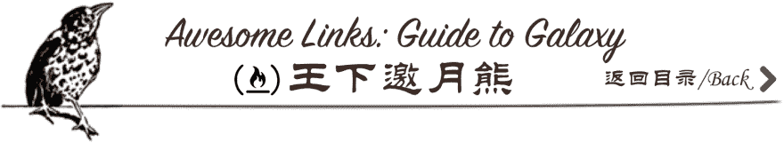

# 2018 年人工智能、机器学习、深度学习和 Tensorflow 的书籍、课程、示例的精彩链接

> 原文：<https://dev.to/wxyyxc1992/awesome-links-of-books-courses-examples-for-ai-machinelearning-deeplearning-and-tensorflow-in-2018-1gi0>

[T2】](https://github.com/wxyyxc1992/Awesome-Links)

# DataScienceAI Book Links | List of recommended books in machine learning, deep learning and natural language processing

[T2】](https://github.com/wxyyxc1992/Awesome-Links)

人工智能(AI)课程和书籍的精选列表，由来自[的](https://github.com/wxyyxc1992/Awesome-Links)[数据科学-书籍链接](https://github.com/wxyyxc1992/Awesome-Links/blob/master/DataScienceAI/DataScienceAI-Book-Links.md)和[数据科学-课程链接](https://github.com/wxyyxc1992/Awesome-Links/blob/master/DataScienceAI/DataScienceAI-Course-Links.md)组成。

# 数学|数学数学基础

*   [2008-Complete Course in Statistics # book #](https://book.douban.com/subject/3180810/) : The Complete Course in Statistics, written by the famous American statistician L. Wasserman, is an excellent textbook that contains almost all the knowledge in the field of statistics. This book not only introduces all the contents of traditional mathematical statistics, but also includes new methods and technologies in statistical fields such as Bootstrap method (self-help method), independent inference, causal inference, graph model, nonparametric regression, orthogonal function smoothing method, classification, statistical theory and data mining. This book not only pays attention to the exposition of the basic theories of probability theory and mathematical statistics, but also emphasizes the cultivation of data analysis ability. This book contains a large number of examples to help readers quickly master the use of R software for statistical data analysis.

*   [2009-凸优化#Book#](http://stanford.edu/~boyd/cvxbook/bv_cvxbook.pdf) :这本书是关于凸优化，一类特殊的数学优化问题，包括最小二乘和线性规划问题。众所周知，最小二乘和线性规划问题有相当完整的理论，出现在各种应用中，并且可以非常有效地用数值方法解决。这本书的基本观点是，对于更大类的凸优化问题也可以这样说。

*   [2009-统计学习的要素:数据挖掘、推理和预测-第二版](https://web.stanford.edu/~hastie/ElemStatLearn/) : Hastie 和 Tibshirani 涵盖了广泛的主题，从监督学习(预测)到非监督学习，包括神经网络、支持向量机、分类树和 boosting -这是任何书籍中第一次全面讨论这一主题。

*   [2010-所有的统计:统计推断简明教程#Book#](http://read.pudn.com/downloads158/ebook/702714/Larry%20Wasserman_ALL%20OF%20Statistics.pdf) :这本书的目标是为统计学、计算机科学(尤其是数据挖掘和机器学习)、数学和相关学科的学生提供概率和统计的广泛背景。

*   [2012-Li Hang-Statistical Methodology # book #](https://www.amazon.cn/dp/B007TSFMTA) : This book comprehensively and systematically introduces the main methods of statistical learning, especially the supervised learning methods, including perceptron, K-nearest neighbor method, naive Bayes method, decision tree, logistic regression and entropy model, support vector machine, lifting method, EM algorithm, hidden Markov model and conditional random field, etc.

*   [2016-沉浸式线性代数#Book#](http://immersivemath.com/ila/index.html) :世界上第一本全交互图形的线性阿尔及利亚书。

*   [2017 年-机器学习的数学#Book#](http://www.datasciencecentral.com/profiles/blogs/the-mathematics-of-machine-learning) :机器学习理论是一个交叉统计、概率、计算机科学和算法方面的领域，通过从数据中迭代学习并找到可用于构建智能应用的隐藏见解而产生。尽管机器和深度学习有巨大的可能性，但要想很好地掌握算法的内部工作原理并获得良好的结果，对这些技术中的许多技术进行彻底的数学理解是必要的。

# 机器学习|机器学习

*   [2007-模式识别与机器学习#Book#](https://book.douban.com/subject/2061116/) :该书适用于机器学习、统计学、计算机科学、信号处理、计算机视觉、数据挖掘、生物信息学等课程。
*   [2012 年-机器学习的概率观点#Book#](https://www.amazon.com/Machine-Learning-Probabilistic-Perspective-Computation/dp/0262018020) :这本教科书提供了对机器学习领域的全面和独立的介绍，一种统一的概率方法。覆盖范围结合了广度和深度，提供了必要的背景材料，如概率，优化，线性代数等主题，以及讨论该领域的最新发展，包括条件随机场，L1 正则化和深度学习。

*   2014 年-剑桥人工智能手册#Book# :该书侧重于理论，而不是技术和应用问题，不仅对人工智能领域的工作人员有价值，对其他学科的人也有价值，他们希望获得该领域的权威和最新介绍。

*   [2015-数据挖掘，教科书#Book#](https://www.springer.com/gp/book/9783319141411) :这本教科书探索了数据挖掘的不同方面，从基础到复杂的数据类型及其应用，捕捉了数据挖掘问题的广泛多样性。

*   [2016-潜入机器学习#Book#](https://github.com/hangtwenty/dive-into-machine-learning) :我是先黑了再学 Python，后来认真了。我想用机器学习来做这件事。如果这是你的风格，和我一起超越你自己。

*   [2016-Zhou Zhihua-Machine Learning # Book #](https://www.amazon.cn/dp/B01ARKEV1G) : As an introductory textbook in this field, Machine Learning covers all aspects of basic knowledge of machine learning as much as possible. This paper introduces the basic knowledge of machine learning, classical and commonly used machine learning methods (decision tree, neural network, support vector machine, Bayesian classifier, ensemble learning, clustering, dimension reduction and metric learning), feature selection and sparse learning, computational learning theory, semi-supervised learning, probability diagram model, rule learning and reinforcement learning, etc.

*   [2016-Prateek Joshi-Python 真实世界机器学习#Book#](https://parg.co/Y63) :学习通过使用 Python 构建强大的机器学习模型来解决具有挑战性的数据科学问题。

*   [2016-用 Python 设计机器学习系统](https://parg.co/Y6O):了解机器学习设计过程，优化机器学习系统以提高准确性，了解机器学习的常用编程工具和技术，开发处理来自各种来源的大量数据的技术和策略，建立模型以解决独特的任务。

*   [2018-Andrew ng-机器学习向往#Book#](http://www.mlyearning.org/) :这本书的重点不是教你 ML 算法，而是如何让 ML 算法发挥作用。有的技术 AI 课会给你一锤子；这本书教你如何使用锤子。

*   [2018-人工智能:一种现代方法-第三版#Book#](https://parg.co/Y6t) :人工智能:一种现代方法，3e 为人工智能的理论和实践提供了最全面、最新的介绍。在其领域的第一，这本教科书是一个或两个学期，本科或研究生水平的人工智能课程的理想选择。

## 强化学习|强化学习

*   [2018-强化学习:导论-第二版#Book#](https://parg.co/Y6M) :这本教材对强化学习的关键思想和算法进行了清晰简单的阐述，所有相关学科的读者都可以理解。要求熟悉概率的基本概念。

# 深度学习|深度学习

*   [2015-古德费勒、本吉奥和库维尔-深度学习教材#Book#](http://www.deeplearningbook.org/) :中文译本[这里](https://exacity.github.io/deeplearningbook-chinese/Chapter1_introduction/)，深度学习教材是一种资源，旨在帮助学生和从业者进入机器学习领域，特别是深度学习领域。这本书的网络版现在已经完成，将继续在网上免费提供。
*   [2016-斯坦福深度学习教程#Book#](http://deeplearning.stanford.edu/tutorial/) :本教程将教你无监督特征学习和深度学习的主要思想。通过完成它，你还将实现几个特征学习/深度学习算法，看到它们为自己工作，并学习如何将这些想法应用/适应新问题。
*   [2016-用 TensorFlow #Book#](https://parg.co/Y6s) 构建机器学习项目:参与项目将教你如何利用复杂的数据来获得最大的洞察力。

*   [2016-Introduction to Deep Learning # Book #](https://github.com/PaddlePaddle/book/blob/develop/README.md) : The book you are reading now is an "interactive" e-book-each chapter can be run in a Jupyter Notebook. We packed Jupyter, PaddlePaddle, and all kinds of dependent software into a Docker image. So you don't need to install all kinds of software yourself, just install Docker.

*   [2017-神经网络和深度学习#Book#](http://neuralnetworksanddeeplearning.com/) :神经网络和深度学习是一本免费的在线书籍。这本书将教你:(1)神经网络，一个美丽的生物启发编程范式，使计算机能够从观察数据中学习。(2)深度学习，一套强大的神经网络学习技术

*   [2017-TensorFlow Book # Book #](https://github.com/BinRoot/TensorFlow-Book):用 tensor flow 进行机器学习的随附源代码。参阅书中的分步解释。

# NLP | Natural Language Processing

*   [2016-文本数据管理与分析#Book#](https://dl.acm.org/citation.cfm?id=2915031) :信息检索与文本挖掘实用入门
*   [2017-dl 4 NLP-面向 NLP 资源的深度学习](https://github.com/andrewt3000/DL4NLP):面向机器翻译、图像字幕、对话等 NLP 序列建模任务的最先进资源。

# 计算机视觉|计算机视觉

*   [2016-OpenCV:使用 Python 的计算机视觉项目](https://parg.co/Y6Q):使用 OpenCV 的 Python 绑定来捕捉视频、操纵图像和跟踪对象。了解 OpenCV 的不同功能及其实际实现。

# data science | pan-data science

*   [2012-data analysis in simple terms-Chinese version # book #](https://book.douban.com/subject/5257905/) : data analysis in simple terms vividly shows readers the skills that excellent data analysts should know: basic steps of data analysis, experimental methods, optimization methods, hypothesis testing methods, Bayesian statistical methods, subjective probability methods, heuristic methods, histogram methods, etc. After that, three appendices are used to introduce the ten important tasks of data analysis, R tools and ToolPak tools, which not only fully show the target knowledge, but also build a bridge for readers to study deeply.

*   [2014-从头开始的数据科学#Book#](http://shop.oreilly.com/product/0636920033400.do) :在这本书里，你将了解到有多少最基本的数据科学工具和算法是通过从头开始实现的。

*   [2016-Python 数据科学手册# Book #](https://github.com/jakevdp/PythonDataScienceHandbook):Python 数据科学手册 Jupyter 笔记本

* * *

# DataScienceAI Course Links | List of recommended courses in machine learning, deep learning and natural language processing

# 机器学习|机器学习

*   2010-麻省理工学院人工智能视频:这门课程包括互动演示，旨在激发学生的兴趣，帮助他们直观地了解人工智能方法在各种环境下是如何工作的。

*   [2014-Stanford-Machine Learning Course # course #](https://zh.coursera.org/learn/machine-learning) : In this course, you will learn the most efficient machine learning techniques, know how to use them, and practice them yourself. More importantly, you will not only learn theoretical knowledge, but also learn how to practice and how to quickly use powerful technology to solve new problems. Finally, you will learn how companies in Silicon Valley can innovate in the field of machine learning and AI.

*   [2014-统计学习(自定进度)#课程#](https://parg.co/Y6f) :这是监督学习中的入门课程，重点是回归和分类方法。

*   [2015-uda city-人工智能入门#课程#](https://www.udacity.com/course/intro-to-artificial-intelligence--cs271) :在这门课程中，你将学习现代人工智能的基础知识，以及人工智能的一些代表性应用。一路上，我们也希望让你兴奋于人工智能领域的众多应用和巨大的可能性，这将继续扩展人类超出我们想象的能力。

*   [2016 年-台大机器学习技法#课程#](https://www.youtube.com/playlist?list=PLXVfgk9fNX2IQOYPmqjqWsNUFl2kpk1U2) :线性支持向量机(SVM)::课程介绍@机器学习技术等。

*   [2017-EdX-人工智能(AI)#课程#](https://parg.co/Y64) :学习人工智能(AI)的基础知识，学以致用。设计智能代理来解决现实世界的问题，包括搜索、游戏、机器学习、逻辑和约束满足问题。

*   [2018-Google 提供的 TensorFlow APIs 机器学习速成课程#Course#](https://developers.google.com/machine-learning/crash-course/) :机器学习速成课程包括一系列课程，包括视频讲座、真实案例分析和动手实践练习。

# 深度学习

*   [2016-Google 深度学习#课程#](https://parg.co/Y6N) :在这门课程中，你将对深度学习的动机有一个清晰的理解，并设计从复杂和/或大规模数据集学习的智能系统。

*   [2017-CS 20SI:深度学习研究的 TensorFlow #课程#](https://web.stanford.edu/class/cs20si/) :本课程将涵盖深度学习研究的 tensor flow 库的基础知识和当代用法。我们旨在帮助学生理解 TensorFlow 的图形计算模型，探索它必须提供的功能，并学习如何构建和构造最适合深度学习项目的模型。

*   [2017-fast . AI Deep Learning AI # Course #](https://github.com/fastai/fastai):该库的大部分都经过了相当好的测试，因为许多学生都使用它来完成实用的深度学习 for Coders 课程。然而，它还没有在课程之外广泛使用，所以你可能会发现一些缺失的功能或粗糙的边缘。

# NLP | Natural Language Processing

*   [2016-伊利诺伊大学厄巴纳-香槟分校:文本挖掘和分析#课程#](https://zh.coursera.org/learn/text-mining) :本课程将涵盖挖掘和分析文本数据的主要技术，以发现有趣的模式，提取有用的知识，并支持决策，重点是统计方法，这些方法通常可以应用于任何自然语言的任意文本数据，无需或只需最少的人工努力。

*   [2017-用于机器学习的神经网络#课程#](https://www.coursera.org/learn/neural-networks) :了解人工神经网络以及它们如何用于机器学习，如应用于语音和对象识别、图像分割、建模语言和人类运动等。

*   [2017-牛津深度 NLP 课程#Course#](https://github.com/oxford-cs-deepnlp-2017/lectures) :这是一门关于自然语言处理的高级课程。自动处理自然语言输入并产生语言输出是人工通用智能的关键组成部分。

*   [2017-CS224d:自然语言处理的深度学习#课程#](http://cs224d.stanford.edu/syllabus.html):NLP 和深度学习入门，简单的词向量表示:word2vec，GloVe 等。

# 工业应用|行业应用

## 自动驾驶|自动驾驶

*   [2017-人工智能机器人#课程#](https://www.class-central.com/course/udacity-artificial-intelligence-for-robotics-319) :向谷歌和斯坦福自动驾驶团队的领导者学习如何对机器人汽车的所有主要系统进行编程。

# 例题|示范

*   [2015-Keras # Project #](https://github.com/fchollet/deep-learning-models)训练好的图像分类模型:流行深度学习模型的 Keras 代码和权重文件。

*   [深度学习一体化 Docker 镜像#Project#](https://github.com/saiprashanths/dl-docker) :深度学习一体化 Docker 镜像。包含所有流行的 DL 框架(TensorFlow，Theano，Torch，Caffe 等。)

*   [顶级深度学习项目](https://github.com/aymericdamien/TopDeepLearning):深度学习相关的热门 github 项目列表(按星级排序)。

* * *

# 张量流学习&练习链接|张量流资料索引

# 概述|概述

*   [2017- TensorFlow 揭秘](https://chatbotslife.com/tensorflow-demystified-80987184faf7):为了理解一个新的框架，谷歌的 TensorFlow 是一个用于机器学习计算的框架，看到一个“玩具”例子并从中学习通常是有用的。

*   [How to use TensorFlow as a computing framework](https://zhuanlan.zhihu.com/p/30719727) : If you have just come into contact with TensorFlow and want to use it as a computing framework, then this article is a good choice for you. Reading it will help you, I believe.

*   [2017-我们需要更深入:张量流和初始的实用指南](https://parg.co/YqN)

## Case Study | Case Analysis

*   [2017-tensor flow 五大用例](https://www.exastax.com/deep-learning/top-five-use-cases-of-tensorflow/) : TensorFlow 主要用于:分类、感知、理解、发现、预测、创造。

*   [T0】 2018-Google Brain researcher explains chat robot in detail: the technical problems of deep learning and the development practice based on TensorFlow.

*   【Zendesk 如何在生产中服务 TensorFlow 模型

# resource | resource highlights

## series | series of tutorials

*   [2015-tensorflow _ tutorials](https://github.com/pkmital/tensorflow_tutorials):从 tensor flow 的基础到稍微有趣一点的应用

*   [2017-Effective TensorFlow](https://github.com/vahidk/EffectiveTensorflow) :我的尝试是通过添加新的文章来逐步扩展这个系列，并保持内容与 TensorFlow API 的最新发布保持同步。

*   [2017-tensor flow 101](https://mubaris.com/2017-10-21/tensorflow-101):tensor flow 是谷歌开发的开源机器学习库。TensorFlow 使用数据流图进行数值计算。

*   [2017-TensorFlow-World](https://github.com/astorfi/TensorFlow-World) :该资源库旨在为 TensorFlow 提供简单易用的教程。

## 例题|示例

*   [2015-TensorFlow 示例](https://github.com/aymericdamien/TensorFlow-Examples):本教程旨在通过示例轻松进入 TensorFlow。为了可读性，它包括笔记本和带有解释的源代码。

*   [2016-使用 Tensorflow 进行深度学习](https://github.com/anujdutt9/Tensorflow-DeepLearning):这个知识库包含了深度学习的 Tensorflow 教程从头到尾的代码。所有代码都是用 Python3 编写的。

*   [2017-Deep Learning 21 Examples](https://github.com/hzy46/Deep-Learning-21-Examples) : This project is the supporting code of "21 Project Play Deep Learning-Practice Detailed Explanation Based on TensorFlow". The recommended operating environment of the code is Ubuntu 14.04, Python 2.7, TensorFlow > = 1.4.0\. Please try to use UNIX-like system and Python 2 to run the code of this book.

*   [2017-TensorFlow Models by Sarasra # Project #](https://github.com/Sarasra/models):这个存储库包含了 tensor flow 中实现的多个不同的模型:官方模型、研究模型、样本文件夹和教程文件夹。

*   [Android TensorFlow 机器学习示例](http://6me.us/GbWFKx):本文面向那些已经熟悉机器学习并知道如何构建机器学习模型的人(对于这个示例，我将使用一个预先训练好的模型)。

*   [2018-利用 Tensorflow 进行深度学习](https://github.com/anujdutt9/Tensorflow-DeepLearning) :
    这个知识库包含了深度学习的 Tensorflow 教程从头到尾的代码。所有代码都是用 Python3 编写的。

*   [2018-TensorFlow 项目模板#Project#](https://github.com/Mrgemy95/TensorFlow-Project-Template) :简单且设计良好的结构对于任何深度学习项目都是必不可少的，因此在 TensorFlow 项目中经过大量实践和贡献，这里有一个 tensorflow 项目模板，它结合了 simplcity、文件夹结构的最佳实践以及良好的 OOP 设计。

*   [2018-Javascript 中的初学者 Tensorflowjs 示例](https://hpssjellis.github.io/beginner-tensorflowjs-examples-in-javascript/):这是我能找到或制作的最简单的一组机器学习示例。我希望你喜欢它。

## 收藏

*   [Awesome tensor flow # Collection #](https://github.com/jtoy/awesome-tensorflow#github-projects):Awesome tensor flow 实验、库和项目的精选列表。灵感来自令人敬畏的机器学习。

*   [TensorFlow-World-Resources # Collection #](https://github.com/astorfi/TensorFlow-World-Resources):整理了&关于 tensor flow 深度学习的有用资源

# 教程|教程

*   [2016-tensor flow in through—第一部分:基础知识](https://medium.com/@camrongodbout/tensorflow-in-a-nutshell-part-one-basics-3f4403709c9d#.m0948trt3):世界上最流行的深度学习框架的快速简单指南。

*   [T0】 2016-Tensorflow architecture [T1】: TF One of the characteristics of TF is that it can support many kinds of devices, ranging from GPU and CPU to mobile phone tablet. All kinds of devices can run TF.

*   [2016-tensor flow 中深度学习的图像补全](http://bamos.github.io/2016/08/09/deep-completion/)

*   [2017-naked tensor](https://github.com/jostmey/NakedTensor):tensor flow 中机器学习的裸骨例子。

*   [2017-7 行代码深度学习](https://chatbotslife.com/deep-learning-in-7-lines-of-code-7879a8ef8cfb):机器学习的本质是识别数据内的模式。这归结为三件事:数据、软件和数学。你问七行代码能做什么？很多。

*   [T0】 2017- TensorFlow Code Analysis : This article explains the concepts of Tensor and Flow from simple to deep. This paper first introduces the core concept and basic overview of TensorFlow, and then analyzes the OpKernels module, Graph module and Session module.

*   [2017-Entry-level Interpretation of TensorFlow: Matrix, Multi-characteristic Linearity and Logistic Regression](https://zhuanlan.zhihu.com/p/25352208) : This article is an introduction article of TensorFlow series written by Hin Khor, co-organizer of TensorFlow Party in Tokyo, Japan.

*   [2017-我们需要更深入:张量流和初始的实用指南](http://6me.us/s2n)

* * *