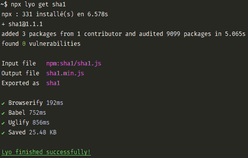
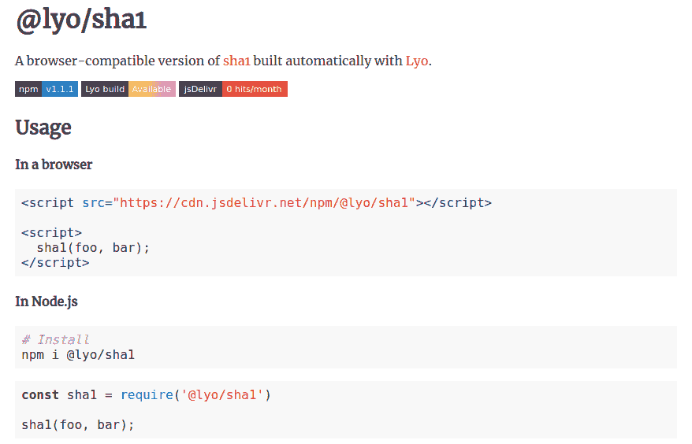

# 1000 颗星以下的牛逼项目(3) - Lyo

> 原文：<https://dev.to/gmartigny/awesome-projects-under-1000-stars-3---lyo-2k93>

# [利奥](https://github.com/bokub/lyo)

Javascript 环境中最受赞赏的特性之一无疑是 [NPM](https://www.npmjs.com) 开源包的巨大选择。易于使用，(主要)可靠、快速、安全...它有许多很大的优势。

另一方面，即使是资深开发人员也最讨厌 node.js 和 javascript 浏览器引擎之间奇怪的二分法。这种语言提供了在后端和前端运行相同代码的可能性，但是我们从来没有完全实现它的无缝运行。

[T2】](https://res.cloudinary.com/practicaldev/image/fetch/s--WWGmL3eJ--/c_limit%2Cf_auto%2Cfl_progressive%2Cq_auto%2Cw_880/https://user-images.githubusercontent.com/17952318/44954822-2055cc80-aea9-11e8-9ebd-b10619f80171.png)

Lyo 旨在填补这一空白。这个工具可以将任何 node.js 包转换成一个文件浏览器库。让我们通过一个例子来看看它是如何运行的。

首先，我在 NPM 上随机选择了一个我想放在浏览器上的包。Javascript 缺少的一个常见特性是原生加密，所以我选择了 [sha1](https://www.npmjs.com/package/sha1) 。假设我想将这个散列脚本添加到一个普通的 HTML 页面中。

由于 [npx](https://www.npmjs.com/package/npx) 的存在，我甚至不用安装 Lyo，直接运行:

```
npx lyo get sha1 
```

Enter fullscreen mode Exit fullscreen mode

[T2】](https://res.cloudinary.com/practicaldev/image/fetch/s--ZuPn5QBO--/c_limit%2Cf_auto%2Cfl_progressive%2Cq_auto%2Cw_880/https://thepracticaldev.s3.amazonaws.com/i/3o3knp6z45jbsx675d9j.png)

从上到下，我们可以看到:

*   Lyo 是 6.5s 安装的
*   在 sha1 版本 1.1.1 上运行
*   它读取文件 sha1.js
*   输出名为 sha1.min.js 的文件
*   命名库`sha1`
*   Browserify、Babel 和 Uglify 已成功运行
*   Lyo 终止，没有错误

然后，我可以简单地将输出文件添加到我的 HTML 页面中。

```
<script src="sha1.min.js"></script>
<script>
console.log(sha1("P@ssWord")); // => 56355fa0c17cb7f9dc0d936f6c7aa385114ee097
</script> 
```

Enter fullscreen mode Exit fullscreen mode

这多容易啊！

还不够简单吗？你甚至不想打开你的终端？Lyo 会保护你的。在自己喜欢的浏览器上打开 [lyo.now.sh](https://lyo.now.sh/) ，输入想要编译的包名。Lyo 将负责一切，并输出如何通过 CDN 或 node.js 使用这个包。

[T2】](https://lyo.now.sh/sha1)

另一方面，为什么不给用户提供 node.js 包的浏览器版本呢？当然，你可能已经使用了 Browserify 或 Webpack，但你现在可以将所有工作委托给 Lyo。

打开你的项目文件夹，然后运行:

```
npx lyo init
npm install 
```

Enter fullscreen mode Exit fullscreen mode

Lyo 将编辑`package.json`文件，将其自身添加为依赖项，并添加一个脚本来执行它。
现在，每次你在 NPM 上发表作品，都会被打包在一个文件里。然后这个文件可以直接下载或者通过类似 [jsDelivr](https://www.jsdelivr.com/) 或者 [unpkg](https://unpkg.com/#/) 这样的 CDN 下载。

一些警告，Lyo 不能确保它的输出在浏览器环境下工作。例如，使用文件系统或任何仅节点功能的包将不能在浏览器上运行。此外，Browserify 对 ES6 功能的使用非常固执，比如[导入/导出](https://github.com/browserify/browserify/issues/1186)。这意味着你不能使用 node.js 上一版本不支持的语法。

我真的很喜欢如此复杂的过程可以如此容易地使用。不管你喜不喜欢 NPM 的极度模块化，Lyo 都能让你驾驭这种力量。

下个月再见。