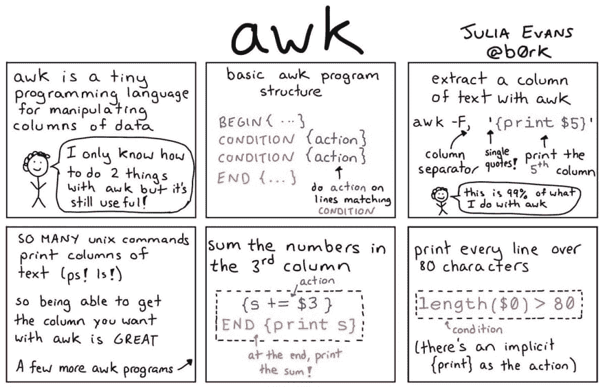

# Awk -一个有用的小语言

> 原文：<https://dev.to/rrampage/awk---a-useful-little-language-2fhf>

Awk 是一种小型但功能强大的编程语言，用于处理文本。它是由贝尔实验室的 Aho，Weinberger，Kerninghan 开发的。

[茱莉亚·埃文斯](https://twitter.com/b0rk)为`awk`做了一个很棒的介绍:
[](https://res.cloudinary.com/practicaldev/image/fetch/s--YxKHSWq2--/c_limit%2Cf_auto%2Cfl_progressive%2Cq_auto%2Cw_880/https://pbs.twimg.com/media/DeLcVfSWAAAw6OZ.jpg)

Awk 将输入文件扫描成一系列的行，并将每一行分割成字段。字段分隔符通常是空白，但是您可以将其自定义为任何字符。

一个`awk`程序是一系列**模式-动作**对，即对于每一行，它检查是否与模式匹配，如果匹配，它在该行上执行相关动作。Awk 可以交互使用，也可以运行保存的程序。

下面是 Awk 用类似 Python 的伪代码写的内容:

```
initialize() # Initializes variables in BEGIN block for line in input_lines: # Awk divides file / input into a list of lines
    for condition, action in conditions: # A program is a list of condition-action pairs
        if condition(line): #match line against condition
            action() #perform action on match 
```

Enter fullscreen mode Exit fullscreen mode

以下是 Awk 的一些小片段:

#### 1。你好世界！

您可以内嵌或通过一个文件运行`awk`程序:

```
awk 'BEGIN{ print "Hello, World!"}' 
```

Enter fullscreen mode Exit fullscreen mode

或者，您可以将其保存到文件`hello.awk` :

```
BEGIN{ print "Hello, World!"} 
```

Enter fullscreen mode Exit fullscreen mode

然后作为`awk -f hello.awk`运行它

#### 2。读取 CSV 并打印特定列

让我们现在做些有用的事情吧！下载这个 [csv](https://data.lacity.org/api/views/nxs9-385f/rows.csv) 是 2010 年洛杉矶市邮政编码的人口普查数据。

读取 csv 的前 3 行:`head -3 2010_Census_Populations_by_Zip_Code.csv`

```
Zip Code,Total Population,Median Age,Total Males,Total Females,Total Households,Average Household Size
91371,1,73.5,0,1,1,1
90001,57110,26.6,28468,28642,12971,4.4 
```

Enter fullscreen mode Exit fullscreen mode

我们将使用`awk -F, '{print $2}' 2010_Census_Populations_by_Zip_Code.csv`只打印总计列

`-F,`将字段分隔符设置为逗号，因为我们需要用逗号分隔来获取 CSV 文件中的字段。`$n`允许您使用第 n 列中的值。

#### 3。计算一些统计数据

Awk 允许使用变量和函数。让我们通过计算整个城市的总人口来看看如何使用它们。

```
# total.awk
{s += $2}
END {print "Total population:", s} 
```

Enter fullscreen mode Exit fullscreen mode

默认情况下，变量初始化为 0。这里，我们使用一个变量`s`来保存总数。

运行这个脚本为 **`awk -F, -f total.awk 2010_Census_Populations_by_Zip_Code.csv`** ，我们得到输出:`Total population: 10603988`

#### 特殊变量和内置函数

Awk 使用一些特殊的变量和函数使你的程序更加紧凑:

*   **NF** :一行中的字段数
*   **NR** :行号
*   **$0** :整个输入行
*   **length** :给出一个字符串中的字符数

现在，我们将计算平均家庭规模，即总人口除以总家庭数。感兴趣的列是$2 和$6。我们还需要每个邮政编码的平均人口。我们的剧本:

```
# stats.awk
{ s += $2; h += $6;}
END {print "Total population:", s, "\nTotal households:", h, "\nAverage household size:", s/h, "\nAverage population per zip code:", s/NR} 
```

Enter fullscreen mode Exit fullscreen mode

`NR`给出了总行数。但是我们不想要标题行。我们可以使用`tail`命令跳过第一行作为`tail -n +2`。运行 **`tail -n +2 2010_Census_Populations_by_Zip_Code.csv | awk -F, -f total.awk`** 给出了我们:

```
Total population: 10603988
Total households: 3497698
Average household size: 3.0317
Average population per zip code: 33241.3 
```

Enter fullscreen mode Exit fullscreen mode

#### 4。模式匹配

到目前为止，我们已经用 awk 做了一些有用的事情，但是我们忽略了它最大的优势——模式匹配。我们可以根据字段值、正则表达式和行号进行匹配。

*   每隔 2 行打印: **`NR%2 == 0 {print $0}`** 。这里$0 代表整行。
*   打印人口> 100，000 的所有邮政编码: **`$2 > 100000 {print $1}`**
*   打印人口> 10，000 且平均家庭规模> 4 的所有邮政编码: **`$2 > 10000 && $7 > 4 { print $1}`** 。我们可以使用分别代表逻辑**和**以及**或**的`&&`和`||`来组合条件。

### 进一步阅读

Awk 还有很多功能。以下是一些参考资料:

*   学习 Awk 的最佳资源是由同一三人组编写的 AWK 编程语言。这本书超越了典型的编程语言教程，教你如何使用 Awk 的超能力来构建通用系统，如关系数据库、解析器、解释器等。

*   有效 Awk 编程的 GNU Awk 手册是一个全面的参考。