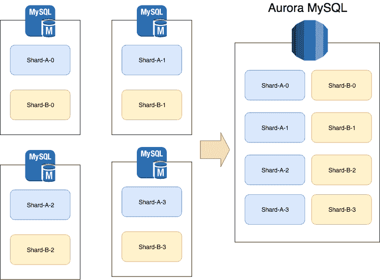

# 使用 AWS 数据库迁移服务降级数据库

> 原文：<https://dev.to/gumi/aws-database-migration-service-26eh>

本文以“[挑战使用 AWS 数据库迁移服务水平分割的数据库退化的故事](https://qiita.com/migimigi_/items/76ae6ef8b75df11a41e2)”为基础进行了修改和整理。

# Summary

[使用 AWS Database Migration Service](https://aws.amazon.com/jp/dms/) ( DMS )计划精简水平分割的数据库( DB )实例时，在验证中发现了似乎有问题的东西，所以 **这篇文章总结了关于在验证 DMS 时遇到的故障和对策的笔记。 这次报道中说明的内容，虽然有与实际环境模糊的地方，但请原谅。**

*在之后的说明中使用的“维护”一词是指游戏系统的维护，与 AWS 端的维护不同。

## Motivation

通常，DB 基本上在规格不足时进行扩展来应对。 株式会社 gumi 为了能够承受更大规模的负荷，进行了水平分割，并同时使用了向外扩展。 在规模扩大时没有问题，但如果所需的负载下降，或者服务的使用方式发生了变化，导致其他子系统组受到负载，则需要适当地缩小规模。

此次降级计划将 4 个 RDS MySQL5.6 实例合并为一个 Aurora MySQL5.6 集群(图 001 )。

#### t0.t1 .将四个 rds MySQL 5.6 实例添加到一个 Aurora MySQL5.6 集群

[T2】](https://res.cloudinary.com/practicaldev/image/fetch/s--vLqwY88Y--/c_limit%2Cf_auto%2Cfl_progressive%2Cq_auto%2Cw_880/https://thepracticaldev.s3.amazonaws.com/i/ooa8p0gbcoqe0avntr11.png)

由于需要负载的部分变成了其他子系统，该实例组的利用率急剧下降，因此进行了规模缩小。 这一次，由于不再有合适的扩展目标实例大小，因此制定了扩展计划。 由于 DB 的规模缩小可以在短时间内完成，所以可以在通常的维护时间中顺利进行，但规模缩小存在问题。

进行扩展时，通常在维护开始后从削减对象实例开始`mysqldump`，进行向保留的实例 import 的作业。 但是这次的情况下，原来的台数也多达 4 台，容量也是每台 150GB 左右，DB 内的记录数也很有规模。 使用`mysqldump`的向内扩展方法预计需要十几个小时，存在无法在可允许的维护时间内完成的问题。 那个时候知道了 DMS 的存在，想着是否可以使用这个服务来退缩，进行了调查和计划。

## 什么是 DMS

可以在数据库保持在线的情况下从源迁移到目标的服务。 当初我以为这是一种用于从就地数据库迁移到 RDS 的服务，但不知什么时候功能越来越多了。 例如，当前可以选择的源包括(摘自“[数据迁移的源](https://docs.aws.amazon.com/ja_jp/dms/latest/userguide/CHAP_Source.html)) :

*   现场和 EC2 实例上的数据库
    *   Oracle 10.2 版或更高版本，11g，12.2 版或更高版本
    *   Microsoft SQL server 2005、2008、2008R2、2012、2014 和 2016 版
    *   MySQL 版本 5.5、5.6、5.7
    *   Maria db (支持作为 MySQL 兼容数据源)
    *   PostgreSQL 9.4 以降
    *   SAP 自适应服务器企业(ASE) バージョン12.5、15、15.5、15.7、16 以降
    *   MongoDB 2.6.x 和 3.x 及更高版本
*   微软 Azure
    *   azure SQL 数据库(部分限制)
*   亚马逊 RDS
    *   Oracle 11 g 和 12c 版
    *   Microsoft SQL Server 版本 2008 R2、2012、2014 (部分限制)
    *   MySQL 5.5 版、5.6 版、5.7 版( 5.5 有部分限制)
    *   PostgreSQL 9.4 或更高版本(部分限制为小于 9.4.9 和 9.5.4 )
    *   Maria db (支持作为 MySQL 兼容数据源)
    *   Aurora MySQL
*   亚马逊 S3

这样，大多数数据库都可以是源。 连 MongoDB 和 S3 都可以做成调味汁，这让我很惊讶。 目标与上述列表大致相同，但存在以下差异(摘自《[数据迁移目标](https://docs.aws.amazon.com/ja_jp/dms/latest/userguide/CHAP_Target.html)) :

*   可以源，但不能目标
    *   MongoDB
    *   Azure 女士上のAzure SQL 数据库
*   源是不可能的，但目标是可能的
    *   Aurora PostgreSQL
    *   红移
    *   DynamoDB

[从 MongoDB 向 DynamoDB 的转移](https://aws.amazon.com/jp/about-aws/whats-new/2017/04/aws-database-migration-service-adds-support-for-mongodb-and-amazon-dynamodb)的用途中也可以使用 DMS，如果努力映射的话，也可以实现[从 MySQL 向 DynamoDB 的转移](https://docs.aws.amazon.com/ja_jp/dms/latest/userguide/CHAP_Target.DynamoDB.html)。

### DMS 中重要的概念

DMS 的文档“[AWS 数据库迁移服务](https://docs.aws.amazon.com/ja_jp/dms/latest/userguide/Welcome.html)”的卷满分。 说明因为全部都读起来很辛苦，所以想先控制这里的概念和地方。

*   [复制实例](https://docs.aws.amazon.com/ja_jp/dms/latest/userguide/CHAP_ReplicationInstance.html)

    *   从源读取并导出到目标的实例
        *   确切地说是用于移动复制任务的实例
    *   为了用 DMS 进行转移，必须要。
    *   必须设置可以访问源和目标的安全组。
*   [任务](https://docs.aws.amazon.com/ja_jp/dms/latest/userguide/CHAP_Tasks.Creating.html)

    *   定义在复制实例上运行的迁移
    *   按三对指定源、复制实例和目标。
    *   可以为任务选择三种迁移方法。
        *   将数据迁移到目标数据库(完全加载)。
            *   将任务开始时的源内容迁移到目标。 这被称为满负荷( FL )。
        *   在迁移过程中捕获更改(全加载和 CDC )。
            *   完全加载后开始连续复制。 此复制在文档中称为更改数据捕获( CDC )
            *   在线迁移时，在完全加载期间发生的源位置更改当然不会迁移到目标位置。
                *   复制实例缓存了所做的更改，并在完全加载后应用缓存的更改后开始复制。
        *   仅将数据更改复制到源数据库。
            *   将自任务开始以来的源端更改复制到目标(不能用于迁移用途，因此不再赘述)。
*   满负荷( FL )

    *   目标为 MySQL 或 Aurora MySQL 时，通过 CSV 获取来自源的数据，显示了[`LOAD DATA INFILE`](https://dev.mysql.com/doc/refman/5.6/ja/load-data.html)的行为。
*   更改数据捕获( CDC )

    *   通过 CloudWatch 的度量可以在一定程度上了解进度。

> 例如，可以通过将`CDCLatencySource`值与`CDCLatencyTarget`值组合来检查任务的总延迟(副本滞后)。
> *根据“[数据迁移服务度量](https://docs.aws.amazon.com/ja_jp/dms/latest/userguide/CHAP_Monitoring.html#CHAP_Monitoring.Metrics)”

*   [任务验证](https://docs.aws.amazon.com/ja_jp/dms/latest/userguide/CHAP_Validating.html)

    *   可以按任务单位选择启用或禁用的选项，默认情况下禁用。
    *   启用后，在 FL 后，开始验证源数据和目标数据，并逐行进行比较以检测不匹配。
        *   还验证 CDC 时的增量更改。
    *   如果启用，则会对源和目标发出查询，并在任务端进行比较，从而导致源、复制实例和目标的负载高于禁用。
*   [表映射](https://docs.aws.amazon.com/ja_jp/dms/latest/userguide/CHAP_Tasks.CustomizingTasks.TableMapping.html)

    *   可以按任务单位选择启用或禁用的选项，默认情况下禁用。
    *   通常，在 DMS 中，缺省情况下会迁移所有源数据库和表(称为 MySQL )。
        1.  直接转移的话，数据库名和表名会冲突。
        2.  有不需要迁移的数据库和表。
            *   在这种情况下指定。
    *   您已设置了仅针对在此迁移情况下需要迁移的数据库的表映射。

## DMS 的制约

读到这里，DMS 看起来具有如下所示的短时间维护就能完成的优秀功能。

1.  使用“在迁移过程中捕获更改”迁移方法从四个源迁移到一个目标。
2.  FL 完成后，通过 CDC 进入复制，目标赶上源后，进入维护，对源的更新停止。
3.  确保“验证任务”成功迁移，并且 CDC 的复制副本标志为 0。
4.  将源的`AUTO_INCREMENT`值迁移到目标。
5.  将指向 APP 应用程序端数据库的端点从源重写为目标。
6.  动作确认后，维护结束。

但是，由于 DMS 本身有很多限制，所以没有那么简单。

> AWS DMS 创建执行迁移所需的目标方案对象。 但是，AWS DMS 采用的是最低限度的方法，因此只创建有效迁移数据所需的对象。 这意味着 AWS DMS 会创建表、主键和某些唯一索引，但不会创建有效地从源迁移数据所不需要的其他对象。 例如，不会创建次索引、非主键约束和数据缺省值。
> *根据“[AWS DMS 的概要](https://docs.aws.amazon.com/ja_jp/dms/latest/userguide/CHAP_Introduction.html#CHAP_Introduction.HighLevelView)”

也就是说，DMS 为您提供的是一个数据库，其中包含的内容已集成，但没有任何非主键索引，也没有缺省值。 如果就这样转移的话，系统会瞬间停止运作。

据我们所知，以下内容不会通过 DMS 从 MySQL5.6 迁移到 Aurora MySQL5.6 (可能还存在泄漏) :

1.  辅助索引(通常只称为索引)
2.  默认值
3.  列的`AUTO_INCREMENT`属性(请参见[使用 MySQL 数据库作为 AWS DMS 源的限制](https://docs.aws.amazon.com/ja_jp/dms/latest/userguide/CHAP_Source.MySQL.html#CHAP_Source.MySQL.Limitations))
4.  `AUTO_INCREMENT` Qi
5.  分区
6.  视图
7.  特利迦
8.  存储过程

因为我们的系统中没有使用的属性也很多，所以这次我们决定自己转移使用的上述 1 到 4。

### 在 DMS 中不转移的转移

首先，不会迁移的这四个操作都属于 DDL 操作，请参阅《MySQL 5.6 参考手册》14.11.1「 [在线 DDL 概述](https://dev.mysql.com/doc/refman/5.6/ja/innodb-create-index-overview.html)》。 首先，接下来的两个瞬间结束。

*   默认值
    *   设置列的默认值。
        *   只更改`.frm`文件，而不是数据文件。
*   `AUTO_INCREMENT` Qi
    *   更改列的自动增量值。
        *   更改存储在内存中的值，而不是数据文件。

`AUTO_INCREMENT`为了保持值的一致性，最好进入维护，确认源端没有更新后再设定为目标。

*   列的`AUTO_INCREMENT`属性

这是一项向主键列赋予`AUTO_INCREMENT`属性的任务。 即使是 DMS，主键也会迁移。 老实说，我还以为这只是一瞬间的事情，但是因为所做的是`ALTER TABLE tbl MODIFY col type AUTO_INCREMENT`，所以在刚才在线 DDL 概要中的“变更列的数据类型”时，会强制进行表复制。 以下是`SHOW PROCESSLIST`的结果

```
362 dms 192.0.2.1:4397  shard-A-0   Query   3   copy to tmp table   ALTER TABLE `example1` MODIFY `id` int(11) NOT NULL AUTO_INCREMENT 
```

Enter fullscreen mode Exit fullscreen mode

作为对策，事先用`mysqldump --no-data`获取源的模式，将其流入目标，然后在任务定义中选择“如果目标中已经存在表，则进行`TRUNCATE`”，从而将列的`AUTO_INCREMENT`属性作为后续时间

剩下的只有辅助索引，这将在下面详细说明。

### 怎样才能缩短 ADD INDEX 的维护时间

索引本来就是一项繁重的任务。 在 MySQL5.6 (和兼容的 Aurora MySQL )中可以就地赋予，但只有在大小较小的桌子时，才能在巨大的桌子上进行桌子复制<sup id="fnref2">[2](#fn2)</sup> 。 而且最重要的是需要 CPU 功率。 验证了在什么时候做`ADD INDEX`最合适。

1.  FL→CDC→维护→ `ADD INDEX`
    *   好处
        *   确定性高
            *   当初计划就这样转移
    *   坏处
        *   `ADD INDEX`需要很长时间
            *   当初预计 20 小时
                *   因为 CPU 是瓶颈，所以使用了现在最好的 16xlarge，但是没有比想象的缩短
        *   `ADD INDEX`花费时间的话，维护时间会延长，所以不采用
2.  模式流入(带索引定义)→FL→CDC→副本碎片确认→维护
    *   好处
        *   如果从一开始就注入大纲的话，剩下的 DMS 就会全部转移
        *   维护时间只需端点改写即可
    *   坏处
        *   满载太慢，中途停止
            *   1 号通常方法的 FL 为 10 小时左右，这种方法即使做了 100 小时也能否转移 6 成的进度
            *   `show engine innodb status`表示等待大量事务处理
            *   很难大量插入到带索引的桌子中
3.  FL→ `ADD INDEX`→CDC→复制品确认→维护<sup id="fnref3">[3](#fn3)</sup>
    *   好处
        *   即使`ADD INDEX`延长，系统也是在线的，所以没有问题
        *   维护时间只需端点改写即可
    *   坏处
        *   列的`AUTO_INCREMENT`属性赋予比想象的要晚
4.  模式流入(无索引定义)→FL→ `ADD INDEX`→CDC→副本标志确认→维护
    *   好处
        *   即使`ADD INDEX`延长，系统也是在线的，所以没有问题
        *   维护时间只需端点改写即可
        *   列的`AUTO_INCREMENT`缩短属性时间
    *   坏处
        *   没什么特别的

# Result

在到目前为止的验证中，按照前项 4 的步骤进行的话，可以在短的维护时间内缩短，制定了计划，构筑了生产前提的环境。 但是，在构建过程中，我们发现在源上有生产负载的情况下进行 DMS 迁移会产生大量验证错误，迁移暂时中断。 在联系 AWS 支持的同时，正在讨论不使用 DMS 的降级方法。

## Prepare for the exam

### 应该注意的事情

*   如果复制实例没有指定可以连接到源和目标的适当安全组，连接测试将失败。
*   将 RDS MySQL5.6 作为源的注意事项
    *   如果将自动备份设置为 0 天，则原本就不会创建二进制日志，因此即使将其指定为源也不会移动。
    *   要使用 CDC，必须增加二进制日志保留时间。
        *   `call mysql.rds_set_configuration('binlog retention hours', 24);`
            *   您必须是特权用户才能提交此查询。
            *   因为会比平时更好地保留二进制日志，所以会消耗更多的存储空间。
    *   需要将`binlog_format`设为 ROW。
        *   可以通过 RDS 的参数组进行设置。
            *   因为是动态的，所以不重新启动 RDS 就可以变更设定。
        *   性能可能会低于默认的`MIXED`。

### 幸亏提前去了

*   启用 DMS 任务日志。
    *   如果需要多个任务的话，哪怕只有一个也可以，所以要启用。
        *   任务无法开始，在发生任务错误时非常有用。
        *   不戴的话经常什么都得不到信息。
*   启用任务验证。
    *   虽然为时已晚，但谁都可以清楚地看到数据迁移成功。

### 今后应该研究的事情

*   使用适当加载的源创建验证环境。
    *   似乎最好在生产实例上创建读复制副本，并将其作为源。
        *   也可以设置与生产不同的参数组。
    *   因为 RDS MySQL 可以轻松创建 Aurora 读取副本，所以 Aurora to Aurora 也值得一试。
*   `AUTO_INCREMENT`属性赋予很慢，所以本来想避免的，但是`ALTER TABLE`语句本来可以对一个表写多个变更( 13.1.7「 [ALTER TABLE 语法](https://dev.mysql.com/doc/refman/5.6/ja/alter-table.html))。
    *   `ADD INDEX`和`ADD UNIQUE KEY`总结为 1 句，`MODIFY col type AUTO_INCREMENT`也总结了不是很好吗？
*   不使用 DMS 任务验证功能，自行实现来验证数据。
    *   在 2018 年 8 月 3 日召开的“[从 FGO 等大规模游戏的课题中学习的游戏服务器基础设施学习会](https://connpass.com/event/91736/)”上发表的日光之王甲的幻灯片中有很有趣的内容。
    *   FGO 为了水平分割数据库而验证和使用了 DMS，但根据要求无法使用 DMS 任务验证功能。
    *   因此[数据的一致性是准备校验和表并在那里验证的](https://www.slideshare.net/hideakikabuto/db-108716671/65)。
    *   这次我们的数据库退化任务卡在了 DMS 任务的验证功能中，所以我想为了避免这种情况，也有自行实现的方法。
        *   但是，当然，因为需要验证安装的工时和其验证结果是否正确，所以不容易选择。

### 经常在 DMS 上阅读的文档

*   aws 数据库迁移服务仕組み
*   AWS 数据库迁移服务のコンポーネント
*   “[AWS 数据库迁移服务的最佳实践](https://docs.aws.amazon.com/ja_jp/dms/latest/userguide/CHAP_BestPractices.html)”
*   [创建任务](https://docs.aws.amazon.com/ja_jp/dms/latest/userguide/CHAP_Tasks.Creating.html)
*   [验证 AWS DMS 任务](https://docs.aws.amazon.com/ja_jp/dms/latest/userguide/CHAP_Validating.html)
*   “[用作 MySQL 兼容数据库的 AWS DMS 源](https://docs.aws.amazon.com/ja_jp/dms/latest/userguide/CHAP_Source.MySQL.html)”
*   』 [AWS BlackBelt 在线研讨会 2017 AWS 数据库迁移服务](https://www.slideshare.net/AmazonWebServicesJapan/20170919-aws-blackbelt2017dms)

* * *

1.  之所以选择`TRUNCATE`，是因为觉得重置`AUTO_INCREMENT`的值比较好，也许 Do nothing 也没关系。 DROP 会消除好不容易投入的模式，所以没有意义。

2.  在小桌子上可以进行就地`ADD INDEX`，在 200MB 左右的桌子上设置`ADD INDEX`为默认值(`ALGORITHM=INPLACE`)和`ALGORITHM=COPY`进行运行后，发现默认值快 7 倍左右。

3.  在 FL 后、CDC 前的时机进行索引没问题吗？ 但是，在创建公式任务的过程中，在“[全部加载完成后停止任务](https://docs.aws.amazon.com/ja_jp/dms/latest/userguide/CHAP_Tasks.Creating.html#w255aac23c15c11b6c11)”的设置中，选择“在应用缓存更改之前停止-在应用缓存更改之前停止任务”。 这样可以添加辅助索引，以加速更改的应用。 ”，我认识到这是符合 AWS 意图的动作。