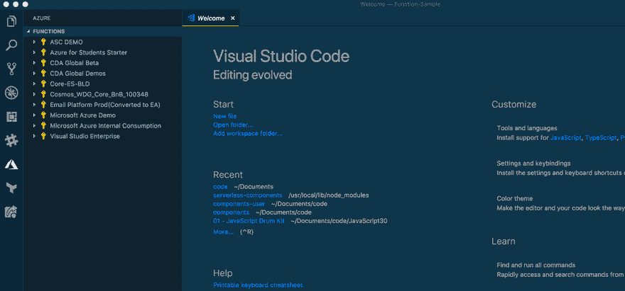

# Azure Functions ⚡关键特性开发者指南

> 原文：<https://dev.to/azure/azure-functions--a-developers-guide-to-key-features-2j0d>

### 如何入门 Azure 功能

[T2】](https://res.cloudinary.com/practicaldev/image/fetch/s--R0eQTBCY--/c_limit%2Cf_auto%2Cfl_progressive%2Cq_auto%2Cw_880/https://deanbryen.dev/img/feature-start.jpg)

作为一名开发人员，过去一年我一直专注于深入研究 Azure 函数。既然我有机会出来透透气，我想分享我的一些经验，以帮助其他开发人员踏上无服务器之旅。

我已经确定了几个我最喜欢的特性，这些特性使得开发功能即服务(FaaS)变得更加容易。请在评论中给我你的反馈——我很想听听作为一名无服务器开发人员，哪些特性将有助于改善你下一年的生活。

#### 简单的&原生开发者工具

虽然我是[无服务器框架](http://www.serverless.com)的超级粉丝，但他们对 Azure 的支持并不出色。这个框架目前只支持函数，而且是通过插件来实现的，这让它感觉有点像二等公民。虽然我对他们的[组件](https://github.com/serverless/components)项目抱有很高的期望——那是另一篇博客文章。

起初，我强烈要求为 Azure 开发一个等效的框架——这种方法可能仍然有争议。但是随着我对函数的深入研究，我已经成为 Visual Studio 代码的头号粉丝。

有了 VScode，我发现从工具内部完成所有事情是非常无缝的。这可以归结为几件事:

**VSCode 扩展和函数 v2.0 本地运行时**

任何使用过 VSCode 的人都会对这个扩展生态系统很熟悉——而且 VSCode 的[函数扩展也很扎实。这个扩展依赖于简单的命令行工具`azure-functions-core-tools`，所以你可以在本地运行 Azure Functions 运行时。另外，CLI 还可以独立于 VSCode 扩展使用。](https://marketplace.visualstudio.com/items?itemName=ms-azuretools.vscode-azurefunctions?WT.mc_id=blog-devto-debryen)

Azure Functions 的 v2.0 运行时是开源的，运行在。网芯。这意味着你在本地机器上安装的东西——无论是 Mac、Linux 还是 Windows——与你在 Azure Cloud 上获得的运行时完全相同。没有仿真器或模拟器试图模仿云提供商的行为。

使用本地运行时和扩展的组合，您可以创建一个函数项目，添加一些函数，在本地测试和调试它们，然后将它们发布到 Azure——只需几次点击或命令。一旦它开始运行，你可以简单地将日志从 Azure 中运行的函数直接传输到你的终端的 VSCode 中。

[T2】](https://res.cloudinary.com/practicaldev/image/fetch/s--TQ-MhVT---/c_limit%2Cf_auto%2Cfl_progressive%2Cq_66%2Cw_880/https://cdn-images-1.medium.com/max/1600/1%2AVMMw_vkW8KMMQ3dpz_m42A.gif)

#### 功能绑定

可悲的是，当人们谈论无服务器时，它往往围绕着功能即服务(*你的意思有点像这篇博客文章，迪恩？*😛).

FaaS 只是无服务器应用程序或架构的一部分。如果您真的想开发任何值得讨论的应用程序，您的功能可能需要与大量其他服务和系统集成和通信。它可以像访问存储容器或写入数据库一样简单——无论哪种方式，只使用 FaaS 都无法实现太多。

Azure 函数绑定为开发人员提供了一种简单的方法来集成一堆服务。这很棒，有几个原因。首先，更改数据库不再需要开发人员编辑功能代码中的业务逻辑——我们只需更新绑定配置。其次，它只是让你的代码更简单。

绑定有两种风格

1.  输入—这些发生在函数代码执行之前
2.  输出—这些发生在函数代码完成时。

有大量的[绑定支持](https://docs.microsoft.com/en-us/azure/azure-functions/functions-triggers-bindings#supported-bindings?WT.mc_id=blog-devto-debryen)，我经常使用其中的一些。首先，这里有一个简单快捷的例子，演示了如何使用 CosmosDB 绑定。

一个非常好的特性是能够在一个`function.json`文件中配置我们的绑定和我们的函数代码。这是我们的输入绑定，通过它的`id`从我们的 CosmosDB 集合中获取一个文档。

```
{
    "name": "cosmosDBInput",
    "type": "cosmosDB",
    "databaseName": "MyDatabase",
    "collectionName": "MyCollection",
    "id" : "{id}",
    "connectionStringSetting": "myCosmosDBAccount",     
    "direction": "in"
} 
```

为了与绑定进行交互，我们只需通过下面一些超级简单的代码按名称引用它。我使用的是 Javascript，但是任何一种受支持的语言都可以做到这一点。

```
module.exports = function (context) {   
    let data = context.bindings.cosmosDBInput;
    context.log(data);
    context.done();
}; 
```

我们还可以为输出绑定做一些非常类似的事情。下面是如何将单个文档写入 cosmosDB 集合的方法。

首先，我们需要`function.json`
中的绑定配置

```
{
    "name": "puppyData",
    "type": "cosmosDB",
    "databaseName": "MyDatabase",
    "collectionName": "MyCollection",
    "createIfNotExists": true,
    "connectionStringSetting": "myCosmosDBAccount",     
    "direction": "out"
} 
```

接下来，我们可以简单地在函数代码中使用绑定:

```
module.exports = function (context) {
      context.bindings.puppyData = { 
        id: 1,
        name: "Rover",
        breed: "Great Dane",
        address: "Big Dawg House, Paw Lane, London"
      };
      context.done();
}; 
```

如果你使用函数，你会想要使用绑定。

#### 内置 HTTP 触发器

在与其他云提供商合作之后，除了我的功能之外，总是需要安装某种形式的 API 网关，这样我就可以通过 HTTP 服务 web 请求。

我完全支持 API 管理和网关服务——它们可以给你的 API 带来很多价值。但是对于某些用例来说，它们有点过头了，尤其是如果您只想通过 HTTP 本地调用函数的话。

有了 Azure Functions，这个特性就开箱即用了。您只需要为您的函数提供一个 HTTP 触发器，然后您就可以直接从 web 上调用它。

不要惊慌，这并不意味着任何人都可以调用你的函数。您可以为 HTTP 调用选择三个授权级别之一:`anonymous`、`function`或`admin`。后两者需要一把钥匙来通过网络调用该功能。

就像绑定一样，我们可以将 HTTP 触发器的配置和代码放在`function.json`文件中——看起来就像绑定一样。这里有一个你的文件的例子:

```
"bindings": [
    {
      "authLevel": "anonymous",
      "type": "httpTrigger",
      "direction": "in",
      "name": "req"
    },
    {
      "type": "http",
      "direction": "out",
      "name": "res"
    }
] 
```

现在，您可以简单地通过名称`req`在代码中引用 HTTP 触发器。需要注意一件有趣的事情 HTTP 响应实际上只是使用了`http`输出绑定。

#### 函数代理

虽然 HTTP 触发器为您提供了一个简单的 web 调用，但是如果您需要比 HTTP 触发器多一点的东西——但是比一个完整的 API 网关少一点呢？

函数代理为开发者提供了轻量级 API 网关的能力——就在你的函数应用中。与触发器和绑定类似，配置与您的代码一起保存在一个`proxies.json`文件中。最简单的形式是，函数代理配置看起来像这样:

```
{
    "$schema": "http://json.schemastore.org/proxies",
    "proxies": {
        "proxy1": {
            "matchCondition": {
                "methods": ["GET"],
                "route": "/api/{test}"
            },
            "backendUri": "https://<AnotherApp>.azurewebsites.net/api/<FunctionName>"
        }
    }
} 
```

在这个例子中，我们只是将代理路由到一个函数作为后端。函数代理还支持诸如请求和响应覆盖之类的东西，所以您可以像处理大多数企业 API 网关一样处理 HTTP 请求。

函数代理在很多事情上非常方便，尤其是 1)避免跨源资源共享(CORS)的问题，以及 2)模仿 API 响应。

**避免 CORS 问题**

我在 Azure Blob 存储中构建了许多单页面应用程序(spa)。每当我将它们连接到我的函数时，我通常会遇到 CORS 错误，因为它们驻留在不同的域中。

有几种方法可以解决这个问题。一种方法是更新功能应用程序中的 CORS 设置，以接受存储容器的域。或者……你可以简单地为你的函数和 Azure Blob 使用函数代理——所以你基本上是把它们放在同一个域上。不再有 CORS 错误。 *TADA！*

要使用函数代理来避免 CORS 问题，只需将存储容器的 URI 作为代理配置的`backendUri`。这里有一个例子:

```
{
    "$schema": "http://json.schemastore.org/proxies",
    "proxies": {
        "proxy1": {
            "matchCondition": {
                "methods": ["GET"],
                "route": "/"
            },
            "backendUri": "https://myserverlessapp.z6.web.core.windows.net/index.html"
        },
        "proxy2": {
            "matchCondition": {
                "methods": ["GET"],
                "route": "/media/{*restOfPath}"
            },
            "backendUri": "https://myserverlessapp.z6.web.core.windows.net/media/{*restOfPath}"
        }
    }
} 
```

**模仿 API 响应**

Azure Functions proxy 也为你的 API 提供了一个简单的模仿响应的方法。你基本上可以创建一个函数代理，不要给它一个后端 URI，然后你使用`requestOveride`特性来返回你嘲笑的响应。交给你前端开发！这里有一个例子:

```
{
    "$schema": "http://json.schemastore.org/proxies",
    "proxies": {
        "proxy1": {
            "matchCondition": {
                "methods": ["GET"],
                "route": "/api/hello"
            },
            "requestOveride" : {
                "response.statusCode": "200",
                "response.body": "{ \"message\": \"Hey There\" }"
            }
        }
    }
} 
```

#### [T1】你有什么想法？](#whats-your-thoughts)

我希望你喜欢了解这些特性——它们让我作为开发人员使用 Azure 功能的体验变得更加愉快。

哪些功能让你的生活变得更轻松？你对 Azure 功能的愿望清单上有哪些特性？我很乐意在下面的评论中听到你的意见，或者在 Twitter 上联系我，地址是 [@deanbryen](https://twitter.com/deanbryen) 。