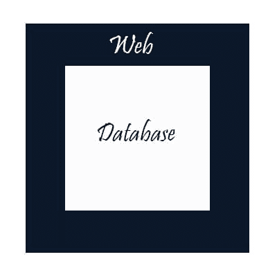
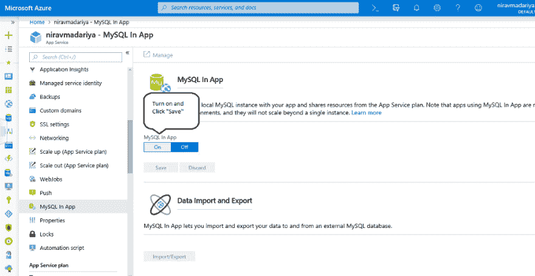
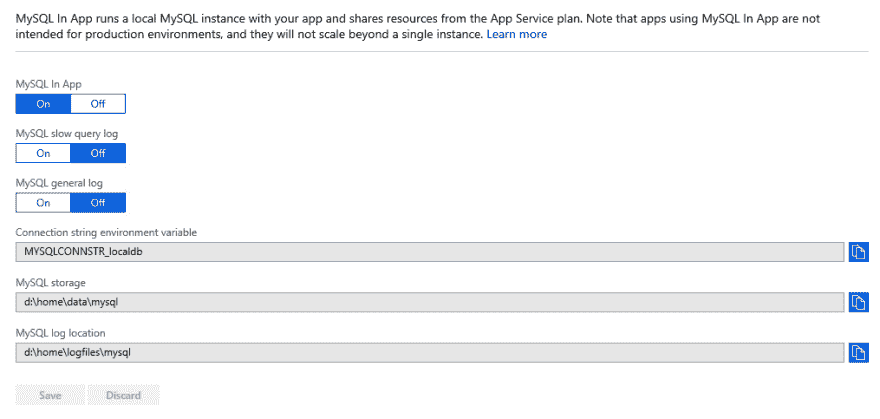

# Azure MySQL in App for App services

> 原文：<https://dev.to/niravmadariya/azure-mysql-in-app-for-app-services-4odm>

当你的网站需要一个数据库时，为什么要购买一个单独的数据库服务呢？

<figure>[](https://res.cloudinary.com/practicaldev/image/fetch/s--RZnLyDlz--/c_limit%2Cf_auto%2Cfl_progressive%2Cq_auto%2Cw_880/https://cdn-images-1.medium.com/max/400/1%2AYfki03qFEIyx1vIPvgzh3A.jpeg)

<figcaption>MySQL in app in Azure app service</figcaption>

</figure>

2017 年 3 月宣布推出 MySQL in app。Azure 在你的 web 应用(应用服务)中提供 MySQL，Azure 中的每个 web 应用都有 MySQL in app 作为选项。对于 [Windows](https://azure.microsoft.com/en-us/blog/mysql-in-app-preview-app-service/) ，在应用服务中托管 MySQL 是可用的。

请注意，这可以用于小型项目或开发/测试项目，当转移到生产时，您可能希望考虑用于 MySQL 的 [Azure database，这是企业就绪、完全托管的社区 MySQL 数据库。](https://azure.microsoft.com/en-in/services/mysql/)

**入门:**

默认情况下，您创建的每个应用程序服务都会禁用此选项。为了在应用程序数据库中使用 MySQL，您需要在 web 应用程序设置中启用它，如下所示:

<figure>[](https://res.cloudinary.com/practicaldev/image/fetch/s--p7dUcbZt--/c_limit%2Cf_auto%2Cfl_progressive%2Cq_auto%2Cw_880/https://cdn-images-1.medium.com/max/1024/1%2A1QdWOWmE1XuRDynvz87GJQ.png) 

<figcaption>为 Azure app 服务在 app 中启用 MySQL</figcaption>

</figure>

启用它后，等待几分钟来启用您的 web 应用程序的某些服务，其中包括一些很酷的东西，如 [phpmyadmin](https://www.phpmyadmin.net/) 。

启用后，您将看到如下屏幕:

<figure>[](https://res.cloudinary.com/practicaldev/image/fetch/s--fcCYYmw7--/c_limit%2Cf_auto%2Cfl_progressive%2Cq_auto%2Cw_880/https://cdn-images-1.medium.com/max/1015/1%2AN5FyoH-D79YEnwuFUbU_6A.png) 

<figcaption>MySQL 中的 App 设置</figcaption>

</figure>

为了保护您的应用程序和 MySQL 数据库之间的连接，您有一个名为“MYSQLCONNSTR _ localdb”的环境变量，它包含作为应用程序中 MySQL 数据库的连接字符串的值。

现在，访问你的 phpmyadmin 进入:[https://. SCM . azure websites . net/phpmyadmin](https://yoursite.scm.azurewebsites.net/phpmyadmin)。你现在有 phpmyadmin 了，这意味着你可以开始使用 MySQL 数据库了。

您可以在应用程序 MySQL 中连接到，如下:

```
<?php 
    //below will give the whole connectionstring in a single string
    $conn = getenv("MYSQLCONNSTR\_localdb"); 

    //Let's split it and decorate it in an array
    $conarr2 = explode(";",$conn); 
    $conarr = array();
    foreach($conarr2 as $key=>$value){
        $k = substr($value,0,strpos($value,'='));
        $conarr[$k] = substr($value,strpos($value,'=')+1);
    }
    // $conarr is an array of values of connection string
    print\_r($conarr); 
?> 
```

好了，现在你可以在你的应用服务中找到 MySQL 的连接细节，现在你可以使用 **mysqli_*** 函数或者 **PDO** 来执行 CRUD 操作等等。

希望这篇文章已经让你清楚了 MySQL 在 Azure 应用服务中的概念。如果你想和我联系，你可以在推特上给我发短信，号码是[https://twitter.com/niravmadariya](https://twitter.com/niravmadariya)

如果你喜欢这篇文章，请不要忘记为它鼓掌。很快我们会在 Azure 中看到更多概念:)

**下一个:**

*   询问 MSP(微软学生合作伙伴)下一步做什么
*   开始学习 [Azure 云开发](https://docs.microsoft.com/en-us/learn/#!jobf=Developer&lang=1033)
*   参见 [Azure 文档](https://docs.microsoft.com/en-us/azure/)