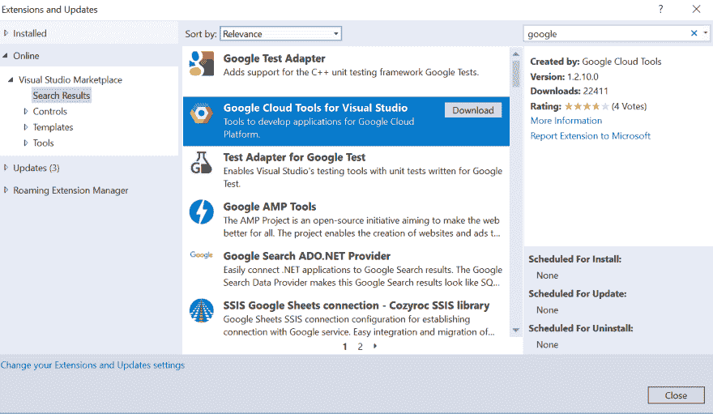
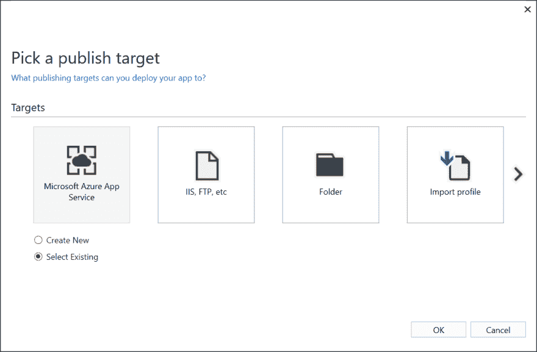

# Azure vs GCP 第 1 部分:部署 ASP.NET 核心应用体验

> 原文：<https://dev.to/kenakamu/azure-vs-gcp-part-1-aspnet-developer-experience-22i>

在这篇文章中，我解释了作为 C#开发者，你如何将你的 dotnet 核心 web 应用程序部署到 Azure 和 GCP。

# [T1。净支持](#net-support)

很明显 Azure 支持. NET。但是 GCP 开始支持。NET 至少核心版本。现在，我可以在两种云环境中运行我的 C#应用程序。但是我应该用哪一个呢？与其回答这个问题，我不如以动手操作的形式向您展示开发人员的体验。

### 先决条件

*   Azure 和 GCP 订阅。
*   Azure 开发工作量的 Windows 10 和 Visual Studio 2017。
*   dotnet 核心 SDK。
*   对两种云平台都有基本的了解。

## Visual Studio 2017 支持

我开发 C#应用的时候用的是 Visual Studio 2017。Azure 和 GCP 都提供 IDE 集成。

#### Azure Visual Studio 工具

它被包含在 Azure 开发工作负载中。如果您错过了它，请通过 Visual Studio 安装程序添加它。

#### 用于 Visual Studio 的谷歌云工具

1.从工具|扩展和更新安装扩展到你的 Visual Studio，然后搜索“google”。
[T3】](https://res.cloudinary.com/practicaldev/image/fetch/s--Zf9G4jw9--/c_limit%2Cf_auto%2Cfl_progressive%2Cq_auto%2Cw_880/https://thepracticaldev.s3.amazonaws.com/i/co73shdxcm7dkvw459ll.PNG)

2.安装完成后，打开 Visual Studio 2017，进入工具|谷歌云工具|显示谷歌云浏览器。

3.然后按照向导配置您的帐户。

4.接下来，从[这里](https://cloud.google.com/sdk/)安装扩展使用的 Google Cloud SDK。

5.在安装结束时，确保您选中了“运行‘g Cloud init’来配置 Cloud SDK。
[T3】](https://res.cloudinary.com/practicaldev/image/fetch/s--OHKiHiOb--/c_limit%2Cf_auto%2Cfl_progressive%2Cq_auto%2Cw_880/https://thepracticaldev.s3.amazonaws.com/i/pk1hoxk8v9n6ur7ge5ae.PNG)

6.按照说明完成初始化。

7.提前创建一个项目。运行以下命令。更改项目值以使其唯一。

```
gcloud projects create cloud-compare-2018 --name "cloud compare"
gcloud config set project cloud-compare-2018 
```

Enter fullscreen mode Exit fullscreen mode

8.项目完成后，转到[谷歌云平台控制台](https://console.cloud.google.com/billing/projects)并为项目分配计费信息。

# 创建 dotnet 核心项目

1.打开 Visual Studio 2017 并创建新项目。

2.选择“ASP。NET 核心 Web 应用程序。
[T3】](https://res.cloudinary.com/practicaldev/image/fetch/s--2UuL9DfE--/c_limit%2Cf_auto%2Cfl_progressive%2Cq_auto%2Cw_880/https://thepracticaldev.s3.amazonaws.com/i/njer8g0dgee69swvihwn.PNG)

3.选择 MVC 应用程序，或您想要的任何模板，然后单击“确定”。Azure 在这里已经支持认证集成功能，但目前保持“无认证”。VS 也让我们选择“docker 支持”，但是由于两个云都支持 dotnet 核心运行时，继续点击“确定”。
[T3】](https://res.cloudinary.com/practicaldev/image/fetch/s--K4Db0ICJ--/c_limit%2Cf_auto%2Cfl_progressive%2Cq_auto%2Cw_880/https://thepracticaldev.s3.amazonaws.com/i/qaatgj271u60d5z6zel9.PNG)

4.按 F5 在本地运行应用程序。
[T3】](https://res.cloudinary.com/practicaldev/image/fetch/s--Bx6fXu2o--/c_limit%2Cf_auto%2Cfl_progressive%2Cq_auto%2Cw_880/https://thepracticaldev.s3.amazonaws.com/i/egohm4yj9kumzmdmzy2c.PNG)

# 部署

现在应用程序已经创建，让我们部署到每个云平台。

### 天蓝色

部署应用程序有多种方法，但让我们来做最简单的一种。

1.右键单击项目并选择“发布”。
[T3】](https://res.cloudinary.com/practicaldev/image/fetch/s--4Ak8zHVs--/c_limit%2Cf_auto%2Cfl_progressive%2Cq_auto%2Cw_880/https://thepracticaldev.s3.amazonaws.com/i/q9p4dpt5tbn45tkcmxse.PNG)

2.点击“发布”按钮，选择“Azure”和“新建”。
[T3】](https://res.cloudinary.com/practicaldev/image/fetch/s--p2RkyYcg--/c_limit%2Cf_auto%2Cfl_progressive%2Cq_auto%2Cw_880/https://thepracticaldev.s3.amazonaws.com/i/u5s3a2mushibn6t3ocx5.PNG)

3.如果您尚未登录 Azure，请登录，这会加载订阅和相关信息。

4.输入应用程序名称，然后选择订阅。您可以创建新的“资源组”和“应用服务计划”或选择现有的。我添加了新的资源组和免费计划。点击“创建”。

*   资源组:这是一个逻辑分组，您可以在其中放置所有资源，如 WebApps、VM、存储等。这几乎相当于在 GCP 的项目。
*   应用服务计划:它存储 CPU 和内存大小、支持的功能和定价等信息。每个 web 应用程序都链接到一个应用程序服务计划。

5.就是这样。一旦发布，它会自动启动应用程序。
[T3】](https://res.cloudinary.com/practicaldev/image/fetch/s--FR6P04ZY--/c_limit%2Cf_auto%2Cfl_progressive%2Cq_auto%2Cw_880/https://thepracticaldev.s3.amazonaws.com/i/sdq765rguduh5fm9ifn8.PNG)

### GCP App 引擎 Flex

步骤和 Azure 很像。

1.如果这是您第一次部署任何应用程序，您需要首先创建 App Engine 应用程序。打开命令提示符并运行以下命令。如果需要，您可以更改区域。

```
gcloud app create --region=us-central 
```

Enter fullscreen mode Exit fullscreen mode

2.创建应用程序后，在 Google Cloud Explorer 中选择项目。
[T3】](https://res.cloudinary.com/practicaldev/image/fetch/s--CVHGULNF--/c_limit%2Cf_auto%2Cfl_progressive%2Cq_auto%2Cw_880/https://thepracticaldev.s3.amazonaws.com/i/l3dyzgmlez9k1b2mstrh.PNG)

3.右键单击项目，选择“发布到 Google Cloud”。
[T3】](https://res.cloudinary.com/practicaldev/image/fetch/s--JfYqEQaT--/c_limit%2Cf_auto%2Cfl_progressive%2Cq_auto%2Cw_880/https://thepracticaldev.s3.amazonaws.com/i/9ezp7v6nizoudbne9dea.PNG)

4.点击“App Engine Flex”。我们稍后测试集装箱。
[T3】](https://res.cloudinary.com/practicaldev/image/fetch/s--FYEnn_j6--/c_limit%2Cf_auto%2Cfl_progressive%2Cq_auto%2Cw_880/https://thepracticaldev.s3.amazonaws.com/i/r5x5ruvcg4v9jinsm07c.PNG)

5.输入版本名称并点击“发布”。我认为它比 Azure 花费更多的时间，因为它在后台创建和注册容器。
[T3】](https://res.cloudinary.com/practicaldev/image/fetch/s--wQbZqeZy--/c_limit%2Cf_auto%2Cfl_progressive%2Cq_auto%2Cw_880/https://thepracticaldev.s3.amazonaws.com/i/nd7ydrb3hex4xor37cbc.PNG)

6.就是这样。它会自动启动应用程序。
[T3】](https://res.cloudinary.com/practicaldev/image/fetch/s--Mz1oz24d--/c_limit%2Cf_auto%2Cfl_progressive%2Cq_auto%2Cw_880/https://thepracticaldev.s3.amazonaws.com/i/8699l6880f9y69quf828.PNG)

哦，等等。应用程序名称变成了[https://cloud-compare-2018.appspot.com/](https://cloud-compare-2018.appspot.com/)，我没有指定任何名称。

App Engine 将项目名称作为其 URL。

# 版本化

好了，第一个版本部署完毕。让我们更新应用程序，看看版本控制在每个云中是如何工作的。

#### 更新申请

你可以改变任何事情。我只是改变了 index.cshtml 的标题。

### 天蓝色

Azure 提供“插槽”来托管不同的版本，并让您“交换”应用程序以切换版本。

#### 添加插槽

问题是，“免费”版本不提供这种能力，所以让我们改变它。

1.转到 [Azure 门户](https://portal.azure.com)并选择“资源组”。
T3T5】

2.选择您创建的资源，然后选择“应用服务计划”。
[T3】](https://res.cloudinary.com/practicaldev/image/fetch/s--ZQyDNwO6--/c_limit%2Cf_auto%2Cfl_progressive%2Cq_auto%2Cw_880/https://thepracticaldev.s3.amazonaws.com/i/iodq9r13fgrl21pwaor6.PNG)

3.从菜单中，单击“向上扩展(应用服务计划)”。
[T3】](https://res.cloudinary.com/practicaldev/image/fetch/s--OTVRLkrB--/c_limit%2Cf_auto%2Cfl_progressive%2Cq_auto%2Cw_880/https://thepracticaldev.s3.amazonaws.com/i/pz5zw8qza08yj8l221f4.PNG)

4.选择具有开槽能力的“S1 标准”并点击“选择”。
[T3】](https://res.cloudinary.com/practicaldev/image/fetch/s--4oAcFqvS--/c_limit%2Cf_auto%2Cfl_progressive%2Cq_auto%2Cw_880/https://thepracticaldev.s3.amazonaws.com/i/m12qxpntte9lb65mp1zz.PNG)

5.然后，从资源组转到 Web 应用程序，并选择“部署插槽”。
[T3】](https://res.cloudinary.com/practicaldev/image/fetch/s--LHp1JRC0--/c_limit%2Cf_auto%2Cfl_progressive%2Cq_auto%2Cw_880/https://thepracticaldev.s3.amazonaws.com/i/60lq2ptdoizsecsy0zl2.PNG)

6.点击“添加插槽”，然后命名。您也可以选择是否要复制配置。完成配置后，单击“确定”。请保留此窗口，以便以后再次使用。
[T3】](https://res.cloudinary.com/practicaldev/image/fetch/s--Oq5_6eS2--/c_limit%2Cf_auto%2Cfl_progressive%2Cq_auto%2Cw_880/https://thepracticaldev.s3.amazonaws.com/i/nkl8rz0y9lxvmwh383jn.PNG)

#### 部署

现在我们有了新的插槽，让我们部署它。

1.右键单击项目，然后单击“发布”。

2.因为我已经发表过一次了，这个“简介”已经存在了。单击“创建新配置文件”。
[T3】](https://res.cloudinary.com/practicaldev/image/fetch/s--GHGwvbuz--/c_limit%2Cf_auto%2Cfl_progressive%2Cq_auto%2Cw_880/https://thepracticaldev.s3.amazonaws.com/i/8xlbs6pe39g7zn0iwml4.PNG)

3.选中“选择现有”，然后单击“确定”。
[T3】](https://res.cloudinary.com/practicaldev/image/fetch/s--qT1TLLOp--/c_limit%2Cf_auto%2Cfl_progressive%2Cq_auto%2Cw_880/https://thepracticaldev.s3.amazonaws.com/i/d98unlkpo9rawv80fj7r.PNG)

4.展开现有资源组，向下展开到“slot ”,选择新创建的插槽，然后单击“OK”。
[T3】](https://res.cloudinary.com/practicaldev/image/fetch/s--qug-yxvG--/c_limit%2Cf_auto%2Cfl_progressive%2Cq_auto%2Cw_880/https://thepracticaldev.s3.amazonaws.com/i/si6kckb0l6apcxfpcftd.PNG)

5.点击“发布”。
[T3】](https://res.cloudinary.com/practicaldev/image/fetch/s--DELugin9--/c_limit%2Cf_auto%2Cfl_progressive%2Cq_auto%2Cw_880/https://thepracticaldev.s3.amazonaws.com/i/uphqxjy9rgr1v7yuulc8.PNG)

6.一旦出版完成，我们目前有两个版本。在生产插槽和“插槽 1”插槽上。再次返回门户，选择插槽并单击“交换”。
[T3】](https://res.cloudinary.com/practicaldev/image/fetch/s--BZp5ReA0--/c_limit%2Cf_auto%2Cfl_progressive%2Cq_auto%2Cw_880/https://thepracticaldev.s3.amazonaws.com/i/moso483065x6zcxnxdqa.PNG)

7.选择“Slot1”作为源，选择“production”作为目标，然后单击“OK”。
[T3】](https://res.cloudinary.com/practicaldev/image/fetch/s--W3K4Wo68--/c_limit%2Cf_auto%2Cfl_progressive%2Cq_auto%2Cw_880/https://thepracticaldev.s3.amazonaws.com/i/8do11dtttqx8g9v9e1a8.PNG)

8.交换完成后，打开页面确认它有更新的版本。
[T3】](https://res.cloudinary.com/practicaldev/image/fetch/s--GGiG-VZr--/c_limit%2Cf_auto%2Cfl_progressive%2Cq_auto%2Cw_880/https://thepracticaldev.s3.amazonaws.com/i/zd2kr6hmc5u5s4fpjxg5.PNG)

### GCP

默认情况下，GCP 具有版本控制功能。

1.右键项目，点击“发布到 Google Cloud”，选择“App Engine Flex”。

2.确认您有不同的版本，选中“升级版本”并取消选中“发布”。
[T3】](https://res.cloudinary.com/practicaldev/image/fetch/s--ykdYVD2B--/c_limit%2Cf_auto%2Cfl_progressive%2Cq_auto%2Cw_880/https://thepracticaldev.s3.amazonaws.com/i/464mhzu71k8x611ql8v1.PNG)

3.发布完成后，进入[谷歌云平台控制台](https://console.cloud.google.com/)，从菜单中选择“应用引擎”。
T3T5】

4.选择“版本”并确认有两个版本。
[T3】](https://res.cloudinary.com/practicaldev/image/fetch/s--cSlUTMWF--/c_limit%2Cf_auto%2Cfl_progressive%2Cq_auto%2Cw_880/https://thepracticaldev.s3.amazonaws.com/i/u74yjvncrqe1923dtizj.PNG)

5.选择较新的版本，然后单击“分流流量”。
[T3】](https://res.cloudinary.com/practicaldev/image/fetch/s--frs-uiaa--/c_limit%2Cf_auto%2Cfl_progressive%2Cq_auto%2Cw_880/https://thepracticaldev.s3.amazonaws.com/i/awfenacfowlhmkjnw4ho.PNG)

6.为新版本指定 100%并“保存”。
[T3】](https://res.cloudinary.com/practicaldev/image/fetch/s--rNNvbyG4--/c_limit%2Cf_auto%2Cfl_progressive%2Cq_auto%2Cw_880/https://thepracticaldev.s3.amazonaws.com/i/h1a1mis7q1dexsas21ip.PNG)

7.打开应用程序以确认新版本可用。
[T3】](https://res.cloudinary.com/practicaldev/image/fetch/s--RENTH77U--/c_limit%2Cf_auto%2Cfl_progressive%2Cq_auto%2Cw_880/https://thepracticaldev.s3.amazonaws.com/i/2ihm9ns1rsapyocuwcmk.PNG)

如你所知，GCP 通过分流流量让我们同时运行多个版本，这样我们就可以进行 A/B 测试。

# 总结

两个云平台都提供了相似的体验和功能。那么哪个更好呢？通过研究部署经验，我没有答案，因此我将在下一篇文章中更深入地研究这两个平台。