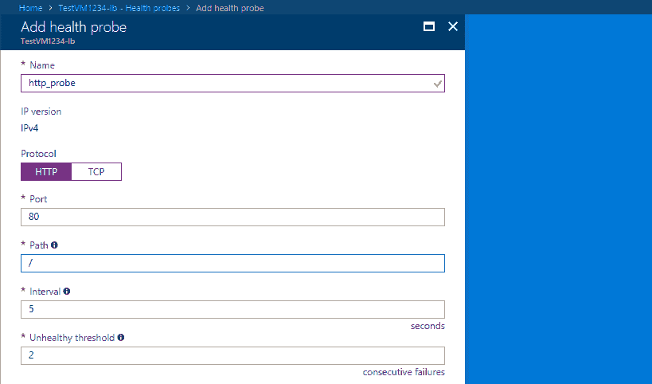

# Azure vs GCP 第 10 部分:虚拟机扩展(Azure)

> 原文：<https://dev.to/kenakamu/azure-vs-gcp-part-10-virtual-machine---scaling-azure--4ci0>

在[上一篇文章](https://dev.to/kenakamu/azure-vs-gcp-part-9-virtual-machine-azure--29f3)中，我使用 Azure VM 作为单一实例来托管我的应用程序。

这次我研究了扩展选项。

# 可用性

我推荐多实例的原因之一是可用性。有两种类型的担忧。

*   硬件故障
*   软件更新

Azure 为每一个都提供了解决方案。

# 横向扩展

除了可用性之外，当我得到高负载时，我需要有多个实例。Azure 提供横向扩展解决方案，以及负载平衡。

### 可用性设置

一种选择是使用可用性集。显示文件[此处](https://docs.microsoft.com/en-us/azure/virtual-machines/windows/tutorial-availability-sets#availability-set-overview)

> 可用性集是一种逻辑分组功能，您可以在 Azure 中使用它来确保您放置在其中的 VM 资源在 Azure 数据中心内部署时相互隔离。
> 当您将虚拟机放入可用性集中时，这些虚拟机会被分成多个容错域和更新域。

*   故障域:这是针对硬件故障的。硬件故障不会影响另一个域。
*   更新域:这是用于软件更新。由于更新导致的操作系统重启不会同时在多个域中发生。

### 刻度设置

另一个选择是使用缩放设置。显示文件[此处](https://docs.microsoft.com/en-us/azure/virtual-machines/windows/tutorial-create-vmss#scale-set-overview)

> 虚拟机扩展集允许您部署和管理一组相同的自动扩展虚拟机。规模集中的虚拟机分布在一个或多个放置组中的逻辑故障和更新域中。这些是类似配置的虚拟机组，类似于可用性集。

### 区别

它们很相似，但也有不同之处。

*   任何虚拟机或相同的虚拟机
*   以可用性为导向还是以横向扩展为导向

比方说，您有多个虚拟机作为一个集合工作，那么您可以考虑使用可用性集合，因为您想要控制每个虚拟机如何坐在一起。另一方面，如果你简单地横向扩展每一层，那么缩放设置听起来是正确的。

### 负载均衡器

使用可用性集或规模集创建多个实例不会自动对它们进行负载平衡。Azure 提供负载平衡器服务。显示文件[此处](https://docs.microsoft.com/en-us/azure/virtual-machines/windows/tutorial-load-balancer#azure-load-balancer-overview)

> Azure 负载平衡器是第 4 层(TCP、UDP)负载平衡器，它通过在健康的虚拟机之间分配传入流量来提供高可用性。负载平衡器运行状况探测器监控每个虚拟机上的给定端口，并且仅将流量分配给运行中的虚拟机。

# 我们试试吧！

要做到这一点，需要几个步骤。

### 创建图像

横向扩展时，需要一个种子映像进行复制。有多种方法来准备图像。我使用我在上一篇文章中部署的那个。

1.转到 [Azure 门户](https://portal.azure.com)并导航到您创建的虚拟机。

2.点击“连接”,远程桌面进入镜像。

3.一旦登录，按 Windows 键+ "R "并进入 Sysprep，然后运行它。
[T3】](https://res.cloudinary.com/practicaldev/image/fetch/s--NurZsf9y--/c_limit%2Cf_auto%2Cfl_progressive%2Cq_auto%2Cw_880/https://thepracticaldev.s3.amazonaws.com/i/huzusdsz30g21z9cpirj.PNG)

4.使用以下设置对其进行概括。它将关闭操作系统。
[T3】](https://res.cloudinary.com/practicaldev/image/fetch/s--sLL1X7TO--/c_limit%2Cf_auto%2Cfl_progressive%2Cq_auto%2Cw_880/https://thepracticaldev.s3.amazonaws.com/i/ysuydh8kc9ouumpk7807.PNG)

5.回到 Azure Portal，等待虚拟机关闭。然后点击“捕获”。
[T3】](https://res.cloudinary.com/practicaldev/image/fetch/s--le2HG-P4--/c_limit%2Cf_auto%2Cfl_progressive%2Cq_auto%2Cw_880/https://thepracticaldev.s3.amazonaws.com/i/maeqssc66hgetemhu8j1.PNG)

6.输入姓名。我指定了新的资源组。如果您想删除捕获的图像，您可以选择“自动删除...”复选框。
[T3】](https://res.cloudinary.com/practicaldev/image/fetch/s--iflmspsi--/c_limit%2Cf_auto%2Cfl_progressive%2Cq_auto%2Cw_880/https://thepracticaldev.s3.amazonaws.com/i/jbns5wn0d6y57fzesqzh.PNG)

种子图像现在准备好了。

# 试可用性设置

我先试试可用性设置。

1.转到新创建的资源组，单击添加并搜索可用性集。
[T3】](https://res.cloudinary.com/practicaldev/image/fetch/s--_wx4oaB8--/c_limit%2Cf_auto%2Cfl_progressive%2Cq_auto%2Cw_880/https://thepracticaldev.s3.amazonaws.com/i/92q68rv1r158m0phhrje.PNG)

2.输入名称并设置值。我对域使用默认值。点击“创建”。
[T3】](https://res.cloudinary.com/practicaldev/image/fetch/s--LPh8gK7v--/c_limit%2Cf_auto%2Cfl_progressive%2Cq_auto%2Cw_880/https://thepracticaldev.s3.amazonaws.com/i/lv0uiygpz4u20geqdbdg.PNG)

3.转到种子映像，然后单击“创建虚拟机”。
[T3】](https://res.cloudinary.com/practicaldev/image/fetch/s--ilesU7Or--/c_limit%2Cf_auto%2Cfl_progressive%2Cq_auto%2Cw_880/https://thepracticaldev.s3.amazonaws.com/i/fsuego3qb8j7vieievv8.PNG)

4.输入配置值。
[T3】](https://res.cloudinary.com/practicaldev/image/fetch/s--pRomf7v2--/c_limit%2Cf_auto%2Cfl_progressive%2Cq_auto%2Cw_880/https://thepracticaldev.s3.amazonaws.com/i/pjah2s3u4z46up6qm4gr.PNG)

5.在下一步中选择尺寸。我选择“B1MS”进行测试。

6.选择创建的“可用性测试”并根据需要更改设置。所有设置都来自种子图像。我只是用了默认设置。
[T3】](https://res.cloudinary.com/practicaldev/image/fetch/s--t_1uCaSm--/c_limit%2Cf_auto%2Cfl_progressive%2Cq_auto%2Cw_880/https://thepracticaldev.s3.amazonaws.com/i/je1ndkuj47lu2vk0qd4w.PNG)

7.单击“确定”创建图像。

8.重复上述步骤，在同一可用性集中创建第二个虚拟机。结果，我创造了许多资源。这是因为种子图像有它们。
[T3】](https://res.cloudinary.com/practicaldev/image/fetch/s--uwtNL03k--/c_limit%2Cf_auto%2Cfl_progressive%2Cq_auto%2Cw_880/https://thepracticaldev.s3.amazonaws.com/i/4yxbl8lolrls2i8kpvou.PNG)

9.转到每个虚拟机并确认公共 IP 地址。逐个访问它们，查看应用程序是否按预期运行。
[](https://res.cloudinary.com/practicaldev/image/fetch/s--n6ldYEhQ--/c_limit%2Cf_auto%2Cfl_progressive%2Cq_auto%2Cw_880/https://thepracticaldev.s3.amazonaws.com/i/bk86opkah429q31iu54l.PNG) 
[](https://res.cloudinary.com/practicaldev/image/fetch/s--s2KccVt4--/c_limit%2Cf_auto%2Cfl_progressive%2Cq_auto%2Cw_880/https://thepracticaldev.s3.amazonaws.com/i/a4xojz6bg24oztarwlfv.PNG)

10.现在，我有两个虚拟机正在运行。接下来，创建负载平衡器。在资源组中，单击添加并找到它。
[T3】](https://res.cloudinary.com/practicaldev/image/fetch/s--WXP0LQlo--/c_limit%2Cf_auto%2Cfl_progressive%2Cq_auto%2Cw_880/https://thepracticaldev.s3.amazonaws.com/i/1vv6ss1xbh6f5cvm8iuf.PNG)

11.设置参数。我为这个测试设置了公共动态 IP 地址。
[T3】](https://res.cloudinary.com/practicaldev/image/fetch/s--LxeLUzdI--/c_limit%2Cf_auto%2Cfl_progressive%2Cq_auto%2Cw_880/https://thepracticaldev.s3.amazonaws.com/i/ftphm1w26qzfa4gs6grg.PNG)

12.创建负载平衡器后，转到负载平衡器，选择“后端池”，然后单击“添加”。
[T3】](https://res.cloudinary.com/practicaldev/image/fetch/s--nkcYqPaG--/c_limit%2Cf_auto%2Cfl_progressive%2Cq_auto%2Cw_880/https://thepracticaldev.s3.amazonaws.com/i/s7vutddru87zzcpd19gm.PNG)

13.选择“可用性集”进行关联，并选择 AG。现在，您可以在可用性集中添加虚拟机。添加所有虚拟机，然后单击“确定”进行保存。
[T3】](https://res.cloudinary.com/practicaldev/image/fetch/s--ZkKQI72I--/c_limit%2Cf_auto%2Cfl_progressive%2Cq_auto%2Cw_880/https://thepracticaldev.s3.amazonaws.com/i/z5rapaodv8omln8d13fu.PNG)

14.接下来，创建用于运行状况检查的探测器。选择“健康探测器”并单击“添加”，然后创建一个探测器。在本例中，我创建了端口 80 探测器。
[T3】](https://res.cloudinary.com/practicaldev/image/fetch/s--2wdiAxDD--/c_limit%2Cf_auto%2Cfl_progressive%2Cq_auto%2Cw_880/https://thepracticaldev.s3.amazonaws.com/i/f3fr7y3smec8zvqtxi21.PNG)

15.最后，创建一个规则。选择“负载平衡器规则”并单击“添加”，然后创建一个规则。指定刚刚为规则创建的探测器。
[T3】](https://res.cloudinary.com/practicaldev/image/fetch/s--vCmfxma3--/c_limit%2Cf_auto%2Cfl_progressive%2Cq_auto%2Cw_880/https://thepracticaldev.s3.amazonaws.com/i/elulcs3hp8meb7gwvmjg.PNG)

16.检查概述以确认公共 IP 地址。探测器和规则也是链接的。通过浏览器访问公共 IP 以确认您可以访问应用程序。
[](https://res.cloudinary.com/practicaldev/image/fetch/s--VgS15N2m--/c_limit%2Cf_auto%2Cfl_progressive%2Cq_auto%2Cw_880/https://thepracticaldev.s3.amazonaws.com/i/ssko2w778awprw7yml2k.PNG) 
[](https://res.cloudinary.com/practicaldev/image/fetch/s--PNmxqMYw--/c_limit%2Cf_auto%2Cfl_progressive%2Cq_auto%2Cw_880/https://thepracticaldev.s3.amazonaws.com/i/hxbn5o39cwj2c9glt1ix.PNG)

17.我现在不需要每个虚拟机的公共 IP。如果你愿意，你可以删除它们。

# 试秤台

接下来我尝试音阶组合。

1.返回到资源组并单击“添加”，然后找到“模板部署”并单击“创建”。我需要用它来部署自定义图像缩放集。
[T3】](https://res.cloudinary.com/practicaldev/image/fetch/s--0a1vBHRx--/c_limit%2Cf_auto%2Cfl_progressive%2Cq_auto%2Cw_880/https://thepracticaldev.s3.amazonaws.com/i/nxt50ij6nlkvazb82ut6.PNG)

2.在编辑器链接中点击“构建您自己的模板”。这里你需要输入一个模板。下面的代码是创建的最小模板:

*   虚拟网络:myVnet，10.0.0.0/16
*   子网:我的子网，10.0.0.0/16
*   虚拟机规模集:myScaleSet，

比例集的 VM 被指定为 virtualMachineProfile。它使用种子映像，从 vm 开始，它有 NIC(myNIC)连接到 myVnet，大小是 Standard_A1。

```
{  "$schema":  "http://schema.management.azure.com/schemas/2015-01-01/deploymentTemplate.json",  "contentVersion":  "1.0.0.0",  "parameters":  {  "adminUsername":  {  "type":  "String"  },  "adminPassword":  {  "type":  "SecureString"  }  },  "variables":  {},  "resources":  [  {  "type":  "Microsoft.Network/virtualNetworks",  "name":  "myVnet",  "apiVersion":  "2016-12-01",  "location":  "[resourceGroup().location]",  "properties":  {  "addressSpace":  {  "addressPrefixes":  [  "10.0.0.0/16"  ]  },  "subnets":  [  {  "name":  "mySubnet",  "properties":  {  "addressPrefix":  "10.0.0.0/16"  }  }  ]  }  },  {  "type":  "Microsoft.Compute/virtualMachineScaleSets",  "sku":  {  "name":  "Standard_A1",  "capacity":  2  },  "name":  "myScaleSet",  "apiVersion":  "2016-04-30-preview",  "location":  "[resourceGroup().location]",  "properties":  {  "upgradePolicy":  {  "mode":  "Manual"  },  "virtualMachineProfile":  {  "storageProfile":  {  "imageReference":  {  "id":  "[resourceId('Microsoft.Compute/images', 'vmtest1234-seed-image')]"  }  },  "osProfile":  {  "computerNamePrefix":  "vm",  "adminUsername":  "[parameters('adminUsername')]",  "adminPassword":  "[parameters('adminPassword')]"  },  "networkProfile":  {  "networkInterfaceConfigurations":  [  {  "name":  "myNic",  "properties":  {  "primary":  "true",  "ipConfigurations":  [  {  "name":  "myIpConfig",  "properties":  {  "subnet":  {  "id":  "[concat(resourceId('Microsoft.Network/virtualNetworks', 'myVnet'), '/subnets/mySubnet')]"  }  }  }  ]  }  }  ]  }  }  },  "dependsOn":  [  "Microsoft.Network/virtualNetworks/myVnet"  ]  }  ]  } 
```

Enter fullscreen mode Exit fullscreen mode

3.保存模板并进行部署。填写参数用户名和密码。

4.等到部署完成。部署完成后，转到资源。
[T3】](https://res.cloudinary.com/practicaldev/image/fetch/s--miVNHFC0--/c_limit%2Cf_auto%2Cfl_progressive%2Cq_auto%2Cw_880/https://thepracticaldev.s3.amazonaws.com/i/mz7bswje98owqfba91gu.PNG)

5.随着扩展集的部署，我创建了新的负载平衡器。
[T3】](https://res.cloudinary.com/practicaldev/image/fetch/s--w6VH8Xs9--/c_limit%2Cf_auto%2Cfl_progressive%2Cq_auto%2Cw_880/https://thepracticaldev.s3.amazonaws.com/i/3u9ckvuvbf2j0nwmctl8.PNG)

6.创建负载平衡器后，转到后端池并单击“添加”。
[T3】](https://res.cloudinary.com/practicaldev/image/fetch/s--x34LSHM8--/c_limit%2Cf_auto%2Cfl_progressive%2Cq_auto%2Cw_880/https://thepracticaldev.s3.amazonaws.com/i/9o8tdxlc58vqngtmr2fp.PNG)

7.选择“虚拟机规模集”作为关联，然后选择 myScaleSet。
[T3】](https://res.cloudinary.com/practicaldev/image/fetch/s--XXhZGxIR--/c_limit%2Cf_auto%2Cfl_progressive%2Cq_auto%2Cw_880/https://thepracticaldev.s3.amazonaws.com/i/8xmpdky4qjdexdevpl98.PNG)

8.像以前一样创建一个探测器和一个规则。
[T3】](https://res.cloudinary.com/practicaldev/image/fetch/s--r1VkRMZp--/c_limit%2Cf_auto%2Cfl_progressive%2Cq_auto%2Cw_880/https://thepracticaldev.s3.amazonaws.com/i/yx5o3zp1gnqfxuzfsri7.PNG)

9.通过负载平衡器的公共 IP 访问应用程序，以确认应用程序已启动并正在运行。
[T3】](https://res.cloudinary.com/practicaldev/image/fetch/s--URa5HplE--/c_limit%2Cf_auto%2Cfl_progressive%2Cq_auto%2Cw_880/https://thepracticaldev.s3.amazonaws.com/i/qsbjfbbi231b87rgv1rb.PNG)

### 秤台自动秤台设置

我之所以要使用比例集，是为了使用自动缩放。虽然我可以在上面的模板中设置它，但是我没有。因此，我需要在这里手动配置它。

1.转到“缩放集”资源，选择“缩放”。
[T3】](https://res.cloudinary.com/practicaldev/image/fetch/s--F3QKadEk--/c_limit%2Cf_auto%2Cfl_progressive%2Cq_auto%2Cw_880/https://thepracticaldev.s3.amazonaws.com/i/y94ro63m4mjorey5mcqc.PNG)

2.点按“启用自动缩放”，然后点按“添加规则”。
[T3】](https://res.cloudinary.com/practicaldev/image/fetch/s--xgBqAVMy--/c_limit%2Cf_auto%2Cfl_progressive%2Cq_auto%2Cw_880/https://thepracticaldev.s3.amazonaws.com/i/vo5rn94wd3faluju8vcu.PNG)

3.添加新规则。我指定在 5 分钟内使用 70%的 CPU 来增加一个实例。
[T3】](https://res.cloudinary.com/practicaldev/image/fetch/s--OMn6liVZ--/c_limit%2Cf_auto%2Cfl_progressive%2Cq_auto%2Cw_880/https://thepracticaldev.s3.amazonaws.com/i/tlskcosshgc106izxhkf.PNG)

4.然后输入“自动缩放设置名称”并保存。

就是这样！

# 总结

我简单测试了 Azure 的可用性和可伸缩性，两者都很好。作为开发人员，剩下的任务是自动创建自定义图像，否则我需要在每次发布新版本时都创建图像。

实际上，这可以从秤台的“连续输送”部分完成。更多信息请参考最后的博客。

在下一篇文章中，我将研究 GCP 期权

# 引用

[Windows 虚拟机文档:查看教程部分](https://docs.microsoft.com/en-us/azure/virtual-machines/windows/)
[自动缩放的最佳实践](https://docs.microsoft.com/en-us/azure/monitoring-and-diagnostics/insights-autoscale-best-practices)
[将应用部署到 Azure 虚拟机规模集](https://blogs.msdn.microsoft.com/devops/2017/05/15/deploying-applications-to-azure-vm-scale-sets/)